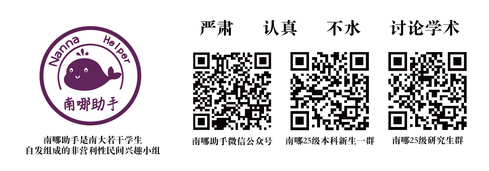

  
如果你认为你的文章对南大er有帮助，欢迎联系南哪助手QQ**492711989**或邮箱**nannahelper@163.com**投稿。

如果你对助手感兴趣，希望和我们一起做一些有趣的事，如果你相信自己可以为纯粹的热爱所驱动，如果你想挑战基于纯粹的自驱利用南哪最大的民间平台做一些有价值的事情，那么欢迎你加入助手！

助手团队招新采取**“Boss直聘”**模式，大家直接**私聊小破手QQ（492711989）**或**小帮手QQ（3238099036）**即可！也欢迎大家向助手**邮箱（nannahelper@163.com）**投递简历！（详见[助手招人啦！](https://mp.weixin.qq.com/s/HOs-socUSNjBUendKtR1bg)）

#### 
:::color5
**南哪助手是南大若干学生自发组成的非营利性民间兴趣小组。转载请注明来源。**

:::

#### 

