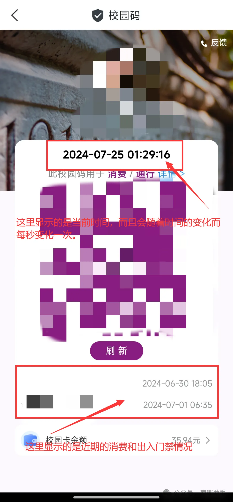
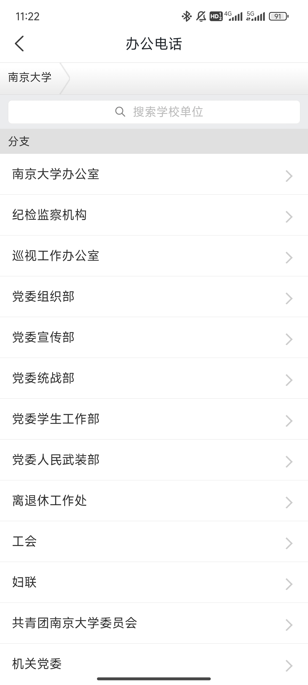
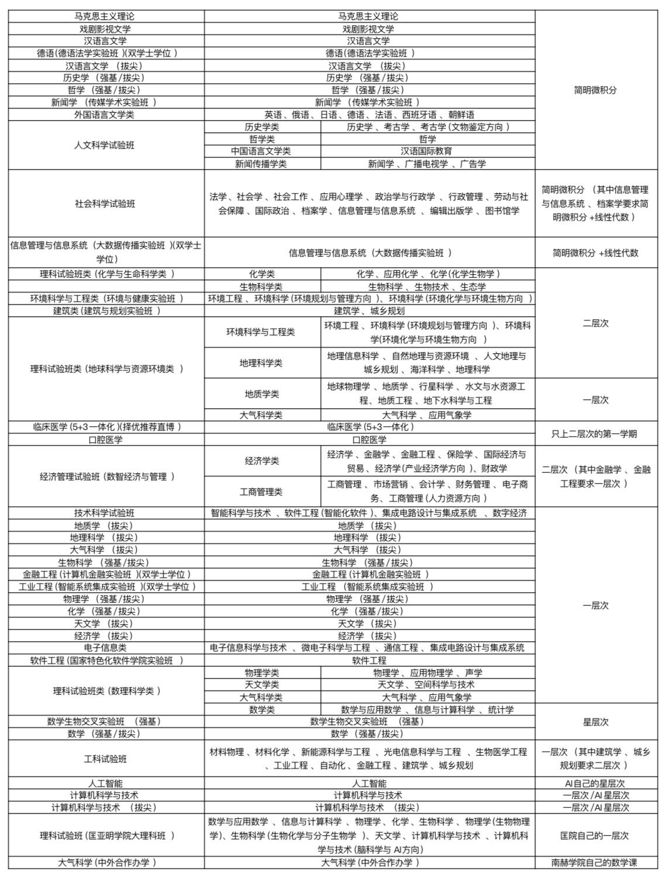
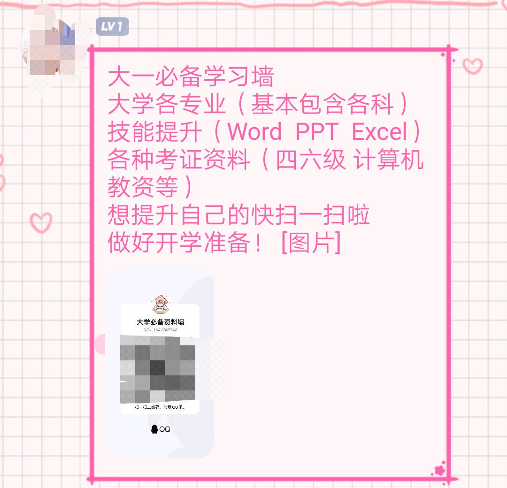
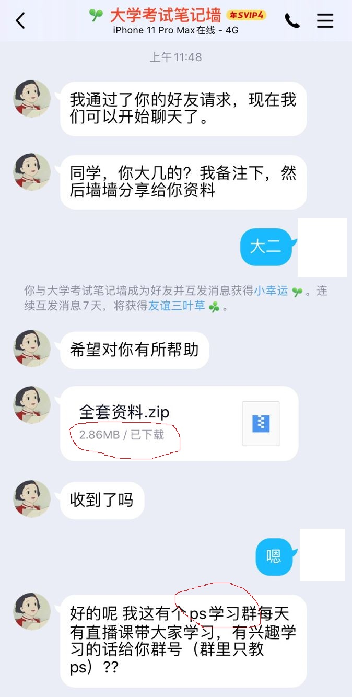
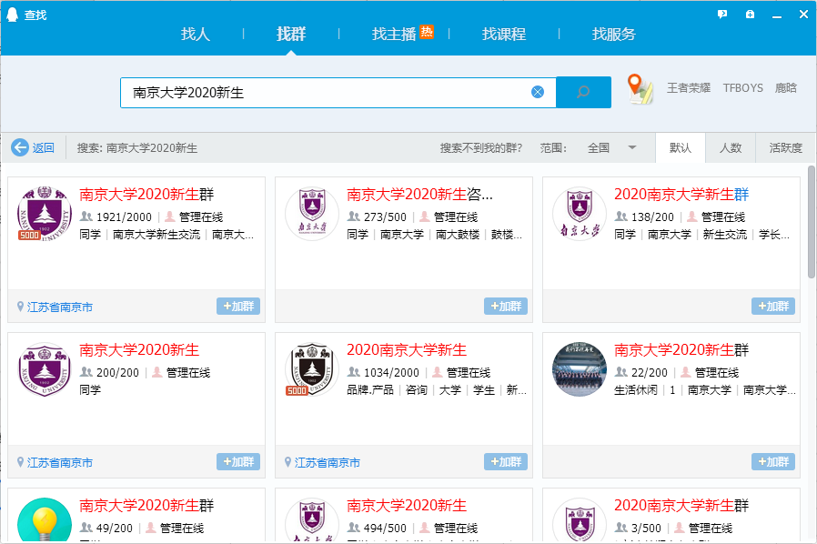

[南哪助手长期接受同学们投稿](https://www.yuque.com/greatnju/q-a/gw3phd#o8osi)

在南大校园里，也依然会有各种各样的人使用各种“套路”，想方设法将贪婪的目光瞄准大家的钱包。每年新生入学季都是忽悠发生的高发期，而刚刚进入大学的新生们就是这些“大忽悠”们的目标。

为了防止大家被忽悠，小破手总结了一些常见的套路。接下来，就请各位新生和小破手一起，学习如何保卫自己的钱包和个人隐私吧！

# 写在前边：请大家保护好自己的“录取号”，“学号”，“手机号码”等个人信息，防止自己的信息被利用！
尤其是大家拿到录取通知书后，如果要在各类社交媒体上发布开箱视频或图片的话，请大家一定记得**给自己的信息打码**。不要忘记在快递单上也打好码哦！

# 套路类型一：推销
利用大一学生的同情心，很多校外人员会混入南大校园，开展推销行为。他们往往**假冒学长学姐**，谎称自己在做社会实践/实习，需要卖出“笔”，“洗衣液”，“洗衣片”等产品，而且他们卖出的价格是**淘宝的十倍！！！**而且他们会堵着你的去路，拉着你一定要购买！真的是很不要脸了！很多女生一害怕，男生一害羞就买了他们的产品，事后越想越生气。

遇到这种拦路推销的，大家尽量**远离**，他们上来搭话你一定**不要理踩**，如果被围堵，要寻找周围路过同学的帮助！其他新生开学售卖物品的，除了教育超市等校内超市，我不建议大家购买，因为买完之后，卖家就消失了，大家的权益无法得到保障。尤其是在地下通道卖床上用品的，每年都坑很多新生。

另外，还有其他很多进入宿舍敲门推销的，建议大家立刻联系宿管阿姨或者保卫处！还有很多在QQ群私戳推销的，遇到这种情况要及时报告群管理员（如果管理员不处理，你就要审视一下这个群了）

## 如何联系保卫处
:::danger
**鼓楼校区：025-83595110**

**仙林校区：025-89685110**

**浦口校区：025-58605110**

**苏州校区：0512-68765110**

:::

## 如何判断ta是不是南大学长学姐
就是**校园码实时录屏**。要求对方从和你聊天的当前页面开始录屏，到展示出南大app的校园动态码为止。

**注意：**即便对方提供了校园码实时录屏，大家也不能掉以轻心，尤其是**当对方提到和金钱、身份证、照片等隐私信息相关的话题时**，更要提高警惕，“学长学姐”和“南大同学”并不代表百分之百可靠。

## 类似套路：校门口的板栗桂花糕
实际上就是切糕形式，很小一块就要数百元，并且强买强卖。而且很难吃……

# 套路类型二：电话诈骗
大家有可能会接到电话，自称是“南大工作人员”，这个时候就要注意了：

南大的官方校内号码几乎均以**025-8359（鼓楼校区）**或**025-8968（仙林校区）**或**025-5864（浦口校区）**或**0512-6876（苏州校区）**开头，除此之外的南京号码都需要警惕！

另外，大家在入学后可以使用南大app（南大app是大家未来必须使用的app，更多关于南大app的使用，请见[文章](https://mp.weixin.qq.com/s/uAHoH_TQR5TrDfxWuh-LQg)）进行电话查询，能查到的电话才是学校官方的电话：

而且，一般情况，除了辅导员以外，其他学校工作人员假期并不会主动联系新生。事出反常必有妖，遇到拿捏不准的情况，可以在咨询群**（25级本科新生咨询群：862670709）**询问学长学姐。

此外，也请各位同学提醒家长注意，因为往年有人生成自己是学校工作人员，拨打新生家长电话，很多家长信以为真。请大家相互转告！

# 诈骗类型三：远离校园贷！
:::danger
**校园贷，百害无一利，务必远离！**

:::

南京大学为家庭贫困的学子提供助学金和助学贷款（详情请见：[https://www.nju.edu.cn/zsjy/jzxj.htm](https://www.nju.edu.cn/zsjy/jzxj.htm)），还有丰富的勤工俭学机会，请大家远离校园贷和套路贷！同学们如果急需用钱，那么一定要和家里人或者辅导员说！

同时，蚂蚁花呗，京东白条，这些都是刺激大家超前消费的因素，希望大家进入大学后能够合理规划自己的收支情况，理性消费**（大学第一个月可能要用平时生活费的两倍，因为需要购置很多生活用品和学习用品；第二个月是双十一购物节，很多同学需要在这个时候购买御寒衣物，大家一定要和家里说一下自己的消费情况）。**

# 诈骗类型四：兼职诈骗
> **如果你是一个，****没有任何****挣钱技能的人**
>
> **并且，此时你面前有一份****是个人就能干****的高薪工作**
>
> **那建议你拒绝掉**
>

可能大家觉得，自己在高考后就有能力自食其力了，应该出去做一些兼职，同时又不想付出太多的时间。在这种心态的影响下，有部分同学可能陷入兼职诈骗的陷阱中。网络兼职诈骗，是一种历史悠久的诈骗方式，但每年的高中毕业生还是止不住得被骗。常见的骗局有：打字员、淘宝刷单、快递单号填单员、抖音点赞员、开淘宝店售卖视频，还有其他完成简单任务就可以领钱的“兼职”。这些兼职，无一例外都是网络兼职诈骗，希望大家一定远离！

这些诈骗，许诺你能挣钱，但实际上会要求你出“押金”“保证金”“培训费”等，并且你的挣钱方式，最重要的是拉下线！也就是类似传销的行为！这种骗局其实很好识破，但很多同学被洗脑，被金钱冲昏了头脑而已。要先交各种费用的兼职，99%都是骗人的！大家想实现财富自由，可以选择做家教、办自媒体、勤工助学等，但切记要提防各种诈骗行为（比如介绍家教要先交保证金）。

如果你想做家教，那么**一定要注意个人安全！**

如果你想做自媒体，那么请一定要注意**保护自己的个人隐私**，如果需要签订合约，请一定要认真阅读合同条款，寻求正规渠道咨询（如[法学院仙林校区志愿法律咨询项目](https://mp.weixin.qq.com/s/h-fDGwUhWGhtOZpxMJbHvw)）**不要轻易签字**，捍卫自己的权利！

# 套路类型五：“免费”学技能
在qq空间还有各种qq群，可能都会出现“免费学ps”，“大学数学资料群”，“英语资料群”，这样的套路。表面看，这些群充满正能量，实际上呢，全是套路。

我个人很好奇，为什么有人认为学ps需要花钱呢，哔哩哔哩上的教学视频不香吗？其实他们的套路和之前央视曝光的微信群“免费学画画”如出一辙，大家可以自行查找，例如[https://www.zhihu.com/question/278089318](https://www.zhihu.com/question/278089318)。

而且，想获得资料，这些群聊还要求你拉人进群，助手姐姐遇到拉我进群的小学弟是非常生气的！为什么要贪图小便宜呢！学校给大家买正版的Adobe全家桶，大家不要接触这些盗版资源呀！

各种学科资料群呢，我觉得大家**完全没必要加。**

:::danger
**学校购入给大家免费提供的各类正版软件：**

[https://itsc.nju.edu.cn/zbrj/list.htm](https://itsc.nju.edu.cn/zbrj/list.htm)

:::

## 数学
南京大学本科生数学课程采取分层次教学模式，层次划分如下图所示。部分课程存在可替代选项。

[南京大学大学数学通修课程实施方案.pdf](https://www.yuque.com/attachments/yuque/0/2025/pdf/34810676/1752129874866-34185ebe-227d-4977-a6cb-8f43273c5fa0.pdf)

[大学通修数学替代关系表.pdf](https://www.yuque.com/attachments/yuque/0/2025/pdf/34810676/1752129865968-ab236698-f4b9-469a-8bf6-c86dcd723c01.pdf)

毕竟南京大学的数学学的是比较难的哦~按照外校的资源复习可能比较轻松，但会有挂科的风险呢！希望大家好好听课，认真做笔记，认真对待习题~如果有没听懂的地方，可以去b站搜索苏德矿老师的微积分呢~

## 英语
除了数学、ps外，另一类常见的“诱饵”就是各类英语学习资料了。但是实际上，能够进入南大的同学，大部分人还是可以比较轻松容易地通过四六级考试的，完全没有必要去报什么四六级课程，刷刷历年试题其实就足够了。[历年四六级资料均可在南京大学大学外语技能综合训练中心官网下载。](http://eol.nju.edu.cn/)

此外，还会有很多校外机构推荐大家报考雅思、托福等考试，这个需要大家根据自己的实际情况来决定。不要被某些校代所迷惑。

**首先，**雅思、托福等语言成绩都有有效期，大家如果有需要的话，需要将有效期纳入自己的考试范围内，换句话说，并不是越早考试就越好；如果大家有交换等打算的话，可以先看看南大国际处的网站（[https://stuex.nju.edu.cn/main.htm](https://stuex.nju.edu.cn/main.htm)），参考一下往年的项目时间和要求，提前做好规划。

**其次，**有些同学没有出国的打算，但是会认为备考雅思托福可以提升自己的英语能力。关于这一点小破手认为所谓的提升英语能力，帮助四六级考试本质上都make no sense。因为在备考过程中，大家都忙于应试刷题，真正提高英语的东西不多，且不说国内外英语考试的评分标准本就不同。但学习托福雅思，确实可以给自己留下后路，且是一种英语能力的证明，比六级考试更有说服力。有了语言成绩，如果想进行交换，也不会慌乱。

**另外，**很多同学比较关心“备考托福雅思是否需要报班”的问题。**个人基础不同，想要达到的分数也不同。**笔者也上过一些机构的班，也听过上过的同学的评价，可以供大家参考：

+ 机构所谓的提升英语能力基本都是在扯淡，靠十几节课就能提升的英语能力的话，还要学十几年英语干什么。语言是需要感觉和长期训练的东西，报班只会教一些应试技巧
+ 机构有一定的监督作用，可以帮助同学快速上手考试，掌握考试规律和技巧
    - 不过，这些东西如果用心找的话，网上也都有现成的。直白的说，机构的知识壁垒并没有达到要付那个价钱的地步，**<u>前提是比较自律+有一定找信息的能力</u>**
+ 关于口语与写作：经费充足的话可以试试小班，或者万能的淘宝什么都有的，注意自己要甄别质量
+ 总而言之，报班与否取决于自己，问清楚自己是否具备这样的能力以后就能做出决定了

## 典型案例

# 诈骗类型六：针对家长的诈骗
可能大家有时候比较忙，不看手机。有的骗子就利用这一点，利用你的个人信息对家长进行诈骗！（所以大家一定要**<u>保护好自己的个人信息！</u>****qq空间要上锁、陌生好友不要加、电话号码要保密！**）

这种骗术看起来很简单，但有很多爱子心切的家长会上当，新闻上报道了很多案例，南大也有家长被骗！希望大家要教育好自己的家里人！

# 套路类型七：盗号诈骗
qq盗号是一种普遍的现象，希望大家加强号码安全，**不要乱输密码！**

一般，被盗号人员的号码会忽然找列表好友问_“你微信有钱吗，我支付宝转给你”“能借我钱吗，急用”_等话语，被骗的同学和被盗号的同学都会承受不该有的损失！遇到这种情况，不要回复就可以，（调戏骗子被删好友得不偿失），并且通过电话联系号主尽快找回、冻结qq号！

另外，qq群里的套路也要注意：

大家有想加入，感兴趣的群，**<u>一定不要在群查找界面使用关键词搜索！一定要有精确的群号！</u>**

[新生群汇总](https://www.yuque.com/greatnju/q-a/wk5buh#418A)

关于套路群，小破手有一个顺口溜分享给大家：

先看群名再看人，仔细观察群昵称。

微信扫码莫轻信，免费课程不要领。

拒绝办卡付定金，广告通知要分清。  
学长好友谨慎加，姓名考号不乱发。

别信骗子人情牌，学姐未必是真爱。

如若该群追不放，举报退出一条龙。  
个人信息保护好，利人利己护大家。

认准消息不迷路，南哪助手快关注。

:::danger
关于更多套路群的内容，大家可以阅读：《什么？！我的热心学姐/学长居然有问题？！》[https://mp.weixin.qq.com/s/VtkvG0kpusRTOwon93PhXw](https://mp.weixin.qq.com/s/VtkvG0kpusRTOwon93PhXw)

:::

# 诈骗类型八：感情诈骗
和互联网上完全没见过的人网恋，是有很大风险的，助手菌每年都会遇到两三个加南大群，寻找自己不存在的网恋对象的可怜娃——正是有人冒充南大学生的身份进行网恋诈骗！所以，希望南大本校的同学在进行网上交友时，一定要慎重！

另外一种，是更严肃的问题——PUA！大家都是萌新，可能觉得学长学姐比同学更有吸引力，但是在恋爱过程中，一定要谨防pua，一旦对方在感情中使用这种手段，一定要及时止损！

:::info
[https://www.zhihu.com/question/360621331/answer/1223404757](https://www.zhihu.com/question/360621331/answer/1223404757)

给大家指路知乎的回答，希望大家学习一个，保护好自己！

:::

> 同时，也特别提醒大家，关于学长的相关问题（此处学长可代指学长学姐）
>
> 上了大学大家对于学长好感度总会比同届男生多很多， 但是
>
> 1、不要觉得学长什么都好，贴心、懂的又多。他贴心并不是对你一个人贴心的，懂得多是因为你刚进学校还不大熟悉大学生活。要懂得感谢他人，但不要过分感动。
>
> 2、认识不久的学长与你告白或者暧昧要保持清醒，多了解了解再做决定，保护好自己，不要轻易就同意同居或开房。
>
> 最后，祝大家大学过的充实开心呀！！！不要太小白兔啦。
>
> （本段引自知乎回答https://www.zhihu.com/question/340573806/answer/788501896）
>

# 诈骗类型九：到付快递诈骗
如果你发现，自己什么东西也没有买，自己周围人也没有给自己买东西，但是收到一个到付快递，那这时候你就需要注意了！你的个人信息（主要是快递单信息）已经泄露，并且被用于诈骗。对于这种奇怪的到付快递，一定要**拒收！**并且，在之后取快递后，要及时抹除快递单上的个人信息！

---

[南哪助手长期接受同学们投稿](https://www.yuque.com/keke.sorry/q-a2.0/gw3phd)

