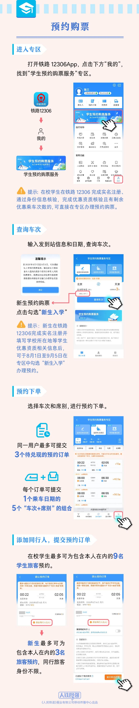
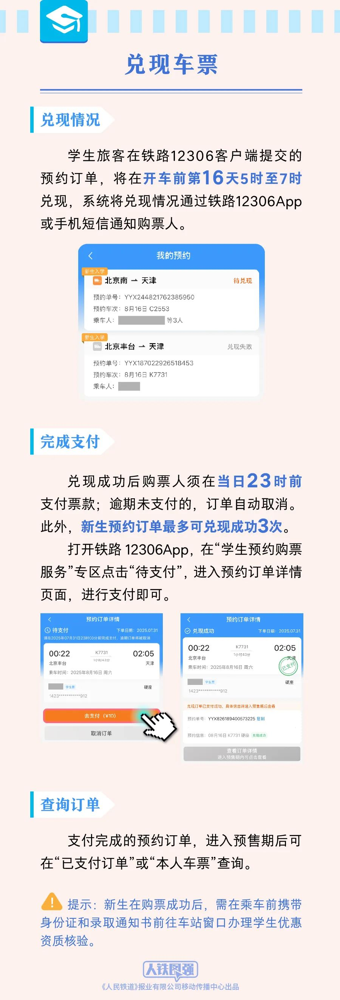
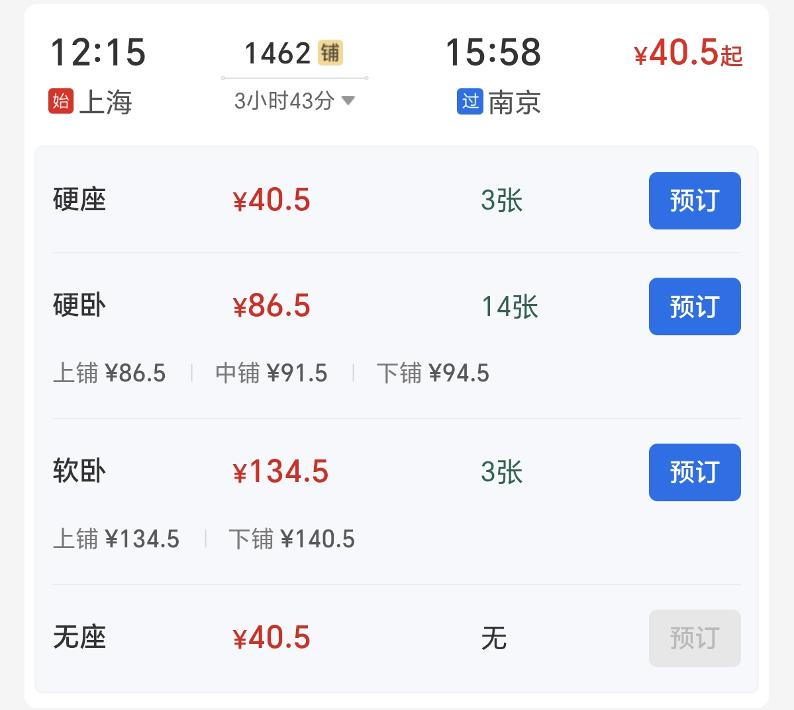
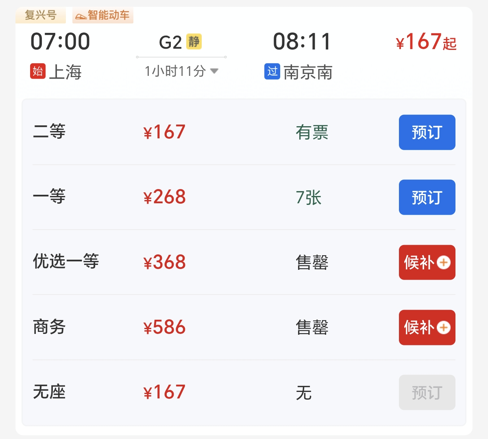
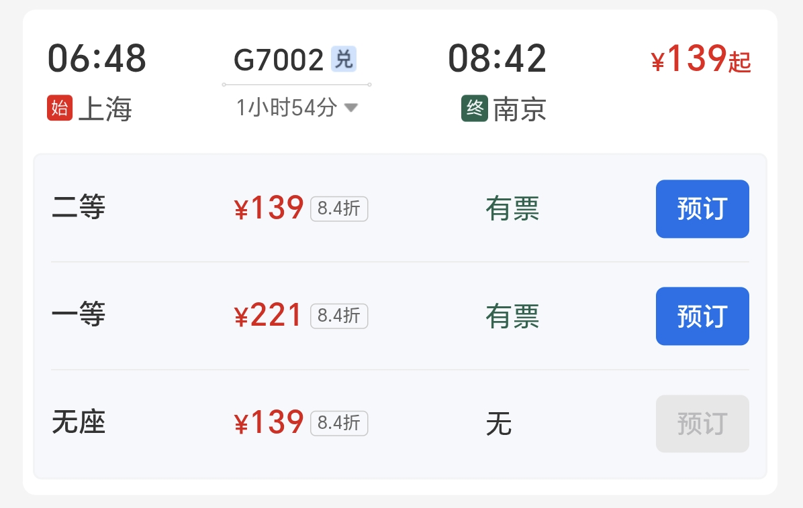
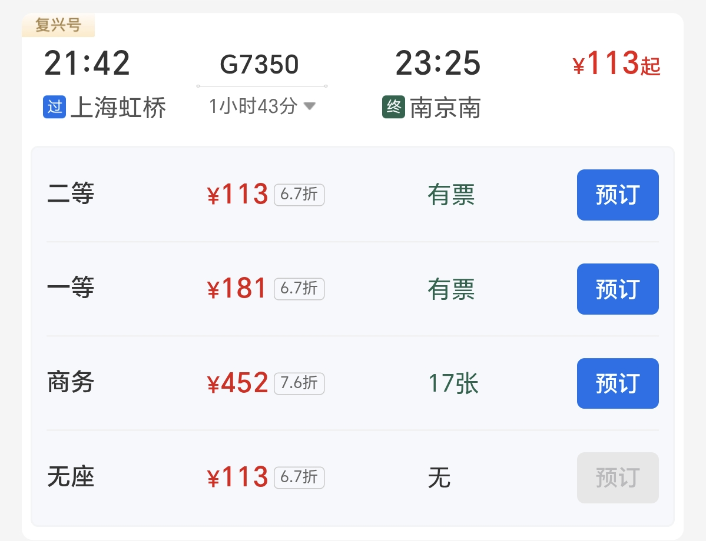
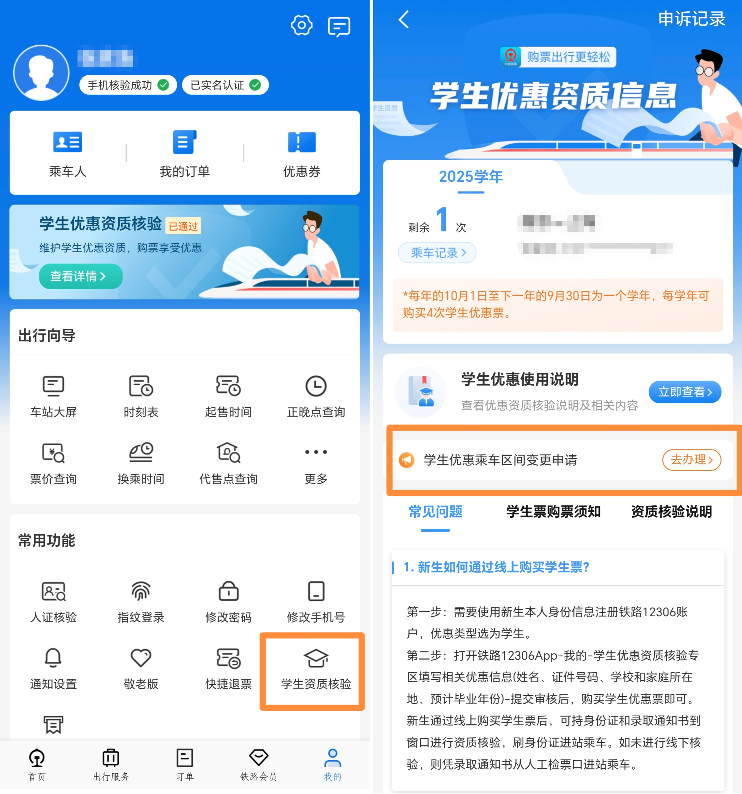

# 新生购买学生票
传统方法：持录取通知书，至火车站线下售票窗口购买。

线上购票：使用 12306 APP 的学生票预约服务，购票时**勾选“新生入学”**，乘车前**携录取通知书至车站窗口核验学生身份**。

# 常规购买学生票
:::info
买票请到12306，请勿使用第三方平台购买火车票，否则**可能导致个人信息泄漏**。

:::

## 设置学生身份
在 12306 APP 的“我的”>“乘车人”中，点击本人对应的编辑按钮，更改”优惠（待）类型“为学生。

## 选择以学生身份购票
在购票界面选择学生类型的乘车人时，系统会弹出选择购买成人票/购买学生票的窗口，点击**购买学生票**。

# 优惠次数
学生票的优惠次数为**每年4次**，当4次机会全部用完后无法购买学生票。每年10月1日会重置优惠次数为4次。

## 合并优惠次数
当中转换乘，分段购买车票时，可能会产生额外的优惠次数消耗。可在出站后打开 12306 APP 中的“我的”>“常用功能”>“学生资质核验”>“乘车记录”，点击右上角的“**去申诉**”，在申诉界面拖动行程进行合并。

:::info
注：需合并的所有行程中，第一次行程和最后一次行程的乘车日期的**间隔应在5天以内**，否则无法合并。

:::

# 票价计算
学生票适用的席位为：**硬座、硬卧、二等座**。具体折扣票价如下：

+ 硬座：常规硬座票价 * 0.5
+ 硬卧：常规硬卧票价 - 常规硬座票价 * 0.5
+ 二等座：**公布票价 *** 0.75

:::info
从 2025 年 9 月 6 日起，学生票适用范围增加，可购买**高铁一等座、二等卧、一等卧、动卧**，均按 75 折计算。

:::

值得注意的是，部分动车和高铁线路实行**浮动票价**机制：即先公布一个基准票价，随后根据车次的运行时间、客流情况等因素，在此基础上进行上下浮动。对于此类车次，学生票价格并不是按12306上显示票价打75折，而是按照**公布票价的75%**计算。 

:::info
从 2025 年 9 月 6 日起，学生票折扣为当日当次车成人票的 75 折，最低折扣为公布票价4折。

:::

以2025年7月25日，上海到南京的四趟车次为例：

+ 硬座/无座：40.5 * 0.5 ≈ 20.5 元
+ 硬卧上铺：86.5 - 40.5 * 0.5 ≈ 66.5 元
+ 软卧无法使用学生票，需支付原价。

+ 二等座：167 * 0.75 ≈ 125 元（票价没有折扣，可直接打75折）
+ 一等座、优选一等座、商务座无法使用学生票，需支付原价。

+ 二等座：139 / 0.84 * 0.75 ≈ 124.5 元（票价存在折扣，需先计算没有折扣的公布票价，再打75折）

:::info
公布票价相同的车次，无论选择的车次当日的票价的折扣是否相同，学生票的最终价格都是一样的。因此，**选择不打折的车次获得的优惠更多**。（不打折的车次通常都是停站少，速度快的高等级车，比如说上文中的 G2）

:::

+ 二等：113 元（该车次的票价已有67折，使用学生票无法享受更多优惠）

:::info
**当车次的票价折扣已经低于75折时，应直接购买成人票**，使用学生票不仅无法享受优惠，还会**损失学生票的折扣次数**。

:::

# 乘车区间
## 区间限制
学生票存在乘车区间限制，只能购买符合乘车区间范围的车票。在入学时学校会统一登记乘车区间。

好消息是，2025年铁路学生票政策更新，对于乘车区间的限制大大放宽。入学时的乘车区间可在后续任意更改，只需**确保区间的一端为学校所在地即可，另一端可以是全国任意车站**。

## 变更区间
得益于上文的新政策，在进行长途旅行时，可将区间修改为目的地车站，合理享受学生折扣。可在 12306 APP 中的“我的”>“常用功能”>“学生资质核验”>“学生优惠乘车区间变更申请”中，提交相关信息。

