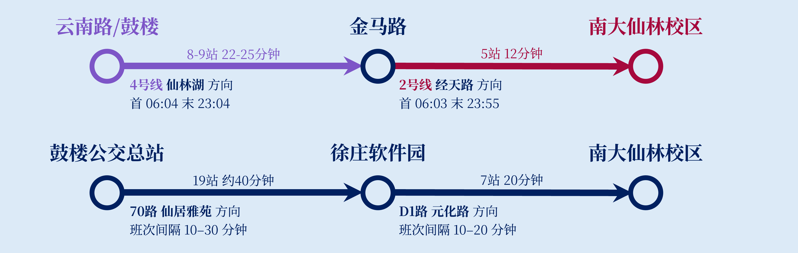
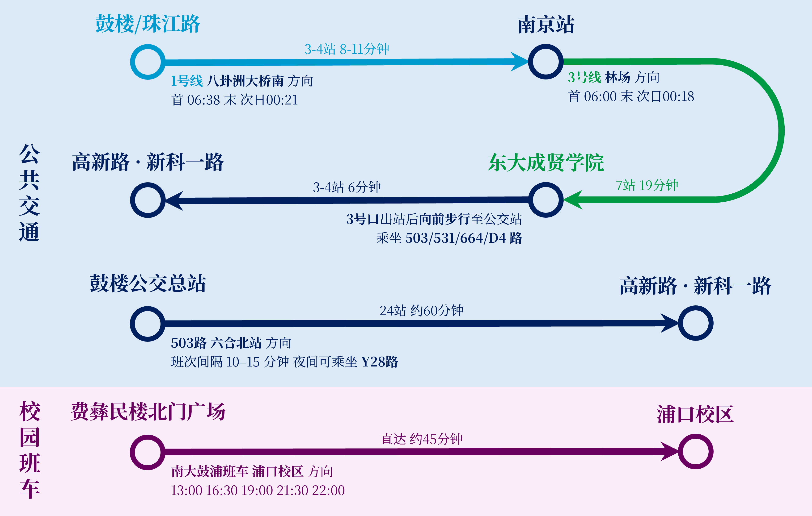
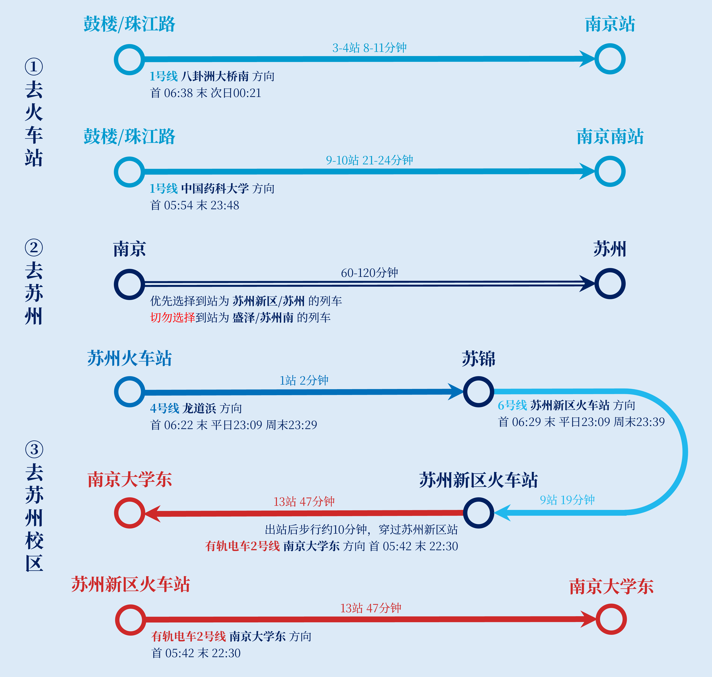

:::info
匆匆忙忙跑下换乘楼梯，却发现列车从眼前开走？

不妨阅读[一眼盯出换乘门](https://mp.weixin.qq.com/s/ClY1ZUw6LaPEuuO2Y5an4g)，从离换乘通道最近的车门下车，节省跨校区通勤的每分每秒~

:::

# 前往仙林校区
## 鼓楼北园 -> 仙林

## 鼓楼南园 -> 仙林

# 前往浦口校区
## 鼓楼 -> 浦口
:::info
有关鼓浦班车的更多信息，可查看[速报丨鼓浦班车开始试运行！！！](https://mp.weixin.qq.com/s/dxs4Ez8yyp232aLgXM4VpA)。

:::

# 前往苏州校区
## 鼓楼 -> 苏州

