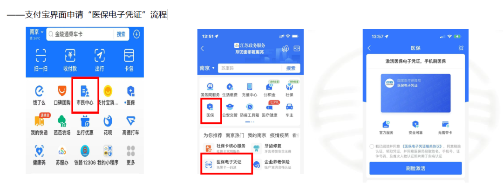
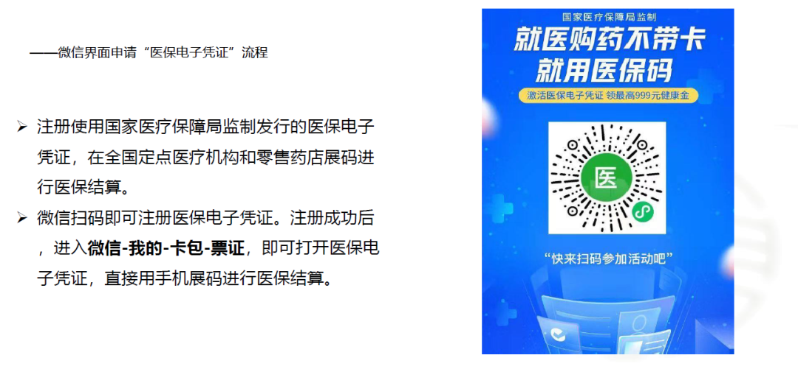
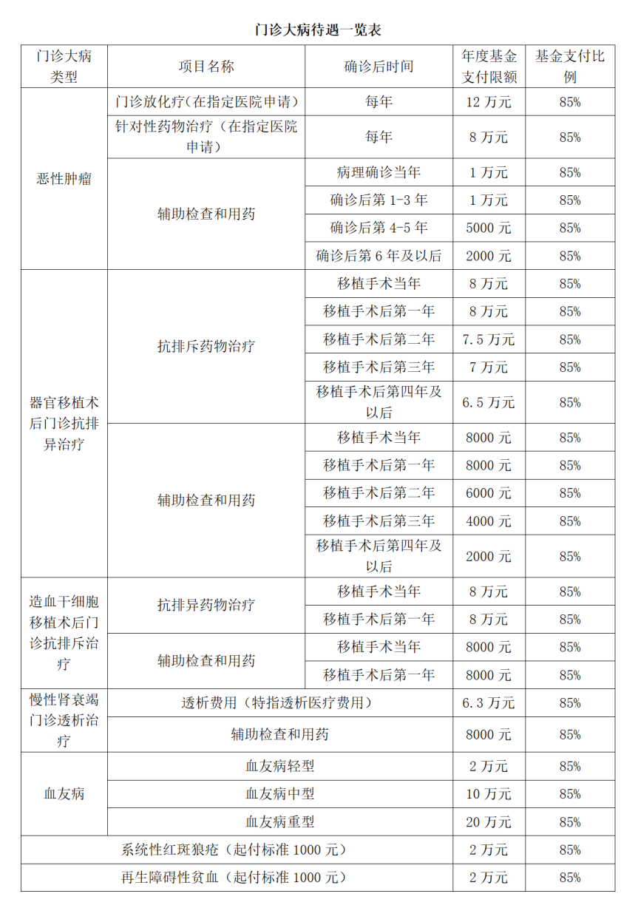
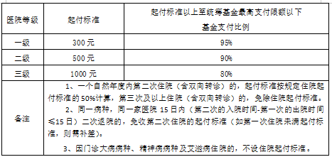
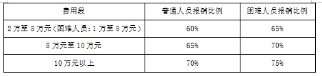

[南哪助手长期接受同学们投稿](https://www.yuque.com/greatnju/q-a/gw3phd#o8osi)

---

本文医保就医相关内容参考来源自校医院官网，以校医院官网和“南京大学医院”公众号最新通知为准；就诊体验与经验来自学生个人积累，仅供参考。

更新日期：2023-7-25

以下文章中出现的医保卡、社保卡，市民卡、社会保障卡均代指上印有“社会保障卡”且具有芯片功能的南京市第三代社保卡。（22级已开始启用第三代社保卡）

仍需完善的问题：

1.苏州、浦口校区就诊问题

## 一.大学生参保须知
+ **医保参保**：  
   **所有在校大学生（不包括外籍留学生）** 按自愿原则参加南京市城镇居民基本医疗保险，根据参保当年南京市医保中心通知的收费标准执行，**按学制年限一次性收费**。所有新生均可参照随入学通知书所附文件要求，线上申办社保卡，到校自行或根据通知至对应网点领取实体社保卡。
+ **大学生医保提供的医疗保障**参照[《大学生医保就医新政解读》（2023年1月1日启用）](https://hospital.nju.edu.cn//gfyyb/20221215/i235798.html)

### 1.待遇享受期
+ 参保的大学生，待遇享受期为自然年度，即**入学次年1月1日**至**毕业当年12月31日**。
+ 大学生入学当年已经在南京市之外参加基本医疗保险的，当年发生的医疗费用，原则上按原参保地规定享受医保待遇。入学当年发生的门诊大病、住院等重大疾病医疗费用，可参照南京市居民医保中大学生保障待遇予以保障。

### 2.就诊方式
2023年1月1日起，我校大学生无论在校医院或其他医保定点医院门诊就医均须刷**医保卡**进行实时结算。**<u>学校不再办理大学生门诊医疗费报销。</u>**参保大学生在医院就医缴费时，**凭本人社会保障卡或电子医保卡**直接刷卡结算。医保支付费用已直接减免，所支付消费即为个人自付内容。未刷医保卡不享受南京市医保报销待遇，全额自费。

:::info
**门诊就诊经验：**目前大部分互联网医院**线上预约门诊挂号**无法支持直接医保挂号，显示为**自费支付**，请在就诊前认真识读各医院关于使用医保账户的要求。

可提供的经验参考：预约挂号支付成功后，在**就诊前**到就诊医院**挂号处或预约中心**说明使用医保结算，提供医保卡或电子医保凭证在人工窗口将自费挂号转为医保挂号即可。

**急诊就诊经验：**携实体医保卡或医保电子凭证至医院急诊挂号处直接使用。

:::

按文件通知，学生到15家门诊统筹转诊定点医院就医（专科医院除外），门诊需办理转诊手续，未经转诊不享受南京市医保报销待遇。但在南京大学医院2023-02-24《大学生医保相关政策问答》中标注目前因疫情暂不需要转诊，2023-6实测仍不必须要求转诊，急诊直接刷社保卡结算。

## 二. 校医院相关：
### 1. 就诊注意事项：
+ 前往校医院就诊付费需携带**社保卡或申领电子社保卡**，否则无法享受医疗报销。第三代社保卡支持一卡两用，即社会保障卡功能和银行借记卡功能，具体差别与激活方式请自行百度搜索或电话咨询，**一般情况下**，大学生社保卡的社保账户内无余额，就医时走医保统筹报销减免相关费用，所支付金额即为个人自费部分。
+ **2023年1月1日之后就医报销注意事项请详细阅读上述**[《大学生医保就医新政解读》（2023年1月1日启用）](https://hospital.nju.edu.cn//gfyyb/20221215/i235798.html)**。**
+ 校医院**不提供直接买药**的服务，如果已经有想要购买的药物不需要医生诊断可以先挂号门诊后说明请医生开药。并且医院外药店即使标注支持医保，但大学生医保**无法在此享受报销**。
+ 居住在**仙林校区**的同学若出现急性病症状可以打电话给仙林校区校医院申请医生出诊。联系电话：89685120。出诊服务全天提供。
+ **校医院不提供狂犬病疫苗、破伤风疫苗**，需前往校外接种并且不享受报销服务。（谨慎撸学校里的猫，每年学校都会有很多人被猫抓后需要接种疫苗。）
+ 目前校医院已按批提供**HPV九价、乙肝疫苗**，有需要同学请根据南京大学医院公众号通知按时预约接种。
+ 校医院官网：[https://hospital.nju.edu.cn/](https://hospital.nju.edu.cn/) 

### 2.社保卡申领注意事项：
+ 每年新生录取通知书附件内即有南京社保卡办理资料，请同学们仔细查阅。
+ 实体社保卡（或称市民卡）：若同学手上所持有的外地社保卡卡面上沿标注“江苏省人力资源与社会保障厅”字样，不影响在南京地区正常使用。同时，同学们也可自行申请电子医保卡和医保电子凭证（可通过微信、支付宝、“我的南京”app等渠道）。支付宝渠道的医保电子凭证可能存在参保信息不全、延后等情况，可在学生医保系统（https://xsyb.nju.edu.cn/ybxt/sys/lwNjuHealthCare/index.do#/homePage）中确定参保信息无误后转用“我的南京”app等渠道查询或联系院医保办（咨询电话：025-83594290）询问。南京市医保中心电话：025-12393。
+ **电子医保卡本地就医和异地就医都可以使用；医保电子凭证支持南京本地就医，暂不支持异地就医。**

### 3.社保卡遗失补办
社会保障卡遗失后，应及时拨打电话**025-12333**进行人工挂失或自动语音挂失，并在三个工作日内携带本人身份证及复印件到**市民卡中心、市民卡服务网点或指定银行网点**办理挂失和补卡手续。社保卡拿到后，可在自费就医当月内去医院退费处退费补刷卡处理。（欢迎有相关经验的同学投稿，可私聊联系“南哪助手”）

### 4. 校医院就诊相关时间：
+ **工作时间**：

鼓楼校区：

普通门诊：（周一至周五） 8:00--11:45 ，13:30--17:00

急　  诊：（周一至周五） 11:45--13:30，双休及节假日 8:00-17:00

仙林校区：

普通门诊：（周一至周五） 8:00--11:45，13:30--19:30

急  　诊：（周一至周五）11:45--13:30，19:30--次日上午8:00  ，节假日全天

出    诊： 24小时出诊，联系电话 89685120

+ **专家门诊：**

鼓楼校区

鼓楼医院专家门诊时间：

| 时  间 | 专家科室 |
| --- | --- |
| 周三下午 | 神经内科、感染科 |
| 周四下午 | 心血管科、呼吸科 |

咨询电话：83592526

仙林校区

泰康仙林鼓楼专家门诊时间 

| 时  间 | 专家科室 |
| --- | --- |
| 周二下午 | 妇科、皮肤科 |
| 周四下午 | 内分泌科、失眠门诊 |

咨询电话：89685120

+ **校医院各项服务工作时间：**
1. 仙林校区：

| 科室 | 工作日 | 工作时间 |
| --- | --- | --- |
| 综合门诊 | 周一至周五 | 08:00~11:45 13:30~17:00 |
| 口腔科、预防保健科、医院行政 | 周一至周五 | 08:00~11:45 13:30~17:00 |
| 皮肤科 | 周五 | 08:00~11:45 13:30~17:00 |
| 妇  科 | 周五 | 08:00~11:45 13:30~17:00 |
| 五官科 | 周二、周四 | 08:00~11:45 13:30~17:00 |
| 中  医 | 周二、周四 | 08:00~11:45 13:30~17:00 |
| 放  射 | 周一至周五 | 08:00~11:45 13:30~17:00 |
| B超、心电图 | 周一至周五 | 08:00~11:45 13:30~17:00 |
| 检验科常规 | 周一至周五 | 08:00~11:45 13:30~17:00 |
| 生化检查(空腹) | 周二、周四 | 08:00~10:00 |
| 门诊体检(空腹) | 周二、周四 | 08:00~10:00 |
| C13检查 | 周一上午 | 08:30~11:00 |
| 零星疫苗接种 | 周一下午 | 14:00~16:00 |
| 挂号、药房 | 周一至周五 | 08:00~19:30 |
| 挂号、药房 | 周六、周日 | 09:00~19:30 |
| 急  诊（综合门诊） | 周一至周五 | 11:45~13:30 17:00~次日上午 08:00 |
| 急  诊（综合门诊） | 双休及节假日 | 24小时 |

2. 鼓楼校区：

| 科室 | 工作日 | 工作时间 |
| --- | --- | --- |
| 内科、外科（皮肤科）、口腔科、妇科、推拿科、预防保健科、医院行政部、院士保健办 | 周一至周五 | 08:00~11:45 13:30~17:00 |
| 五官科 | 周一、三、五 | 08:00~11:45 13:30~17:00 |
| 中医科 | 周一、三全天及周五的上午 | 08:00~11:45 13:30~17:00 |
| 理疗科 | 周一至周五上午 | 08:00~11:45 |
| 挂号、药房 | 每天 | 08:00~11:45 13:30~17:00 |
| 胃镜（空腹，需预约） | 周五上午 | 08:00~11:00 |
| 雾  化 | 周一至周五下午 | 13:30~17:00 |
| 放  射 | 周一至周五 | 08:00~11:45 13:30~17:00 |
| B超、心电图 | 周一至周五 | 08:00~11:45 13:30~17:00 |
| 检验科常规 | 周一至周五 | 08:00~11:45 13:30~17:00 |
| 生化检查(空腹) | 周一、三、五 | 08:00~10:00 |
| 门诊体检(空腹) | 周一、三、五 | 08:00~10:00 |
| C13检查 | 周五上午 | 08:30~11:00 |
| 零星疫苗接种 | 周二下午 | 14:00~16:00 |
| 院士楼保健服务 | 周三下午 | 13:30~17:00 |
| 急  诊 | 周一至周五 | 11:45~13:30 |
| 急  诊 | 双休及节假日 | 8:00~17:00 |

## **三、医保报销细则**
### 1.医疗报销待遇
在一个待遇年度内（1月1日—12月31日）发生的符合南京市城乡居民医疗保险支付范围的医疗费用，**起付标准以上部分**，基金按规定支付（有自付比例的药品和项目需个人先按比例支付），支付类型分以下10类。

#### 1.普通门诊统筹待遇
一个自然年度内大学生发生门（急）诊医疗费用，**起付标准100元**（医疗支付费用在100元以上的部分进行基金支付报销）

+ 在校医院及社区医疗机构就诊的，基金支付比例**60%**，
+ 非社区医疗机构就诊的（例如鼓楼医院、皮研所、泰康仙林鼓楼医院等），基金支付比例**40%**；
+ **年度基金支付限额600元**。

#### 2.高血压、糖尿病门诊统筹待遇
参保大学生如患有高血压或糖尿病的，在**定点医疗机构**发生的医保范围内“两病（高血压、糖尿病）”药品、诊疗服务等医疗费用纳入门诊统筹支付范围，门诊统筹年度基金支付限额增加至1100元。同时患有“两病”的，门诊统筹年度基金支付限额增加至1500元。

#### 3.门诊高费用补偿待遇
一个待遇年度内，**享受完门诊统筹待遇（达到限额600元）后**，继续发生的门诊医疗费用，

+ **个人自付2000元以上部分**，享受门诊高费用补偿待遇；
+ 在校医院及社区医疗机构就诊的，基金支付比例50%；
+ 非社区医疗机构就诊的，基金支付比例30%。
+ **年度基金支付限额2800元****。**

#### 4.门诊大病待遇
##### 一）门诊大病病种。包括恶性肿瘤、重症尿毒症的血液透析（含腹膜透析）治疗、器官移植手术后抗排异治疗、血友病、再生障碍性贫血、系统性红斑狼疮。具体基金支付限额与比例参照以下医疗待遇分类与门诊大病待遇一览表。
##### 二）身份认定。患有以上门诊大病的参保学生，可向本市有认定资质的三级定点医疗机构（具体可询问院医保处）提出病种认定申请。
##### 三）医疗待遇。
###### （1）恶性肿瘤门诊治疗：
+ 患有恶性肿瘤的参保学生，在规定的定点医疗机构发生的门诊放射治疗和化学治疗（指静脉或介入化学治疗）医疗费用，基金支付限额**12万元/年**；
+ 发生的乳腺癌和前列腺癌内分泌治疗，肾癌和黑色素瘤免疫治疗，恶性肿瘤口服化疗（含分子靶向药）、膀胱灌注、抗骨转移或晚期镇痛治疗等针对性药物治疗费用，**自确诊之日起五年内，基金支付限额****8万元/年**，**五年后仍需继续治疗的，经规定的定点医疗机构评估后，可延长待遇年限**；
+ 发生的除放化疗和针对性药物治疗以外的辅助治疗费用，**基金支付限额为：****第一至三年1万元/年，第四至五年5000元/年，第六年及以后2000元/年。**

###### 2）慢性肾衰竭门诊透析治疗：
+ 患有慢性肾衰竭需门诊透析治疗（包括血液透析和腹膜透析）的学生，在规定的定点医疗机构发生的透析医疗费用限额为**6.9万元/年**，发生的辅助检查用药医疗费用，基金支付限额为**1000元/年**。

###### 3）器官移植术后门诊抗排异治疗：
+ 器官移植术需后门诊抗排异治疗的学生，在规定的定点医疗机构发生的抗排异药物治疗费用，基金支付限额为：**第一年8万元，第二年7.5万元，第三年7万元，第四年及以后6.5万元/年**。
+ 发生的辅助治疗费用，基金支付限额为：**第一年8000元；第二年6000元；第三年4000元；第四年及以后2000元。**
+ 造血干细胞（异体）移植术后门诊抗排异治疗待遇期为手术当年及术后第一年，待遇标准参照移植术后门诊抗排异治疗对应年限执行。

###### 患以上三项门诊大病病种参保人员确诊或术后当年发生的门诊大病医疗费用，基金按照第一年待遇标准支付。
###### 4）血友病待遇：
+ 血友病（遗传性凝血因子Ⅷ、Ⅸ缺乏）患者，在规定的定点医疗机构发生的相应检查和替代治疗医疗费用，按照血友病**轻型、中型、重型**，年度基金支付限额分别为**2万元、10万元、20万元**。

###### 5）再生障碍性贫血、系统性红斑狼疮待遇：
在规定的定点医疗机构发生的病种医疗费用，**起付标准1000元，年度基金支付限额为2万元**。

#### 5.门诊精神病待遇
##### 一）身份认定
患有精神分裂症、分裂情感性障碍、偏执性精神病、双相情感障碍、癫痫性精神病、精神发育迟缓伴发精神障碍、抑郁发作（中、重度）、强迫症等精神疾病的参保学生，可在**南京市脑科医院**或**东南大学附属中大医院**提出病种认定申请，并在定点医疗机构医保办进行病种认定的审核。

##### 二）医疗待遇
在门诊发生的病种医疗费用，**基金支付比例为85%**。

#### 6.门诊艾滋病待遇
##### 一）身份认定
患有相关艾滋病种的参保人员，可在**南京市第二医院**提出病种认定申请，并至定点医疗机构医保办进行病种认定的审核。

##### 二）医疗待遇
艾滋病病毒感染者和艾滋病病人在门诊**免费享受抗艾滋病病毒和机会性感染治疗及相关检查**，由定点医疗机构**按每人每季度1000元的定额标准包干使用**。

#### 7.住院待遇

#### 8.生育医疗待遇
##### 一）办理登记。
符合国家计划生育政策的参保学生，怀孕后携带结婚证、社会保障卡、生育登记服务证明等资料到具备建卡条件的医疗机构办理生育登记。

##### 二）医疗待遇
包括产前检查和住院分娩的医疗费用。产前检查费用，**基金支付比例40%**，**基金支付限额300元**。住院分娩费用，参照**住院支付政策**执行，其中在三级医疗机构就诊的，**基金支付75%**。

#### 9. 大病保险待遇
一个待遇年度内，发生符合城乡居民医疗保险规定范围内的住院和门诊大病医疗费用，**个人支付金额2万元（困难人群1万元）以上**，可以享受大病保险待遇。实行“分段计算，累加支付”，不设最高支付限额。具体如下：

#### 10.哪些医疗费用，不享受医保待遇
##### 1）应当从工伤保险基金中支付的
##### 2）应当由第三人负担的；
##### 3）应当由公共卫生负担的；
##### 4）在境外就医的；
##### 5）按照规定不予报销的其他情况。
### 2.异地就医
大学生异地实习及在户籍地（或生源地），因病异地就医时需在**“我的南京”APP-医保服务-异地就医备案办理备案手续**，持二代省卡（卡面上沿标注“江苏省人力资源与社会保障厅”字样）或三代卡在异地刷卡结算。  

若异地就医备案成功后，因未办理二代省卡或三代卡等原因未刷卡结算，发生的门诊或住院费用**先由个人垫付**，出院后凭**病历复印件、住院发票、费用明细、出院小结等材料（自留复印件）交至校医院医保办**，由医保办统一申请按规定办理审核零星报销。**如未办理异地就医备案手续，报销比例降低20%**。

---

[南哪助手长期接受同学们投稿](https://www.yuque.com/greatnju/q-a/gw3phd#k6p5Y)

