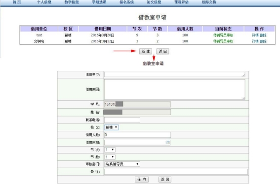

[南哪助手长期接受同学们投稿](https://www.yuque.com/greatnju/q-a/gw3phd#o8osi)

---

# 南京大学学生活动网上借教室操作流程

为方便学生借用教室进行社团、班级活动，提高工作时效，教务处现推出网上借教室功能，5月3日开始试运行。

## 一、面向对象
目前网上预约借教室功能服务对象为全校本科生。因教室借用功能依托教服平台开发，研究生同学暂时还没有账号，所以研究生同学或其他单位借用教室依然按照原流程在规定时间办理。教学活动使用教室仍通过院系教务员借用。

## 二、借用教室操作流程
登陆教服平台-业务办理-借教室申请-填写教室借用申请并提交审核-院系/相关单位指导老师/社联会初审-教务处复审并安排教室-打印教室使用单

## 三、借用教室申请步骤
1. 通过教务处主页登陆教服平台，输入用户名和密码（如下图所示）

2. 点击教服平台首页-业务办理-借教室申请（如下图所示）

3. 点击“新建按钮”按照实际情况填写《借教室申请》（申请界面如下图）

4. 选择审核部门后提交申请，等待指导老师及教务处审核并安排教室，在借教室申请界面可以随时关注审核状态，教务处审核完毕即可打印教室借用申请表结束借用流程。

## 四、注意事项
1. 网上借用教室需至少提前三天发起申请，最多可以提前一周借用教室
2. 教室借用申请提交完毕后请及时联系指导老师进行网上审核，各院系/单位指导老师账号和密码可在南京大学办公自动化系统相关通知中查看。
3. 因活动时间变化等原因需要调整时间或取消活动，在教务处安排教室前均可删除借用申请，教务处安排教室后需到教务处进行办理。
4. 使用教室前必须至少提前1小时在教室黑板上写明教室使用原因、使用时间段、使用单位等信息，否则自习同学可拒绝让出教室。
5. 教室借用仅限社团/班级开会、讲座、课程辅导等活动，教室内禁止进行彩排、party、破冰等打扰同学自习的活动，如发现教室实际使用情况与申请情况不符，申请人及审核人均要承担相应责任。
6. 因网上借用教室刚开始运行，如遇不方便的地方可以及时把建议和截图发到zhouhang@nju.edu.cn，教务处会根据大家的意见和建议共同进行改进。

---

[南哪助手长期接受同学们投稿](https://www.yuque.com/greatnju/q-a/gw3phd#k6p5Y)

