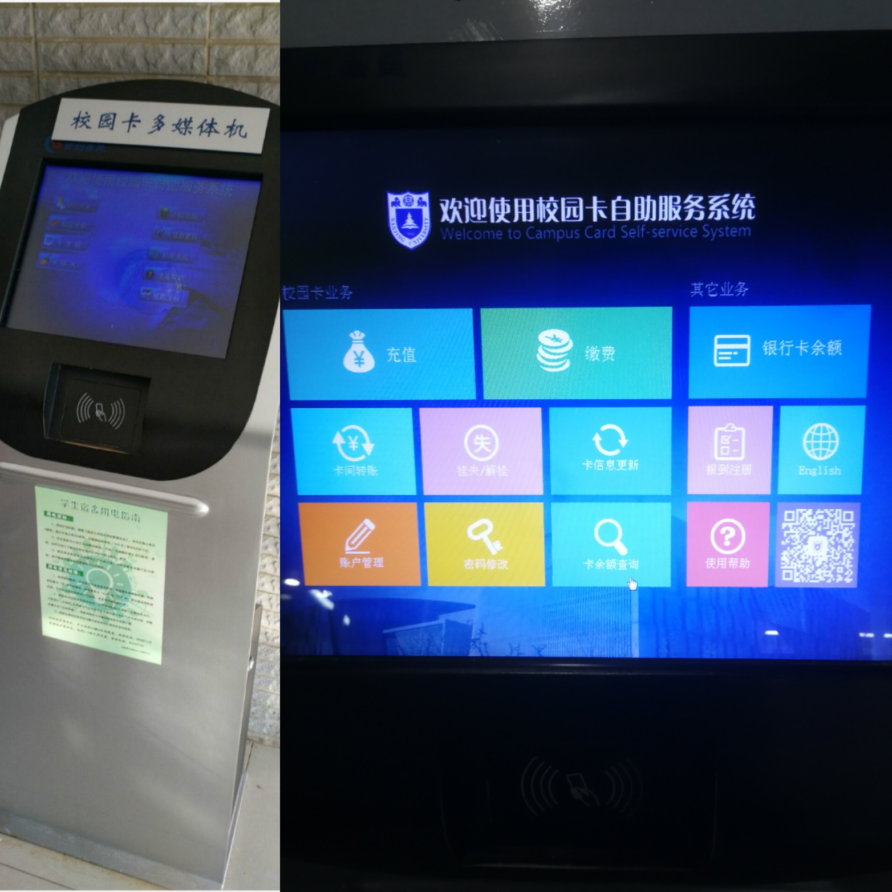

[南哪助手长期接受同学们投稿](https://www.yuque.com/greatnju/q-a/gw3phd#o8osi)

---

**随着信息化的发展，微信端“南京大学信息门户”，南京大学app以及网页端ehall.nju.edu.cn逐渐取代了线下的多媒体机，多媒体机也退出了历史的舞台。多媒体机的消失见证了南大信息化水平的发展，我们相信南大的信息化会越来越方便同学们的生活！**

多媒体机是与校园卡息息相关的机器，它分布在宿舍楼下，五食堂门口，大活，教学楼等位置，大家可以在任意一台多媒体机上办理校园卡业务。

多媒体机的界面左半部分位校园卡业务，右半部分为其他业务。下面对各个按钮对应功能进行简介。

**注意，系统会不定时进行升级，本文档也会跟随系统升级而更新，请以最新版本为准**

   

 

+ 校园卡业务
    - 充值：即为给校园卡充值的功能界面。
    - 缴费：将校园卡放置在感应区，可进行电费、网费和水费的缴纳
    - 卡间转账：把钱从一张校园卡转到另一张，需要转入卡和转出卡同时在你手里，但是不需要转入卡密码。
    - 挂失/解挂（不允许重复挂失和解挂）
        * 挂失：输入用户名（学号）和密码进行挂失
        * 解挂：将卡放置在感应区输入校园卡密码进行解挂
    - 卡信息更新：卡信息更新是旧卡需要进行的操作，一般不使用。
    - 账户管理：在该界面可进行账户查询、交易明细查询和消费限额修改
    - 密码修改：顾名思义，修改密码用的
    - 卡余额查询：卡余额为有卡免密操作，可以查询校园卡当前余额。
+ 其他业务
    - 银行卡余额：查询与校园卡绑定的银行卡的余额，需要输入校园卡密码
    - 报到注册：每年开学都要用校园卡在多媒体机上报道注册。
    - English：转换语言
    - 使用帮助：内包含使用帮助
    - 二维码：南京大学信息门户的二维码

校园卡初始密码为身份证后6位，x用0代替。单次消费限额（包括单次充值限额）为500，日累计消费最大值为10000。限额设置为0，则不限制消费（在最大限额以内）

充值银行卡有时会发生未到账的情况，在第二天使用多媒体机，放上校园卡后会提示有补助可以领取，未到账的充值金额将以补助形式进入校园卡中。

 

本文作者：杨健雄

本文更新：宋霄涵

---

[南哪助手长期接受同学们投稿](https://www.yuque.com/greatnju/q-a/gw3phd#k6p5Y)

