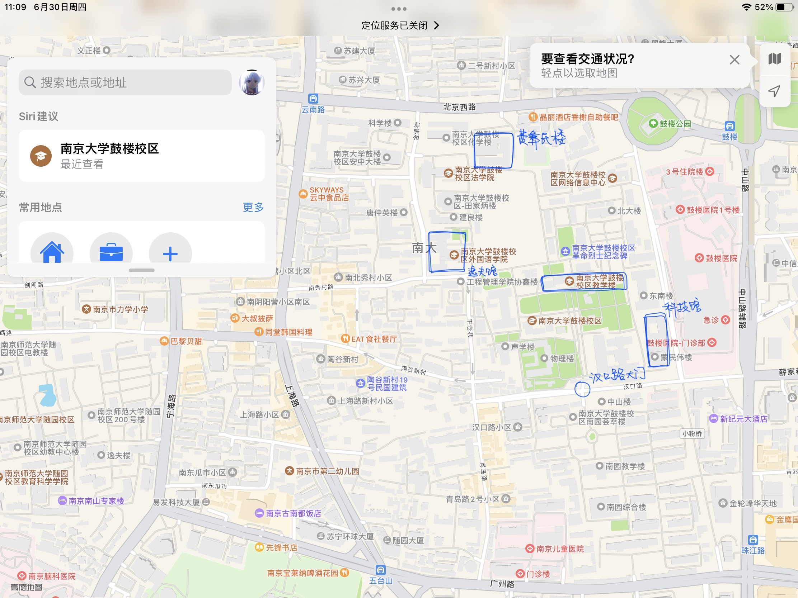
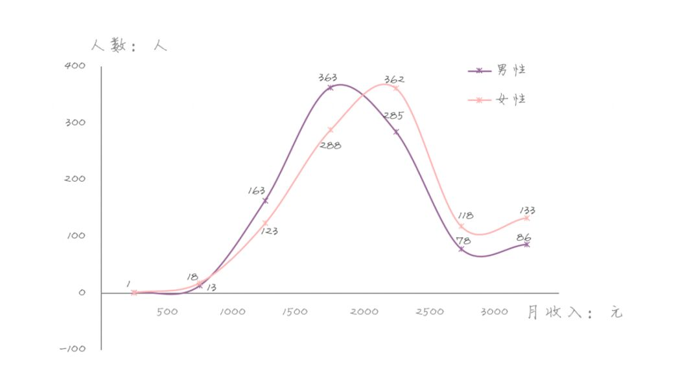
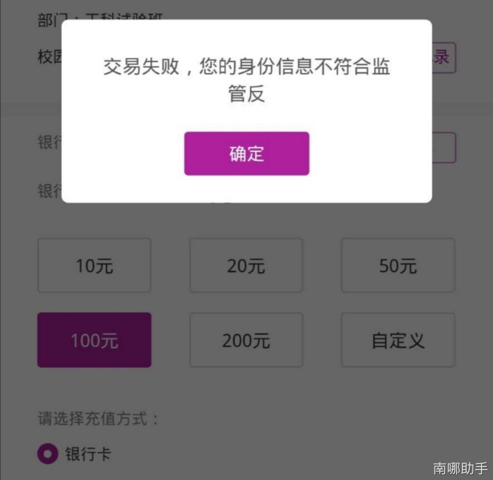

[南哪助手长期接受同学们投稿](https://www.yuque.com/greatnju/q-a/gw3phd#o8osi)

---

by皮皮张

红色背景的部分为待定内容。

## 报道篇
#### Q：通知书大概什么时候到啊？怎么查啊？
A：通知书正在有序发放。由于数量比较多，假期招办人手紧张，请大家耐心等待。

可以关注微信公众号“南大招生小蓝鲸”或在[https://bkzs.nju.edu.cn/static/front/nju/basic/html_web/lqcx.html](https://bkzs.nju.edu.cn/static/front/nju/basic/html_web/lqcx.html)查询已寄出的通知书单号，不同省份、批次寄出顺序不同。

通知书包括：录取通知书、入学纪念卡、工行银行卡、新生入学指南（二维码扫描，2023-7-21还未上传）、安全教育、家庭困难认定表、学生资助政策简介和紫色盒子一系列纪念品。其他被塞进去的东西都与南大官方无关，谨防广告。

反正已经录取了，通知书是不会跑掉的，大家安心等待即可。等待是人生中最美的姿态。

录取通知书如果出现错误，及时联系招生办或者在咨询群内反馈。

#### Q：啥时报道呀！
A：通知书里会写。火车站汽车站有人接站，校门口也有志愿者，地点是（2025年鼓楼校区报道地点待定），跟着举着自己大类/院系牌子的学长学姐走就好啦。

#### ~~Q：铁路托运怎么操作啊？~~
~~A：带着行李去火车站，问那里的工作人员在哪里办，一般在车站外面的附近。行李上要贴上标有“61”字样的贴条，以便被分拣到南大。“61”贴条的作用类似于邮政编码。地址填~~~~（未定，应该是鼓楼校区地址）~~~~。有无火车票都可以进行铁路托运，不过没有车票时价格要高一些。铁路托运的行李南大会代为接收并代为保存，所以即便早寄几天也可以，但是不要提前太多。~~

~~除了铁路托运~~~~，~~~~也可~~~~以~~~~通~~~~过~~~~快~~~~递~~~~的方~~~~式~~~~寄~~~~送~~~~行~~~~李~~~~，~~~~但~~~~是~~~~需~~~~要~~~~和~~~~快~~~~递~~~~公~~~~司~~~~商~~~~议~~~~好~~~~送~~~~的~~~~时~~~~间~~~~和~~~~派~~~~送~~~~时~~~~间~~~~，~~~~快~~~~递~~~~学~~~~校~~~~是~~~~不~~~~能~~~~代~~~~为~~~~收~~~~件~~~~的~~~~。~~

~~如果通知书里没有行李贴，可能是漏掉了，可以自行在咨询群群文件下载电子版（群号见文档首），打印大一点、尽量打成红色。~~

~~~~

**2022年，行李托运已经取消了。**

****

#### Q：如何购买学生票？
A：网络购票时学号填录取号（通知书上25开头的八位数字（举个例子：20252020）），乘车区间为“出发地-南京”，取票时带着录取通知书去人工窗口取。人工窗口买票的时候就需要带着录取通知书。电话订票貌似不需要提供学号/录取号，不过取票的时候同样需要提供录取通知书。上车的时候也要带着录取通知书以便查票。

#### Q：外地学生生活用品是运过去比较好还是到学校再买比较好？
A：路远的话来了再买更方便一些，运费也很贵的，而且带着很麻烦；近的话可以自己带。学校会给新生提供日用品套餐，应该是460一套，具体内容通知书里应该有的，质量还算不错（单独买的话很难买到这么多东西）。

+ 仙林校内有且只有两家正规超市：**教育超市**和~~**中超华诚超市**~~**苏果超市（不知道2023年秋季能不能开业）**，也可以去那里买日用品，记得保存好小票。不着急的话网购也是很方便的。
+ 鼓楼校内只有教育超市是正规超市。校外较近的超市有距离100m好又多超市（汉口路）和700m的苏果超市（汉口西路）。

另：**校内正规超市只有上面说的几家。****一定不要去流动摊点购买，无法保证质量。**每年开学都有人运点东西过来赚上一批就跑人，投诉也找不到地方，刚到就被坑一顿很糟心的~

#### Q：学校的460生活用品套餐质量怎么样啊？
A：还算不错，质量和价格匹配。

#### Q：录取通知书里那张银行卡是干啥用的？
A：通知书里有一张工行卡，它和你的校园卡自动绑定，主要用于扣缴学费、住宿费等费用，发放各类奖助学金，校园一卡通（含食堂饭卡功能）自助充值等。如果丢了，挂失后需要和校园卡重新绑定。

收到银行卡之后，在9月5日之前携带银行卡和本人身份证件到当地工行营业厅激活（向工作人员说明情况即可），并及时预存所需缴纳的费用即可，详情参阅《2025新生入学指南》。

二类卡的处理请参阅《2025新生入学指南》或咨询工行工作人员。

#### Q：报道时候怎么到鼓楼校区啊？
A：报道当天，学校在南京站（南广场）、南京南站、南京长途客运站（小红山）都设有新生接待站。大家找到举着“南京大学”牌子的学长学姐，跟着他们可以坐学校的班车。乘飞机到达的同学可以从机场坐地铁S1号线至南京南站。

[南京大学鼓楼校区到校交通指南](https://www.yuque.com/greatnju/q-a/vbq9zd)

#### Q：报道时候要准备多少钱啊？学费什么的
A：不同专业的学费、住宿费、医保、教材费等，通知书里的入学须知里会说明，很详细。除要缴纳的学杂费外，建议第一个月的生活费多准备个一两千这样子，刚来到学校总会有你没考虑到的东西需要置备。

#### Q：报道时候要带银行存款凭条么？
A：最好带上。如果银行自助扣款失败（扣除的是学费、住宿费等），则需要用到它；当然可能很小，丢了也不用太担心。

#### Q：报道时团员证/介绍信/个人档案怎么处理？
A：每个高中的处理方式不同。有的高中会将上述材料统一寄送给南大；有的会发下来，保存好带到学校等待辅导员收取即可。不清楚处理方式可询问高中教务处。

#### Q：我有事情可以晚些报道么？
A：“因故不能按时报到或因出国留学等各种原因放弃入学资格的新生，请于8.25日之前提交书面申请，并附相关证明材料，发传真至招办（025-89680212）”（2020新生入学指南

建议提前联系大类辅导员，联系方式见通知书。

#### Q：家长陪同前去报道，有住宿的地方么？
A：家长住宿自理。仙林校区有两家宾馆：学生宿舍21栋的招待所（025-89681068、025-89681078），南大国际会议中心（在任意订房APP上都能搜到）。（疫情原因招待所暂不对外开放）学校周边宾馆也有很多，如果定不到可以选择二号线地铁沿线的宾馆，坐地铁很方便。

鼓楼校区也可以定在附近的宾馆，由于疫情原因校内宾馆暂不对外开放。现在可以定校内的南苑宾馆。

#### Q：通知书上说的行李箱大小不要超过balabala是什么意思？
A：那个限制是托运行李时的尺寸限制，不托运行李的话不用管。正常的行李箱宿舍里都能放得下。

#### Q：我的学号是多少？我的录取号是啥？
A：学号在[https://bkzs.nju.edu.cn/static/front/nju/basic/html_web/lqcx.html](https://bkzs.nju.edu.cn/static/front/nju/basic/html_web/lqcx.html)查询，录取号是录取通知书上“2025”开头的八位数字。

#### Q：为啥登不上迎新系统？
A：因为还没开放。~~通知书里的新生入学指南表示~~~~8.20日~~~~会开放迎新系统。~~

#### Q：报道时需要携带的照片要什么底色的？
A：白色。

（这是一个问了好多遍的问题，而且在新生入学指南上写的清清楚楚，但还是有人在反复地问..........................

## 军训篇：
#### Q：军训大概什么时候开始呀？持续多久呢？一般有啥内容？要剪寸头么？
A：报到后两三天开始，持续三周，无周末。

前十天左右，会根据大类/院系和性别分成不同的排，排内一般都是自己大类的同学，练习队列。之后会分到各个不同的方阵，女生有队列和军体拳，男生有队列、军体拳、刺杀操、匕首操。此外还有急救方阵，应该是最轻松的了，考核之后还能获得江苏省初级救护员证。

军训在校内进行，去年开始取消了实弹打靶、改用电子枪。

南大军训还是很轻松的。上午下午去训练，其他时间一般都是自由安排。军训期间会安排新生入学教育的一些讲座，白天晚上都有，强烈建议不要翘（特别是图书馆使用的讲座）。不查寝，不管内务；训练的时候穿好军服就行、对发型没有要求；训练时间外就是想做啥都可以咯~可以跟同学沟通一下感情，熟悉熟悉学校，了解了解社团这样子。

#### Q：军训服装有几套啊？
A：一套，于报道时统一购买，需一百元现金，包括帽子、外套、短袖、长裤、鞋、肩章。一般一夜可以晒干，如需额外换洗的衣服，可以去大学生活动中心人武部购买。

## 宿舍篇
#### Q：宿舍条件如何？几人间啊？
A：仙林四人间，上床下桌，有空调独卫（没有热水），有直饮水，有阳台。

[南大宿舍全知道（仙林校区，2021更新版）](https://www.yuque.com/greatnju/q-a/ksf4e5)

鼓楼宿舍三/四人间，上床下桌，具体内部条件每个宿舍楼都不一样，部分鼓楼宿舍下文有介绍。

[宿舍条件介绍](https://www.yuque.com/greatnju/q-a/owiiry)

#### Q：宿舍如何分配呀？大概啥时可以知道呀？床位怎么安排呢？
A：宿舍分配由房产处进行，同大类/院系在一起，学号排在大类/院系内首尾的同学可能会和其他大类/院系的同学拼宿舍。

8.20之后可以登陆迎新系统（admission.nju.edu.cn）查看宿舍分配情况，用户名：录取通知书编号（通知书上25开头的八位数字）；初始密码：身份证后6位（港澳台侨学生为入境证件全部号码）。

16级及以前南大是按照姓氏顺序分宿舍；17年发了个关于宿舍的调查问卷，进行有效填写的同学都根据问卷内容安排了宿舍，未填写同学的宿舍随机安排。今年的宿舍很可能上线网上自选舍友系统，大家耐心等待吧。

宿舍床位的话，可以迎新网上查询房号后面的字母代表床位，一般贴在上床下桌的上床的外围栏处。

#### Q：宿舍有独卫嘛？可以在宿舍洗澡嘛？
A：仙林宿舍有独卫和淋浴头，但没有热水。（仙林校区还在建的时候附近某大学热水器出了事故所以emmmmm，其实本来淋浴头都装好了的，最后临时取消了。

**2023-7-21更新：暑假正在给仙林没有热水的宿舍装热水器，预计2023-8-31完工**

**2025-6-27更新：三栋在装修**

每栋宿舍楼一楼都有一个公共浴室，只有淋浴没有大池子，开放时间为13：30-22：30，没有帘子。公共浴室习惯了就好了，问题不大。

部分人会用洗澡精灵在宿舍里洗澡，洗澡精灵是啥可以自行了解。

鼓楼宿舍部分有独卫，部分为公共厕所公共浴室，部分没有浴室需要去南园大澡堂洗澡，宿舍内是否有独卫浴室可参考上文的宿舍条件。

#### Q：啊啊啊这么说要自己打扫厕所了orz
A：有独卫的宿舍可以隔一段时间请宿舍楼里的阿姨打扫（多少钱一次忘了），宿舍AA一下就好。

公共卫生间的宿舍楼是阿姨统一打扫，但是也要注意卫生哦。

#### Q：宿舍可以用洗衣机嘛？可以做饭嘛？
A：仙林校区：宿舍一楼有洗衣房，内有公共洗衣机，会定期消毒，使用手机扫码支付，根据洗衣时间不同，每次2到6元。洗衣房内（或其他地方，找不到可以问宿管阿姨）有一个公共微波炉。

鼓楼校区在上面的链接有介绍。

宿舍限电1kw，吹风机、电冰箱、电热毯、洗衣机、电磁炉、电饭煲、电热水器等都是违禁电器，为了安全还是别在宿舍偷偷用啦。宿舍一楼有开水房，教学楼、图书馆都提供开水。部分宿舍楼有直饮水。

#### Q：宿舍钥匙丢了怎么办啊？
A：

[南京大学的常用补办说明](https://www.yuque.com/greatnju/q-a/dwtmdg#lDjr6)

#### Q：宿舍什么时候可以住啊？提前到南京要不要定酒店？
A：一般来说，报道前一天可以住，再早就得定酒店了。学校周围的酒店如果定完了的话，去仙林校区可以考虑2号线沿线的酒店，去鼓楼校区（2022级新生入学点）可以考虑1号线/4号线沿线的酒店，坐地铁很方便。

#### Q：晚上不回宿舍会怎么样？
A：理论上不会怎么样，但是2020年开始，有了预警系统（启用情况未知），夜不归宿（可能）会被辅导员通报。建议不回宿舍时及时找辅导员请假。

#### Q：学校限制学生在校外租房子住么？
A：需要办理退宿手续，不可以同时在校内拥有宿舍。

#### Q：宿舍有蟑螂嘛？
A：看你们打扫的干净不干净了，正常是没有的。

#### Q：宿舍有门禁嘛？
A：本科生宿舍开放时间：6：30-23：30。

夜间回寝可以按门铃，但非不可抗因素强烈建议按时回寝。值班的宿管阿姨经常因为一波波深夜回寝的同学一整夜没法睡觉，真的很辛苦。

#### Q：仙林、鼓楼校区有空调嘛？
A：有。宿舍，食堂，教学楼，体育馆，大活，图书馆，都是空调，很大很冷的空调。冬天公共场所有暖气。（南京这鬼天气，没空调早造反了）

#### Q：宿舍都在什么位置啊，离食堂教室远嘛？
A：（本条建议配合地图食用

仙林本科生都在一组团和二组团，距离食堂、教学楼、图书馆、体育馆、操场、大活都很近。一组团和二组团都是4人间，二组团是三室一厅、多了个小客厅，差别不大。

鼓楼本科生宿舍都在南园宿舍区。

#### Q：宿舍晚上断电嘛？断网嘛？
A：不断电，不断网，夜里会禁部分游戏。仙林一组团工作日23:30熄灯（考试周除外），鼓楼不熄灯。

#### Q：宿舍里可以放台式机么？
A：可以放，有不少学长在用，咨询群群相册有桌面的尺寸数据。

#### Q：宿舍会查寝嘛？
A：会，但不重要。每次查寝之前会在宿舍一楼大厅贴通知，就是进去看一下有没有违禁电器，没有就ok。

#### Q：床上用品的规格是多大的？
A：宿舍床大小：2*0.9m，有支架（可挂蚊帐/床帘）约1.2m，学校套装的被子规格是2*1.5。鼓楼校区部分宿舍层高较低，在购买带支架的窗帘前建议先进行高度测量。

可以参考鼓楼宿舍全知道，有详细数据供参考

#### Q：可以在宿舍养宠物么？
A：宿舍是公共空间，请考虑他人感受，与舍友协商妥善。原则上禁止养宠物，宿管发现后会没收，请妥善安置。

宿舍条件有限且上课较忙，你无法给它足够的陪伴和物质条件，不建议在宿舍养宠物。请善待它，不要无故抛弃。

## 学习篇：
#### Q：有入学考试嘛？有的话要考啥呀？
A：有英语分级考试和二次招生的考核。

英语分级考试基本全校都要参与，目的是根据大家英语水平的不同分层级教学，因材施教。有四个不同的层次，一层次最好，绝大部分人都在二三层次，四层次是为没有学过英语的同学开设的课（来自英语学区的同学，交白卷也是三层次）。分级考试成绩只决定了你在哪个层次的班级上英语课，不影响之后的英语课成绩；各个层次都是单独给分的，在三层次班里拿的90和二层次班里拿的90在对GPA的影响都是一样的，所以不用太担心这次考试。不建议假期突击考试技巧，强行进入高层次或许会学习压力会比较大、导致成绩不理想影响绩点。客观来说，一层次给分普遍比较高、但平时作业很多且较难进入；前三层次期末考试都是一样的试卷。群文件有样卷。<u>（2024级没有这一项，直接根据高考英语分数分层）</u>

[关于英语分级考试（2022）](https://www.yuque.com/greatnju/q-a/wwn0f6)

二次招生的考核包括拔尖计划（数理化生天计匡）、新传的传媒实验班、~~计算机金融交叉实验班~~等，一般是网筛、笔试、面试。全校范围内有意向的同学都可以报名，一旦通过便转入对应专业学习（相当于刚开学就转了专业，也是一次极好的转专业机会）。

拔尖计划咨询群：628661817

#### Q：请问仙一仙二是什么啊？
A：仙一仙二是仙林校区教学楼的俗称。仙一叫择善楼，仙二叫思源楼，这两栋是连在一起的，仙一仙二中间有个“思善堂”，平时可以在这里背书；此外仙林校区还有逸夫楼（分ABC三个区，各个区入口分别写着逸夫楼、左涤江楼、国际学院）。仙林校区上课一般都在这三个教学楼。

#### Q：请问在鼓楼我们都去哪上课啊？
A：鼓楼校区主要的教学楼有北园教学楼，科技馆（蒙明伟楼），逸夫馆，费彝（yí）民楼、新教学楼。

可到jw.nju.edu.cn网页上下载“学在鼓楼”文件看每个教学楼的内部情况

#### Q：大学里用的教材学校会发嘛，还是要自己买呀？
A：入学时会一次性发放部分教材，包括微积分、思政课、军理等公共课程；其他课程的教材需自己购买。

公共课程教材补办：在食堂旁边空地上靠近垃圾桶的地方一栋黄色小平房，门口写了“教材处”，如果丢书了可以去那儿补购一下。

教材费用：开学时通过工行卡一次性收取书本费500元，详情参考《2025新生入学指南》—新生缴费须知。

需要自己购买的教材，可以由班级统一在四栋门口的教材中心购买，也可以去教材中心自行购买。也可以去学友书店，或者二手书群收二手书。

#### Q：请问人文/社科实验班要学数学嘛？
A：要的。除新传和法学院的体育生、文学院戏文专业之外，所有学生都要学数学，不过难度不同。数学课分三个层次，一般人文和社科学简明微积分，很简单。

#### Q：微积分/专业课程要提前预习嘛？有学长说要先自学。
A：也有学长说不用预习。一层次的同学真的担心的话可以看看同济的高等数学，个人建议吧，这本是图书馆里数量最多的微积分教材了。（咨询群群文件有电子版）

如果你感兴趣，提前学没问题；但不是一定要提前准备，正常上课不会突然跳到某一章或者讲得很难，绝大多数同学按照老师上课的进度认真学习都能达到课程要求，不需要考虑衔接问题。在假期发展发展自己的兴趣也是个不错的选择，学会用正确的方式度过闲暇时间也很重要，没人监督自己更要学会劳逸结合（掌握不好度疯狂玩游戏结果挂科退学的也有的……

#### Q：大一可以带电脑嘛？我妈妈说不可以带。电脑用的多嘛？
A：可以带，你麻麻骗你的。

电脑用的还是挺多的。网上选课、完成网络课程（部分通识、悦读经典）、看讲义、写论文、做PRE都是必须的，此外部分人习惯用电脑做笔记。虽然可以去机房，但不方便且开放时间有限。

#### Q：有没有推荐的电脑呢？
A：为了避免商业广告，不做具体品牌/型号的推荐了。建议通过知乎、百度、微信或者南大it侠等渠道自行了解。

友情提醒：不要轻信向你推销电脑的学长/学姐，学校里也是有某品牌校园代理的存在的。

#### Q：四六级啥时考呀？
A：大一新生大一下可以报四级，顺利通过之后大二上考6级。匡院大一上就可以考。

四六级考试中心规定，四级就是应该在修完大学英语课程后参加，所以大一上学期不能参加四级考试。

#### Q：我们一天几节课啊嘤嘤嘤~
A：理论上有11节课。上午8点到12点四节，下午2点到6点四节，晚上6.30-9.30三节。具体个人每天要上几节课，看大类的排课和个人的选课情况。（据说后续可能会改）（2023-7-21更新：还没改）每节课的时间如下：

| 第1节 | 8:00-8:50 | 第5节 | 14:00-14:50 | 第9节 | 18:30-19:20 |
| :---: | :---: | :---: | :---: | :---: | :---: |
| 第2节 | 9:00-9:50 | 第6节 | 15:00-15:50 | 第10节 | 19:30-20:20 |
| 第3节 | 10:10-11:00 | 第7节 | 16:10-17:00 | 第11节 | 20:30-21:20 |
| 第4节 | 11:10-12:00 | 第8节 | 17:10-18:00 |  |  |

#### Q：怎么看自己大一的课表呢？
A：登录教务网，点击我的课程就可以看啦。另外可以在全校课程里，查询每一个年级、院系的课程。

#### Q：什么时候选课啊，要怎么选？
A：军训期间登陆教务网进行选课，届时请关注南大教务处首页（jw.nju.edu.cn）的通知。

#### Q：选课竞争激烈嘛？还是多了就抽签
A：现行选课为预选制。提交选课意向，教务处统一处理，人多了就抽签，公平，不用抢。选的人多不多要看是啥课，选课时候可以查看选课人数和名额，只要你不把所有的机会都用来选特别火爆的课，就不会出现没课上的情况。

补选阶段是直选制，先到先得。（体育课退补选在开课第一周，过时补不了！！！）

#### Q：南大转专业/修二专难嘛？要怎么做？
A：相对于国内其他高校，南大转专业政策灵活、难度较小。具体而言，我们讲，南京大学转专业容易，是指与中国其他优秀高校相比，转专业容易一些。

但是这并不意味着南京大学可以随随便便转专业——转专业有规范的程序，也有一定的限制。转专业一般发生在大一学年结束时，同学们此时可以提交转专业申请。之后，经过原来的学院批准(除非极特殊的情况，一般都会批准)，经过对方专业面试(有的专业可能有笔试)并且通过后即可转专业。

所谓的限制，即是每个专业都有转入人数的限制。如果申请人数大于专业能够接受的人数(比如一些计算机系、商学院的热门专业)，那么必然就会有竞争和筛选。竞争和筛选一般是通过考试和面试完成的。不过所幸的是，每年提交转专业申请的人实际上不多，大部分非热门专业均可直接转入。

[转专业和第二专业（辅修专业）概述](https://www.yuque.com/greatnju/q-a/xr4360)

#### Q：转专业需要留级吗?之前上的课还有用吗?
A：南京大学采取三三制教育模式，不存在留级的概念。但是如果同学在大四毕业时没有修读完全部的准出课程，则可能会延迟毕业。

转专业前的课程主要都是大一的基础课程，比如微积分一类，它们是基本上所有理科专业都要修读的。当然也存在某个特定专业或者特定大类的课程。如果您确定要转专业，那么您可以提前修读对方专业的课程。如果您不想修读原专业的课程，可以申请缓修。但是如果转专业失败，您又想从原专业毕业，那么之后几年要补上这些课程，可能会比较紧张。

#### Q：我想转专业，但是原来专业的课和目标专业的课上课时间重叠了，怎么办啊？
A：若想选的跨专业课上课时间与本专业课程时间冲突，则需要设置专业意向才可选中，否则无论名额有多少都无法选中。

设置专业意向之后，课程冲突时可以申请某一门课“免修不免考”，可以不去听课、但仍需交作业和参加考试。此外，可以申请缓休某一门课程，就是把它留到大二再修。如果大一顺利的转了专业，就不用再修原专业没修的课了；但如果转专业失败了，那大二就得补回来，会很辛苦。

#### Q：双学位啥时报名啊？
A：不存在“报名”这个过程。

[【二专专栏】第二学士学位、双学士学位、联合学士学位、辅修学士学位、辅修专业结业......分别都是什么？](https://www.yuque.com/greatnju/q-a/ynmycs)

#### Q：所以，专业意向是啥啊？
A：跨专业选课时，若选课人数大于课程名额，需要进行抽签。设置专业意向可以提高自己选课抽签的优先级。

专业意向：锁定技，可以提高抽签命中率。

专业意向包括“转专业”和“第二专业”两种。

设置某专业的专业意向之后（精确到院系—专业），在跨专业选课阶段，你只能看到并选修该专业的跨专业课程；未设置专业意向时可以选修全校所有跨专业课程。补选阶段不受此影响。

设置/修改时间：新生入学第一次设置专业意向为军训期间、选课之前，此后变更/设置专业意向为每学期末一定时间段，具体需关注教务网（jw.nju.edu.cn）首页通知或大类群辅导员通知（自己看教务网通知更靠谱）。

优先级：若你没有设置专业意向，则你跨专业选课的优先级为X。

第二专业意向：选课阶段，若你设置专业意向为“第二专业”，则你的优先级变为X+1。若你保持此专业意向不变，下次选课阶段你的优先级提高为X+2，以此类推。若你变更了专业意向，则你的优先级重置为X+1。

转专业意向：大一开始，设置专业意向为“转专业”，则你的优先级为MAX。若大一结束

之后你没有成功转专业，并仍保持“转专业”的专业意向，则你的优先级会大幅度下降。专业意向只是一个选课辅助手段，与能不能转专业、能不能拿到二专证书没有必然关系。

假如对应专业课程较为冷门，无需设置专业意向即可选中，则仍可照常转专业/修二专。

#### Q：课表里的新生研讨课和导学课是什么意思？
A：新生研讨课一般是小班教学（20-30）人左右，老师讲授和学生自主讨论、展示都占一定比例，主要根据兴趣选择。导学课一般是大班教学（100-200人左右），以老师讲授为主，性质为整体介绍和科普，一般由各个院系开课。

#### Q：我可以去听别的专业的课程嘛？
A：可以。有两种途径：跨专业选课和蹭课。南大的氛围很开放，绝大部分课程都是可以直接去蹭课的，只是拿不到学分而已。当然，蹭课更要自觉维持课堂纪律、尊重老师。

#### Q：学分是怎么获得的？期末考嘛？
A：你选修某一课程，总评及格（60及以上），即可获得该课程学分，每个课程的学分数不同。

课程总评受多种因素影响，一般包括签到、作业、期中、期末、论文、PRE（个人/小组）中的若干项，由老师决定各个项目所占比例，请咨询任课老师。

你获得本专业教学计划中所规定的必修课程学分（军训、思政、英语、数学、专业平台课、核心课等）和选修课程学分（通识、悦读经典、专业选修等），且总学分达到150，并拿到英语六级证书或通过学位英语考试，即可毕业。

#### Q：学分绩（GPA）是什么？怎么算？
A：南大的GPA为5分制，将你的课程成绩按对应学分数加权平均后除20即可，5.0表示平均分100。学分绩可以理解为你的总成绩，评奖评优、申请推免、申请交换生项目和出国留学时学分绩是必须的。

#### Q：学校哪里可以打印东西呀？
A：仙林二栋楼下的大唐；四栋下的雅思园、京东电；五栋下的打印店；图书馆、宿舍楼下的自助打印机都可以打印文件。

鼓楼校区：

校内图书馆自助打印；教学楼120旁边过道；逸夫馆馆Ⅱ馆Ⅲ交界处；可以通过“窝趣云打印”小程序自行设置黑白/彩色以及其他参数

[学校周边交通&设施&娱乐](https://www.yuque.com/greatnju/q-a/azw0f2#xfVk4)

#### Q：学校里可以拍证件照吗？
A：仙林二栋南侧的大唐，可以拍证件照。鼓楼校区需要去校外找照相馆拍。

#### Q：我们平时可以在哪里自习呀？
A：仙林有条件超好的图书馆（南京大学图书馆微信公众号有详细介绍），仙一仙二逸夫楼的空教室（可以用信息门户查找某个时间段没课的教室），宿舍一楼的自习室，宿舍每层楼的自习室，院楼的教室都可以用来自习。一般来说考试周图书馆会比较满，早上九点以后去可能没有座位。但是教室一直比较空，考试周每个教室也不会超过十个人（大家都喜欢保持距离）。

鼓楼校区图书馆正在重新装修，新生入学的时候便会开放给各位学习，同时所有教学楼只要没有上课的教室都可以去自习，同样可以在信息门户（南京大学APP-空闲教室查询）上查到哪个教室没有课，在鼓楼校区拥有院楼的学院也可以去院楼教室自习。

## 生活篇
#### Q：南大社团多嘛？如何加入呢？
A：南大目前在运行的有130多个校级社团，涵盖各个方面，十分齐全。

加入社团的话，大家可以在入学前在社团推介群（1047133129）了解各个社团军训期间就会有各个社团的宣传和招新活动，建议多关注校内新媒体平台和海报；军训结束之后社团联合会会组织“百团大战”，就是大家聚在一起招新啦~

基本上所有社团零基础就可以进，少部分社团的理事需要面试，具体可以咨询目标社团。

#### Q：大一新生在哪个校区啊~
A：所有2025新生统一在鼓楼上课。之后部分学院会根据院楼位置搬校区，等专业内通知即可。

#### Q：生活费一般多少啊？
A：大部分人是1500-2500/月，上不封顶，第一个月可能花钱比较多。在食堂吃饭一天20-30左右。

今年年初的一个小调查~

#### Q：在南京兼职好找嘛？
A：学校提供勤工助学岗位，所有学生皆可申请，部分岗位要求为贫困生，一个月几百块这样子,具体请咨询辅导员。一般的工作内容是协助图书馆/档案馆/校史馆/宿舍/学校各部门/辅导员等的工作。

校外兼职品类较多，但也存在一定的安全问题，请慎重考虑。

学校的勤工助学岗位基本可以满足家庭困难同学的在校生活费用。

#### Q：我之前有自己的社保卡，学校还会发么？会冲突么？
A：统一发南京市民卡（含社保卡功能），是否冲突建议咨询相关部门。

#### Q：需要自己办公交卡么？
A：上面提到的南京市民卡可以当公交卡使用，无需激活，直接充值即可。这里说的是公共交通卡，地铁公交车都可以坐。

市民卡一般11、12月左右发，前面一段时间可以用现金过渡或者自行前往地铁站购买地铁卡。同时，支付宝、云闪付也提供地铁及公交乘车码。支持NFC功能的手机钱包可申领金陵通地铁卡（或其他任意地区地铁卡，只要卡面上印有“交通联合”标志即可在南京使用）。（ps. 地铁卡乘车九五折优惠，乘公交八折优惠）

#### Q：新生有必要备自行车嘛？学校里共享单车多嘛？
A：学校里共享单车多，很多，鼓楼支付宝小蓝、美团小黄、青桔小绿比较多，很方便。

至于要不要自己买自行车，建议在学校里先生活一段时间后再决定。学校虽然面积很大，但一般生活的地方都比较集中，宿舍、教学楼、图书馆、体育馆、操场都在一块。不要开学啥也不知道就着急买了，可能会吃四年灰。更不要在开学的时候学校旁路边卖自行车的流动摊点购买，这种一般都是欺生赚新生的钱，有质量问题都找不到人。如需购买建议去正规市场或者网购。

#### Q：我们有几个校区呀？仙林校区偏僻嘛？
A：四个校区，仙林、鼓楼、浦口、苏州。

从仙林校区坐地铁到新街口40分钟，不算偏；而且仙林发展很快，不要低估南京的发展速度。客观来讲，所有大学的新校区都在郊区。

吃喝玩乐方面鼓楼校区周围有很多地方，可以参考宿舍全知道鼓楼篇，也鼓励你们自己去探索南京有趣的地方。

#### Q：南大男女比怎么样啊？
A：各个院系不同，全校范围大概是一比一，很均衡。

~~然~~~~而~~~~能~~~~不~~~~能~~~~找~~~~到~~~~对~~~~象~~~~和~~~~男~~~~女~~~~比~~~~有~~~~什~~~~么~~~~关~~~~系~~~~呢？~~

#### Q：校园卡有什么用啊？
A：校园卡是一张绿色的卡片，上面有你的照片、姓名、学号，报道时候会发。校园卡用于校内身份识别及消费。目前，南大两校区所有食堂、超市及大部分校内商铺、体育馆、游泳馆等都支持校园卡刷卡支付，宿舍电费、校园网账户网费也可以用校园卡在校内一卡通机器上（南京大学APP-校园卡服务板块-校园卡充值）充值。进出宿舍、图书馆、部分院楼、鼓楼校区部分校门时需要刷校园卡。

:::danger
**特别提醒，校园卡为南大校方提供，人人都有，直接获得，与第三方无关。某些运营商打着“校园信息卡”等名头兜售电话卡其实是欺诈消费者。**

:::

校园卡补办：查阅咨询群文件-实用信息汇总文件夹-《南京大学的常用补办说明》，或直接在群文件输入关键字检索。

校内日常消费有校园卡（主）+支付宝/微信即可。

#### Q：校园卡上的照片是哪张？（小声
A：今年会开放人脸识别系统，让大家自己更换校园卡照片；将于某个时间点在迎新系统上提交，请耐心等待。为确保校园卡严肃性,请使用正面证件照,请勿使用其他类型照片。上传照片使用美颜工具进行操作后可能引起人脸识别失败,请慎重。

#### Q：仙林校区有多少食堂啊？味道如何？
A：仙林校区有9个食堂，味道的话看你个人口味咯。不追求家乡口味的话，南大的食堂还是很优秀的，菜系比较全，品类很多，食堂比较多不会太挤，经常推新品、一直在进步。这几年新修建了清真食堂、教工2食堂、第九食堂，目前5食堂正在装修，南大食堂还是很棒的！

#### Q：那鼓楼食堂呢？
第一第二第三食堂：一食堂有个水饺店，现包现煮，过节有水饺需求的同学可早点来排队。盖浇饭也不错。（一食堂已翻新，部分窗口转移到了三食堂）

清真食堂：位于一二三食堂楼上。

南芳园餐厅：位于一二三食堂楼上，形式是点一道菜（通常20价位）+素菜点心自助。

教职工食堂：位于一二三食堂西侧，部分时间对学生开发。

西苑：位于唐仲英楼北侧，安中大楼西侧。中午和晚上两顿饭，菜价较一二三食堂贵（但是比一二三好吃）。

#### Q：学校里可以叫外卖嘛？
A：当然可以，并且可以送到宿舍楼下，图书馆/教室楼外等地。广州路门/汉口路门/北京西路校门都有专门的外卖柜，可扫码取餐

#### 
#### Q：生活垃圾要怎么处理呢？
A：以前垃圾可以直接扔到各层的垃圾桶里，疫情期间需要同学们把垃圾扔到宿舍楼下垃圾桶。2020年开始南京可能实行新的垃圾分类管理政策，大家可以关注一波。

另外，有害垃圾，比如打碎的温度计、纽扣电池等，要联系宿管阿姨处理。（普通干电池属于普通垃圾，不需要单独处理，直接扔普通垃圾桶就可以）

鼓楼校区扔到食堂旁边的大空地上的垃圾车/垃圾桶内即可，尽量不要在楼道堆放垃圾袋

#### Q：快递地址写什么啊，快递会送到哪里？
A：

仙林校区：

1. 填写“江苏省南京市栖霞区仙林大道163号南京大学菜根潭快递站”(默认一二组团即宿舍楼1-11栋) ;
2. 填写“江苏省南京市栖霞区仙林大道163号南京大学静园快递站”(默认三组团，即12-15栋) ;
3. 填写“江苏省南京市栖霞区仙林大道163号南京大学勇园快递站”(默认四组团，即16-25栋)。

填写校内其他地址格式，系统将随机分配至3个快递站中任意一个,请大家根据自己的需求就近选择快递站地址格式。

鼓楼校区：

1. 填写“江苏省南京市汉口路22号南京大学鼓楼校区”（默认校内菜鸟驿站，校外汉口路47号（圆通）、49号（申通））
2. 信件在北园汉口路门收发室自取
3. 校外办公楼可精确到楼（例如：唐仲英楼、安中大楼

#### Q：每学期都有体测嘛？是跑1000还是3000？
A：根据国家要求，每年需要进行一次体测，包括身高、体重、肺活量、坐位体前曲、立定跳远、50米、1000米（男）/800米（女）、引体向上（男）/仰卧起坐（女）。

此外，体育课的成绩中一般包括体测这一项，一般由老师自己决定看哪两个项目的成绩（秋季学期全算，春季学期只测2400m和仰卧起坐/引体向上，都占总评到30%，为素质分）。不要太害怕体测，不及格也没啥问题。你可以把它理解成一个国家要求的体制普查，不重要，即使不通过也不会卡什么东西。有实际影响的只有体育课成绩，但体育课就1学分，开心就好。当然锻炼身体是关乎自身一辈子幸福的事，还是建议多多锻炼。

#### Q：学校对服饰发型发色有什么规定么？
A：没有。~~如果有学弟想~~~~要~~~~女~~~~装~~~~都~~~~是~~~~可~~~~以~~~~的~~~~。~~

#### Q：学校医疗条件如何？
A：感冒之类的小问题，去校医院挺方便的；大问题仙林同学去仙林鼓楼医院（校门口公交）或者去市里。

在校医院买药很便宜，可以在外面看病之后去校医院拿药，不过不一定有。可以查看校医院常用药品名录：[http://bbs.nju.edu.cn/file/M_Hospital/ndyyyzxx1530582347.xlsx](http://bbs.nju.edu.cn/file/M_Hospital/ndyyyzxx1530582347.xlsx)（来自南大小百合-校医院院长信箱板块置顶帖）或者直接咨询药剂科：83592347-8115。

**鼓楼校区附近的常去医院：**

南京大学医院：位于南园，平时只开放汉口路门，校内门位于南园屋舍北边正常不开放（疫情封校期间可能开放此门），可以关注南京大学医院公众号，会更新校医院最新新闻（例如开放时间变更，疫苗预约等），疫苗预约及核酸预约需微信登录“南京大学医院”进行预约。

南京大学医院网站：[https://hospital.nju.edu.cn](https://hospital.nju.edu.cn)

南京大学心理咨询室（鼓楼校区）：位于南园21舍202，电话 83597219，咨询前需电话预约。

南京大学医学院附属鼓楼医院本院：中山路321号（从天津路进入），注意提前公众号挂号，部分科室号很难挂，等号时间较长。大多提前一周放号。

南京市儿童医院：广州路72号

南京市口腔医院：中央路30号

江苏省口腔医院：上海路1号

南京脑科医院：广州路264号

#### Q：南大有专属app嘛？
A：有“南京大学”app（在[https://itsc.nju.edu.cn/34/cd/c21607a472269/page.htm](https://itsc.nju.edu.cn/34/cd/c21607a472269/page.htm)下载，新生需正式报到注册之后才能使用），可以用来交电费、交网费、查打卡次数、查本人借书情况、查找学校部门联系方式等，使用方法请查阅咨询群群文件-实用信息汇总文件夹-《南京大学app使用指南》，或在群文件输入关键字检索。

#### Q：水电网费怎么交？
A：生活用水免费。直饮水通过app或者支付宝扫码喝水/校园卡消费，每升水约三毛钱。

电费以宿舍为单位交，每人每月有几度微不足道的免费电量，可以用校园卡在一卡通机器上充值/使用南京大学APP充值，价格为0.5483元/度。

浴室洗澡是插卡出水，拔卡停水，3秒一分。

网费可以在一卡通机器/南大APP上充值。每月前180h免费，最多收20元（对应280h），之后的时间都免费，某种程度上可以理解为20包月，关注南京大学信息门户会有免费上网时长活动。

教学楼、图书馆等地提供免费开水。

#### Q：说了这么多，一卡通机器是啥？
A：一个奇妙的机器。虽然它长的有点丑，但你四年都离不开它。

一卡通机器，就是用来操作校园卡的。

学校宿舍、食堂、教学楼等地都有一卡通机器，主要功能有：给校园卡充值、查询所绑定银行卡余额、充值宿舍电费和个人网费等。

新生报道时，领着大家走流程的学长学姐会介绍一卡通机器的使用哒~

[多媒体机使用指南](https://www.yuque.com/greatnju/q-a/fggo1u)

#### Q：校园网如何使用啊？宿舍有wifi么？
[新生校园网使用指南](https://www.yuque.com/greatnju/q-a/vqnpi0)

#### Q：电话卡选择？
A：三家运营商各有优劣，自行对比，选择适合自己的。也可以不用换南京的号，直接用自己原来的手机号，具体操作咨询本地运营商。

#### Q：要不要迁户口啊？
A：户口问题较为复杂，请慎重考虑。建议查阅

[对迁户口与南京户籍政策的一些说明](https://www.yuque.com/go/doc/10951531)

#### Q：为什么充值校园卡出现了不符合监管反……的情况？

A：可能是因为身份证过期后，没有到工商银行更新个人信息，需要在手机工商银行上面补充一下个人信息或者到学校对面的工商银行进行操作。

#### **Q：教室里和图书馆里的空调怎么控制啊？**
A：教室里的是中央空调，你只能选择开或者关。

图书馆的空调可以在墙上控制，建议不要调太高或者太低 。

新教学楼、费彝民楼的空调是可以调温度和风速的。逸夫馆的空调要找值班室的人员开关。

#### **Q：宿舍里有马蜂窝怎么办？**
A：尽快联系保卫处进行处理。保卫处24小时值班报警电话89685110（仙林）、83595110（鼓楼）

****

#### **Q：学校里和学校附近哪里可以理发呀？**
A：学校里四栋楼下有一家“阿玛尼”，可以理发；男生理发15元一次。学校对面和园有几家理发店，但是比较贵，还诱导你办卡消费，还动不动就倒闭找不到……有人说学校里理发不好看，其实我觉得都差不多，好看不好看主要看脸……

鼓楼校区教超边上有一家“飞丝流彩”，理发水平比较一般，里面有个老头给你剪头发之前都不给你洗头，不过要求不高还是可以满足需求的。

****

#### **Q：学校里有健身房吗？器械怎么样呀？有没有打篮球、踢足球、打羽毛球、打乒乓球、打网球的地方呢？学校里有游泳馆吗？**
A：学校里有两个健身房，一个在四组团体育馆，一个在一组团方肇周体育馆。内部设施基本齐全，并且对本校师生免费。学校里有多个区域设有室外篮球场，方肇周和四组团体育馆内部也有篮球场，不过室内场馆一般不开放。学校有炜华体育场、四组团足球场和四组团小足球场三个场地可以踢球，其中四组团足球场是真草足球场，一般不对校队之外的同学开放。方肇周体育馆内有羽毛球和乒乓球场地，每天上午8点在南大app中进行预约场地。五栋北边有网球场。

学校内有游泳馆，十块钱一次，可以洗澡。但疫情期间停止开放，目前已恢复正常

鼓楼这边健身房就在操场旁边，吕志和游泳健身馆（装修中）里，比较小，设施还是全的就是可能老了点。篮球在南园有六个篮球场，但是要注意开放时间（鼓楼专题栏目里可以查到），等北园操场修好了以后（已修好）操场旁边也会有篮球场的，足球可以在操场踢，排球场在操场外，旁边还有一个门球场可以看到爷爷奶奶们打太极什么的。羽毛球有羽毛球馆（体育馆），乒乓球馆就在健身房楼上，还有跆拳道馆。网球场很可惜，校内没有。

****

#### **Q：学校里哪里可以给电动车充电呀**
A：21栋留学生公寓一楼停车平台，五栋院子里，游泳馆旁边，十食堂附近，四食堂的北侧（从靠里边的地方的斜坡下去），行政北楼-1楼（比较偏，在出口的大坡正下方）

鼓楼在蒙民伟楼前面和费彝民楼后面以及科技馆靠近新教学楼的地方有集中充电桩

#### **Q：学校哪里可以修自行车/电动车呀？**
A：一栋和三栋之间的一楼里边，大气楼门口。

#### **Q：学校哪里可以给自行车打气呀？**
A：前一个问题两个修车的地方，宿舍楼找阿姨借，以及仙二靠近操场那一侧有自助打气点。

鼓楼没有，自己搞打气筒。

****

#### **Q：寒假/暑假可以留在学校吗？**
A：可以，可以一直留着。其中寒假期间仙林校区会安排集中住宿，一般在腊月廿七到正月初八。如果所在宿舍楼人数很少，可能会提前安排集中住宿。具体寒暑假留校信息可以参考南大学工公众号的推送。

****

#### **Q：请问想要联系宿舍楼宿管/食堂/会议中心/校内水电管理中心等应该打什么电话呢？**
A：可以打后勤服务集团相关部门电话，后勤服务集团黄页：[https://hqjt.nju.edu.cn/39812/list.htm](https://hqjt.nju.edu.cn/39812/list.htm)

****

#### **Q：校医院可以打狂犬疫苗吗？**
A：不可以，仙林最近的接种点可以去仙林社区卫生服务中心（电话 25-85587350-8026，时间8：00-18：00）。

**鼓楼区最近的点是中央门社区卫生服务中心（电话 **025-83626123**），但是有时间限制，周一到周五（8：00-11：30，14：00-16：30），周六上午8：00-11：00）。比较急可以去南京市第二医院（电话 **025-86386886**），24小时全天接诊。**

**南京市狂犬疫苗的接种点上班时间会因客观因素改变，所以去之前一定要先打电话咨询。**

## 写在最后：
1. 请仔细阅读通知书内的《2025新生入学指南》，你的大部分疑问都可以从中得到答案。
2. 请仔细阅读咨询群群文件及聊天记录，你的几乎所有疑问都可以从中得到答案。
3. 常识性问题(如：交通）建议先自行搜索，今后，主动获取信息的能力至关重要。
4. QQ群的聊天记录和群文件可以直接输入关键字（如：户口）进行检索，无需手动翻阅。

注：本文信息来自南大2020级新生咨询群、往年咨询群、《2020新生入学指南》等。

由于水平有限，若文中有错误或疏漏，欢迎指正（错别字就算了能看懂就行懒得改了...本文件最后修改时间：2020.8.4

本文件在2025.6.27号更新了部分鼓楼信息。

---

[南哪助手长期接受同学们投稿](https://www.yuque.com/greatnju/q-a/gw3phd#k6p5Y)

