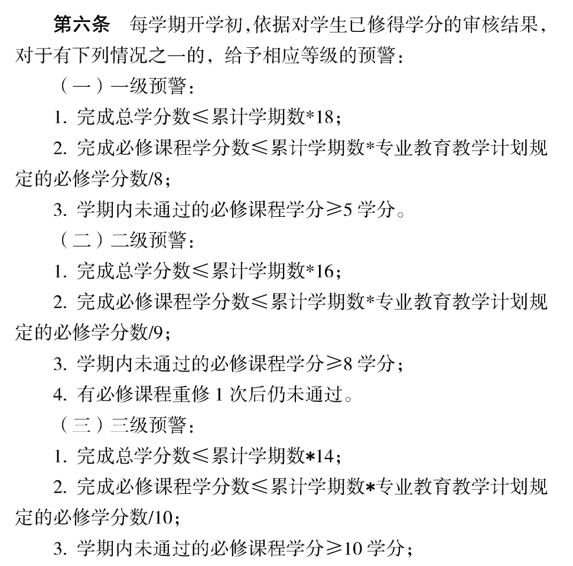
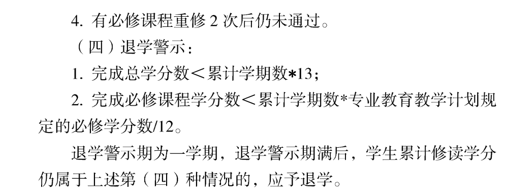

**学业预警（摘自学生手册）**

**<u>也就是说：连续两学期得到退学警示的学生，将被勒令退学</u>**

**如果你希望休学、或是本专业就读实在出现困难的，不要自己硬撑着，请及时与辅导员老师进行联系，辅导员老师将会耐心的解决你的问题。**

****

### 开除学籍
开除学籍属纪律处分。纪律处分的种类由轻至重分为：1）警告 2）严重警告 3）记过 4）留校察看 5）开除学籍。与其它纪律处分到期后可以解除不同，开除学籍不得解除，不设期限。

#### 什么情况下会被开除学籍？
《南京大学学生违纪处分规定》说明，学生有下列情形之一，学校可以给予开除学籍处分：

1）违反宪法，反对四项基本原则、破坏安定团结、扰乱社会秩序的；

2）触犯国家法律，构成刑事犯罪的；

3）受到治安管理处罚，情节严重、性质恶劣的；

4）代替他人或者让他人代替自己参加考试、组织作弊、使用通讯设备或其他器材作弊、向他人出售考试试题或答案牟取利益，以及其他严重作弊或扰乱考试秩序行为的；

5）学位论文、公开发表的研究成果存在抄袭、篡改、伪造等学术不端行为，情节严重的，或者代写论文、买卖论文的；

6）违反《普通高等学校学生管理规定》和学校规定，严重影响学校教育教学秩序、生活秩序以及公共场所管理秩序的；

7）侵害其他个人、组织合法权益，造成严重后果的；

8）屡次违反学校规定受到纪律处分，经教育不改的。

其它规定中涉及开除学籍的有：

1）打架、斗殴或者故意伤害他人身体的，造成严重后果的，给予留校察看或开除学籍处分；

2）对于第二次作弊的学生，给予开除学籍处分

#### 开除学籍的处理办法是什么？
开除学籍处分经学生管理部门审核后，学校党政联席会或者校长授权的专门会议研究决定，并事先进行合法性审查，由学校出具处分决定书。

处分决定书应当直接送达学生本人，学生拒绝签收的，可以以留置方法送达；难于联系的，可以利用学校网站、新闻媒体等以公告方式送达。

对被开除学籍的学生，由学校发给“学习证明”。学生按学校规定期限离校，档案由学校退回其家庭所在地，户口应当按照国家相关规定迁回原户籍地或者家庭户籍所在地。

### 退学
退学属于学籍变化，包括主动退学和勒令退学两种。主动退学由学生递交书面退学申请，经学生所在院系、教务处审核同意后，报分管校长审批。下文主要介绍勒令退学的情况。

#### 什么情况下会被勒令退学？
《南京大学普通全日制本科生学籍管理细则》规定，学生有下列情况之一的，应予退学：

1）经二级甲等以上医院诊断，本校医院复查，患有严重疾病或者意外伤残不能继续在校学习的；

2）退学警示期满后，完成总学分 ＜累计学期数*13 者；

3）退学警示期满后，完成必修课程（通修、平台、核心）学分数＜累计学期数＊专业教学计划规定的必修学分数/12 者

4）未经批准迕续两周未参加学校规定的教学活动的；

5）未经请假、请假未获批准逾期两周不注册的或获准后逾期不到校的；

6）休学或保留学籍期满，在规定期限内未办理复学手续或者申请复学经复查不合格的；

7）交换学习逾期未归者；

8）四年制学生在校学习时间超过六年者、五年制学生在校学习时间超过七年者（含休学、保留学籍时间）；    

9）学期内旷课累计达50 学时者；

10）因其他特殊情形，学校认为必须退学者。

其它规定中涉及勒令退学的有：

留学生可以申请在校试读一年。试读期满达到在校修读年限累计学分数要求者，可继续就读。

在教务处网站中可以看到，试读这一制度对普通全日制学生也适用，但在学生手册中我没翻到这一点。

#### 退学警示期是什么？
《南京大学普通全日制本科生学业预警及帮扶管理办法（实行）》规定，

1）完成总学分数＜累计学期数*13者;

2）完成必修课程学分数＜累计学期数＊专业教学计划规定的必修学分数/12者；

会进入退学警示。退学警示期为一学期，退学警示期满后，学生累计修读学分仍属于上述情况的，应予退学。

#### 退学的影响是什么？
对退学学生发给退学决定书，并根据学习年限及成绩发给肆业证书或写实性学习证明。退学决定文件生效后，学校应及时办理离校手续，其档案退回家庭所在地，户口按国家相关规定迁回原户籍地或者家庭户籍所在地。

有退学警示记录者不得授予学士学位，但可在毕业当年的6月1日至15日向院系学位评定分委员会提交授予学士学位的书面申请。

图1：退学、试读的操作流程

### 其它：取消学籍
此外，还有一种取消学籍的说法。

1）（入学资格复查中）发现学生存在弄虚作假、徇私舞弊等情形的，确定为复查不合格，作取消学籍处理；

2）（保留学籍的学生）如有以休学创业、参军入伍为由实施其它活动的虚假行为，一经查实，学校将取消其学籍。

参考资料：2019学生手册

