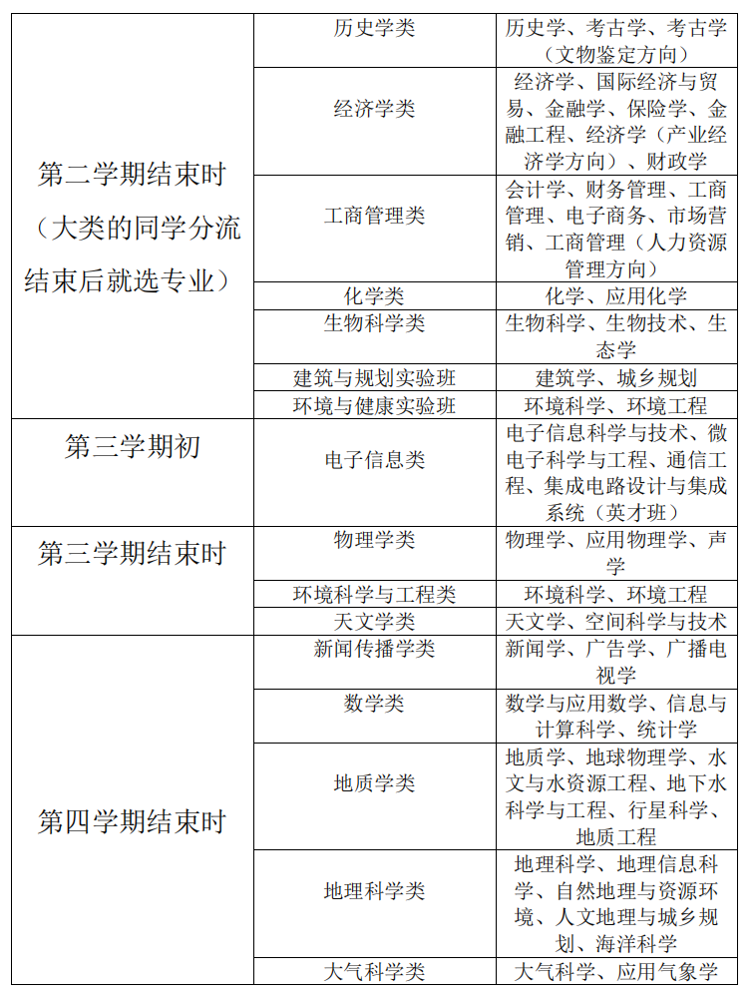
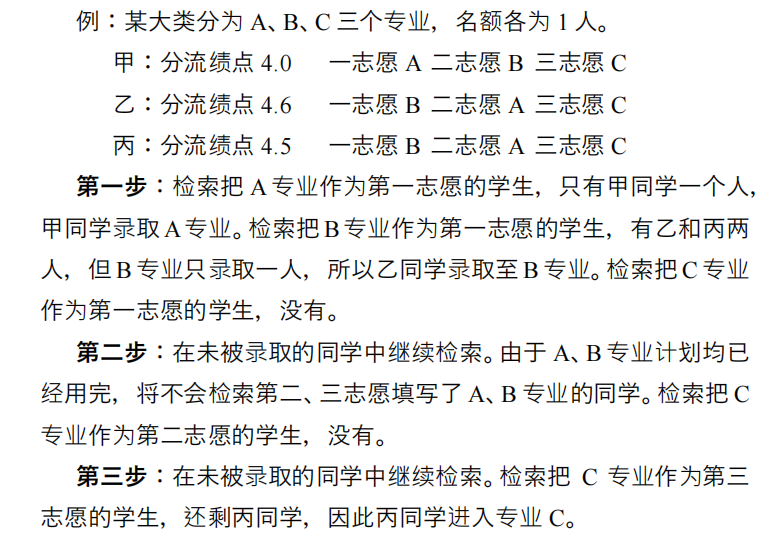

**【重要提醒】需要参加大类分流的学生有： **

1. 参加普通高考正常录取（包括专项）且未被拔尖计划录取的学号开头为2518和251098 的同学。 
2. 未被拔尖计划录取且被综评学科特长类录取至数学与应用数学、物理学、化学、生物科学专业的同学。 
3. 未被拔尖计划录取且是通过内地高中班，港澳台，少数民族单列计划录取且学号开头为2518和251098的同学。 

注：关于特殊招生类型的同学的大类分流，请参见后文**【特殊招生类型】**部分。

****

2017 年开始，南京大学开始实行大类招生政策。经过 了若干年的发展与调整，截至 2025 年，共有以下九个大类：人文艺术传播类、社会科学试验班、地球科学与资源环境类、数理科学类、化学与生命科学类、工科试验班、工科试验班（智慧人居）、经济管理试验班、技术科学试验班。 

录取至大类的同学在经过一年级的学习后，会分流至具体的院系或是专业，如下表： 

| 学号开头 | 大类 | 分流选项 |
| :---: | :---: | :---: |
| 251098 | 经济管理试验班 | 经济学类、工商管理类  |
| 251810 | 人文艺术传播类  | 汉语言文学、历史学类、哲学、汉语国际教育、新闻传播类 |
| 251820 | 社会科学试验班 | 法学、信息管理与信息系统、档案学、图书馆学、编辑出版学、政治学与行政学、行政管理、劳动与社会保障、国际政治、社会学、社会工作、应用心理学 |
| 251830 | 地球科学与资源环境类 | 大气科学类、地质学类、地理科学类、环境科学与工程类 |
| 251840 | 数理科学类 | 数学类、物理学类、大气科学类、天文学类 |
| 251850 | 化学与生命科学类 | 化学类、生物科学类 |
| 251870 | 工科试验班 | 材料物理、材料化学、光电信息科学与工程、新能源科学与工程、生物医学工程、 工业工程、金融工程 |
| 251880 | 技术科学试验班 | 智能科学与技术、自动化（机器人方向）、集成电路设计与集成系统、数字经济 |
| 待补充 | 工科试验班（智慧人居） | 建筑学、城乡规划 |

可以看到有些大类分流到的是具体的某个专业（如工科试验班分流到材料物理），有些大类分流到的是某个专业类（如数理科学类分流到数学类）。已经分流到具体专业的同学后续则无需再次分流；分流到某某专业类的同学后续还要进行第二次分流至具体的专业，具体时间如下表（未在表内提到的则是不需要进行二次分流的）这里面也包括一些录取到非大类的同学。

注：天文学类中的“空间科学与技术”专业可能关停

**分流志愿模式：** 

南京大学的分流采取志愿优先的形式。即优先录取符合条件且志愿靠前的学生，志愿排序同级情况下，优先录取分数高的学生。分流具体名额将在第二学期四五月份公布，分流志愿将在第二学期结束前填写。请看下面的例子： 

在上面的例子中，甲同学分流绩点只有 4.0 却进入了专业A，丙同学的分流绩点 4.5 高于甲同学，但是他填写的前两个专业 B 和 A 都未被录取。这就是“志愿优先”，即先考虑志愿顺序，再考虑分数高低。 

上述志愿优先的前提是：你已经达到了专业的准入条件。如果未达到准入条件，即使志愿靠前，这个专业也可以（是可以不是一定）不录取你，并且你的分流优先级会直接在最末。 

如果你没有达到本大类中任何专业的转入要求，一般来说，会被调剂到本大类没有报满的专业中去，有一定概率会被调剂到外大类没有报满的专业中去。

所有的分流要求都可以在“南京大学本科生院”发布的《南京大学全日制本科生大类培养分流实施方案一览表》中查到，准入课的意思是分流到这个专业所需要的课，有一些大一上的课是这个专业的必修课并非准入课，这些课如果不上也 是可以进入专业的，但是进去之后需要补上。

**【特殊招生类型】**通过**综合评价学科特长类，港澳台，内地高中班，民族单列计划**录取的学生，按照你学号所体现的大类进行分流（具体可看前文中的表格），也就是说，你大一的专业归属就是你学号所体验的大类，而并非具体的某个专业。 

当你将你录取通知所显示的那个专业填到第一志愿，将忽略成绩 100%录取进入该专业。你也可以跟普通的大类同学一样选择别的专业进行分流，但如果你将别的专业放到第一志愿，将会自动丧失前面的优惠，和普通的大类同学分流规则完全一样。 

注：社会学类指的是社会学院的三个专业、公共管理类指的是政府管理学院和国际关系学院的所有专业、材料类指的是现工院的所有专业、工业工程类指的是工业工程和工管金融工程

**【转专业影响分流】**当你选择转专业时，你选择转过去的专业将会占用你的第一志愿，在你本大类填写的第一个志愿将会成为你的第二志愿，以此类推。

注意：**<u>大类分流的课程不允许使用大类中没有出现的课程替代。</u>**例如：工科试验班大类分流需要看一层次的数学课成绩，在学校规定中：星层次数学可以替代一层次。但在工科试验班大类里没有“星层次数学”这门课，如果你只上了星层次数学而没有上一层次数学，那么你的分流成绩中，数学部分将直接记录为0分。

