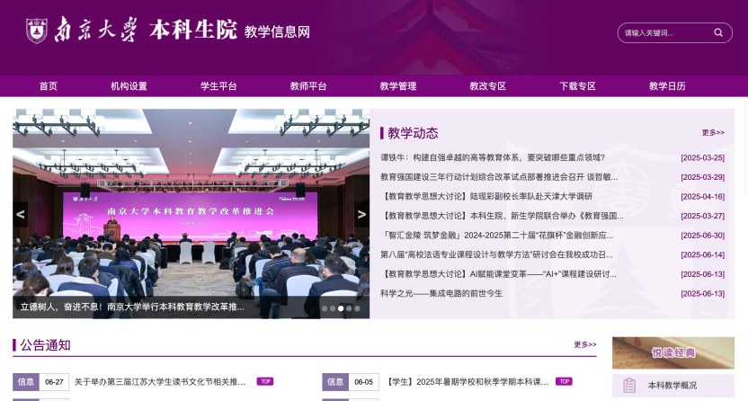
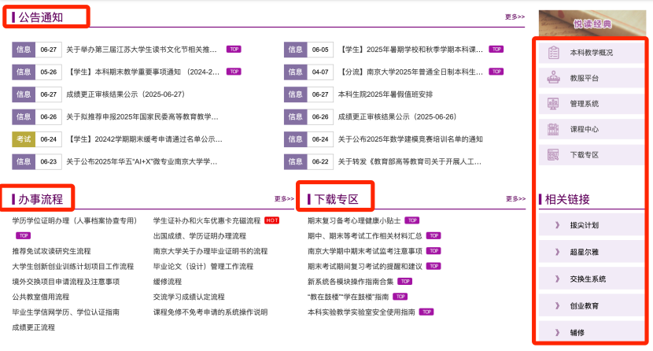
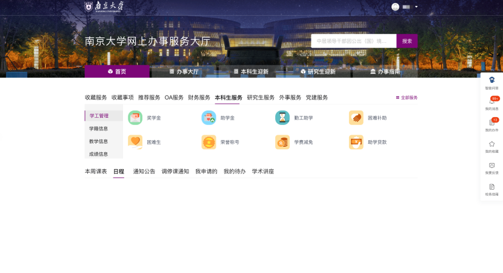
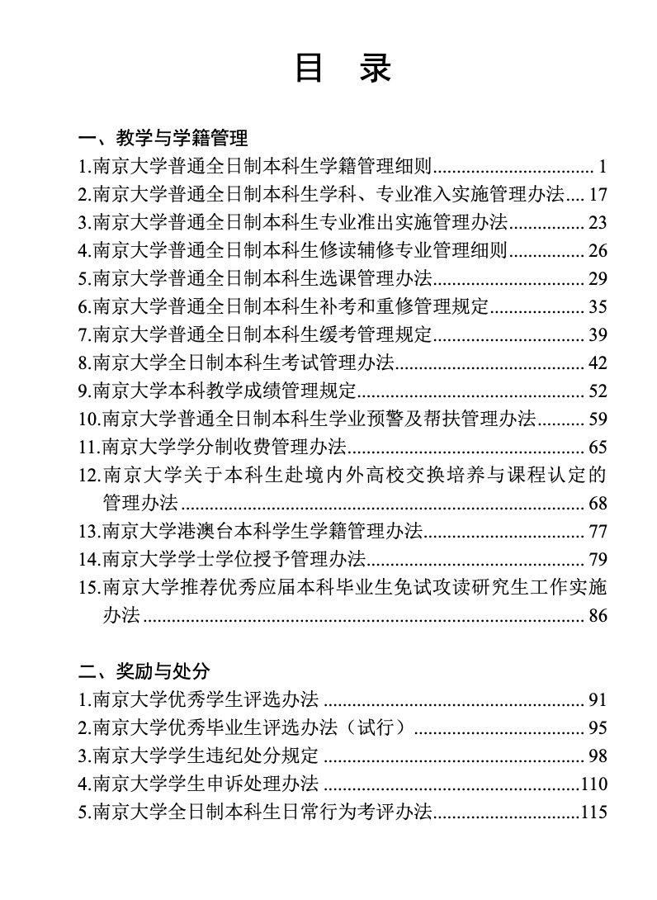
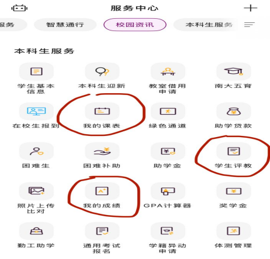
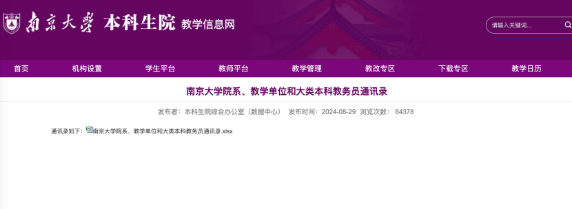
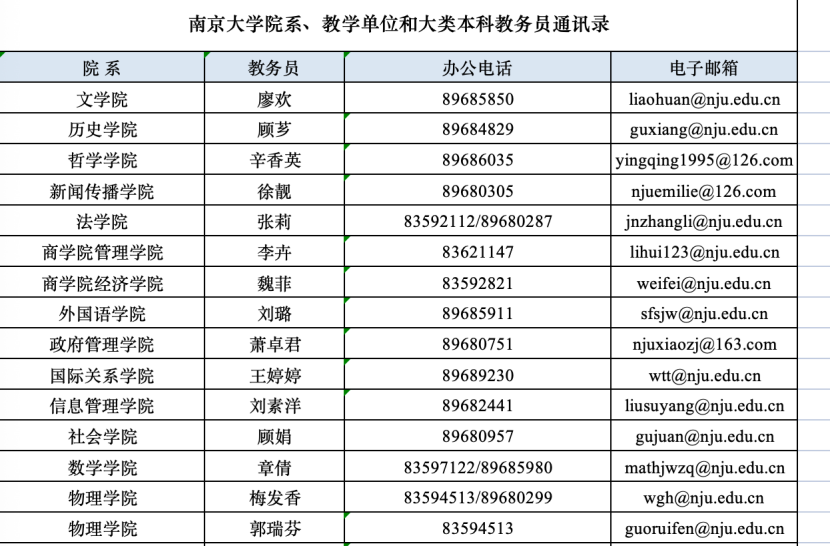

教务信息，也就是一切有关于学习方面的信息。作为南京大学的本科生，你必须要知道以下渠道可以帮助你找到最新的信息：

**1.**** ****南京大学本科生院官网（**[https://jw.nju.edu.cn](https://jw.nju.edu.cn)**）**

本科生院官网总体可以分为以下几个部分：<u>公告通知</u>、<u>办事流程</u>、<u>下载专区</u>和<u>相关链接</u>。

公告通知部分就是最新的教务信息通知，会经常进行更新（尤其需要关注置顶的通知）；办事流程和下载专区部分是一些常用的文件和信息的汇集处；相关链接部分是一些会经常用到的网站链接，这部分中一些常用的网站后续也会介绍。

**2. 南京大学办事服务大厅ehall（**[https://ehall.nju.edu.cn/](https://ehall.nju.edu.cn/)**）**

办事服务大厅ehall也是查找信息比较重要的一部分。其中的<u>本科生服务</u>板块会经常用到，常用功能例如：我的课表、本-课表查询、免修不免考办理、本-培养方案查询等。

**3. 学生手册**

纸质版的学生手册每年都会发，电子版的学生手册可以在[http://jw.nju.edu.cn/5c/84/c24748a416900/page.htm](http://jw.nju.edu.cn/5c/84/c24748a416900/page.htm)上查看。学生手册提供了最为官方的教务问题的解答。

**4. 南京大学APP**

南京大学APP中也有一些关于教务的功能非常有用，例如：我的课表、我的成绩、我的考试安排、学生评教等。

**5. 教务员老师**

教务员就是负责教学事务的行政老师，每个学院（大一同学是书院）都有一个负责的教务老师。教务员和辅导员是两个不同的分工，切记不要搞错了（也有老师兼任两个岗位）。

那么如何查找教务员的联系方式呢？在上文说到的本科生院官网的下载专区，我们就可以找到教务员通讯录。

当出现例如选课或者教务上的，已经通过自行检索或询问他人无法解决的问题，或是需要高权限的操作时，可以联系教务员老师，强烈建议通过邮箱先行联系，着急时再通过电话联系。

如果在少数时候出现了学院或书院教务员无法处理的事项、无法解答的问题或是需要更高权限的某些操作时，可以联系本科生院教务处。本科生院教务处两位老师的邮箱：肖海珊老师：xiaohs@nju.edu.cn；张源老师：zyjwc@nju.edu.cn。本科生院教务处联系电话：025-89682303。

因此，强烈建议在遇到未知的教务问题时的信息检索顺序为：

**1. 在本科生院、办事服务大厅、学生手册、南京大学APP进行自行检索**

**2.**** ****在前人留下的语雀文档、群文件或者本文件进行查找**

**3.**** ****在咨询群、课程群、转专业群、院系群等各大****QQ****群咨询**

**4.**** ****咨询本书院或学院的教务员老师**

**5. 咨询本科生院教务处  
**

