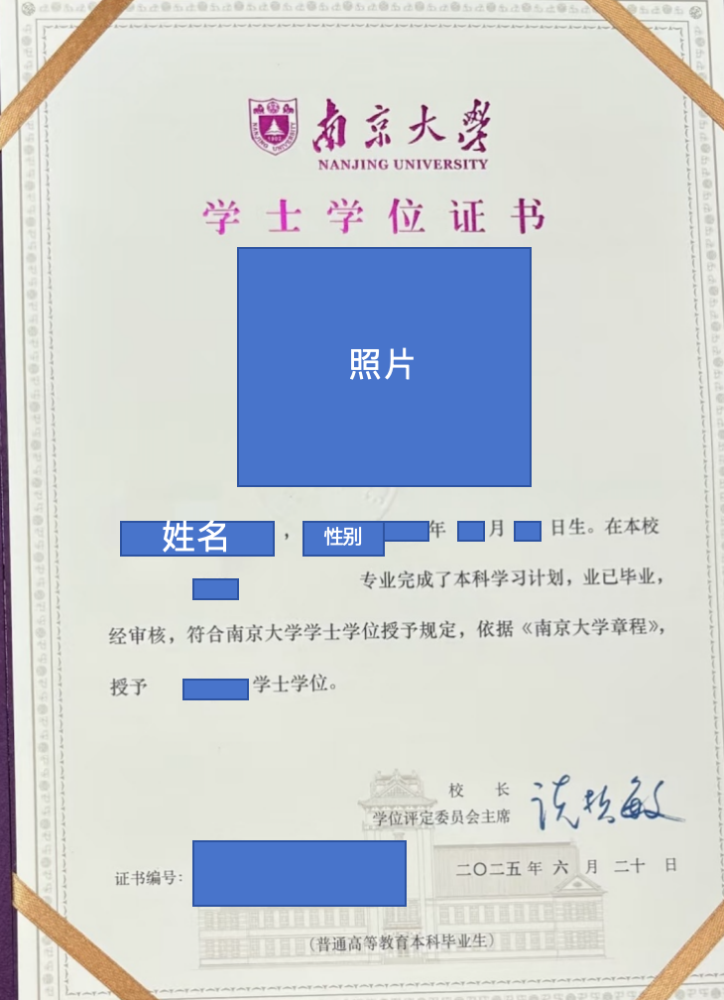
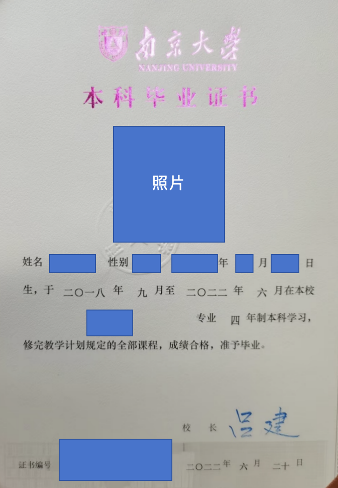

在南大顺利毕业后，会拿到两张证书：一张学士学位证，一张毕业证（中外合办的同学还有外方学校的学位证）

在南大顺利毕业你需要：

1. 全部学分绩达到3.0
2. 完成培养方案中毕业要求的所有课程
3. 六级425分以上或通过学位英语测试（外语类专业无此要求）
4. 四年体测成绩按照前三年每年1/6占比，第四年1/2占比，加权分数超过50分

学位英语测试是在大四下学期举行的，若六级成绩此前未达到425分（合格线）则需要去参加考试，否则无法毕业。六级考试合格者则不需要参加。

体测成绩指得是每年秋季的国家体质测试（跟春季的体测没关系）。按照前三年每年1/6，第四年1/2加权，加权后总成绩需要超过50分才可毕业。

**注意：在南大的各种考试作弊被抓到，将会****吊销学位证****，即使正常读完也只能拿到毕业证。学位证在****考研、保研、就业、考公、考编****都非常重要，因此千万千万千万不要作弊，****挂科后还可补考、重修，作弊没有挽回余地！！****国外学校对学术诚信看得更为重视，出国申请若发现作弊经历，影响非常严重！！**

****

