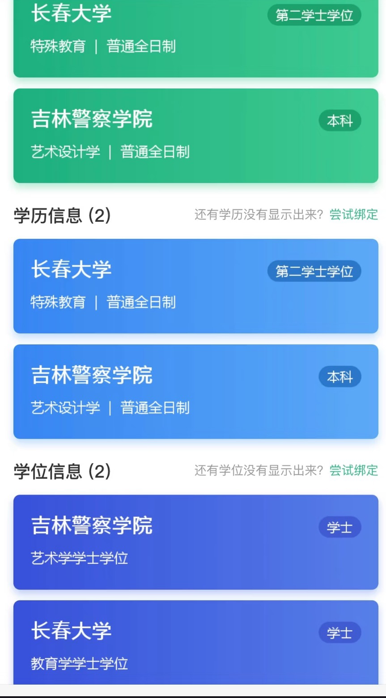

南京大学的双学士学位目前只能通过高考录取进入（德法班也可外语保送进入），且不允许别的专业的同学转进去，但是双学位班的同学可以转出来（保送生不允许转出来）。 

目前南京大学有以下的几个双学位班（加黑代表主专业）： 

**  计算机**+金融工程：计算机金融实验班 

**  德语**+法学：德语法学实验班 

**  新闻学**+信息管理与信息系统：大数据传播实验班 

**  工业工程**+自动化：智能系统集成实验班 

  **软件工程**+经济学：软工经济实验班

  **软件工程**+工商管理：软工商业实验班

双学位班是将两个不同专业的课程进行适当的调整综合，并不是简单的把两个专业的课都上掉，但是学业压力还是不小的。 

根据上级部门的相关规定，对于一个本科毕业生而言，只能拥有**<u>唯一的一个专业</u>**，因此申报双学位时需要一个主专业和次专业，但其实两个专业的课在上课时还是同样重要的，并没有明显的主次之分。

**【理解】双学位班可以理解为“一个专业+两个主修学位”。例如：德语法学实验班毕业后，相当于说拿到了“德语的专业+德语的文学学位+法学的法学学位”，所以实际上并没有拿到“法学的专业”**

****

由于此项规定，在志愿填报以及相关官方系统中，双学位专业需要标注主专业，例如德语法学班一般在系统中记录为：德语（德语法学实验班）

双学士学位含金量是最高的，拿到的两个都是主修学位。在学信网上查询时，只有一个学历信息，写的是专业名，有两个学位信息，均为主修学位。 

例如：德语法学实验班，在学信网上，学历信息写的是“**南京大学/德语（德语法学实验班）/普通全日制/本科**”。学位信息写的是**“南京大学/文学学士学位/学士”和“南京大学/法学学士学位/学士”**。 

由于上级部门的相关规则，导致德语法学实验班的学生并不算获得了“法学专业”，因此德语法学实验班毕业后**<u>不能法考、研究生不能去读法律（法学）只能去法律（非法学）</u>**

双学位班的保研在本班级内进行选拔。

由于目前找不到双学位的毕业证和学位证相关图片，仅提供文字版（以德法为例）

**<u>毕业证：</u>**姓名XXX，性别X，XXX年X月X日生，于XX年X月至XX年X月在本校**<u>德语（德语法学实验班）</u>**专业 四 年制本科学习，修完教学计划规定的全部课程，成绩合格，准予毕业。

**<u>学位证：</u>**XXX，性别，X年X月X日生，在本校**<u>德语+法学双学士学位复合型人才培养项目</u>**专业完成了本科学习计划，业已毕业，经审核，符合南京大学学士学位授予规定，根据南京大学章程，授予**<u>文学、法学</u>**学士学位。

**第二学士学位** 

**<u>【注意】根据上级相关要求，第二学士学位在未来可能随时停止招生。</u>**

第二学士学位是一个单独的学历层次，修读时间晚于本科，先于硕士研究生，可以简单地理解为“学士后”。 

南京大学的第二学士学位修读为两年，也就是大五大六。仅接受本校毕业生申请。（别的学校有的是可以接收外校学生申请）

申请第二学士学位时，需要放弃在大学毕业后就读研究生，并且如果你有保研资格或者以及考上研究生，没有办法顺延到你第二学士学位毕业后， 

并且第二学士学位的同学不能参加保研。也就是说，录取第二学士学位后，如果想上研究生，只能之后自己准备考研或出国。 

**<u>南京大学目前只有法学专业的第二学士学位，读完后即可拥有参加法考、研究生读法律（法学）的资格。不允许本科在法学专业的同学申请法学第二学士学位。</u>**

申请时间为大四第二学期，相关动态在南京大学本科招生网发布。

第二学士学位的课程压力有点大，课程密度较高。如果想在就读期间准备考研其实难度比较大。 但也有同学作为缓冲，考研上岸后即退学，若在半当中退学，仍然算作**应届生**身份

第二学士学位含金量很高，和主修含金量几乎差不多。在学信网上会有单独的“学籍信息” 

例如法学第二学士学位，学信网学籍信息上既有你本科原专业的学籍信息，还有“南京大学/法学/普通全日制/第二学士学位”的第二条学籍信息。学历信息上也是两条，与学籍信息标注一致。学位信息则是既有你本科原专业的学士学位信息，还有“南京大学/法学学士学位/学士”的第二条学士学位信息。

搬一条网上的第二学士学位学信网显示图：

