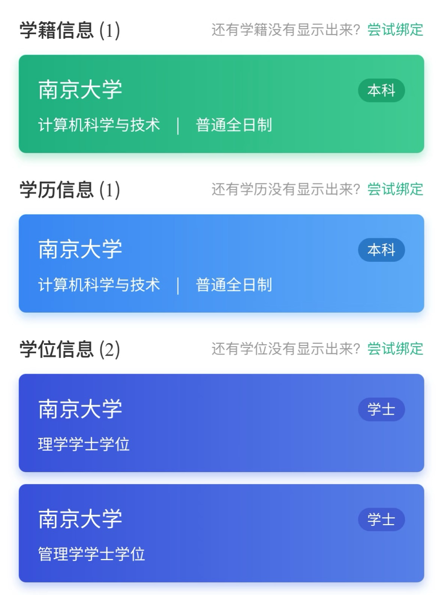
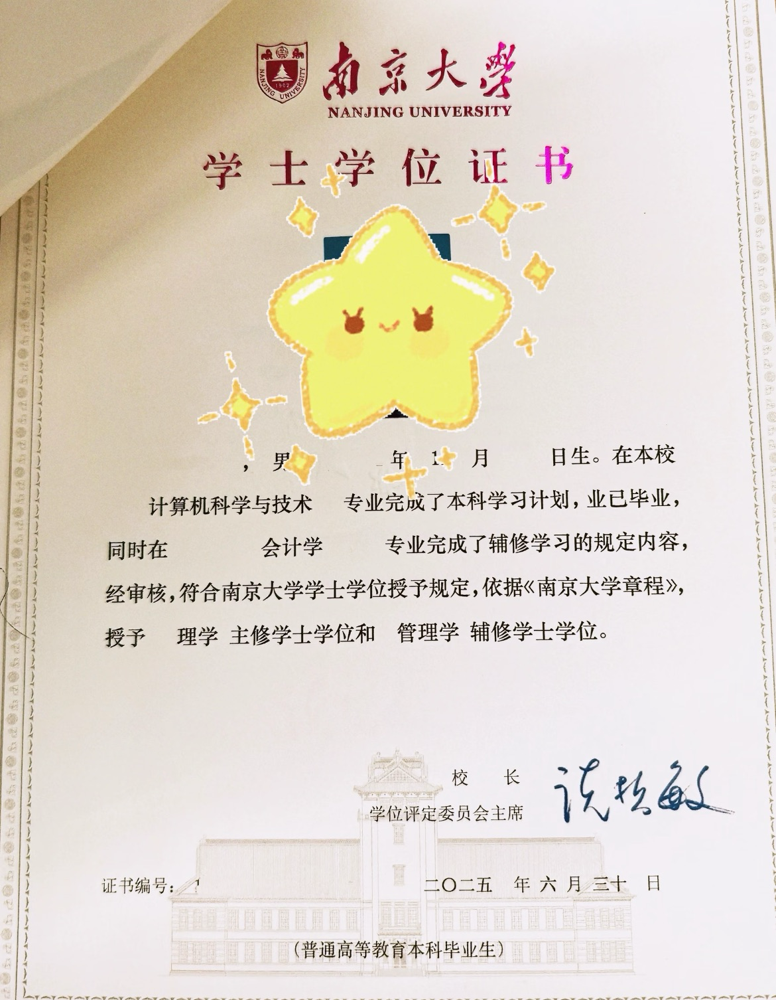

南京大学本科生院在 2021 年发布了辅修培养方案，规定了要拿到辅修学位需要的课程，具体信息可去各大咨询群及本科生院官网查看。 （由于相关新专业例如财政学，技术科学试验班等设置，辅修培养方案暂未规定，具体内容可询问本科生院教务老师） 

双学位班的同学禁止辅修，其他有些专业之间不能为主辅修的要求可以查看辅修文件详细规则。 

辅修选课、上课不单独设置，即：只要按照课程清单，在跨专业选课一栏中进行选修，与对应专业的同学一起上课、把课上完拿到学分就好。

当修读完辅修课程要求的课程学分大于等于 30 时（通修课程不计入），可以申请南京大学辅修结业证明（一张纸质证书，学信网查不到）。但完全修读辅修课程要求时，可以申请辅修学士学位（在学位证上标注、不另外发放证书、毕业证不变、同时学信网可查）。 

**<u>辅修不需要“报名”之类的流程</u>**。当你把所有要求但课都上完了之后，大四进行毕业准出申请，直接进行辅修学位的申请。当学位审核的时候，你的主修与辅修会同时进行审核（可能需要在大四的时候联系教务员），部分有辅修毕业论文的院系，需要在大四的时候联系对应院系帮你把毕业设计的相关程序完成一下。 

学信网上你会多一个学位信息，例如计算机辅修法学，学籍和学历信息都只会写“南京大学/计算机科学与技术/本科”，但是点进学历信息但详情页，会标注辅修法学。学位信息有两个，分别为“理学学士学位”和“法学学士学位”，但注意辅修的法学不允许参加法考。 

辅修的缺点： 

1.课程压力极大：南京大学设置的辅修课程要求实际上跟主修的同学的毕业要求基本上是完全一致的，说是辅修，但其实是你的课程 强度几乎相当于同时主修两个专业。

2.时间难以安排：安排两个专业的课程的时候非常容易出现撞车的情况，一般这种情况要不申请原专业的课缓修，要不只能申请免听课或者拖到后面的学期在上课，而且这种撞车的情况是非常普遍的。 

3.认可度不高：辅修的认可程度比双学位、第二学士学位都低的，据辅修过的同学所说，找工作一般好像用不着。另外跨专业保研和跨专业考研也几乎用不着这个辅修学位，因为这两者都在辅修学位认定时间之前，这两者更多地看重的是你学会了多少东西以及你的能 力。

下图为辅修的学信网和学位证（毕业证和不辅修的同学没有区别）：

