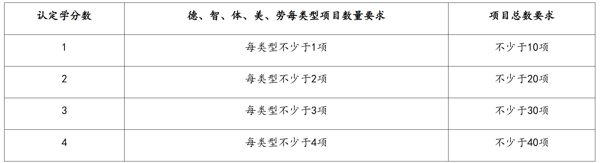
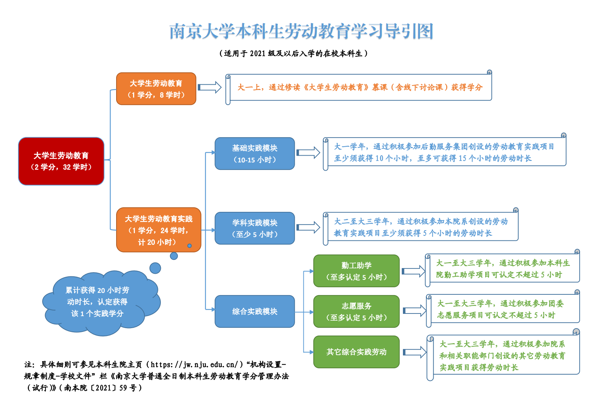

[南哪助手长期接受同学们投稿](https://www.yuque.com/greatnju/q-a/gw3phd#o8osi)

+ **注意**：本篇指南仅适用于**2021级及以后**的南京大学全日制**本科生**。

---

## 五育项目
**“五育项目”**是指在[**“南京大学五育项目系统“**](https://ndwy.nju.edu.cn/)（以下简称**五育系统，**需在校内ip环境使用）上立项，记录本科生在**”德、智、体、美、劳“**五个维度发展情况的活动项目。本科生参与的五育项目将记入本人的**敦行成绩单**中。

**（注意：这里的美育为美育项目，不同于XX人文的美育课程。美育课程为毕业前必修的课程，美育项目没有任何要求。）**

**（五育当中，除了劳育之外，其他都不是必须项目）**

### 敦行成绩单
敦行成绩单用以记录学生本科期间参加“五育项目”的全部情况，包括项目基本信息、评价信息等，作为校内评奖评优和校外选才的重要参考，学科竞赛获奖信息也是推荐免试研究生时学分绩加分的重要依据之一（**按学校相关推免文件要求执行**）。

### “一二课堂融通”学分（非必修学分）
参加“五育项目”满足一定要求的，可在入学后**第八个学期末**转换认定“一二课堂融通”的**选修课学分**（计入多元发展课程模块学分，即**非必须**的学分），累计认定**不超过****4****个学分**。“一二课堂融通”学分认定**只针对“五育项目”**，不在“五育项目管理系统”的项目不能参与学分认定。**该学分并非必修学分，没有特定要求，达标后可以自主认定学分！**

学分认定由**学生所在院系**负责，基本流程为：

+ **①学生报名**
+ **②院系评定**
+ **③录入教务系统，成绩为P（通过），不参与学分绩计算。**

”一二课堂融通“学分的**基本认定规则**如下表所示：

:::color2
p.s. 在每获得1个学分的基础上，可根据项目的突出成果（例如：获得国际、国家、省级重要奖项，在重要期刊或会议上发表论文等），由院系审核认定后增加学分，但不得超过“一二课堂融通”课程4个总学分的限额。

:::

### 劳动教育（必修）
**劳动教育项目**（以下简称**劳育项目**），是五育项目中较为特殊的一类。在培养方案中，**劳动教育课程**（以下简称**劳育课程**）包含**<u>2个必修学分</u>**，分别通过**合格修读劳动教育课程**和**满足劳动教育实践要求**获得，**均计入”通识“的14学分中。（也就是说，劳育也是一种通识课，且对应的2个学分必须拿到）**

+ 劳动教育课程（1学分）：大一上学期开设《大学生劳动教育（理论部分）》通识必修课程，课程为 1 个学分、8 个学时，以线上慕课形式开课。注意线上慕课是有作业、考试、讨论区等任务的，不要忘记或遗漏，以免影响你的分数。
+ 劳动教育实践（1学分）：分为基础实践、学科实践和综合实践 。

#### 劳动教育课程（即理论部分）
大一上学期，教务系统会**自动指选**”大学生劳动教育(理论部分)“课程。**注意及时关注教务系统中的课程备注、本科生院的相关通知，及时加入课程群聊及MOOC相关课程，以免错过作业、考试等导致不及格****（往年有不少同学出分后才发现有这门课等状况）。**该课程主要形式是线上的MOOC。该理论课程每学期都开，如果因为第一学期忘记考试等原因导致挂科，可以在之后的学期继续选课重修。**修读一次并通过即可。**

#### 劳动教育实践（即实践部分）
可结合下方的劳动教育导引图进行理解。劳育实践分为三个模块：**基础实践、学科实践、综合实践。**多数基础实践和部分学科实践可在**南京大学五育项目管理系统（以下简称“五育系统”）**中自主报名，按照规定时间或要求进行实践，可以获得相应劳育实践时长。**总时长需达到20h。**

+ **基础实践（≥10h）：**参与后勤服务集团发布的劳育项目（如学生公寓文明督导员、学生公寓网格化安全员、食堂保洁员等）可以获得基础实践时长；大一学年新生书院的宿舍评比也可能根据获评等级不同，而获得不同的时长。
+ **学科实践（≥5h）：**学科实践项目一般由具体院系发布，有可能会在五育平台上公开发布以供报名，有可能是院系自己在公众号/院系群内开展报名。实践项目的形式和要求不唯一，以院系具体开展的活动要求为准。
+ **综合实践（无时长要求）：**包括勤工助学、志愿服务与其他项目。其中志愿服务对应的实践时长，会由系统自动将自己在第二课堂上的志愿服务时长转入到综合实践模块的时长中。志愿服务与勤工助学最多认定5小时。

:::color2
**注：基础实践**模块并非必须要在大一做完，但建议最好在大一做完，因为鼓楼校区为新生开设的基础实践项目相对来说比较多一些。**学科实践**模块不必着急在大一做完，大一的学科实践机会不多，开设的目的也是让高年级完成，在毕业前其实陆陆续续都有实践机会，可以积极关注自己院系的相关通知；当然你也可以参加别的院系主办的学科实践，只要时长能认定下来就没有区别。

:::

