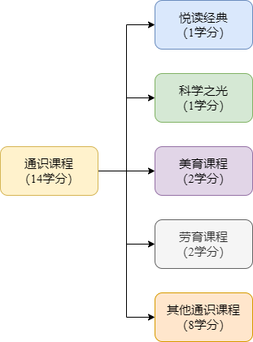

[南哪助手长期接受同学们投稿](https://www.yuque.com/greatnju/q-a/gw3phd#o8osi)

---

_**可以搭配**_

[选课指导(2022级版)v1.3.3](https://www.yuque.com/greatnju/q-a/fvc5vt)

_**食用**_

**毕业时最少应取得14个通识学分。**

与2017版教学计划（2017级至2020级）不同，21级学生经典悦读学分由2学分降为1学分，由科学之光必修1学分替代。同时必修劳育和美育课程各两学分。

_**请务必关注通识课的选课和学分要求，完成对应模块的学分**_

_同学在选课时，可以选择课程编号以002,003,004,005,37,500开头的课程。除了一般的通识和新生研讨课以外，经典阅读，科学之光，美育课程和劳育课程__**均需要**__达到对应的学分。_

## 经典悦读计划
“悦读经典计划”设有六个单元模块，分为“文学与艺术”、“历史与文明”、“哲学与宗教”、“经济与社会”、“自然与生命”、“全球化与领导力”，覆盖60本经典书目。  
**自2021级开始，每位本科生均须按要求在一年级至三年级修完悦读课程，获得至少****<u>1个</u>****悦读通识学分。**本科生院每个学期会根据前一学期成绩情况进行悦读通识学分认定。

#### 方式一：选修经典导读读书班
经典导读读书班主要通过线上学习的模式开展。学生需在“悦读经典计划”六个单元模块——“文学与艺术”、“哲学与宗教”、“经济与社会”、“自然与生命”、“全球化与领导力”、“历史与文明”其中的**3个单元****每单元****选修1门课，成绩均达及格及以上，通过认定即可获得1个悦读通识学分。**如修读经典导读读书班数量达到6个，且覆盖6个单元模块，即可认定2个悦读通识学分。_<u>如修读超过6门，只对先达到及格成绩的6门课程进行认定。</u>_通过方式一最多可以认定2个悦读通识学分。（60部经典及单元分布见附件）

悦读课程在成绩单上显示的成绩为所有认定课程的平均分（不及格课程不会被用来认定学分，不会对平均分有影响，不及格课程不能注销或重修，导读读书班不可重修）。已修的单门经典导读读书班不会显示在打印的成绩单上。

#### 方式二：选修单元导读通识课或DIY研读课
单元导读通识课或DIY研读课均为线下课程。选修单元导读通识课或DIY研读课这两类课程可在获得课程学分的同时认定悦读学分，但课程数量较少，名额有限，选课难度较大。其中，DIY研读课由悦读书社的本科生面向全校征集学生感兴趣的主题，自主邀约深受学生喜爱的高水平教师开课。学生选修DIY研读课需经导师遴选后，才可以选修，**详情可关注“悦读书社”微信公众号：灯下漫谈**。

#### 相关信息平台汇总
+ [南京大学悦读课程SPOC在线学习平台](https://study.nju.edu.cn/home/index.mooc)
+ [南京大学图书馆主页](http://lib.nju.edu.cn/)
+ [60本经典书目电子资源平台](http://njdxydjd.mh.libsou.com/)
+ 南京大学“悦读书社”学生社团微信公众号：“灯下漫谈”

## 科学之光课程
自2021级本科新生开始，每位同学必须选修1门“科学之光”项目的课程，获得1个必修的通识学分。每门课程的课程主题都是同学们感兴趣的交叉科学前沿领域，如：光电信息、天文宇宙、地球资源、智能与大数据、新能源、化生医药等。每门课程有：1位两院院士或“长江学者”领衔、N位高水平教师加入组成教学团队、Lab参访+讲座+研讨的授课形式、重大科研项目和成果的授课内容、青年教师和研究生组成助教团队，学生修完课程获得1个必修通识学分。

## 美育课程
自2021级开始，每位本科生均须按要求修读美育核心课，获得2个美育必修学分才能毕业，原则上应在一年级修读完毕。美育核心课学分计入毕业所需的14个必修通识学分。  
每位新生可选择进入6门美育核心课中的1个班级进行学习。6门课程分别为：戏剧人文、媒体人文、工艺人文、文学人文、音乐人文和视觉人文。  
6门美育核心课均采取“公开讲座+课堂学习+在线学习+课程实践”的模式完成，即学生必须按课程要求听完第一课“公开讲座”，完成“课堂学习”和“在线学习”，做好“课程实践”，通过课程考核（包括完成在线学习模块作业），成绩达及格以上，方可获得2个美育必修学分。

[2021-2022学年第一学期美育核心课简介.pdf](https://www.yuque.com/attachments/yuque/0/2025/pdf/34810676/1746452081220-7de26064-cdbc-4c5e-b4c5-df00157fe6ab.pdf)

## 劳育课程
在各院系本科人才培养方案和教育教学计划中设置劳动教育学分 2 个学分，包含 1 个劳动教育课程学分、1个劳动教育实践学分，可分别通过修读劳动教育课程和开展劳动教育实践认定获得。

1. 劳动教育课程：在大学一年级开设《大学生劳动教育》通识必修课程，课程为 1 个学分、8 个学时，以慕课形式开课 
2. 劳动教育实践：分为基础实践、学科实践和综合实践 

具体可以参考本科生院绘制的劳动教育课程导引。

这里也附上南京大学劳动教育学分管理办法：

[南京大学劳动教育学分管理办法.pdf](https://www.yuque.com/attachments/yuque/0/2025/pdf/34810676/1746452081299-229da3a9-abe8-4fc8-ab5c-583257377866.pdf)

## 2022年全校通识、新生研讨、科学之光、美育和公选课程
[全校通识、新生研讨、科学之光、美育、公选课程20221.pdf](https://www.yuque.com/attachments/yuque/0/2025/pdf/34810676/1746452081365-47af2eb5-fa6d-475a-a4bf-1f2cfe8a48eb.pdf)

## Q&A
1. **通识课是什么意思？**

通识课是南京大学为落实立德树人根本任务，按照“熔炉工程”和“三元四维”人才培养新体系建设要求，而开设的文化科学素养课。每一位全日制本科生都必须修读通识类课程，且满足14学分的要求才能达到南京大学的毕业标准。

2. **如何辨别通识课**

可以移步选课指导。通识课程的课程编号，以002,003,004,005,37,500开头。需要注意，公选课不纳入14学分的计算范畴。

3. **通识课成绩重要吗？该如何选择通识课？**

首先，目前没有院系将通识类课程纳入保研课程清单，且通识类课程通常学分较低，对总体成绩影响较小，所以在选择通识课时可以更多的基于自己的兴趣；

其次，从2022年秋季起，全校通识公选课程由开课院系统排，时间大致为五个时间段，开课院系在7-8节，9-10节，9-11节，5-6节和5-7节中选择，可以选择和自己专业课时间不冲突的时间段。通常来说，新生需要根据自己院系高年级的校区（是否有搬迁）及课程体系的具体情况，按需选择足够学分数的通识课，以免造成不必要的麻烦。

一些院系可能低年级专业课较满，那么空余时间较少的同学也可以选择一些自由时间自由地点的网络课程。

此外，在选择课程之前，也可以咨询自己的学长学姐，或在咨询群或课程交流群中询问相关课程的任务量和给分方式，这样可以更方便的选择适合自己空余时间的课程。

---

[南哪助手长期接受同学们投稿](https://www.yuque.com/greatnju/q-a/gw3phd#k6p5Y)

