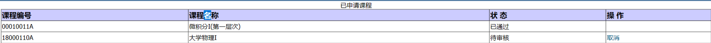
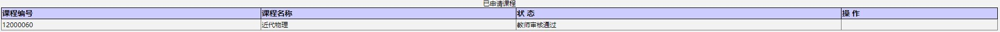
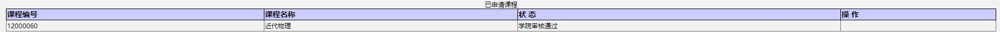
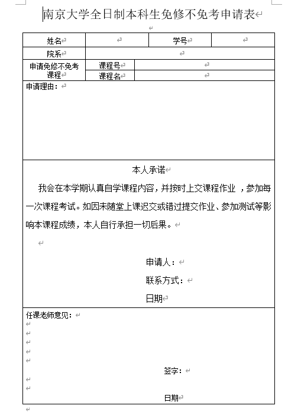
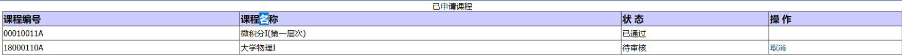
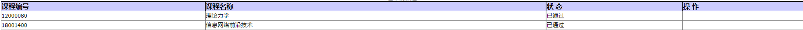
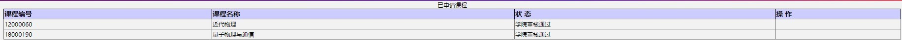
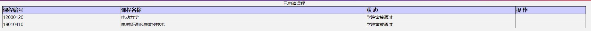

[南哪助手长期接受同学们投稿](https://www.yuque.com/greatnju/q-a/gw3phd#o8osi)

---

## 教务处官方说明（2022.1.23）
[https://jw.nju.edu.cn/a9/44/c24765a371012/page.htm](https://jw.nju.edu.cn/a9/44/c24765a371012/page.htm)

免修不免考申请说明:

1. 每学期最多申请两门课免修不免考。
2. 网上申请后，找任课教师说明情况和申请理由，由任课教师在网上进行审核。（有的老师会叫你写纸质申请，要在教务网下载专门的表格）
3. 如果冲突课程的免修不免考审核不通过，会自动删除该课程。
4. 思政军事类课程、体育课程、实践实验类课程不能申请免修不免考。
5. 免修不免考申请通过后，仍须交作业并参加所有测验和考试。（因老师而异，可以尝试和老师沟通）
6. 免修不免考的申请时间为开课后两周，请在两周内找任课老师办理。（但是经过个人实操第十周都还可以，听同学说考试之前都是可以）

  
除了上述的官方流程，也可以打印好表格给老师签字后，直接去给教务员让他在网上直接通过一步到位。不过貌似教务员不太喜欢这种方式，此前试过被建议和任课老师沟通，以后任课老师在网上通过再由她处理。

  
对于部分学习基础好、自学能力强的学生，如希望以不跟班上课的方式进行学习，须在教服平台“学期选课→免修不免考”里提出申请，每学期可申请课程不超过两门。学生申请后务必通过邮件提交[《南京大学全日制本科生免修不免考申请表》](https://jw.nju.edu.cn/ca/41/c24683a510529/page.htm)给任课教师（不提交申请表的，任课教师有权审核不通过），需要先由任课老师审核，再由学生所在院系教务员审核，所有审核环节均在网上办理。结业学生由于不能登录教服平台，如需办理免修不免考，下载填写申请表后，发送至本科生院张老师邮箱zyjwc@nju.edu.cn。（提醒：思政类课程、军事课程、体育课程、实践类课程（含实习）不得申请“免修不免考”。另因课程不及格申请重修者，原则上不得申请该课程免修不免考。）

  
在教务系统申请之后会进入待审核状态

之后是教师审核阶段

最后是学院审核阶段（结束）

## 注意事项
大多数老师对免修不免考还是持比较开明的态度，除却一些实在不能免修不免考的课程（实验/讲座），老师们大多时候最多问下你的理由也就过了。

免修不免考的一个问题就是如果你没有认识的同学，平时作业是根本不知道的，平时分也就无了，总评分数纯看考试多少分（尤其是跨院系、跨校区……懂得都懂）

如果条件允许的话考试前的最后一节课还是去听听吧。

+ 经注册的课程必须按时上课。学生不请假或请假未批准而缺席，视为旷课。累计旷课达50学时者给予退学处理。
+ 缺课时间达到某门课程一学期上课时间的三分之一者，或缺交作业达到某门课程一学期作业量的三分之一者，不得参加本课程考试，课程成绩以零分记载，且不得申请该课程补考，只能重修。任课教师可以有更加严格的规定。
+ 对一学期旷课累计达10-30学时的学生，给予严重警告处分；对一学期旷课累计达31-49学时的学生，给予记过处分。

## 附录：个人免修不免考课程与经历

#TheShy来全免了#

#Rookie尽力在免了#

#wink在干嘛，wink怎么还不免#

  

ZD最贴心：“免修不免考也是要考试的啊，你要想清楚呀”

QZ最开明：“你不用写作业了，期末给我一份学数学分析的报告就行了”

JBB最严格：“你为什么要免啊，你要去写一份书面申请书啊”

CJY最有经验：“他们网上都可以操作的啊，以后不用写纸质申请给我，叫他们自己网上通过就行了。”

AJ最搞笑：“你确定要免吗，我这课挂科率很高的，这样吧你不用写作业，平时分给你80%怎么样”

XZW最可爱：“我没操作过（通过免修不免考申请）啊，你教教我吧（我也没见过教务系统的教师版本界面）0.0下周你记得提醒我操作啊0.0你是不是以前在哪里学过啊”

ZP、CWZ老师最高效，申请完第二天就通过了，属实是驾轻就熟。

---

[南哪助手长期接受同学们投稿](https://www.yuque.com/greatnju/q-a/gw3phd#k6p5Y)

