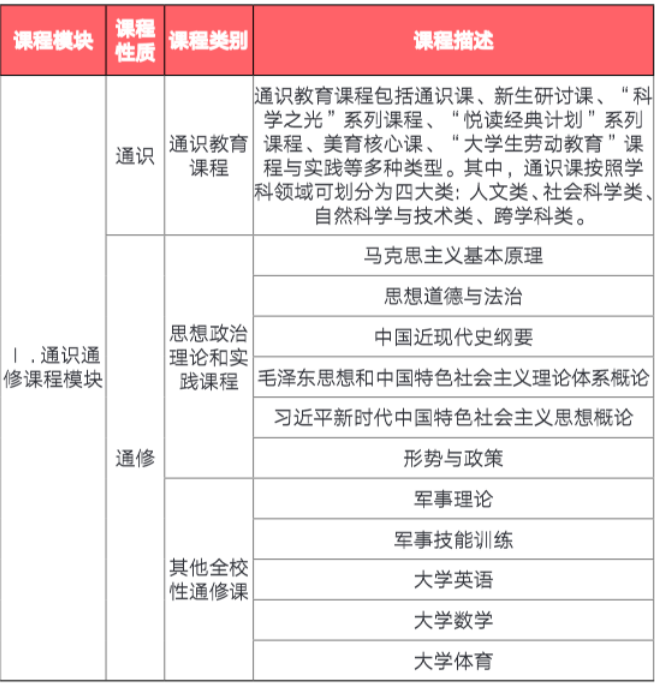
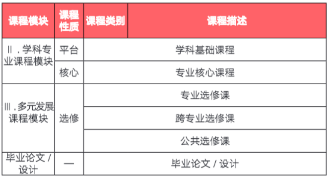
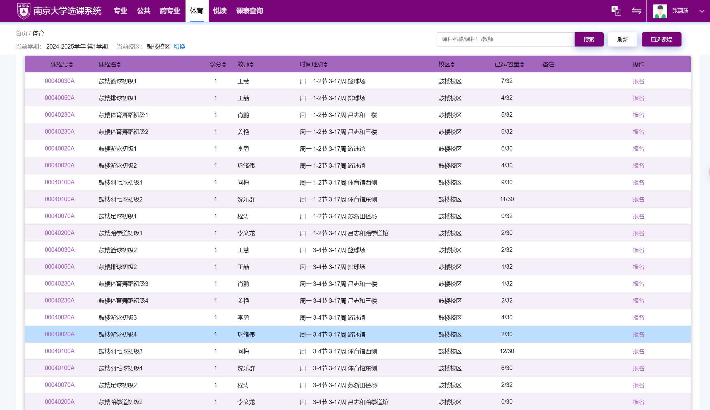
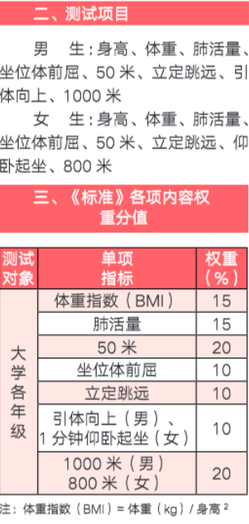
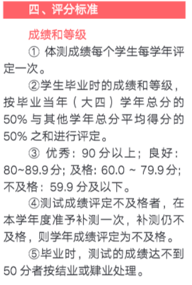

:::success
首先欢迎各位以优异的成绩来到南大！话不多说，相信大家对大学的课程和生活充满期待，让我们直接步入正题。

:::

## 前置知识
### 课程与学分
通常一门课程为1-5学分（每学期0.25学分的《形势与政策》除外），学分基本对应该课程每周的课时数，即2学分的课程每周2节课。但也有例外：如1学分的体育每周为2节课，5学分的微积分每周6节课，3学分的程序设计基础每周为4节理论课+2节上机课共6节课。

课程授课人员由**主讲教师和助教**（通常是老师手下的研究生，每门课1-4人不等）组成，教师负责授课与出卷、批卷，助教负责批改作业与试卷。（但有些课程的助教一学期都遇不到……）

### 课程时间安排
呢喃不分夏作息表和冬作息表，每天排课时间如下，每节课时长为50分钟：

第1节：  8：00 - 8: 50

第2节：  9: 00– 9: 50

第3节：  10:10 – 11：00

第4节：  11:10 – 12：00

--------------------------中午---------------------------------

第5节： 14: 00 - 14: 50

第6节： 15: 00 – 15: 50

第7节： 16: 10 – 17: 00

第8节： 17: 10 – 18: 00

--------------------------晚（30min）---------------------------

第9节： 18: 30 - 19: 20

第10节： 19: 30 – 20: 20

第11节： 20: 30 – 21: 20 

Rank:

1. “奇偶式”（如第1、第2节课）课间休息时间为10min,“偶奇式”（如第2、第3节课）课间休息时间为20min。                              
2. 若下午第7、8节与晚上有课，晚饭时间将会非常仓促，建议自带食品。
3. 一学期为16-17周，新大一会有适应周（预计在军训时期），课程结束后有2个星期左右的期末周用于复习和考试。

### 课程分类

### 学分绩的计算方法以及分类
学分绩即为GPA（平均学分绩点），呢喃的计算方法为5分制，按加权平均分除以20得到，举个例子，5学分的微积分100分，1学分的体育0分，两门课的加权平均分即为（5×100+1×0）÷6≈83.33，学分绩也就是83.33÷20≈4.167；反之，若微积分为0分，体育为100分，那么加权平均分为16.67（糟糕的例子），不难看出，高学分的课程对绩点的影响极其之大。

学分绩的分类主要为**所有课学分绩**（出国看）、**学位学分绩**（包含除通识、选修外的课，一般用于评奖）、**<u>保研学分绩（包含的课程请至南大各大院系官网搜索“推免”，可搜索到具体专业计入保研学分绩的课程，若没有，可询问学长学姐以及教务员）。历史各院系推免GPA及名单可以查看研究生招生官网和群文件。</u>**

### 课程冲突与免修不免考
当课程较多时，难免会遇到课程时间冲突的情况，这时候一种可行的选择是其中一门课免修不免考（平时可以不去上课，但考试等需要参加），但要提前与任课老师联系，**<u>注意平时分要与老师沟通！（有的老师会因免修不免考扣平时分）。若同一时间有多门课且没有申请免修不免考，教务员会强制退课！</u>**

### 有关授课老师
提前去**<u>红黑榜（红代表好，黑代表差，红得发紫代表极好）</u>**查看往届同学对各个课程老师的评价。

:::color4
注意有些评价不一定客观，部分老师会“黑转红”或“红转黑”，时效性不强，需要**自己做出判断（非常重要！）**，但评价一致比较差的基本不要选，选了会后悔的！

:::

### 关于平时分的说明
具体看老师，某些老师会时常点名或者用教学立方等软件签到，不到者会扣平时分，反之一些比较“善解人意”的老师从不点名，或者点名前会提前通知，一些所谓“水课”是否要翘要自己权衡清楚，熟悉老师的“特点”。

### 选课与退课
选课：专业课若有多个老师可选是**<u>即选即中</u>**的（一定要提前了解各个老师，在选课开始前掐表蹲守！）其他课程一般是先选再抽签（非常看运气，有些好课程选的人数甚至达1100/100，中的概率只有9%）,通常同类可选一个选课人数一般的课程进行“保底”。（有些选的人数少的课程其实内容、给分也不错）若运气不佳均未抽中，后续会有补选和增加名额的通知和时间。（抢抢抢！**<u>即选即中！</u>**）

退课：若课程不符口味或者其他原因，可在教学周**<u>1-8周</u>**进行**<u>退课</u>**。其中1-2周退课不会留下退课记录，3-8周退课**会留下退课记录**。（**<u>无影响</u>**，最多出国时会问你为何退了这门课）

### 成绩方面的问题
大学老师素养都很高，很好沟通，如果有成绩上的问题，可以社交软件或邮件沟通助教或老师进行询问。**<u>（规定：学生原则上不得添加老师好友）课程总评通常是四舍五入。</u>**

### 作业忘交了怎么办
赶紧联系助教或老师！

### 有关座位
一般自行抢座，英语课等小班课会为方便管理定座位。如果想好好听，建议提前20分钟到30分钟到教室（如果上一时间段该教室没有课的话）。

### 补考，缓考与重修
补考：课程总评未达60分，通常在下学期开始时组织补考，补考通过总评记为60。

缓考：一般只有期末考试以及特殊原因可以申请，和补考的同学一起在下学期开始参加考试，但期末成绩按90%计入总评。

重修：总评低于80分（不含）的课程可选择重新修读，重新修读的成绩会覆盖原来的成绩。

注意：保研看的是**第一次修读的成绩**，即不及格课程但补考通过的原始分数（例如原始48分，补考通过显示77分，实际按照48分计入保研学分绩计算，总学分绩计算按照60分），重修课的第一次分数，因此不推荐重修，甚至有第二次比第一次更低的风险，且极其浪费时间。

其他具体信息详见**2024新生学习指南**，加入书院群后辅导员会发。

## 通修课程学习指南
:::color4
通修课是绝大部分专业大一的共同必修课。

:::

### 数学类
难度**降序**依次为：（请关注自己的课表）

+ **<u>星层次数学</u>**（数学分析、高等代数）：想要分流进数学专业的同学选修。
+ AI的数学课（不太了解，难度据称为0.5层次）
+ **<u>一层次：绝大多数理工科专业的通修数学</u>**，包括微积分I（第一层次，5学分，上学期），微积分II（第一层次，5学分，下学期），线性代数（第一层次，4学分，大部分专业上学期，经管、计金、工试、工智放在下学期，下学期试题稍易），共计14学分。
+ **<u>二层次：</u>**医学类、建筑规划类以及部分经管的通修数学，包括微积分I（第二层次，5学分，上学期），微积分II与线性代数（5学分，下学期），共计10学分。
+ **<u>简明微积分：</u>**大多数文科专业修读，只有上学期修读，共5学分。

一层次数学总体均分情况：上学期的微积分I较高班均分约为**80**出头，较低班约为**70大几**，下学期微积分II均分约为**75-79**，线性代数均分约为**80**，每个班总评90以上的同学约**20%-25%**。

**一层次的分数构成：平时分20%（包括考勤和作业），期中30%，期末50%。**

一般来说比较好的老师只要平时作业都教全、点名都在平时分**就会给满20分，部分稍苛刻一些的老师作业质量也会考虑在平时分内，会打等第（A+,A,A-,B+,B等）或者评分（最后按平均分计算平时分）。****<u>通常两次签到，一次期中前，一次期末前，一次占总评的1分。</u>**

考试更注重解题技巧和计算熟练度，上课并不能涵盖全部，需要多加练习！

考试题较为固定，**<u>只有解答题（也就是没有客观题！），难度可，题型较基础，通常每次会有一道搞心态的8-12分的难题。期中由自己的老师阅卷，期末全年级统一阅卷。考前最好做至少5年的真题！</u>**

**二层次或简明微积分较为简单，在此不做介绍。**

**星层次数学可咨询数学专业学长。**

### 英语类
分为听说课（2学分）和读写课（2学分），两学期共8学分，通常算入保研绩点。

从2023级起，**<u>不再设置分层考试，直接按照各省市高考英语成绩划分为一层次至四层次</u>**。2023届江苏一层次线为144，二层次线为137（左右），可以自行申请**下降层次**调换（如一层次换为二层次，建议按照自己的英语水平选择合适的层次）。

这里附带一些一层次老师的介绍：

#### 听说
1. 马冬梅老师:

伟大，无需多言。一学期98，一学期95。一个小提醒：第二周会定座位，i人可选后边一点的位置，e人请选第一排。

一共2-3次词汇测试，共占10%，一次为20道选择题，时间为10分钟，词汇为自编讲义中的标黄词，较为简单，每次平均分都在9.5左右。

上下学期结课倒数第三周左右有上机测试，占30%！内容是自编讲义中的课堂练习，包含选择题，判断题，填空题（下学期无填空题），把答案背下来就行。

平时作业为几次pre的录音录像，有互评，若感觉同学互评低可以直接向老师反映，老师很好！

最后是期末的听力部分，占20%。

2. 李捷老师：

李捷平时上课经常互动，人特别特别温柔，不为难人，作业一般就是与课堂内容相关的音频或者视频一两分钟。

#### 读写
1. 于江老师：

水。上课内容少，可摸鱼。给分较为一般，上学期90，下学期93。任务少，但pre会多一点（可以水）。若想要冲高分可以选隔壁的王海啸老师（任务量超大）。

2. 王海啸老师：

王海啸温柔的小老头一枚，但是作业很多很多，要看很多视频，根据视频内容做知到App上的作业，还要写写吧上的小作文，每个星期都是。

### 思政类
大一主要修读的思政类课程为思想道德与法治（3学分）、马克思主义基本原理（3学分），共6学分，几乎所有专业将其纳入保研学分绩。不同老师学期中要求基本一致：小组合作进行一个社会现象或问题的调查研究并撰写论文，课上分享或拍摄微电影。**<u>切记选红榜老师特别重要！</u>**由于这种课程**<u>主要是在期末前背诵</u>**，不建议花时间，到开学后你们会发现这种课大家全是当自习课的。选红榜老师的重要性在于有些老师会承诺**<u>从不点名</u>**，且**期末划重点非常少而精准，不用大幅占据期末复习时间（重点在专业课），**相反有些老师从不划重点，让学生非常难堪，不知如何复习。

**（注：每年老师的给分方式、给分情况都会有变化！）**

### 体育类
**注意：有一些学院保研学分绩是计算体育的，需要自行提前了解好。**

鼓楼体育开设课程如下：

后面一部分不截图了，开设课程为篮球、排球、羽毛球、足球、体育舞蹈、跆拳道、游泳、毽球、传统导引术（新开设的，类似武术）、减脂理论与实践，大家按爱好和排课选择即可。

上学期体育分数构成:

+ 考勤：10%，请病假一次扣1分，事假一次扣2分，有一些要求严格的老师偶尔迟到也会扣分，扣完为止。（不同老师可能标准不同，我两学期都是这样）
+ 体测：30%，男女生项目及占比如下：（注：50分即及格，一般不会达不到50，体育差生不用担心，没有过因体测不到50而有毕业问题的案例）（因体质问题可申请保健班，体育给分统一为60分）

+ 乐跑：20%，一共16次，男生要求≥2.4km/次，配速3到8min/km；女生要求≥2km/次，配速3到9min/km，每天仅可进行一次，有效时间范围详见具体通知，在截止时间后少一次扣1.25分。
+ 专项：40%，即所学课程的考核，如羽毛球考核为击打高远球、发高远球，标准详见老师要求。

下学期体育分数构成：

只有体测项目发生变化。男生为2400m（占20分）、引体向上（占10分），女生为2400m（占20分）、仰卧起坐（占10分）大家考前多跑跑，乐跑尽量不要乐骑敷衍了事。

### 军事类
1. 军事技能训练（即军训，2学分，预计8.28开训），**<u>商学院、软件学院等学院计入保研学分绩</u>**（还是要看具体院系，目前已知这两个，自己查看！）军训较水。上午7点到9点半，下午3点到5点半，除了太阳比较晒其实还行，比高中轻松多了。具体给分方式未知。往年基本统一为85分，标兵为90分，国旗护卫队为95分，今年40m打靶十发100环以上总分+2分，达到者约1%。
2. 军事理论（下学期，2学分）：千万不要翘！一次扣5分，3次即0分需重新修读。

### 形势与政策
每学期都有，只上4周，仅0.25学分，一般是由辅导员上课和打分，最后只有课程论文。

## 通识课程学习指南
1. 第一学期的劳动教育 mooc（理论，1学分）：别忘了**完成 mooc 上的单元测验和考试**！
2. 科学之光（1学分，大一需修读一门）：科普类知识，会有教授授课，详见选课系统和红黑榜，论文结课。
3. 美育（2学分，大一需修读一门）：有关人文，详见选课系统和红黑榜，论文结课。
4. 悦读：共6种主题。必选三个不同主题的各一本书，三本合成1学分。也可6个主题都选一本合成2学分。(取平均分计入，不能选重复的主题！)
5. 其他：选喜欢的就行，最好不要太忙影响正课。

## 选修课程学习指南
略。

## 专业课程学习指南
一般开学后会有朋辈导师（22级、23级同专业学长学姐）进行分享。

