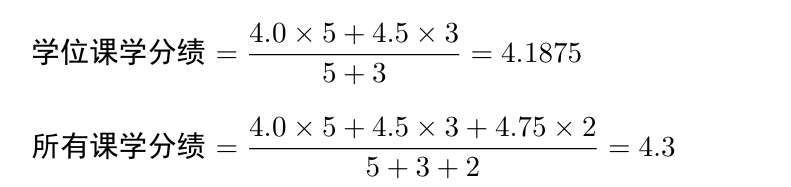

[南哪助手长期接受同学们投稿](https://www.yuque.com/greatnju/q-a/gw3phd)

**导论全文请点击该pdf查看：**

[南京大学本科生课程体系概论-第6版.pdf](https://www.yuque.com/attachments/yuque/0/2025/pdf/34810676/1746452141091-05341c4b-451c-46d3-8cb6-9747c30ff877.pdf)

# 1.序言
## 1.1 第一版序言 
最近正是高考生们的咨询季。接下来就是填报志愿，录取，新生入学。 回顾我在南京大学本科一年级的学习，我想将我关于南京大学本科生的课程 体系尤其是选课系统的了解与心得整理一下，为后来者铺路。 本笔记中的内容大多是基于21年之后的情况，可能不太适用于过早的 年份。由于是个人整理的笔记，我只能尽我所能做到客观真实。如有错误之 处敬请之处，如有其他意见欢迎交流。 

## 1.2 第二版序言 
本导论从单人工作到后面的双人合作，经历了很多次修改和增删工作， 力求能够尽量覆盖大部分的课程内容，但其中过于小众的方面，例如港澳台 生、留学生选课方面的内容没有加入，如有此类问题请找教务员咨询，由于 时间仓促，若有不足欢迎各位指出 。

# 2 学分与学分绩 
相信大家即使没上过大学也多多少少听过“学分”“绩点”这些概念。 

要了解学分与学分绩的概念，首先要理解在大学中“课程”的概念。很多人觉得我上了12年学，难道不知道什么叫课程吗？事实上，大学的“课程”概念与小学和初高中是不完全一样的。

每一个“课程”包含以下特征：课程号与课程名[1]、任课老师、上课时间、上课教室[2]、课程学分数。

简单来说，学分是一种类似于积分的制度，当你在一个学期内修完了某一门课程并且没有挂科，那么你就可以获得该课程的学分。一门课程学分的多少与这门课程的“周学时”相关。在南京大学，一门课程每周上几个50 分钟（一节课的时间），那么这门课的周学时就是几。一般来说“周学时”越多，那么这门课的学分也就越多。一般来说，大部分专业的毕业要求都是 150 学分。（除了双学位专业与医学专业等特殊专业）

学分绩（GPA）是南京大学的“绩点”概念。在学期结束后，各科老师会对你这学期在这门课程的学习打一个100分制的分数[3]。将每门课分数除以20得到一组5分为满分的分数，再将这些分数按其课程的学分数为权重进行加权平均，即可计算出你的学分绩。同时根据课程类型的不同，学分绩还有学位课学分绩与所有课学分绩之分，顾名思义就是按不同的范围计算出不同的学分绩[4]。例如A同学有5学分的学位课程A得分80分(绩点为4.0），3学分的学位课程B得分90分（绩点为4.5），2学分的选修课程C得分95分（绩点为4.75），那么这位同学的绩点就是 ：

注：

[1] 课程号相同的课程才是“同一门”课程，如果仅课程名相同而课程号不同，那么它们是不同的两门课程，在准入准出时一般是不可以互相替代的。 

[2] 没错，每门课都有自己的教室，而不是按班级分教室。 

[3] 一般由平时分、期中成绩、期末成绩这几项组成，有的课程还有大作业或实践。 

[4] 关于哪些课程是学位课范围，这一般与你的专业有关，可以咨询教务员. 

**全文请查看导论pdf：**

[南京大学本科生课程体系概论-第6版.pdf](https://www.yuque.com/attachments/yuque/0/2025/pdf/34810676/1746452141091-05341c4b-451c-46d3-8cb6-9747c30ff877.pdf)

