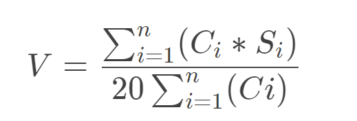
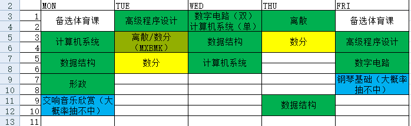
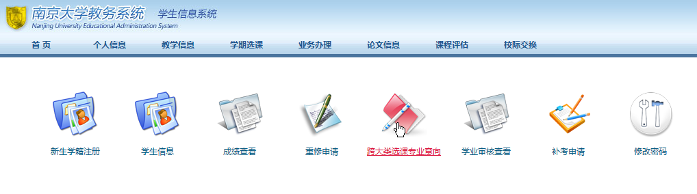
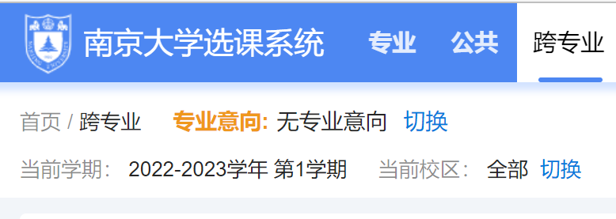
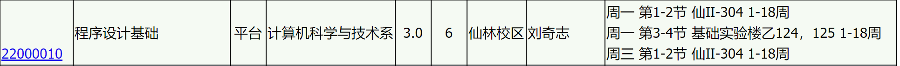
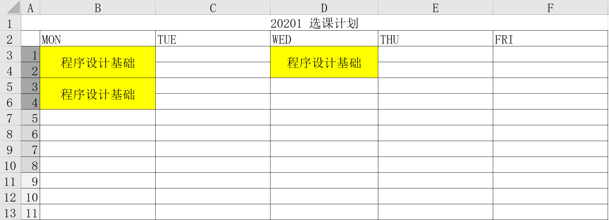
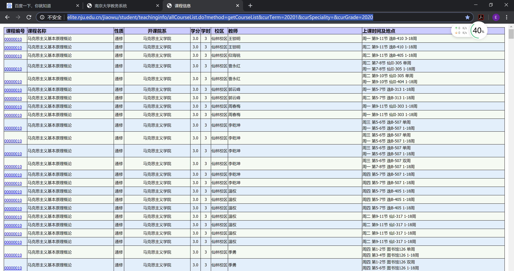
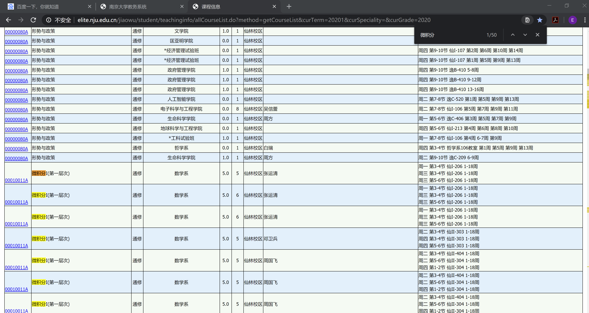
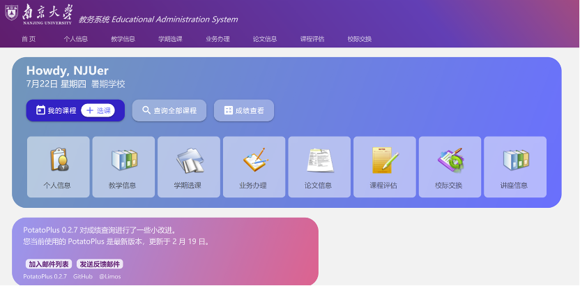
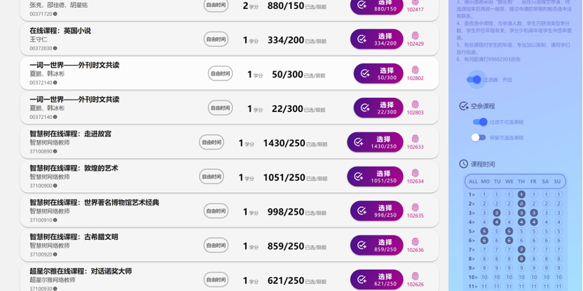

[南哪助手长期接受同学们投稿](https://www.yuque.com/greatnju/q-a/gw3phd#o8osi)

---

南京大学新生选课指导(version 1.3.3-2022.09.06)

编者：Eric GE @ NJUCS

# 新生选课时间节点（22级，23级未更新）
+ ~~9~~~~月~~~~7~~~~日~~~~9:00—9~~~~月~~~~13~~~~日~~~~16:00~~~~，新生登录“本科选课平台”（~~[~~http://xk.nju.edu.cn~~](http://xk.nju.edu.cn)~~）设置跨大类选课专业意向，进行选课报名（包括~~~~**大类选修课程、跨大类专业课程、新生研讨课/通识课、美育通识课、“悦读经典计划”课程、体育课**~~~~等）~~
    - ~~**体育**~~~~选课时间：~~~~9~~~~月~~~~12~~~~日~~~~9:00—9~~~~月~~~~13~~~~日~~~~16:00~~~~，详细请查看~~~~南京大学公共体育课程学习须知.pdf~~
    - ~~**“科学之光”**~~~~系列通识课~~[~~选课通知~~](https://jw.nju.edu.cn/ef/a7/c26263a585639/page.htm)~~。~~~~**2022级每位同学均须选修1门“科学之光”项目的课程，获得1个必修的通识学分。**~~
    - ~~**“悦读经典计划”**~~~~课程~~[~~选课通知~~](https://jw.nju.edu.cn/3b/75/c26263a539509/page.htm)~~。~~~~**2022级每位同学均须达到“悦读经典计划”课程修读要求（**~~~~**选修经典导读读书班或选修DIY研读课**~~~~**）。**~~
    - ~~**美育核心课**~~[~~选课通知~~](https://jw.nju.edu.cn/ef/78/c26263a585592/page.htm)~~。~~~~**2022级每位同学均须按要求修读美育核心课，获得2个美育必修学分，原则上应在一年级修读完毕。**~~
+ ~~9月18日，新生可在“教服平台”查询选课结果。~~
+ ~~9月19日13:30至开课两周进行课程补退选~~~~（因9月19日开始的两周含国庆周，所以9月19日开课的课程，可补退选至10月9日，9月26日开课的课程，可补退选至10月16日，以此类推），其中~~~~体育补选时间为9月19日13:30到9月23日12:00~~~~。开课3-8周可以退课，但是会在成绩单保留退课记录。之后选课名单不再变动。~~~~未经选中的课程无法获得修读资格和成绩。~~

# 前言
首先欢迎各位小蓝鲸来到南京大学，即将踏入大学校门的你们，是否已经感到十分激动了呢？别着急，大学生活与中学时代有很大的差别，其中一个非常重要的差别就在学习和课程安排上。

 

在高中阶段，各位的学习时间、学习方式等都是较为固定的，但是到了大学，各位要按照自己的人生目标和兴趣，选择适合自己的学习道路。南京大学拥有开放的选课和专业准入机制，在同学之中几乎找不到两张完全一样的课表，如此开放的选课机制，给了同学们深入自己兴趣爱好的一个契机。

 

但这也带来一个问题。由于南大选课过于开放，而南大教务处方面一般不会给同学们提供一个系统的选课指导，因此经常出现选课不当、选课程序不明等问题，加上有转专业需求的同学还有修读准入课程的情况，因此选课是一个注定非常复杂的过程。

 

本着方便各位新生的原则，此文将仅就南大课程设置和选课机制原则，探讨如何科学选课，以及选择课程的具体步骤，供各位小蓝鲸参考。不过本指导不就具体专业方向给出具体到课程的选课建议，请各位小蓝鲸根据自己的方向、兴趣等自行选择。

# 一、南京大学课程设置
首先，在选课之前，我们首先要认识一下南京大学和高中**课程设置****方面的差异。**大学的课程和高中很不一样，大学课程十分丰富，**所有的课程都****以学期为单位****，学期结束的时候统一结课、考核********，然后你就可以获得这门课程的分数了。******每门课程都设置有一定**学分**，**学分是最后毕业********考核的主要依据，只有修满规定学分（南京大学一般规定为****150****个学分），才能顺利毕业。**

另外，大学课程有两个极其重要的元素，一是你的**总评成绩**，二是你的**学分绩**（GPA）**。**

+ **总评成绩**：任课老师根据你的学习情况和考核成绩，为你打的一个分数。满分是100分，60分为及格，**只有及格才能获得这门课程的学分，不及格的科目不能获得学分，**且如果必修课不及格，需要补考或重修，否则会影响毕业。一般来说，总评成绩会由平时成绩、期中考试、期末考试综合决定，平时成绩又包括你的出勤率，作业完成情况，课堂表现，小组合作任务等等。
+ **学分绩**：学分绩是考量你的学习情况的重要依据，它是通过你的所有课程的学分，与你获得的总评成绩，计算出的一个加权平均数值（学分越大的科目，其总评成绩对学分绩的影响越大）。学分绩满分是5.0，**学分绩在奖学金、保研、出国等许多重要领域有着极其重要的作用！！！**

**学分绩的具体计算公式如下所示，其中****Ci****代表课程的学分数，****Si****代表课程的总评成绩，n代表参与学分绩计算的所有科目的门数，V是最终学分绩的结果。**

然后，****我们来了解一下南京大学的课程的类型。  
南京大学的课程一般分为以下几种：

1. **通修课程**：所有学生必修的课程，一般有以下几个课：数学类课程（不同院系修读不同层次的课程）、英语类课程（共两学期4门课程，分层次上课）、思政类课程、军事类课程、体育课（共四学期4门课程，自选）。
2. **学科平台课：**大类或院系开设的课程，有的是必修，有的是选修（计划表上一般会注明选修），详情参见官方本科培养方案。
3. 核心课：专业必修的课程，一般在大二、大三修读。
4. **通识课**：学校开设的通识教育类课程，有新生导学课、研讨课、经典悦读、“科学之光”项目等。注意：**<u>南京大学要求每名本科生至少修读14学分的通识课，其中必须包含1学分的经典悦读课程（或完成一门DIY课程的修读）、1学分的“科学之光”项目课程、2学分的美育课程、2学分的劳育课程</u>****，否则影响毕业。**关于经典悦读课程设置这里不再赘述。
5. **公选课**：即公共选修课，全校范围内的都可以选修，纯凭自己兴趣学，没有毕业要求。

一般而言，所有本科生的毕业要求包含两个部分：

1. 修够固定学分的课程（一般要求为150学分，含14通识学分）
2. 完成专业培养计划的全部必修课程（设计通修、平台、核心课程）。大家需要修读的所有必修课程列表可在本科教学计划与培养方案（此文件一般可在[本科生院官网“三三制”培养计划专栏](https://jw.nju.edu.cn/24794/list.htm)中查看，参考2021版本即可）中查询，也可以咨询自己院系的辅导员、教务员。

# 二、南京大学选课制度
南京大学的课程设置可谓相当丰富，眼花缭乱，小蓝鲸初次选择的时候可能不知道如何下手。先别急，我们先来了解一下南京大学的**选课制度**：

**选课时间**：新生为开学时军训期间选课（今年具体时间见最上方），老生在上学期快要结束时，就要选好下学期的课。

**选课基本方式**：初选+抽签+补选

+ **初选**：自己院系开设的的通修、平台、核心课程，可以直接在“专业选课”中去选，分班的还要选择班级，选择成功即为选中。其他课程只是做“预申请”，能不能选中还要看抽签结果。
+ **抽签**：检验欧非的时刻，可以预先根据需要开设一些外挂（比如专业意向，后文会提）来提高部分课程的中签率。
+ **补选**：抽签阶段没有抽满的课程（通识课、跨大类选课、体育课、公选课等），可以在补选阶段去选择，**注意：补选阶段是“直选”，先到先得**，所以那天中午建议不要睡了。

 

针对转专业的同学，由于你们修读相应的“准入课程”，学校则为了各位的准入课程能够顺利选中，专门设置了一个**“专业意向”**。

“专业意向”可以在教服系统设置，设置完成后，仅在选课预选阶段起到一定作用，具体如下：

+ “专业意向”可以设置为“转专业”意向或“二专”意向。
+ 设置专业意向后，在跨大类课程预选中，**仅能选择对应院系开设的跨大类课程。**
+ 设置专业意向后，你可以选择**与你已选课程时间冲突的**跨大类课程。
+ 设置专业意向后，在跨大类课程的预选阶段，你能够拥有比其他同学更高的中签优先级，但是**下面提到的特殊情况会降低你的选课优先级**。
+ 设置“转专业”意向后，大一具有极高的选课优先级，但**从大二开始优先级逐渐降低**。
+ 设置“第二专业”意向后，你的**专业意向保持时间越长，本专业学分绩越高，对方专业平均学分绩越高**，优先级则越高。
+ 设置专业意向后，如果**在非时间冲突的情况下退选**对方院系课程，则优先级会**永久降低**。
+ 设置专业意向后，修改或删除专业意向，则**选课优先级重置**，且若处于预选阶段，系统自动删除所有预申请的跨大类课程。

 

OK！以上内容实际上就是对官方内容的一个解读，从下一个部分开始，我们会介绍基本选课流程和注意事项，祝各位小蓝鲸顺利选到自己心仪的课程哦。

# 三、选课流程与建议
开学前夕，小蓝鲸们就要开始选第一学期的课程了。但是南大课程设置纷繁复杂，**如何选好课是一门****艺术****，更是一个****技巧**，有时需要一波完美的操作，才能成功选上自己心仪的课程。

OK! Here we go!

## Step0：选课前的准备
**1. 登录选课平台**：[http://xk.nju.edu.cn](http://xk.nju.edu.cn/)** ；与教服平台**：[http://elite.nju.edu.cn/jiaowu/exit.do](http://elite.nju.edu.cn/jiaowu/exit.do) ，确认账号能够正常登陆。

****

注：选课平台用于进行选课、专业意向修改、查看选课结果的操作。

而教服平台用于进行查看选课结果、跨大类报名申请，报到注册，重修申请，免修不免考申请等其他各种教务操作。

（建议使用电脑登录，**教服平台是一个非常常用的网站！建议各位收藏**）

（如果无法登录，请尝试连接VPN，教程见：[信息化指南（3）](https://www.yuque.com/greatnju/q-a/zfsalr)第三部分。）

注意：教服平台是报道之后才能使用的，报道之后建议**熟练记忆自己的****学号**，**做到能够倒背如流**，学号是你在南大的编号，很多南大校内网站都是以学号作为你的个人账号的。

** **

**2.****画一张课表**

这一步看似很无聊，其实是很必要的，**每个人在每学期都有一张属于自己独一无二的课表**，尽管是院系相同的同学，也不会出现两张一模一样的课表。为了选课统筹规划，建议事先画一张课表，可以用纸笔，或者Excel等简单工具。

一般情况下，课表只需要星期一到星期五的课程信息（极少部分课程可能周末上课），上午4节课，下午4节课，晚上3节课。一般情况下，课程都是两节连上（或三节连上），每节课50分钟，各节课上课时间如下：

 

第一节：8:00-8:50

第二节：9:00-9:50

第三节：10:10-11:00

第四节：11:10-12:00

第五节：14:00-14:50

第六节：15:00-15:50

第七节：16:10-17:00

第八节：17:10-18:00

第九节：18:30-19:20

第十节：19:30-20:20

第十一节：20:30-21:20

 

所以，你画的课表可能是以下这个样子的：

图 1 课表样式

## Step1：确定你的专业方向
很多小蓝鲸都是通过大类招生进入南京大学的，如果你没有转专业意向的话，你需要在大类内首先确定一个适合自己的专业方向。（即使你有转专业意向，也希望你能够思考一下你在大类内的专业方向，以防万一）因为不同专业方向，在大类阶段的选课也是有所不同的。

[大类培养学科分流、专业准入实施方案一览表（2022修订版）](https://jw.nju.edu.cn/f0/a6/c26263a585894/page.psp)

 

比如数理大类就包括数学系、物理学院、大气科学学院、天文空间与科学学院四个院系。

 

对于转专业意向的同学，在这一步，大家要设置好自己的专业意向，来为之后自己选课做好充足的准备，这里不建议没有转专业和修二专的同学设置专业意向。

有两种设置方法：

**第一种-教务平台：**个人信息 ➡️ 跨大类选课专业意向。

****

**第二种-选课平台：**跨专业 ➡️ 专业意向 ➡️ 切换。

****

**注意：这只是一个初步意向，不是转专业报名。**

** **

关于专业意向的常见疑问，在上一个部分就已经说明过了。

 

## Step2：开始规划选课！
### Part1：专业选课
选课时，请调出自己院系的课表（以及想转的童鞋，请一并调出对方院系课表）

 

然后根据你的专业方向，开始选课，具体而言

 

进入学期选课 → 专业选课，可以调出专业选课表。

然后根据课表，依次选择自己本专业方向要求修读的专业课程，分班的还要选择班级，在这一步时，建议大家统筹规划所有课程的时间，并且选定一门课程后，在自己的课表中做出标记。

 

假设你选择了下面这一个专业课：

↓↓↓课程时间↓↓↓

那么你就在课表对应位置填上这门课程。

 

注意，对于有些专业课程，教务处会帮各位同学选好，这些课程被称为“指选”课程，这些课程都不能主动退课，且除了通修课程外（如英语课），都不可以自行调换时间，如果需要调换时间，请与院系教务员进行联系。

 

这里要注意一点，对于需要分班的课程，各位在选择班级时一定要注意时间上的重合问题，尽量**不要选择有时间冲突的课程班级**，做好统筹规划。

 

例如，某大类同学有A和B两门专业课程必修，且每个课程都开设了两个班级，各班级的时间如下所示：

A课程

1班：周二 3-4节；周二 5-6节；周四3-4节

2班：周三 3-4节；周五 3-4节；周五5-6节

B课程

1班：周三3-4节；周五3-4节；周五5-6节单周

2班：周二3-4节；周二5-6节单周；周四3-4节

分析课表我们可以得出：

选了A1班，就不能选B2班；同理，选了A2班，就不能选B1班。

 

所以只有两种选课组合：

**A1****班****+B1****班**

**A2****班****+B2****班**

 

**对于有转专业需求的同学（请在选课前设置好专业意向）：**

这里单单看本院系课程是不够的，还要统筹规划一下对方院系的课程，请一并拉出对方院系的课表（可在全校课表查看），并将准入课程当作本大类专业课程一并处理。有时间冲突的课程处理方式见上，但是可能会存在一定无法避免的时间冲突，这种情况下，往往有两种处理方式：

 

1、辛苦一下，两门课全修，其中一门申请“免修不免考”（后面会提）

2、 对于本专业课程实行缓修。

 

对于要选的跨大类准入课程，首先标记好这些课程，在后面的“选跨大类课程”步骤后进行选择。

 

到此为止，专业选课已经全部结束了，在此阶段结束后，请在【1-6节】的课程时间段中**至少空出一个时间用于体育课的选课**。

 

### Part2：选需要抽签的课程
#### 1. 选跨大类课程
+ **对于转专业的同学，请在跨大类课程当中选择相应的课程，请根据上一****part****你们统筹规划的结果选课。**
+ **对于没有转专业意向的同学，你们可以在全校范围内选修其他院系的开放课程，这个你们就根据自己兴趣来咯！**

之后，你们就要选修其他的课程了，虽然选这些课简单，但也是很必要的哦！！！

#### 2. 选通识课
众所周知，南京大学重视通识类课程，必须修满至少**14****通识课程学分**才能毕业，与其到了大三大四再去补修，不如大一就开始准备。

 

+ 如何辨别通识课程：通识课程的课程编号，以002,003,004,005,37,500开头。

2021年开始，学校推出了“科学之光”系列课程，属于通识课程的一部分，邀请了两院院士和学术大牛，和同学们一起探讨交叉学科的前沿知识。<u>学校要求2021级同学</u>**<u>至少修读1个学分</u>**<u>的“科学之光”系列课程，1个学分的“经典悦读”课程（或修读一门DIY课程），2个学分的美育课程，2个学分的劳育课程</u>，对于线下系列的课程，只需要和其他通识课一起选择即可；线上系列课程可与“经典阅读”系列课程一起选择。

 

开设时间：通识课经常在下午、晚上开设。

 

大一上选修通识课，建议选修新生导学课&研讨课。其中强烈推荐新生研讨课，这里不仅能让你感受南大课程的多样性，而且学分也多！

 

选择原则：1、不与已选课程冲突；2、自己感兴趣。

 

由于通识课是预选抽签制，建议大家多选几门，且时刻关注课程容量与已选人数，统筹规划。

#### 
#### 3. 选体育课
体育课是必修的，**需要修满****4****个学分**，通常情况下大一大二两年就可以修完了。南大开设的体育课程很多，包括各种球类运动、游泳、太极剑、体育舞蹈、瑜伽、减脂等，就算不喜欢运动，也总有一项是你的菜！

 

体育课基本上在【1-6节】开设，这时候看看你课表上空闲的时间，你就可以在这些时间里选修体育课。

 

选择原则：依然是1、不与已选课程冲突；2、自己感兴趣。

#### 
#### 4. 选经典悦读
南大经典悦读是一个特色课程，算在通识课程之内。经典悦读共有6个单元模块，每个模块都有很多可选书目，在毕业前修读其中3个单元每单元至少一本书，就可以获得1个悦读通识学分；如修读读书班数量达到6个，且覆盖6个单元模块，即可认定2个悦读通识学分。（同样算在通识14学分之内）。

 

经典悦读都是网课，所以不存在课程冲突问题，即使有线下交流会，请假老师也基本都会认可的。经典悦读的考核方式往往都是写读书报告，有一定的课业任务，所以一学期尽量不要选太多，1-2本书为宜，尽量选不同模块的数目。

 

关于经典悦读各个书目的课业压力，可以询问学长学姐。

 

#### 5. 选公选课
（据说大一上不开，所以可以略过，之后的学期如果开了，根据兴趣，自行选择，但大一课业压力还是比较大的）

 

至此，所有选课任务都已经结束了，下面就静静等待抽签吧！

 

### Part3：补选阶段
如果你是非酋，可能选的通识课、体育课都没有中签，那么你就需要在补选阶段补救一下了，选一些还没有选满的课吧。

 

补选阶段一般13:30开启，你主要需要在补选阶段做下面的事：

+ 在选课前保持意识清醒、网络通畅；
+ **调换英语、数学、思政课时间**（如果需要），注意这类课程可以直接在补选列表进行选择，一旦选中，即调换成功，原课程会自动删除。
+ 补选通识、体育课、跨大类课程（此时不管有无设置专业意向，都不能选修有课程冲突的课了）。

 

### Part4：免修不免考申请
当有课程冲突时，如果不准备进行时间调整，那么你必须申请免修不免考！

“免修不免考”定义：可以允许不参与随堂听课，但是必须交所有作业与参加所有考试。

申请免修不免考流程：

0. 在教服系统首先申请；

1. 下载免修不免考申请表，打印（没有表的可以找我要）；

2. 填写信息，带给任课老师签字；

3. 找教务员交表，教务员审核，完成。（或者直接让任课老师在网上审核通过）

 

**注意：思政课、军事课、体育课、实验类课程不能申请免修不免考！**

 

### Part5：退课
你们应该听过“选课一时爽，期末火葬场”的传言。

 

有些课程，你刚开始感兴趣，但上着上着就不想上了，或者能力跟不上，此时不建议硬撑，因为你的期末成绩可能因此被拉低。如果实在不想上了，请果断一点，立马退课。

 

注意：只有课程开课前八周才能退课（前两周退课无记录，3-8周退课，你的退课记录会反映在你的成绩单上），如果犹豫了超过时间了，你就只能硬着头皮上下去了。

举例：如果某课程第2周开课，那么第2周、第3周退课无记录，4-9周退课有记录。

 

以上就是整个选课的流程和具体操作方法。由于今年的特殊情况，选课时间节点可能有所变化，但是依然可以使用本指导所示的方法进行科学选课。

# 四、教服系统全校课表的高级用法
## 1. 预卜先知
这里给大家整个活，给大家讲一个教服系统中“全校课表”的高级用法。**这个用法一般用于在补选阶段开始前预知通修课程的时间安排。**

首先，登录教服系统，进入主页：

将以下URL复制到浏览器后回车：

[http://elite.nju.edu.cn/jiaowu/student/teachinginfo/allCourseList.do?method=getCourseList&curTerm=20221&curSpeciality=&curGrade=2022](http://elite.nju.edu.cn/jiaowu/student/teachinginfo/allCourseList.do?method=getCourseList&curTerm=20221&curSpeciality=&curGrade=2022)

注意上面标红的地方是可以修改的，比如你想查看2019年下半学期的2018级课表，你就把上面两个红色的改成20192和2018就可以了。

点进入，就可以看到所有对应课程了：

比如你想调换“微积分”的课程时间，那么你可以按下Ctrl+F，输入“微积分”，自动定位到全校微积分开课时间：

然后你就可以对着课表，挑选自己心仪的课程时间啦！

## 2. 利用工具管理选课
这里首先讲一个历史遗留问题。由于在往年选课刚开时（特别是补选），南大教务系统经常会因为负载过高而炸掉，非常不稳定，因此南大的教务系统服务器也有着“土豆服务器”的别称。

同时，又有这么一群人，因为看不惯教务系统那丑陋的界面和非友好的用户交互体验，特意开发了一个插件PotatoPlus（[https://github.com/cubiccm/potatoplus/](https://github.com/cubiccm/potatoplus/)），使得教务系统焕然一新。（目前已经启用了新的选课系统，界面UI和功能也有所改善，[http://xk.nju.edu.cn/](http://xk.nju.edu.cn/)）

PotatoPlus是南大学生自主研发的一款插件，可以提供教务系统的一系列方便操作的工具，包括但不限于自动识别验证码登录、选课自动刷新、自动过滤课程时间、改进UI、课程测评一键五星好评等工具，极大的方便了大家的选课体验。

PotatoPlus可在Github、Google应用商店、MicroSoft应用商店等地下载。

# 五、南京大学课程与选课机制FAQ
#### Q：南京大学转专业难吗？
A：南京大学转专业相对比较开放，只要满足官方文件要求的准入标准（一般为修读准入课程并达标），通过考核，就能顺利转入。

#### Q：转专业的考核内容大致是什么？
A：不同院系自己决定考核方式与内容，一般会写在文件上，也可以通过询问学长学姐的方式获取往年的回忆试题，但考察的知识点一定是和目标院系紧密相关的。

#### Q：转专业申请有没有原院系排名要求？
A：除明确要求外，不要求你在原来院系的排名，必要时你也可以在准入标准的允许下，缓修一部分原来院系的课程。

#### Q：南京大学本科生一共有多少次转专业机会？
A：3次。入学拔尖计划考试算一次，大一下、大二下各有一次，大三开始没有机会再转了。

 

#### Q：什么是拔尖计划？
A：拔尖计划是南京大学为培养基础学科科研人才设立的计划，不是重点班、实验班，主要培养科研人才，在奖学金政策以及保研出国方面享有一定优待，具体信息可以咨询“拔尖计划咨询群”（群号628661817），以强基计划考取南大的同学不得再次参与拔尖计划选拔。

 

#### Q：什么专业好转？修什么二专好学？
A：童鞋，我建议你根据自身情况，挑感兴趣的学科学习。到了大学，一些规划就要学会自己制定，人生的选择权只在你自己的手上！

 

#### Q：选不上目标院系课程怎么办？
A：设置了转专业意向之后，基本上就是100%的中签率，如果实在选不上，学校会不定时增加开放名额，请留意官方消息！

 

#### Q：转专业申请失败了会怎么样？
A：可能会导致你在原大类分流处于绝对劣势，具体表现在第一志愿录取满的院系无法准入。关于“志愿顺序”的相关信息，请查看教务处相关文件或说明。（这部分还是比较重要的）

 

#### Q：有没有不需要期末考试的课程？
A：所有课程都是会期末考核的，不过不一定是以闭卷笔试的形式，常见的也有开卷、半开卷、机试、论文、演讲等考试形式。

 

#### Q：排完课表后，我发现我的课表有空白的地方。那些我没有课的时间段，我需要做什么呢？
A：爱干什么干什么。

#### Q：英语课上，老师会给我复习四六级内容吗？比如要求我们刷题之类的
A：老师不会以刷四六级题作为作业布置的，也不会给你复习四六级，这些全部靠自己去准备。

 

#### Q：什么时候考四六级？
A：一般四级在大一下考，首次六级在大二上考。

 

#### Q：我的四六级需要考到什么程度？
A：对于能够考上南大的同学，在维持高中水平的情况下，四级无需过多准备就能高分，重点在于六级。南京大学的毕业六级要求是425，如果你有保研等需求，建议越高越好，如果你有出国深造的需求，一般要求TOFEL或IELTS的成绩，此处请咨询学长学姐，具体标准视个人情况而定。不过不用担心，从大二上开始，你每学期都有一次考六级的机会。

 

#### Q：老师上课会点名吗？
A：会。

 

#### Q：周末会上课吗？
A：除少数通识课、公选课外，一般学校不会安排周末的课程，这段时间可以自由支配。

 

#### Q：大学的课程与高中有什么不同？
A：大学课程是走班制，大学老师不会逼着你学，大学任课老师拥有最终成绩的决定权，大学教学形式和作业形式比高中丰富得多，大学老师都很友好……反正很不一样就是了。

 

#### Q：旷课会有影响吗？
A：退学警告。

 

#### Q：申请免修不免考会被任课老师拒绝吗？
A：可能会，但你只需要获得其中一位任课老师的同意就行了。

 

#### Q：申请免修不免考之后需要参加期中考试吗？
A：原则上必须参加，有的老师可能允许你不参加，然后把你的期末成绩作为最后的总评成绩。

 

#### Q：我能退必修课吗？
A：必修课不能随便退课，如果实属选课不当，请联系教务员。

 

#### Q：军训有学分吗？
A：军训属于通修课，有1个学分且必修，通常只要认真训练，成绩都在85分以上。

 

#### Q：如果我因为身体原因，上不了体育课怎么办？
A：可以申请进入保健班，保健班有学分且算在体育学分之内，但是所有保健班学生的成绩都是60分。如果在临近期末身体受伤，可以申请缓考。

 

#### Q：什么是缓考？缓考有什么申请条件？
A：学生因公、因病或因其它不可抗拒的因素，不能参加课程期末考试的，可申请缓考。申请缓考需要出示医院病历证明等证明材料，与补考同学一起进行。

 2021级以后的全日制本科生，在推荐免试研究生工作时，缓考课程的学分绩(包括学位学分绩达到专业前70%和推免课程学分绩)均按实际成绩乘以0.9计算，因公缓考的按照原始成绩计算。2020级及之前入学的本科生缓考课程的成绩按实际得分计算  。

 

#### Q：什么是补考？
A：学生首次修读课程考核不及格，可以申请一次(仅限一次)补考。补考时间基本在下学期开学左右，补考成绩如实记载，若补考通过，学分绩以60分计，原不及格成绩作废。

 

#### Q：什么是重修？
A：对于不及格或成绩不满意的课程（大于等于80分不允许重修），之后的学期都可以申请重修（即本学期再次跟班上课，重新考核）。重修需要缴费（￥90/Cr），且一旦申请不可撤销，原成绩立即作废。由于及格成绩只有一次申请重修的机会，因此请慎重申请及格重修。

 

#### Q：期末考试试卷谁出？
A：一般是你的任课老师出。

 

#### Q：我的老师会在期末前给我划重点复习吗？
A：现在学校抵制老师划重点，但有些老师还是会善意的在考前告诉你考试比例、难度、分值等。

 

#### Q：第八节和第九节课之间只有30分钟休息诶！！我来不及吃完饭怎么办？
A：30分钟其实是来得及吃饭的，实在来不及你可以去罗森买饭团，买完就一边吃一边飞奔回来，或者教学楼内的自动贩卖机、教学楼旁的小店自行解决，不建议送外卖到教室里吃。

 

#### Q：课上我要怎么记笔记呢？用笔记本（notebook）好呢还是用笔记本（laptop）好呢？
A：看自己习惯，有些老师会把他们的ppt发给你们，也有些老师禁止课堂上使用电脑。建议大家不要用手机拍照，因为不容易保管，且有侵犯老师知识产权的嫌疑。

 

---

[南哪助手长期接受同学们投稿](https://www.yuque.com/greatnju/q-a/gw3phd#k6p5Y)

