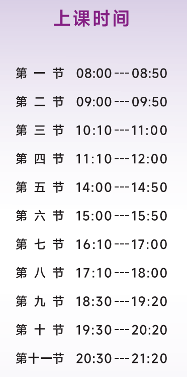
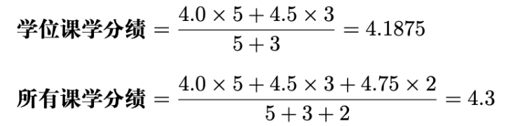
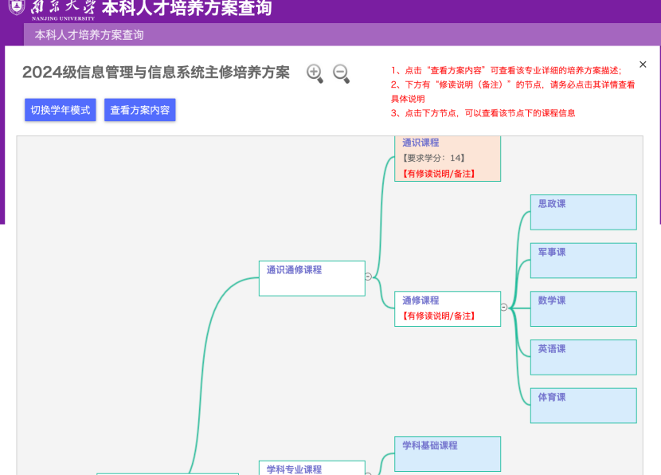
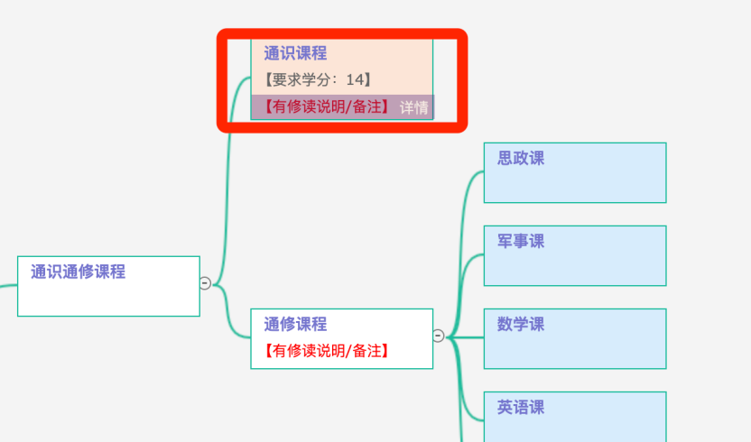
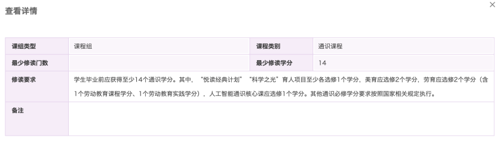
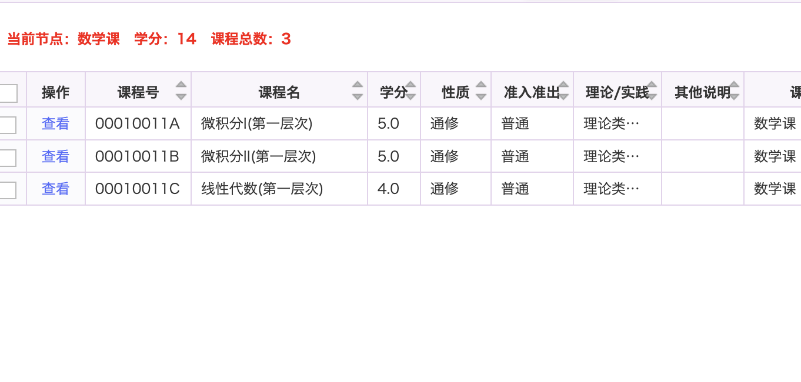
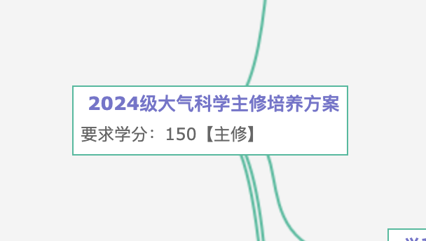

相信大家即使没上过大学也多多少少听过**学分、绩点**这些概念。要了解学分与学分绩的概念，首先要理解在大学中课程的概念。很多人觉得我上了12年学，难道不知道什么叫课程吗？事实上大学的“课程”概念与小学和初高中是不完全一样的。

南京大学一节课时间为50分钟，小课间10分钟，大课间20分钟。

  
	每一个**“课程”**包含以下特征：**<u>课程号、课程名</u>**<u>、</u>**<u>任课老师</u>**<u>、</u>**<u>上课时间</u>**<u>、</u>**<u>上课教室</u>**<u>、</u>**<u>课程学分数</u>**。课程号相同的课程才是同一门课程，如果仅课程名相同而课程号不同，那么它们是不同的两门课程，一般来说是不可以互相替代的。

简单来说，学分是一种类似于积分的制度，当你在一个学期内修完了某一门课程并且没有挂科（60分以上），那么你就可以获得该课程的学分。一门课程学分的多少与这门课程的“周学时”相关。在南京大学，一门课程每周上几个50分钟（一节课的时间），那么这门课的周学时就是几。一般来说周学时越多，那么这门课的学分也就越多。一般来说，大部分专业的毕业要求都是150学分.（除了双学位专业与医学专业等特殊专业，具体可在培养方案中查询）

  
	学分绩（GPA）是南京大学的“绩点”概念。在学期结束后，各科老师会对你这学期在这门课程的学习打一个100分制的分数（一般来说包括平时分、考试分数、大作业分数等等构成）。将每门课分数除以20得到一个满分为5分的分数，再将这些分数按其课程的学分数为权重进行加权平均，即可计算出你的学分绩。同时根据课程类型的不同，学分绩还有**学位课学分绩**与**所有课学分绩**之分，顾名思义就是按不同的范围计算出不同的学分绩（学位课学分绩包括所有的通修课和专业必修课；所有课学分绩包括你上过的所有课）。学分绩和你的保研、出国、评奖评优息息相关。

例如甲同学有5学分的学位课程A得分80分 （绩点为4.0），有3学分的学位课程B得分 90 分（绩点为 4.5），2学分的选修课程C得分95分（绩点为 4.75），那么这位同学的两种学分绩就是:

南京大学本科阶段的课程可以分为：**通识课、通修课、专业课、选修课、毕业论文**。在正式录取之后，同学们可以登录南京大学网上办事服务大厅网站上找到各个院系的培养方案。大类的培养方案只有第一年，后续的内容需要去具体的专业看。（点首页-本科生服务-培养方案）（需要南京大学统一身份认证才可查看）

将鼠标指针移动到课程方框的最下边，即可弹出详情选项，点击“详情”两个字就可以查看这种类型课程的具体要求，双击方框则可查看具体课程列表。

其中，通识通修课程、学科专业课程、毕业论文/设计这三部分，若课程方框未做特殊标注，则需要将课程列表中的课程全部上完。多元发展课程包括专业选修课、跨专业选修课、公选课、通识课等等任何课程，若未做特殊标注，说明可以任意选修。

但是每个专业都有毕业的总学分要求，一般来说是150（有些专业要求更多），说明你上的所有课程的总学分数在毕业时需要达到这么多（一般来说做强制要求的学分是120左右，剩下的就全看个人兴趣选课）。（不要简单的平均为每学期上150/8个学分就好，因为大三大四一般会有别的事情需要忙，上的课会少很多，所以前期有时间可以多上一些课）

**<u>写给新大一的同学们：大学不是高中，不是说你可以做到一天从早上8点上到晚上8点，每周上五天课。对于大一来说，建议一个学期上20-30个学分最为合适。</u>**

