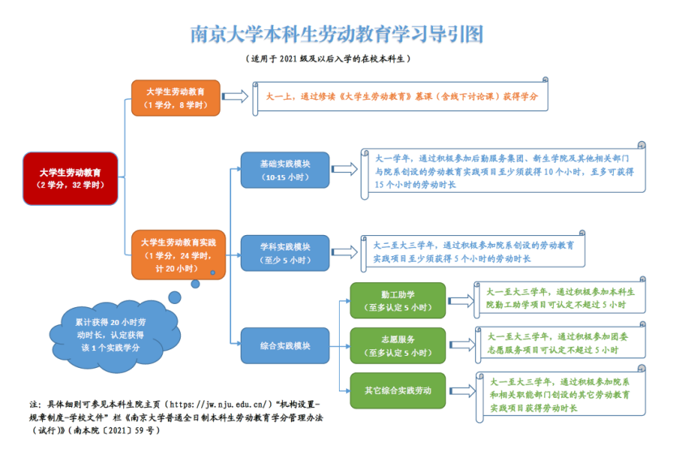

**以下为2025级的新版通识课方案，老版本方案在文章后面：**

通识课是课程号以002、003、004、005、006、37、500开头的课程，具体可以分为：人工智能通识核心课、人文与社会科学、自然科学与技术、美育、劳动教育。具体要求如下表所示：

| 通识课总学分需要达到11学分！！ | 类型 | 最低要求学分 |
| :---: | --- | :--- |
| | 人工智能通识核心课 | 1 |
| | 人文与社会科学 | 悦读课1学分+其余至少2学分 |
| | 自然科学与技术 | 科学之光1学分+其余至少2学分 |
| | 美育 | 2 |
| | 劳动教育 | 理论1学分+实践1学分 |

最普遍且合适的11学分组成方案为：

1学分人工智能通识+1学分悦读课程+1学分科学之光+2学分美育+1学分劳动教育理论+1学分劳动教育实践+2学分普通人文类通识+2学分普通自然类通识

具体某个通识课介绍，可看下面的部分。

以下为2024级及之前的通识课方案

—————————————分割线————————————————

通识课是课程号以002、003、004、005、006、37、500开头的课程，具体可以分为：**<u>科学之光课程、美育课程、劳动教育理论、劳动教育实践、悦读课程、人工智能通识课程以及普通通识课程</u>**。全校不论什么专业，通识课程要求均一样，如下表所示：

|    通识课总学分需要达到14学分！ | 类型 | 最低要求学分数 |
| :---: | :---: | :---: |
| | 科学之光 | 1 |
| | 美育 | 2 |
| | 劳动教育理论 | 1 |
| | 劳动教育实践 | 1 |
| | 人工智能通识课 | 1 |
| | 悦读 | 1 |
| | 普通通识课 | — |

**<u>劳动教育理论课程：</u>**1个学分的理论课程，每学期都开，此课程在大一第一学期将会自动置入你的课表，需要加入课程的QQ群（分3个班，具体自己在哪个班可在课表查看），应当在大一第一学期就完成，主要内容就是刷网课。如果因为忘记考试等原因导致挂科，可以在春季学期继续重修。

**<u>劳动教育实践课程：</u>**1个学分，即需要在南京大学五育平台（ndwy.nju.edu.cn)上报名并完成相关的活动才可以拿到学分（具体要求如下图所示）。

基础实践模块不一定必须要在大一做完，但最好建议在大一做完。学科实践也可以提前在大一完成（可以参加自己学院的学科实践、也可以参加别的学院的）。这里的志愿服务请注意必须是“团委”负责的才能记录劳动时长。

当你完成了图中的实践课程要求后，本院系教务员将会在一段时间后录入你这一门实践课程的1个学分，成绩显示为“通过”，不算入学分绩。

**<u>美育课程：</u>**一般以“某某人文”命名的课程，2个学分，原则上必须要在大一修读完成，只需要修读一次即可。

**<u>科学之光课程：</u>**1个学分的课程，分为“大科光”和“青年科光”，二者的区别是，大科光是一两百个人的大班上课，类似于讲座形式的课程；而青年科光是几个人、十几个人的讨论班形式。其中“大科光”可以在选课平台上自己选择，而“青年科光”需要自己向老师报名（具体情况需要等书院通知）。原则上科学之光课程也需要在大一修读完毕，且只允许修读一次，不可以重复修读。

如果美育课程和科学之光课程在第一学期没有选上也不必太过担心，也可以在大一下学期上，但强烈建议不要拖到大二。

**<u>悦读课程：</u>**悦读课程分为**经典导读读书班**和**DIY研读课**。悦读课在系统上全部标注为仙林校区，但其实任何校区都可以上。  
（1）经典导读：在选课平台上自己可以选择，分为六个单元模块：“文学与艺术”、“哲学与宗教”、“经济与社会”、“自然与生命”、“全球化与领导力”、“历史与文明”。经典导读课程全是网上自主进行（会举行若干次线下交流课）。当修读完三个不同模块的课程之后，可以获得1个悦读学分；如果把所有的六个不同模块全都修读过，可以获得2个悦读学分。（当你修读完后的一段时间，教务员会将成绩录入，悦读分数为三门课的平均值）  
（2）DIY 研讨课：需要进行线下上课（而且很大可能是在仙林校区），和正常上的线下课区别差不多，上完一门课可以直接获得 2 个用于悦读课程的学分。报名需要在本科生院在选课时发的通知里面的方式进行报名。据上过的同学说：收获比较大（但也需要你喜欢阅读）

**<u>人工智能通识课程：</u>**需要至少获得一个学分。2024级为拼盘讲座，共计1个学分。

**<u>普通通识课：</u>**普通通识课就是除了以上特殊通识课的通识课程，也就是选课平台的**“导学/研讨/通识”**板块。

其中002开头的是**新生研讨课**，只有大一的同学可以选。（通识课一般很难抢，大一的同学可以把握住新生研讨课的机会哦）当然也有少部分的通识课只给高年级同学上。通识课中有一些“自由时间、自由地点”的课一般是线上进行，所以也可跨校区修读。

