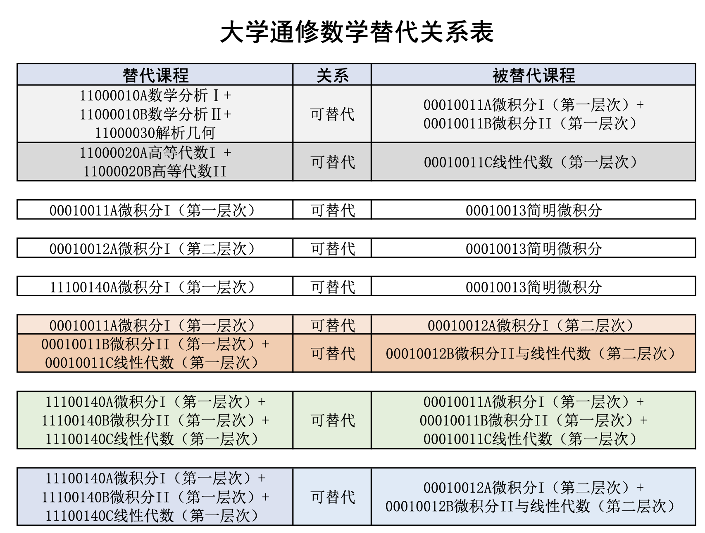

“通修课”可以理解为是大学里的“公共课”，南京大学的通修课有如下几种：数学课、英语课、思政课、计算机课、体育课、军事课。

通修课一般有如下几个特点：

上课的内容不随你所在的专业改变而改变，比如工科试验班学习的微积分I与软件工程学习的微积分I在内容上不会有很大的区别（不排除有授课老师个人教学风格因素导致的细微区别）。

不同院系的相同通修课具有相同的课程号，因此可以互相替代。所有的通修课（除了形势与政策）均可以自行换班。比如教务处给你的班级指选了英语老师A，但是由于不管什么原因你想上老师B的课，只要他们教的课是同一门（以课程号为准），你就可以进行这样的选课替代，即使老师B被教务处指派给了别的班级。

对于一个专业来说，并不是所有的通修课都必须要上的。例如社会科学试验班就不需要上通修计算机课；戏剧影视文学专业就不需要上通修数学课。

当你选修非培养方案要求的通修课时，成绩录入时由于系统原因会默认课程性质为“通修”，但过一段时间后教务员会手动调整为“选修”

**通修数学课**

南京大学的通修数学课程采用分层次教学，分为星层次、一层次、二层次、文科层次。

课程难度上而言：星层次>一层次>二层次>文科层次。这些课程之间的替代关系如下图所示：

说明：

一对一替代关系的课程中，后修课程视为重修，前修课程标记无效，选后修课程时系统会做提醒。

存在替代关系的课程中非一对一关系的，后修课程视为重修，前修课程修读完毕，经学生申请后标记无效；选后修课程时系统会做提醒。

星层次数学课程包含“数学分析”“高等代数”“解析几何”系列课程，请整套修读，是数学系各专业（含数学类拔尖计划）的通修课程。

如学生无准入数学系的意愿，应根据教育教学计划里面的数学通修层次修读即可，以免影响自己在所在大类的成绩排名和准入（修读第一层次数学的同学如希望准入数学类专业，可按照数理科学类的数学类专业的准入方案实施）。已经录取拔尖专业（非数学类拔尖计划）的学生，不能修读星层次数学通修课程。

对于每个专业具体应该上什么层次的数学课，可以在哦ehall中的培养方案查询。对于几个特殊的专业，我们在这里做特殊说明：

1. 匡亚明学院的同学修读的数学课是“特殊的一层次”，课程号与普通的一层次不同（111开头），虽然存在替代关系，但考虑到难度、得分各个方面，外专业同学建议不要选修，并看清选课课程号。
2. 人工智能专业（包括智能科学强基）的同学不修读通修数学课，修读的数学课为人工智能学院开设的数分高代，不属于通修课程体系。因此：如果希望转专业进入人工智能学院，选修的人工智能学院的数分高代将不会算入通修数学，如若转专业失败，可能对你的分流产生极大影响。
3. 戏剧影视文学、运动员班专业的同学不学任何数学课
4. 部分少数民族地区的少数民族同学可以申请修读“体验数学”课程作为通修数学课，可以不修读上述的数学课程，体验数学课程持续两个学期，分流时成绩将会乘60%
5. 南赫学院的同学不修读上述课程体系中的数学课，而是修读自己学院里开的数学课（英文教学）
6. 有些专业并不一定上完一整套数学课，例如医学院只学二层次的第一学期；信息管理与信息系统和档案学专业修读人文数学+线性代数（第一层次）

一层次数学包括：第一学期开设的微积分I（第一层次）、第二学期开设的微积分II（第一层次）、以及两个学期均会开设的线性代数（第一层次）（按照培养方案决定你具体在哪个学期学，当然你也可以自己调整修读时间）

二层次数学包括：第一学期开设的微积分I（第二层次）和第二学期开设的微积分II和线性代数（第二层次）共两门课

文科层次包括：第一学期开设的人文数学。目前正处在教改阶段，人文数学与老的简明微积分互为替代关系。

星层次是数学专业的专业课，除非你要学数学专业，要不尽量不要选：包括第一学期的数学分析A、高等代数A、解析几何。第二学期的数学分析B、高等代数B。注意：大二的数学分析C是数学学院的专业课，不属于星层次。

南大数学课程所用的教材并不是市面上常见的教材，纸质版教材开学后会发，电子版教材可在南大各大交流咨询群找到。

数学滚动班：仙林校区秋季学期会开设一个一层次微2的网课重修班、一个二层次微2的网课重修班。春季学期会开设一个人文数学/简明微积分的线下重修班、一个一层次微1的线下重修班、一个二层次微1的线下重修班。

注意滚动班只允许大二及以上，并且未获得课程学分（挂科或缺课）的同学修读。

注意：少数民族地区的少数民族同学可以申请修读“体验数学”课程作为自己的通修数学课，可以不修读上述的数学课程，体验数学课程上两个学期，分流时成绩将会乘60%计算。

