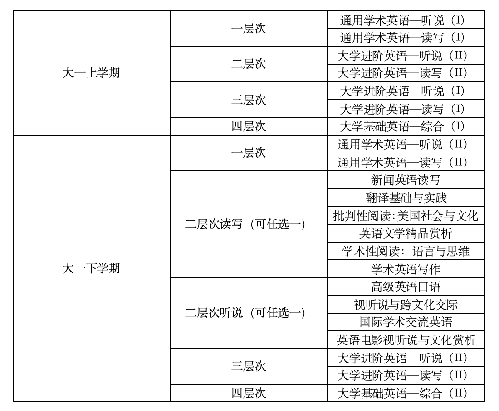
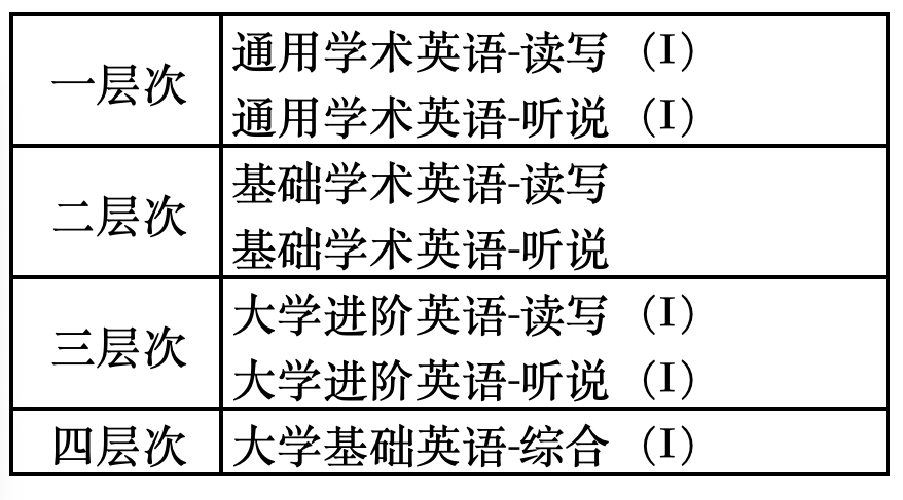

南京大学的通修英语课分为一、二、三、四层次，基本按照高考英语成绩区分（各省分别排序），其中四个层次的比例大约为5%，65%，29%，1%。

外语保送的同学，若高中学过英语，则进入二层次；若高中没有学过英语，则进入三层次。

如果被分入四层次，可以向大学外语部申请层次调整至三层次。

初选阶段的英语课将会以“大学英语”的名字进行占位，这不是你真正的英语课。等到补退选之前，教务员会帮你选好初始英语课，那个时候你看到的就是你真正要上的英语课，同时，“大学英语”的占位课在一段时间后会删掉，不影响正常选课。在补退选阶段，可以任意更换同层次的英语课班级。

一二三层次的英语均为大一上、下两个学期，每学期需要修读一门“英语听说课”，一门“英语读写课”，每门课程2学分。四层次英语需要上四个学期，每个学期仅上一门4学分的综合英语课。不同英语层次可能在平时的测试中有所不同，但是期末考试不同层次考同一张试卷。不同英语层次不会影响同学们报考四六级考试的先后顺序。

注：可以看到三层次下学期上的英语课其实就是二学期上学期上的英语课。

【补丁】2025级大一上学期英语课名字改了，如下：

南京大学英语教材使用的教材也并非市面上常见的教材，开学后会发。南京大学的四六级最早只能在大一下学期考，四级通过后（425分以上）才能考六级。

特殊情况说明：

1. 英语专业不修读通修英语课。
2. 医学院除了上述的英语课程，在二年级还需要修读两学期的学术英语课程
3. 南赫学院的英语课自己上自己的，同样分AB两个层次
4. 运动员班需要上四个学期的四层次英语课，但是别的四层次同学只需要上两学期。
5. 四层次英语课在分流时需要乘60%计算

