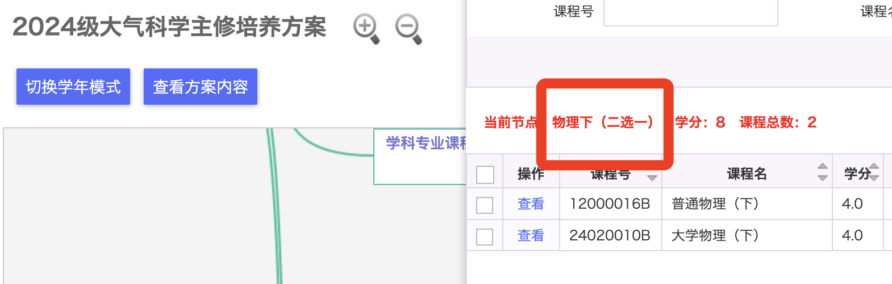
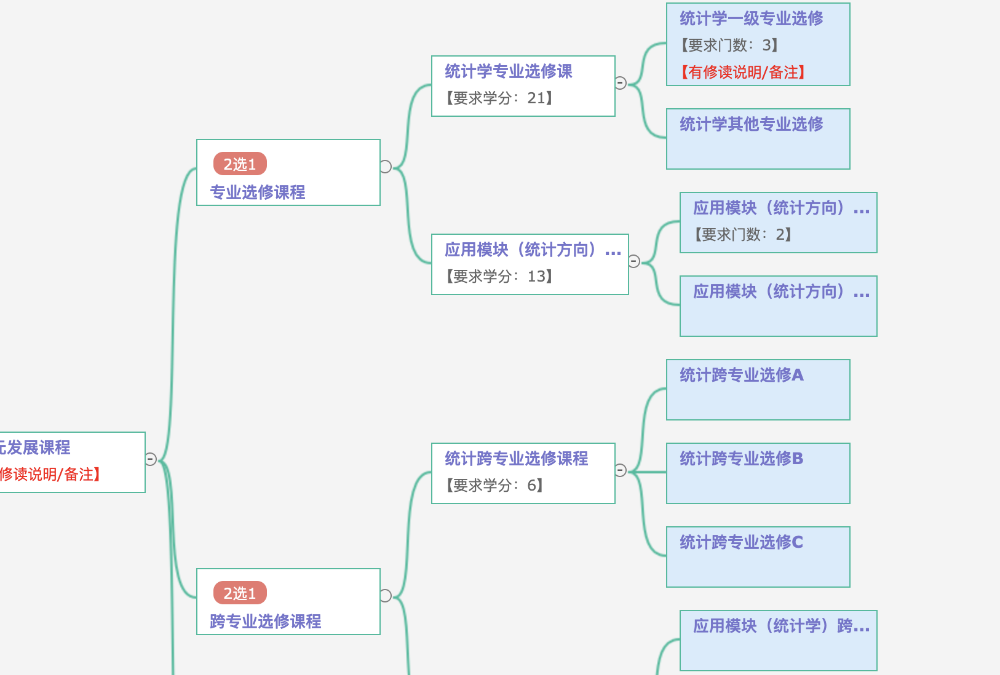
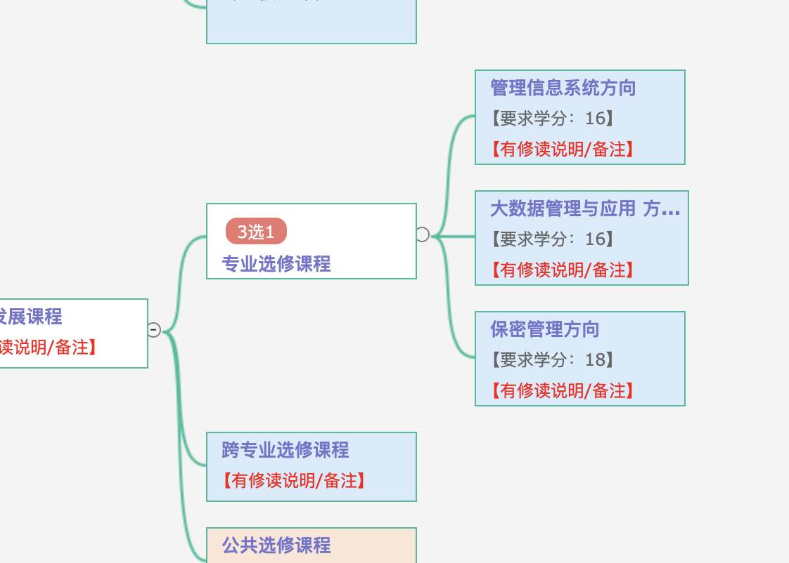
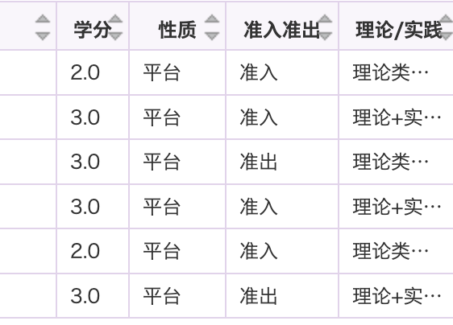

由于呢喃对专业课分类的标准过于复杂且没有必要，因此我们这里只用最为简单的方式帮助大家理解。

专业课可以简单的分为：专业必修课、专业选修课。

专业必修课就是必须要上的课，当然有些时候是二选一或者几选一的形式。例如大气科学专业，虽然普通物理（下）和大学物理（下）都属于必修课这一类，但是只需要上一门就行了。具体可以看专业的培养方案。

什么课是专业必修课呢？课程性质为：**<u>必修、核心、平台</u>**的可以简单都理解为必修课。他们之间的分别可以不做区分。

专业选修课顾名思义就是专业内部的、选修的课，课程性质为选修。很多专业不做选修课的强制要求，你甚至可以一门专业选修课都不上（因为还可以上跨专业课，公选课补足学分）。

但是，也有相当一部分专业强制你必须上够一定数量的专业选修课，但是选修课不算入学位学分绩，只算入全部学分绩。例如下图所示：

一门专业课可能开好几个班，每个班可能考核标准会有区别，需要自己注意（有些专业课是教务员指定班级并且不允许换班的）部分专业课存在重名现象，但是开设院系不同，请以课程号为准。**<u>课程号不同的就是不同的课程</u>**，互相之间不能替代（除数学/物理外）

在培养方案中，你会发现每个课程都标注了“准入/准出”的性质。但是从实际上理解，**<u>这一列没有任何意义且非常容易让人误解</u>**。当你看培养方案时，**<u>请忽略这一列。</u>**

那有些同学可能会问，**<u>如果我想分流或者转专业进入某个专业那么应该上什么什么课呢？</u>**

关于分流和转专业的详细内容请看第二部分。

