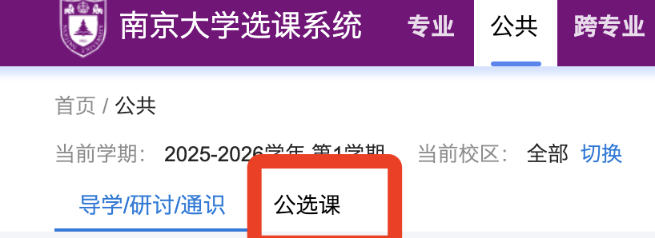

南京大学的选课极其自由，学生们可以几乎100%的自由选读喜爱的课程。

在选课系统的跨专业模块里面，可以选择别的专业的专业必修课、专业选修课。几乎所有的专业的所有课都是开放的（除了少数特殊专业，如戏文、南赫、医学；以及少数内部的课程）。

也就是说：即使你是计算机的同学，你也可以去选读哲学学院的课程；即使你是汉语言文学的同学，也可以去选择物理学院的课程**<u>（当然课程考核要求和本专业正常上课的同学是完全一样的）</u>**

**<u></u>**

**<u>关于选课系统跨专业板块一些按钮、设置的具体功能，将在“选课系统”这一部分具体解释。</u>**

**<u></u>**

同时，跨专业板块也可以让你修读本专业不同年级的课程、以及别的专业不同年级的课程。（但是大一上学期不允许跨年级修读）只要你想，你可以大二的时候上大三的专业课。跨专业的课程（选别的专业的课）同样会进行考核，有学分算成绩，课程性质为“选修”，只计入全部学分绩，不计入学位学分绩。

跨专业选课是进行**<u>辅修和转专业</u>**唯一且最为必要的途径，辅修与转专业的内容将会在后续介绍。

公选课就是公共选修课的意思，里面会有各种有意思的课，面向全校所有年级开放选课（但是大一第一学期只有极少量的公选课会开放选择，这是为了让新生同学们多去看看新生研讨通识课）

公选课不算14学分，不是通识课。也有学分，也会算成绩，课程性质为选修，只算全部学分绩，不算学位学分绩。用途就是上自己喜欢的课以及凑毕业学分，或者刷全部学分绩。

跨专业课和公选课是凑毕业学分（一般是150）非常重要的部分。

