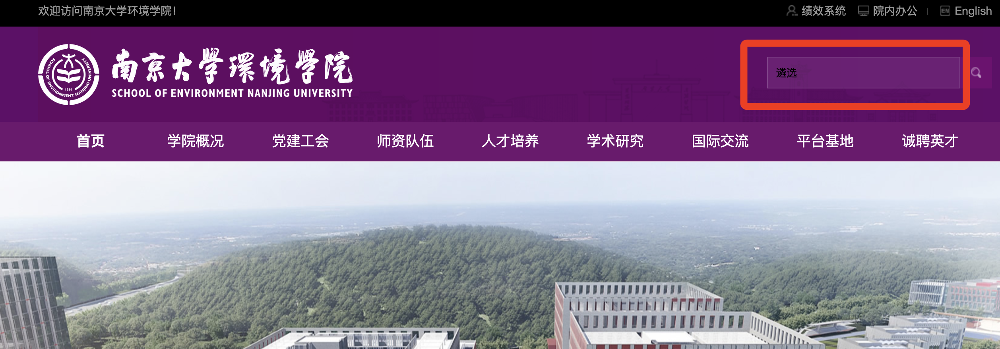
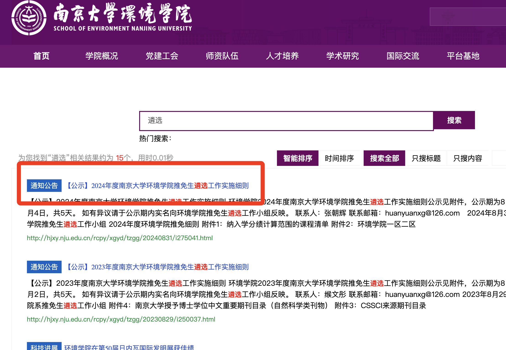
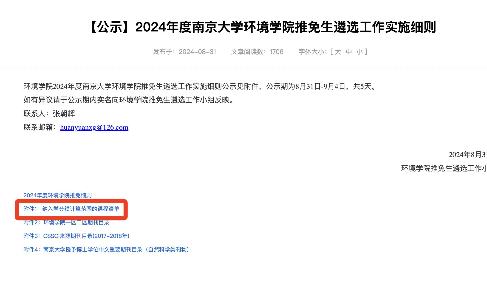
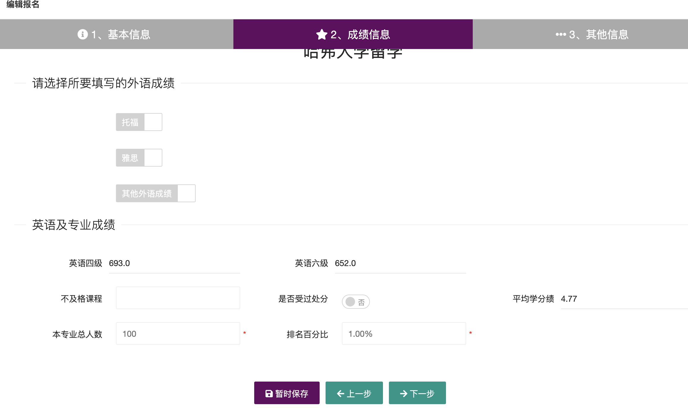

保研课就是分配保研名额时算入成绩的课程，一般来说和“学位学分绩”高度接近，但并不完全一样。那么如何知道自己的专业保研要看哪些课呢？

**<u>方法一：院系官网搜索</u>**

在你自己院系的官网搜索关键词“遴选”，则可以查找关于保研课程的计算。

**<u>方法二：在各大咨询群里问/问同专业学长学姐</u>**

由于许多专业在公示期结束后就会删除细则文件，因此只能在各大咨询群或者找同专业的学长学姐咨询。

注意：保研课每年都可能不一样。保研名额分配时的课程成绩计算均只看第一次的修读，例如：挂科后补考也只用挂科的成绩计算；课程重修也不会对分配保研名额的成绩计算产生影响。

**如何查看自己大概的排名？**

如果想知道自己**<u>学位学分绩</u>**名次，可以在“交换生系统”上进行查询。[http://elite.nju.edu.cn/exchangesystem/](http://elite.nju.edu.cn/exchangesystem/)

在**<u>统一身份认证通过</u>**后，可以打开：[http://elite.nju.edu.cn/exchangesystem/index/create?pid=4](http://elite.nju.edu.cn/exchangesystem/index/create?pid=4)。并把这个项目暂时保存，这样以后随时可以在个人中心—我的项目报名中查看排名。

自己的名次就是与（本专业总人数*排名百分比）结果最接近的整数

<u>注意：如果你希望参加夏令营/预推免等各类保研的项目并且需要开出成绩排名的话：目前南大大部分院系是只支持开出</u>**<u>全部学分绩的排名</u>**<u>或者</u>**<u>学位学分绩的排名</u>**<u>。也就是说，即使你们专业保研不算英语、体育等等课，但是你开成绩排名证明的时候，这些课仍然需要被算进去！！</u>

**<u>课程替代：</u>**

目前南大校级层次的课程替代体系仅有数学课（前文已有）和物理课。

物理课的替代方案在：[https://jw.nju.edu.cn/de/78/c26263a712312/page.psp](https://jw.nju.edu.cn/de/78/c26263a712312/page.psp)（由于这个原因，地学大类/工科试验班的同学申请转专业物理的时候，最好将本专业的物理课退课）

但同时，各个学院有自己的相关课程替代体系。例如：计算机学院可以用AI的数分高代替代微积分；软院的CPL和技科的CPL相关课程也有替代关系。但这些内容过于繁杂，具体的替代关系可等通知或在群里询问。

除上述内容之外，还存在一种特殊的替代，毕业替代。例如：AI院的数分高代不算在通修数学课程体系中，不能代替任何的通修数学课。但如果你跨专业修读完了之后，并且向本专业的教务员申请（一般都会同意），可以用AI的数学课替代本专业的数学课。再例如：英语专业的同学转专业进入别的专业，大一没有上过通修英语课，上的是英语专业课，在转专业后可以申请英语课程替代。但是这样的替代不存在于任何官方的体系中，因此这种替代仅能满足毕业要求，在评奖学金、保研等场景中均会直接判定为缺课。

