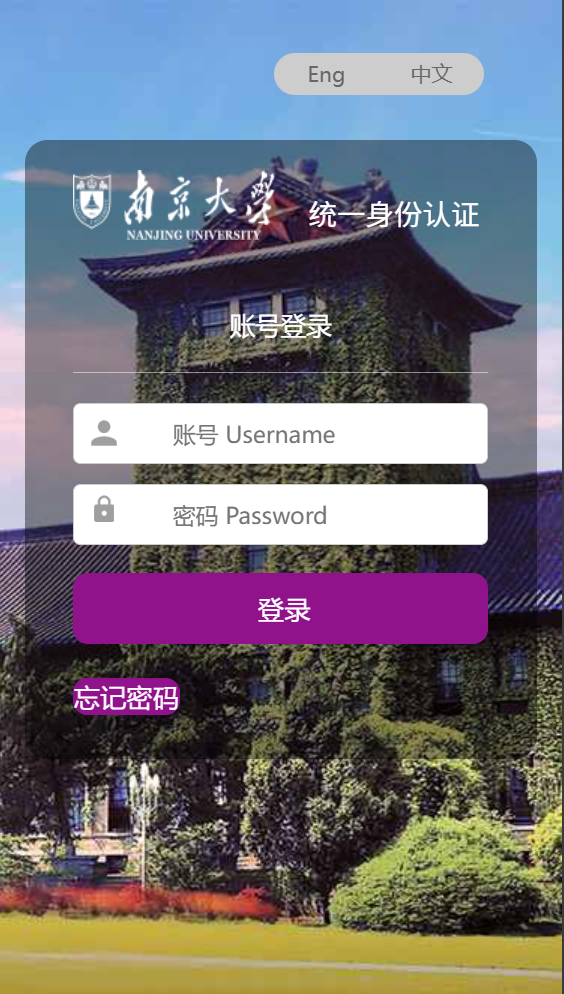

:::info
本篇是南京大学信息化建设管理服务中心（ITSC）的**<u>信息中心学生指南</u>**的极速指引，遇到具体问题时，请查阅[ITSC官方指南](https://guide.nju.edu.cn/faq/main.htm)对应章节~

:::

欢迎加入NJU这个温暖的大家庭！恭喜你们即将开启一段充满探索与成长的大学旅程 —— 在这里，除了课堂上的知识碰撞，**校园信息化服务**也会成为你们学习生活中不可或缺的 “小助手”。

为了让大家快速上手校园里的各类信息服务（比如登录教务系统、连接校园网、使用校园卡等），这份指南特意整理了最核心的信息化问题指引。需要说明的是，南京大学信息化建设管理服务中心（ITSC）已在官网（[https://guide.nju.edu.cn/faq/main.htm](https://guide.nju.edu.cn/faq/main.htm)）提供了完整的系统指南，所以本文档不会重复阐述，而是帮你快速定位：**遇到具体问题时，该去官网的哪个板块找答案**。

## 一、统一身份认证
在南京大学，学号是大家的通行证。所有的校内服务都会依托于学号进行身份验证。**统一身份认证**就是这样的一套系统。<u>（你将会在后续的教程中多次遇到这个词，请记住他）</u>目前，已经有微信公众号“南京大学信息门户”、南京大学APP、上网认证系统`p.nju.edu.cn`、网上办事大厅`ehall.nju.edu.cn`、支付通、就业系统、学生第二课堂、VPN服务（Easy Connect） 等多项服务接入了统一认证系统。

  
  

[【信息服务】统一身份认证及扫码相关问题（new）](https://itsc.nju.edu.cn/ee/60/c21475a585312/page.htm)

### 常见问题
1. **如何登录统一认证？**  
输入同一个账号密码（统一身份认证的账号名、密码）即可登录进入。

电脑端可使用已认证并登录的手机微信或南京大学APP扫码登录。

_具体步骤见 “统一身份认证” 第 1 问。_

<u></u>

2. **不清楚统一身份认证的账号名和初始密码？**  
统一身份认证的用户名为学号；初始密码为全部身份证件号。

首次使用统一身份认证时，需要根据网页提示更改密码。

_详见 “统一身份认证” 第 2 问。_

<u></u>

3. **登录时提示 “用户名或密码错误”“账号冻结”“密码过期”？**  
密码错误可通过 “忘记密码”（需绑定手机 / 邮箱）或邮件申请重置；

账号冻结半小时后自动恢复；

密码过期需重置密码。

_详见 “统一身份认证” 第 3、4、10 问。_

<u></u>

4. **密码登录时需要短信验证，但收不到验证码？**  
需在 “统一身份认证平台”（[https://authserver.nju.edu.cn](https://authserver.nju.edu.cn/)）绑定手机号，可通过微信信息门户 “个人中心”、南大 APP “认证账号设置” 或电脑端平台操作

_详见 “统一身份认证” 第 5、6 问。_

<u></u>

5. **更换学号后，如何重新登录微信信息门户、南大 APP 或绑定新手机号？**  
需先解绑旧学号，再用新学号登录，解绑步骤及新登录方式

_见 “统一身份认证” 第 7、8、9 问。_

## 二、信息门户（微信公众号）
南京大学信息门户与南京大学APP互为移动端服务补充，为师生提供在线服务、消息提醒、推文宣传等服务功能。

[信息门户](https://guide.nju.edu.cn/faq/33/05/c44791a537349/page.htm)

### 常见问题
1. **如何使用微信 “南京大学信息门户”？**  
微信搜索并关注公众号：南京大学信息门户，或扫码关注：

关注公众号后，首次点击 “综合服务”→“更多服务”，用统一身份认证账号登录即可获得更多在线服务！

_详见 “信息门户” 第 1 问。_

<u></u>

2. **更换学号后，微信信息门户绑定的旧学号如何解绑？**  
电脑端登录[https://authserver.nju.edu.cn](https://authserver.nju.edu.cn/)，通过旧学号进入 “账号绑定” 解绑微信，再重新用新学号登录。

_详见 “信息门户” 第 2 问。_

<u></u>

3. **信息门户有哪些推荐功能？**  
包括 “智能问答”“我要反馈”（用于问题咨询）、“消息订阅”（接收提醒）及各类学习生活服务入口。

_详见 “信息门户” 第 3 问。_

## 三、南京大学 APP 
南京大学APP是我校移动客户端，提供包括课表查询、成绩查询、校园卡充值等一百多项在线服务，并提供校园新闻等信息，随时了解校园动态。

### 常见问题
1. **如何下载 “南京大学” APP？**  
苹果用户在 App Store（中国区）搜索“南京大学”APP并安装，安卓用户扫描官方二维码：

_详见 “南大 APP” 第 1 问。_

__

2. **如何登录“南京大学”APP ？**  
首次登录请使用右下角“学工号”登录，统一身份认证后，绑定手机号。

以后再次登录即可使用手机号登录，或用学工号登录均可。

_详见 “南大 APP” 第 2 问。_

__

3. **登录时提示 “校内认证失效”“手机号已绑定过”？**  
认证失效可清除缓存并退出重登；

手机号已绑定可先用手机号登录，在 “校内身份管理” 添加新学号

_详见 “南大 APP” 第 3、4 问。_

4. **更换手机号后如何重新绑定？**  
原手机号可用时，在 APP 内解绑后重新绑定；原手机号不可用时，通过微信信息门户 “我要反馈” 处理

_详见 “南大 APP” 第 5 问。_

5. **APP 有哪些便捷功能？**  
长按图标快速进入校园码、健康打卡；“服务” 页面支持智能问答和功能搜索

_详见 “南大 APP” 第 6、7 问。_

[南大APP](https://guide.nju.edu.cn/faq/33/06/c44791a537350/page.htm)

## 四、网上办事大厅
南京大学网上办事大厅（[ehall.nju.edu.cn](https://ehall.nju.edu.cn./)）是师生网上办事总入口，集成了近400个服务事项，涵盖教学教务、科研事务、第二课堂等30多个服务主题，提供150个在线服务。

### 常见问题
1. **如何访问网上办事大厅？**  
浏览器输入[https://ehall.nju.edu.cn](https://ehall.nju.edu.cn/)，用统一身份认证登录

_详见 “网上办事大厅” 第 2 问。_

2. **大厅内有哪些服务？如何快速找到常用功能？**  
涵盖近 400 项服务（教学、科研、第二课堂等），支持收藏常用应用，首页 “我的收藏” 可快速访问

_详见 “网上办事大厅” 第 2、3 问。_

3. **如何反馈问题或咨询事务？**  
大厅侧边栏有 “智能问答”“校务信箱”“我要反馈” 入口，可直接提交咨询或报障

_详见 “网上办事大厅” 第 3 问。_

[网上办事大厅](https://guide.nju.edu.cn/faq/33/07/c44791a537351/page.htm)

## 五、消息专用短信号码
南京大学信息化统一消息专用短信号：106904000520（备用号码：106905960520、106907190520）该号码将会发送网上办事服务大厅、OA、统一身份认证、VPN等各类重要消息或系统验证码，请勿退订！

若误退订，需通过 OA 申请恢复，咨询电话 025-89683791，详见 “信息化消息专用短信号” 内容。

[信息化消息专用短信号](https://guide.nju.edu.cn/faq/e6/0b/c44791a583179/page.htm)

## 六、校园卡、NFC、校园码

## 七、校园网

## 八、电子邮箱

