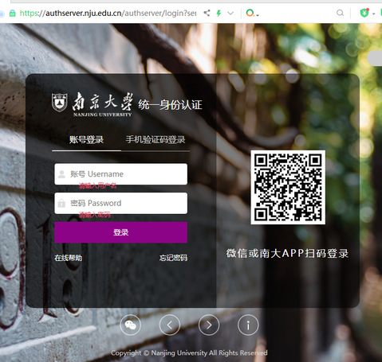
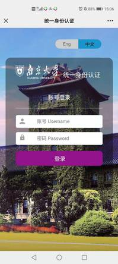
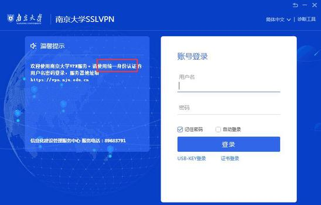
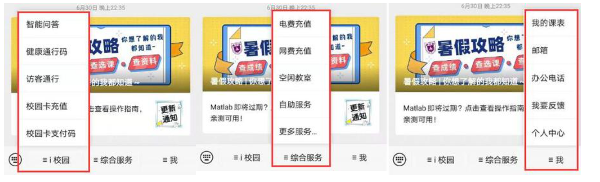
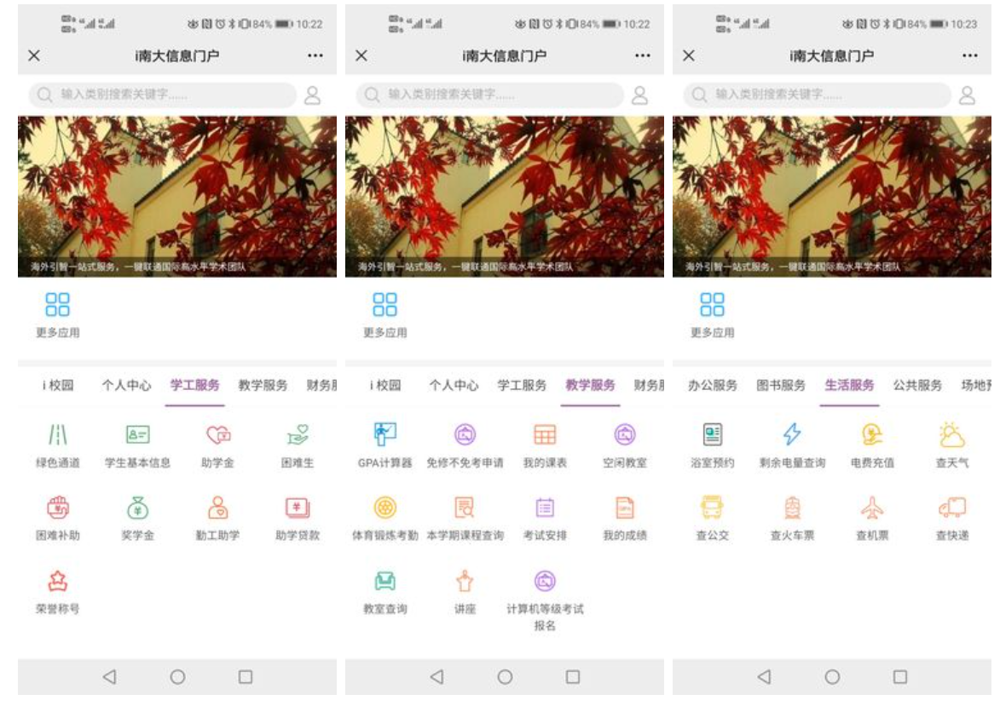
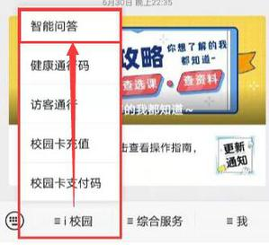
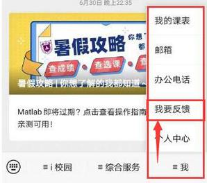
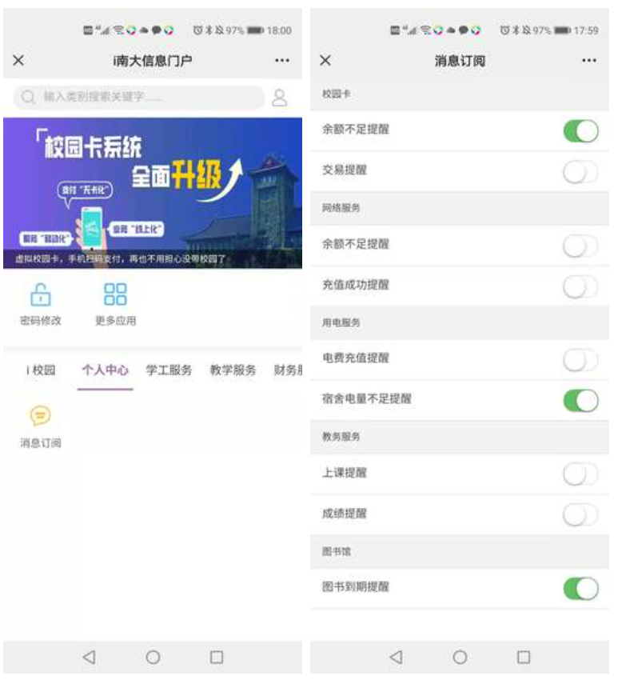
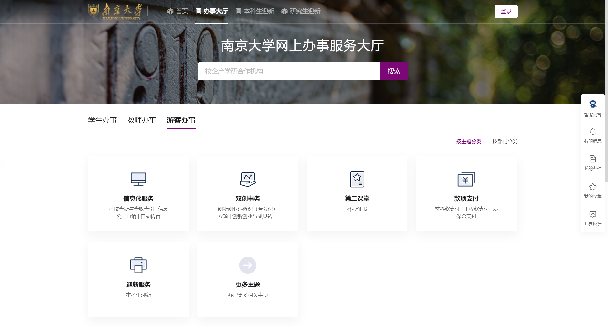
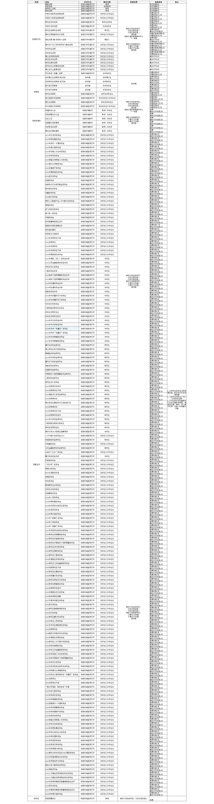

:::info
本系列节选自南京大学信息化建设管理服务中心（ITSC）的信息中心学生指南（点击原文跳转 guide.nju.edu.cn），在此感谢信息化中心老师的付出！

:::

首先恭喜大家加入南京大学，开始你们精彩的大学旅程。在南大，信息中心是每位同学日常打交道最多的部门之一（这里手不禁要夸一夸ITSC的老师，南大人的信息服务越来越高效便捷）。为了更好地帮助新生适应南京大学的生活，手手也特地将这份信息中心的学生指南总结精选给各位同学。

## 统一身份认证
在南京大学，学号是大家的通行证。所有的校内服务，都会依托于学号进行身份验证。**统一身份认证**就是这样的一套系统。<u>（你将会在后续的教程中多次遇到这个词，请记住他）</u>目前，已经有微信公众号“南京大学信息门户”、南京大学APP、上网认证系统p.nju.edu.cn、网上办事大厅ehall.nju.edu.cn、支付通、就业系统、学生第二课堂、VPN服务（Easy Connect） 等多项服务接入了统一认证系统。

### 如何登录统一认证
1. 首先，你需要查询你的学号。你的学号可以在迎新网或本科招生网的入口查到。现行本科生的学号为9位。
2. 统一身份认证的初始密码为：**全部身份证件号**。首次使用统一身份认证时，需要根据网页提示更改密码（为了您的账号安全，请尽快修改为**含字母数字、长度大于八位**的复杂密码）

_（这里网站上没有加入22级新生的情况）_

3. 在登录成功南大APP或信息门户后，你可以使用APP或微信扫码登录。

### 如何修改密码？
登录统一身份认证管理平台**：**[http://authserver.nju.edu.cn/authserver/login](http://authserver.nju.edu.cn/authserver/login) 修改密码

### 忘记密码怎么办
1. 在初次使用时，建议登录统一身份认证管理平台**设置密保手机号和密保邮箱**。一旦忘记密码，可以通过手机号和邮箱找回密码**（重要！！建议新生一定要设置密保手机号）**
2. 如果未预先设置，请将您的**身份证件（有照片的证件）正面朝上**拍照发给soft@nju.edu.cn，写上自己学号/工号，姓名，申请重置统一身份认证密码，工作人员会帮您重置后回信给您（8：00-19：00）

### 如何判断需要使用统一身份认证系统
出现如下界面，且且网址以：[http://authserver.nju.edu.cn/](http://authserver.nju.edu.cn/) 开头

 或页面提示：使用统一身份认证登录，如南京大学VPN：

### 为什么我的账号显示被冻结？
可能您之前密码错误次数过多导致的，半小时后可自动恢复正常。

## 信息门户、南大APP和网上办事大厅
信息门户、南大APP和网上办事大厅（ehall）是南大人最常用的信息平台。其中，信息门户为微信公众号，南大APP为手机端软件，网上办事大厅主要面向电脑web端。他们的功能是类似的，新生在入校前关注或下载好。

### 信息门户
**微信搜索并关注公众号：南京大学信息门户**

或扫码关注：

信息门户涵盖了南大人几乎所有的信息服务。

这里，信息化中心的老师着重推荐了三个功能（他们不止在信息门户中有，在南大APP和网上办事大厅同样可以找到）：

+ **<u>智能问答：</u>**

+ **<u>我要反馈：</u>**网络、信息系统、校园卡，有问题请联系信息化中心itsc，欢迎同学们的反馈、报障、咨询、建议！

+ **<u>消息提醒：</u>**“个人中心”的“消息订阅”，打开提醒开关，就可以在微信信息门户中收到相关提醒

### 南大APP
南京大学APP是一款南大师生必备的校园生活软件。对于本科生来说，主要功能包括：

> i校园（智能问答、校历、校园巴士、我要反馈等）
>
> 学工服务（宿舍申办、助学金、奖学金、荣誉称号、勤工俭学等）
>
> 教务服务（课程查询、空闲教室、考试安排、体锻考勤、我的成绩、GPA计算器等）
>
> 生活服务（电费查询、电费充值、查快递等）
>
> 校园卡服务（挂失/解挂、卡充值、卡转费、卡余额、支付码等）
>
> 网络服务（网费充值、网费互转、上网及邮箱修改密码等）
>
> 图书服务（图书检索、我的图书馆、在线图书、图书欠费缴纳等）
>
> 财务服务（报账服务等）、公共服务（信息收集、居住证办理、边境通行证办理等）
>

上述功能在信息门户中也有体现。安装方式如下：

+ 对于苹果用户，需要在苹果的App Store（国区）搜索下载南京大学，并安装
+ 对于安卓用户， 请扫描

**初次登录时，请使用右下角的学号登录。**该功能接入统一身份认证（第一部分所述），请按照提示完成绑定。

再次登录时，可以使用手机号或学工号登录。

如果更换了手机号，可能会显示异常，这时你可以

+ **<u>如果原手机号仍在使用：</u>**可先使用原手机号登录进入APP，选右下角“我的”、“设置”、“校内身份管理”，选中当前身份，点右上角“编辑”，“删除”即可取消原手机号和您学工号的绑定。这时再使用“学工号”登录，会要求您绑定手机号，绑定新手机号即可
+ **<u>如果原手机号暂停使用：</u>**请在微信“南京大学信息门户”，点“我”、“我要反馈”，告知您新手机号，申请变更为APP绑定的手机号，信息中心的老师在后台帮同学们处理

如果登录时提示手机已被绑定，那么可以参照上面的流程解绑，或点击“我要反馈”，发送报错截图。

### 网上办事大厅
_（这里信息中心的老师没有写教程）_

新生会在迎新时首次接触到这个网站。网址为ehall.nju.edu.cn。该网站接入了统一身份认证。

对于学生服务，同学可以选择在搜索框中输入想要办理的服务。也可以在学生办事中找到相应的服务。

## 自助打印服务
这里单独列出自助打印服务。新生在入学后，会遇到各种成绩单、在读证明、荣誉证书等一系列文件的打印。对于这些文件的打印，学校推出了自助打印系统。该系统提供了如下业务的打印功能：

_（该网页似乎没有更新，可以精简一点）_

同学可以在信息门户、南大APP或网上办事大厅找到自助服务模块获得取件码，或前往如下地点

仙林校区：信息化建设管理服务中心、行政北楼设备一二三、十一食堂、图书馆

鼓楼校区：办事大厅设备一二、图书馆

进行自助打印。

  

