:::info
本系列节选自南京大学信息化建设管理服务中心（ITSC）的信息中心学生指南（点击原文跳转 guide.nju.edu.cn），在此感谢信息化中心老师的付出！

:::

这是本系列文章的第二篇。我们将总结校园卡的使用和校园支付的相关内容。关于往期内容，可以查看 链接。

## 校园卡
前面提到，学号是大家在学校的身份证号，那么校园卡就是各位同学在南大的“身份证”了。

### 怎么领取校园卡
校园卡在报道时从**<u>辅导员</u>**或相应院系的迎新负责同学处领取。需要注意，本科生的校园卡**不同于**运营商所销售的电话卡。此卡为IC卡，和身份证一样，是同学们在南京大学的身份凭证和消费载体。

目前，南京大学校园卡的主要样式如下：

|  | 新版校园卡 | 2022年限定120周年校庆卡 |
| :---: | :---: | :---: |
| 本科生 | 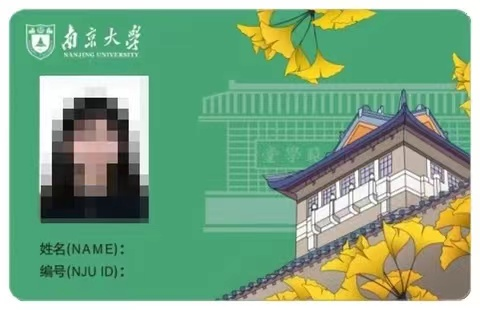 | 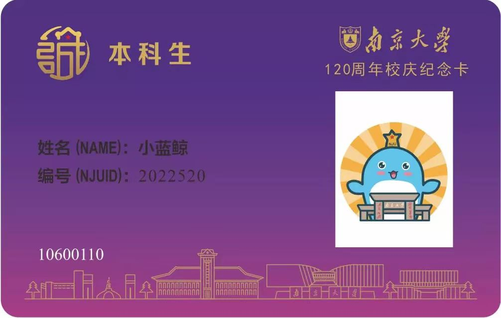 |
| 研究生 | 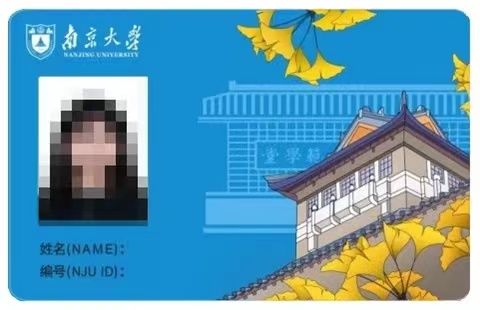 |  |
| 教职工 | 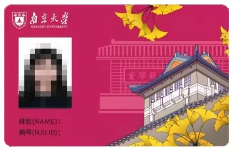 |  |
| 临时卡 | 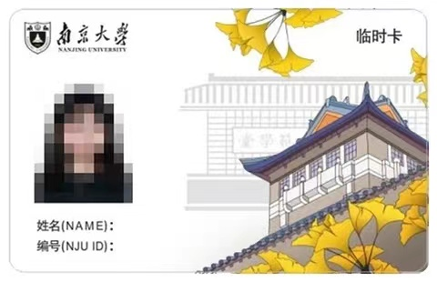 |  |

左栏的新版卡在2021年5月20日投入使用。本科新生入学时获得的卡为左上角绿色样式。右栏的校庆卡为今年5月20日120周年校庆特别卡，所以同学们在校园内看到紫色的卡也不要奇怪。

如果你从一些所谓“学长”处领取的校园卡不是上述样式，请万分警惕，可能碰到了运营商的销售人员。具体可以参考 防诈骗那篇推文。

校园卡的初次领取**不会收取任何费用**。

（此处ITSC的老师着墨不多，这里主要针对具体情况做了详细介绍）

### 使用校园卡消费
校园卡的初始密码是本人**身份证后六位**，若后六位**有字母的以“0”代替**。（该密码用于卡机挂失、卡卡转账、超过支付限额等情况。如卡密码遗忘，可通过手机“南京大学信息门户”或“南京大学APP”重置卡密码）

校园卡可用于食堂、校内超市、 校医院、图书馆、浴室、开水房、游泳馆和门禁等。

通常来说，同学们只需要在刷卡机上刷校园卡，在余额充足的情况下即可完成付费。如果余额不足，将提示消费失败。

#### <u>查询校园卡余额</u>
使用微信“南京大学信息门户”或“南京大学APP”，选“校园卡服务”随时查询：

  

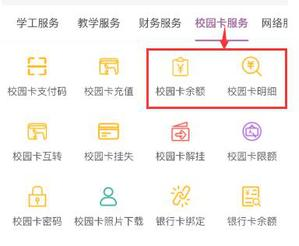

并建议您在“个人中心”的“消息订阅”，打开校园卡的“余额不足提醒”。

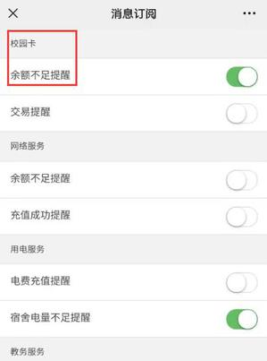

#### <u>校园卡充值</u>
校园卡支持**银行卡、微信和支付宝****充值**。

使用微信“南京大学信息门户”，可通过**绑定的银行卡**或 **微信**，给校园卡充值：

自2022年7月20日起，同学们可以通过南大APP使用**支付宝**为校园卡充值。

_（ITSC没有更新支付宝支付部分）_

__

#### <u>在线缴费</u>
电费、网费、水费，图书欠费的缴纳，可以使用**银行卡**，“**校园卡**”和“**微信支付**”缴费渠道，缴费方式更加多样化。访问路径如下：

（1）南京大学信息门户--综合服务--网络服务--**网费充值**

（2）南京大学信息门户--综合服务--生活服务--**水费充值**和**电费充值**

（3）南京大学信息门户--综合服务--图书服务--**图书欠费缴纳**

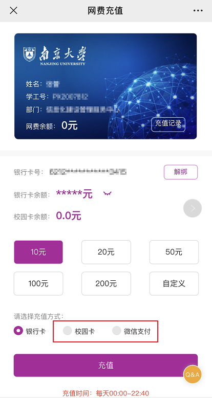

#### <u>其他功能</u>
新校园卡系统已实现了自助多媒体机**所有****“线下”服务“线上”化**，“南京大学信息门户”一站式支持包括**校园卡卡间转账、密码修改、限额修改、挂失与解挂**等校园卡服务，实现“24小时不打烊”，随时随地办理。

### 校园卡的挂失与补办
同学们在丢失校园卡之后，可以按照如下的步骤

1. **<u>在线挂失：</u>**在微信“南京大学信息门户”--综合服务--校园卡服务--**挂失**
2. 寻求南京大学权服侠（QQ: 2461908536）的帮助（所有的失物和拾物都可以通过它解决）
3. 如果没有找到，可以进行**<u>补卡</u>**：在**校园卡自助服务设备**上点击“**自助补卡**”

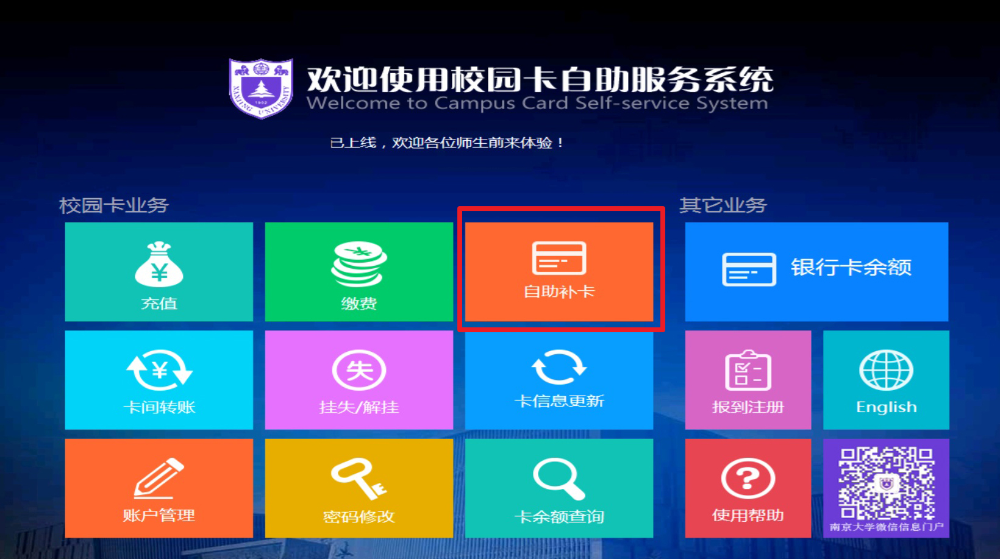

补卡支持“**二代身份证**”、“**校园卡账户**”、**统一身份认证 **三种认证方式。

注意：因**补卡需要收费20元**，如果校园卡里余额不足，需要先进行充值。

校园卡自助服务设备放置地点：

**仙林校区：信息化建设管理服务中心一楼大厅**

**鼓楼校区：综合服务大厅**

****

### 入校后想要更换校园卡照片
如果新生在入学前没有更换照片，那么你的校园卡照片上就是高中学籍的采集照片。在入校以后，如果同学还想更换照片，需要<u>补办校园卡</u>。先将新照片注明学号，发至邮箱：ecardphoto@nju.edu.cn，电子版照片（jpg格式，小于600k）。再到信息化中心前台（需人工办理，不可自助补卡哦），告知学号和邮件地址，更换照片后再补卡（**补办卡需要20元工本费**）。

具体工作时间及地点如下：

鼓楼综合服务大厅信息化中心前台：周一至周五  上午 9:00—12:00   下午13:00—17:00

仙林信息化中心楼一楼前台：周一至周五  上午 8:30—12:00   下午13:30—17:00

## 无卡化支付
校园卡是各位同学在校内各类消费的凭证。但往往，经常有同学走到食堂才发现校园卡落在了宿舍里。为此，ITSC推出了诸多便民措施。自2020年7月校园卡系统全面升级后，除少数功能（如浴室洗澡、宿舍门禁、考勤签到等）外，已基本实现“**消费无卡化**”。

### 校园卡支付码
关注并通过统一身份认证登录微信公众号“南京大学信息门户”—“i 校园”—“**校园码”，**消费时扫描二维码即可。

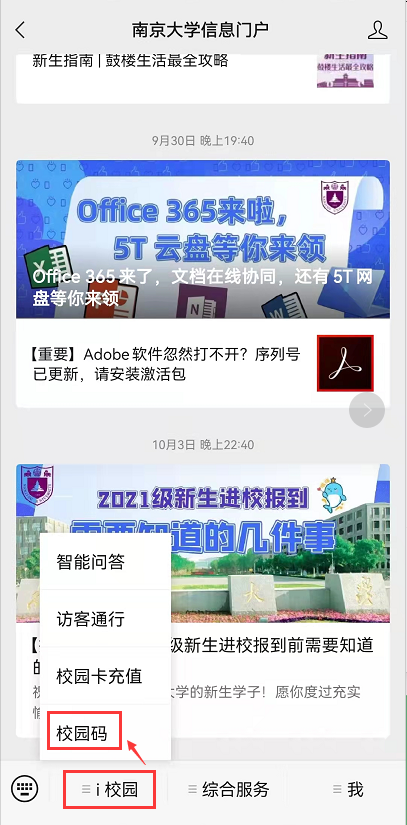

### 微信支付码
打开微信—“我”—“支付”—“收付款”，消费时扫描付款码即可**。**

**注：**

**1. 首次关注“南京大学信息门户”，点“综合服务”，****统一身份认证登录后需等待半小时****，方可使用“微信付款码”消费。**

**2. 暂不支持“支付宝付款码”**

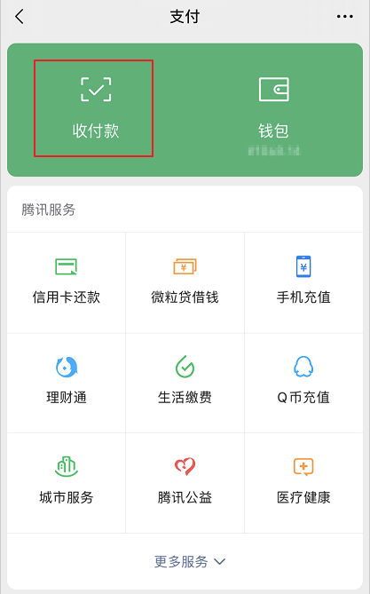

