:::info
本系列节选自南京大学信息化建设管理服务中心（ITSC）的信息中心学生指南（点击原文跳转 guide.nju.edu.cn），在此感谢信息化中心老师的付出！

:::

这是本系列文章的第三篇。我们将总结校园网络的使用。关于往期内容，可以查看 链接。

## 1 关于校园网
### 1.1 接入校园网
目前，南京大学仙林和鼓楼校区学生宿舍区及教学区已实现无线网覆盖。学生宿舍区每人一个网络接口，也可以接网口有线上网。

学校的校园网支持IPv6，带宽可达千兆。

**注意：校园网为学校提供，****而非任何运营商的套餐****，每一个南京大学就读的学生都可以享受便宜且高速的校园网服务。**

_（ITSC没有更新鼓楼校区情况）_

**<u>Step 1 </u>**我们需要使用有线或无线的方式接入校园网：

<strong>使用有线端口：</strong>

在学生宿舍每个人桌子上有一个普天接口，同学们需要自行购买网线插入接口。建议买超五类及以上网线。

<strong>使用无线方式：</strong>

连接到无线信号NJU-WLAN，即可接入校内网络。需要注意，计算机需要设置为DHCP自动获取方式，方法如下：以Windows为例，打开Internet选项，做如下设置

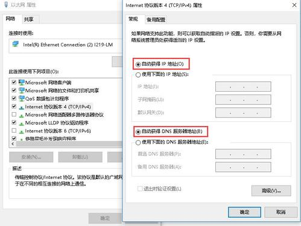

mac OS 也可类似的找到相关设置。

**<u>Step 2</u>** 访问**校外互联网资源**时，我们需要进行网络验证：

默认情况下接入校园网时会打开认证界面，如果没有打开，请在浏览器中输入[http://p.nju.edu.cn/](http://p.nju.edu.cn/)。网络认证系统接入统一身份认证（关于统一身份认证请参考本系列第一篇推文）。

**<u>注意：</u>**接入无线网后，如果不进行认证，仍然可以访问校内网（即nju.edu.cn局域网），此时并不会计费。如果想要访问外网（即百度QQ等），则需要进行认证，此时将按照标准进行计费。

### 1.2 无感知认证
我们可以设置无感知认证来跳过上述的第二步。无感知认证的功能是：进入校园无线网NJU-WLAN覆盖区域或连接到校园有线网后，**无需重复认证登录即可联网**。启用无感知认证功能，可一次认证，解决所有登录困扰。

#### 1.2.1 打开无感知认证
手机（电脑）直连无线信号（NJU-WLAN）或直接连接校园网有线端口后，登录 http://p.nju.edu.cn ，进入后选择“无感知认证”页面：第一行为“当前设备”，点击（变为紫色）即可开启该设备无感知认证。

_（建议ITSC补一张图）_

#### 1.2.2 无感知认证的注意事项
1. 启用无感知认证后，启用了无线网卡的设备一旦进入校园无线区域（NJU-WLAN），**将自动接入，开始计时上网**，可能会**造成较大的网费开销**（现行计费规则每个月20元封顶）
2. 设置无感知认证后，请不要在页面点击退出
3. 不建议设置超过2个无感知设备，以免造成多台设备同时上线，超过并发限制，互相自动下线，出现**设备不停掉线**的情况
4. 如果是通过路由器接入的校园网，在认证页面打开无感知认证，是将<u>路由器设备加入无感知认证</u>，点开启后实现的是该路由器的自动上网，而非同学们需要的手机（电脑）无感知认证。（如果发现设置了无感知认证以后，换了地点没有自动接入，很可能就是将路由器设置了无感知认证）
5. 设置无感知认证后，手机（电脑）自动上网，不再有页面提示余额、即将失效等帐号信息，如果遇到不能上网的情况，可以去信息门户里查看一下网络余额。

### 1.3 网络资费计算与充值
> 学生标准上网服务：按使用时长计费。每月前 180 小时免费，超出部分，费率为每线程 0.20 元/小时。
>

目前，学校正在测试四线程并发上网，**测试期间按照如下方式计费**：

:::warning
每月前180小时免费，超出部分，每终端 0.20 元/小时。每月** 20 元封顶**。支持**四终端同时在线**。

换句话说，校园网支持四个设备同时登入一个账号，每个月最高20元。

如果因疫情转入网课，校园网的免费时长将增加至360小时。

:::

网费的计算从登录网络认证系统开始计费，在p.nju.edu.cn登出（网页端点右上角“登出”；手机端点“退出登录”）后，即停止计时。（退出统一身份认证、关闭浏览器等并不会退出，此期间将持续计算网费）

如您未“登出”认证系统，就关闭电脑，需要注意，电脑是否连接了路由器。**如有连接路由器，可能导致您即使关闭电脑后仍继续计时**。

认证系统仅**在下线时才结算本次在线的网费，并从余额中扣除本次所用网费**。因此如果您长时间在线，一旦下线，认证系统计算本次在线所用网费并扣除后，就可能出现您的网费余额一下少了很多的情况。

同学们登录p.nju.edu.cn看到的“账户余额”并未包含当前在线的时长费用；“已结算时长”也不包含当前在线的时长。

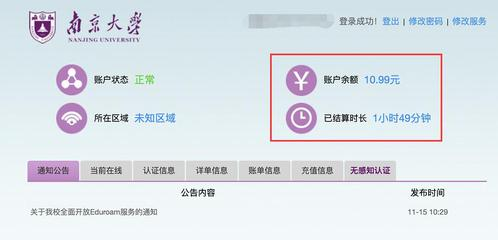

您当前在线情况可点击p认证页面的“**当前在线**”进行查看（这里看到的当前在线的时长尚未计算到“已结算时长”中）。

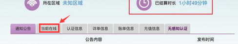

同学们可以在信息门户中给网费充值，方法是<u>南京大学信息门户--综合服务-></u>**<u>网费充值</u>**** **，可通过 校园卡，或微信，或银行卡（指校园卡绑定的银行卡）给网费充值。

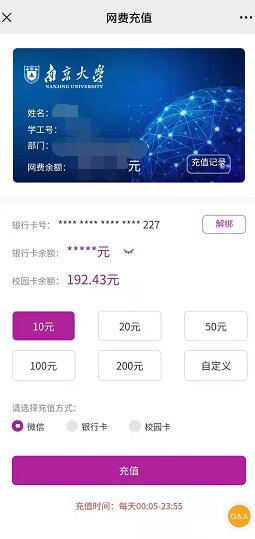

此外，南大还支持网费互转，在<u>南京大学信息门户--综合服务->更多服务--网络服务--网费互转</u>处，可将本人上网帐号中的全部或部分余额，转给其他师生的上网帐号。

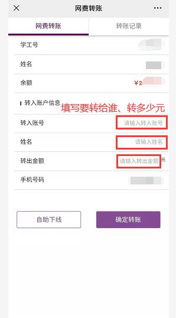

在使用网费互转时需要注意：

1、本人**网络账号在线时无法进行网费互转**，请先点击“自助下线”。

2、如手机正在用本人网络帐号上网，请断开WLAN，改用数据上网，否则无法转账成功。

### 1.4 多终端在线
目前，<u>学校支持四终端在线（测试阶段）</u>。每一个设备都可以通过上述方式接入校园网。

需要注意，网络计费方式以终端为单位，**网络账号的总时长，为****每个设备的在线时长之和****。**例如：今天您电脑上网了20小时，手机上网了8小时，则您今天上网总时长为28小时。所以如果发现每天上网时长超过24小时也不必感到惊讶。

如有设备同时在线，首次进入P认证时会提示您：

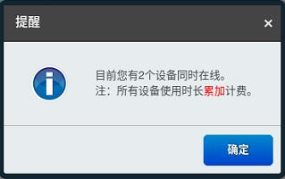

当设备同时在线数量超过并发数（即4个终端以上）时，最先接入的网络终端将被下线。

### 1.5 设备保持
**<u>功能：</u>**设置在线保持后，在您上网账号**超出**并发在线数限制时，该设备不会被自动下线，将一直保持在线（可选择“本次登录保持”或“永久保持”）。

**<u>设置办法：</u>**登录 [https://p.nju.edu.cn](https://p.nju.edu.cn/)  选择“当前在线”，选择设备，“在线保持”处点击开启（变为紫色）即可启用。

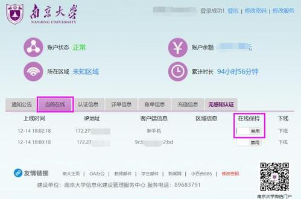

### 1.6 网络报障
如重启路由或电脑无效，请联系ITSC报障： **89683791**** （每天8：00-19：00）。**

或扫下面的二维码进行在线报障（“服务类别”请选择“网络故障报修”）：  

我要反馈

或者，关注微信“南京大学信息门户”后点这里：“我”、“我要反馈”，如下图：

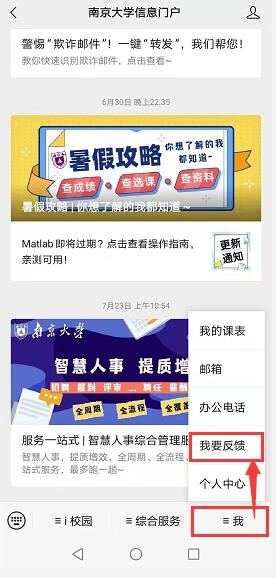

也可以登录“南京大学”APP，在“服务”页面、选“i校园”、“我要反馈”，即可在线反馈或报障。

## 2 关于Eduroam
### 2.1 什么是Eduroam
 Eduroam（education roaming）指全球教育科研机构无线网络漫游联盟的无线漫游服务，目前已覆盖全球80多个国家的教育科研学术机构。该联盟的大学或机构只需原单位开通Eduroam账户，即可在全球Eduroam联盟内实现无线网络接入的漫游服务。目前国内已有_300多（ITSC是200多所）_所大学或科研机构已加入并开通了eduroam服务，如北京大学，复旦大学，中科大，上海交大等学校都已接入了该系统。详见 [https://www.eduroam.edu.cn/list.jsp?urltype=tree.TreeTempUrl&wbtreeid=1004](https://www.eduroam.edu.cn/list.jsp?urltype=tree.TreeTempUrl&wbtreeid=1004)。

换句话说，**如果你去Eduroam会员校，就可以使用Eduroam接入南京大学的校园网漫游服务（即在别的学校也可以接入南京大学校园网）**。外校来访的师生也可以通过该功能接入自己学校的校园网。

注意，此功能对于南大师生在校内是无效的，在校内请连接NJU-WLAN。

### 2.2 如何接入Eduroam

<strong>我校在编师生访问校外漫游服务</strong>

 我校师生至外访单位WIFI无线网络覆盖范围内，搜寻SSID为”EDUROAM”的无线网络信号后选择接入，上网账号为我校网络账号（用户名：“南京大学网络帐号@nju.edu.cn”，密码：“南京大学上网密码”）。

<strong>来访我校的eduroam联盟成员用户</strong> 经原单位批准已开通eduroam漫游服务的用户，在南京大学校园WIFI无线网络覆盖范围内，搜寻SSID为“<strong>eduroam</strong>”的无线网络信号接入。（如未自动弹出认证页面，则打开浏览器输入 

<a href="http://ep.nju.edu.cn./" data-href="http://ep.nju.edu.cn./" target="_blank" class="ne-link">http://ep.nju.edu.cn</a> ）

上网账号为联盟成员原所在机构的网络账号（“原所在单位上网帐号@原单位域”），密码为原所在机构上网密码”。例如：江苏大学的网络账号名user01，则输入user01@ujs.edu.cn和江苏大学上网密码后，即可无线上网。

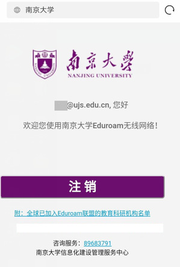

注：首次需认证登录，认证通过后在校内eduroam信号覆盖区域可无感知认证。

## 3 校外VPN
为方便师生在校外**<u>访问南大校内资源</u>**（例如图书馆购买的电子资源、校内服务器等），信息化建设管理服务中心为我校师生两种VPN方式： VPN客户端方式、VPN网页方式。

**VPN客户端  **

优点：接入后可访问所有限校内访问的资源，如电子资源等，还可远程连接限校内访问的服务器等。

缺点：需要安装客户端软件

**VPN网页方式 **

优点：无需安装任何软件，打开浏览器即可使用

缺点：只能访问页面提供的那些校内站点和电子资源，不可远程校内服务器等。

**需要注意，这个VPN是供师生在校外访问校内网使用，并非其他用途。**

### 3.1 VPN客户端
 新VPN服务支持手机端（IOS系统及安卓系统）、Windows系统、MAC系统、Linux系统，您可使用电脑、手机、平板等多种终端在校外远程安全访问校内资源。

**step1、下载客户端软件：**

首次使用时，必须安装客户端软件：通过校外宽带打开 [https://vpn.nju.edu.cn](https://vpn.nju.edu.cn/) 按提示安装客户端（注：校园网无法打开该页面，请在校外使用）

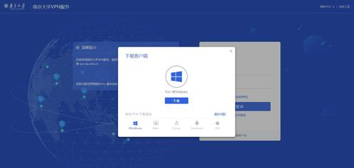

  （ 注：安装过程中如出现防火墙是否允许请务必选允许；手机可能提示需要某些权限，请按提示打开 ）

**step2、首次须设置地址：**

双击桌面上的客户端图标打开。首次需填写服务器地址：  
**     https://vpn.nju.edu.cn   **（注：<u>请注意是https，不是http！</u>） 

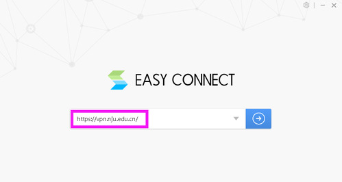

**step3、统一身份认证和短信验证码：**

使用统一身份认证用户名、密码进行认证。自2022年6月18日起，在统一认证成功之后，增加了验证码环节，即会向在统一身份认证平台绑定的手机号发送短信验证码。

_（ITSC未更新本页面短信内容）_

认证通过后，您可看到桌面多出图标：

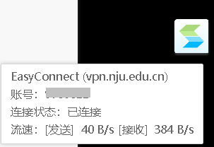

这表明您的电脑已接入校内，可以像在校内一样访问所有校内资源啦，比如，打开浏览器去访问校内网站或电子资源、用远程桌面打开想要管理的校内服务器等。

**注：以下页面仅用于登入、退出VPN，****<u>不可在该页面内搜索或输入网址使用</u>****。您可以关闭此窗口，不会影响VPN的使用。**

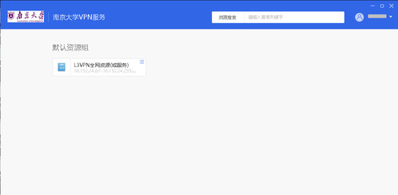

当您无须访问校内资源时，请点击EasyConnect图标，右键退出。

### 3.2 VPN网页端
如您仅需网页访问图书馆资源或财务处等有限校内资源，可采用网页VPN服务。

无须安装客户端，打开浏览器即可使用：输入以下网址

****** **[http://vpn3.nju.edu.cn](http://vpn3.nju.edu.cn/)

 通过统一身份认证后，就可以看到限校内访问的网页资源：

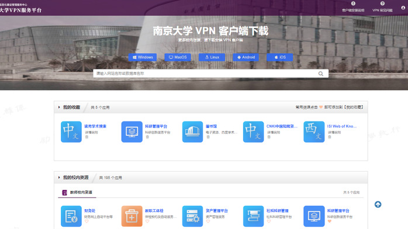

  

注：只能点击vpn3页面上提供的所有链接，方可vpn进校访问，自己输入的其他网址无效。

小贴士：

1、可模糊搜索电子资源

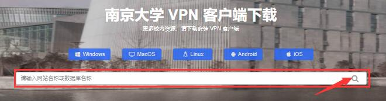

2、点击资源名称下方的❤，即可将常用资源添加到“我的收藏”，方便您再次使用：

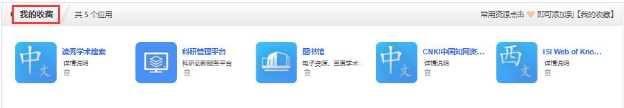

### 3.3 关于VPN的问题
ITSC的老师整理了VPN服务的常用问题与解答，我们在此列举如下：

<strong>在家里上网、看视频，登录学校VPN会不会更快些？</strong>

VPN可以让大家从校外访问校内网络资源，在校外访问普通校外资源，只要自行上网即可，无需使用VPN。友情提醒，VPN帮您从校外宽带接回校内再访问资源，因此<strong>网速会有所</strong><strong>降低</strong>。当您无需访问校内网络资源时，请主动断开VPN，以免降低您对其他外网资源的访问速度。

<strong>使用VPN客户端出现问题时怎么办？</strong>

<strong>1）</strong>VPN客户端的'地址'，务必填写完整：  <strong>https://vpn.nju.edu.cn</strong>   注意：是 https，不是 http！

<strong>2）</strong>如客户端不断提示：要更新、或会话终止等，建议卸载客户端，暂时关闭防火墙等安全软件，重新安装VPN客户端。（注：苹果电脑请使用safari浏览器下载客户端软件）

<strong>3）</strong>如仍不能正常连接，可尝试使用修复工具，链接<a href="https://itsc.nju.edu.cn/_upload/article/files/df/98/5b7e11034ea297ae2056ef691be4/e3e8abc2-52c5-46ba-952b-7b9ca2363293.zip" data-href="https://itsc.nju.edu.cn/_upload/article/files/df/98/5b7e11034ea297ae2056ef691be4/e3e8abc2-52c5-46ba-952b-7b9ca2363293.zip" target="_blank" class="ne-link">https://itsc.nju.edu.cn/_upload/article/files/df/98/5b7e11034ea297ae2056ef691be4/e3e8abc2-52c5-46ba-952b-7b9ca2363293.zip</a>

注：个别windows用户在卸载、重装、修复仍无效时，可卸载后、安装这个通用客户端试下：

<a href="https://itsc.nju.edu.cn/_upload/article/files/df/98/5b7e11034ea297ae2056ef691be4/cc1ad582-5abf-455f-a888-84149cc5f0a9.zip" data-href="https://itsc.nju.edu.cn/_upload/article/files/df/98/5b7e11034ea297ae2056ef691be4/cc1ad582-5abf-455f-a888-84149cc5f0a9.zip" target="_blank" class="ne-link">https://itsc.nju.edu.cn/_upload/article/files/df/98/5b7e11034ea297ae2056ef691be4/cc1ad582-5abf-455f-a888-84149cc5f0a9.zip</a>

<strong>4）</strong>电脑请在<strong>网络信号好且稳定</strong>的场所使用，并<strong>查杀电脑病毒</strong>，一旦有驱动类病毒，客户端会无法拉起、不能正常使用。

<strong>5）</strong>连接easy connect后，一直显示“未连接”、“连接中”，可尝试更换网络，例如改用手机热点上网。如更换网络无效，建议使用360系统急救箱扫描修复，并重启电脑。

<strong>6）</strong><strong>请勿</strong>在浏览器里设置“<strong>使用代理服务器</strong>”，否则可能造成VPN连通后，收发数据为0、无法上网的情況。浏览器里不能设置自动脚本：SSL VPN暂<strong>不支持</strong>在“<strong>使用自动配置脚本</strong>”的IE代理环境下使用。

如以上办法均无效，请将使用情况及报错页面截图发给 itsc@nju.edu.cn 。

<strong>VPN客户端提示：验证码已发往您的手机。但手机收不到验证码怎么办？</strong>

<strong>答：</strong>如手机未收到验证码，请核对：

1）打开“<a href="https://authserver.nju.edu.cn/authserver/index.do" data-href="https://authserver.nju.edu.cn/authserver/index.do" target="_blank" class="ne-link">统一身份认证管理平台</a>”（ https://authserver.nju.edu.cn/authserver/index.do），确认这里已绑定了正确的手机号：

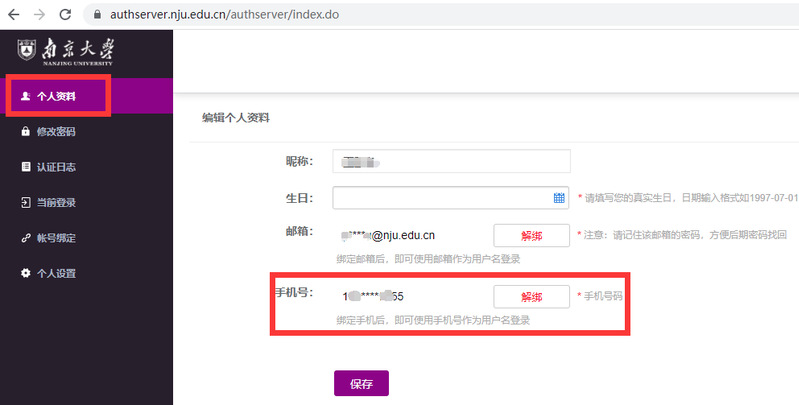

注：如您已绑定正确手机号、但仍无法收到验证码，请解绑手机号重新绑定下，一般即可正常收到。

2）是否退订了【南京大学】统一消息平台发送的短信

如您在2022年7月10日后曾退订过南京大学通知短信（短信号码：<strong>106904000520</strong>），将导致收不到VPN验证码。如需恢复订阅，须OA申请，具体办法请咨询 89683791。

 

