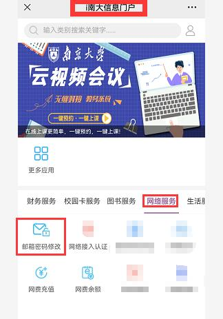
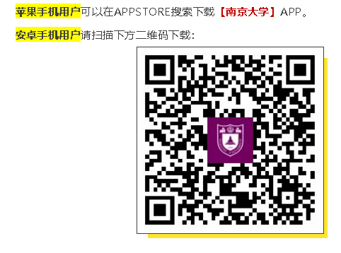
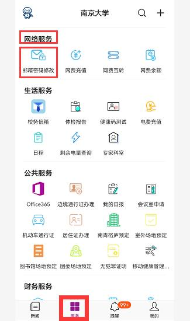
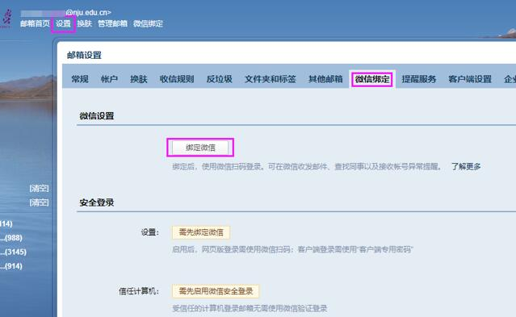
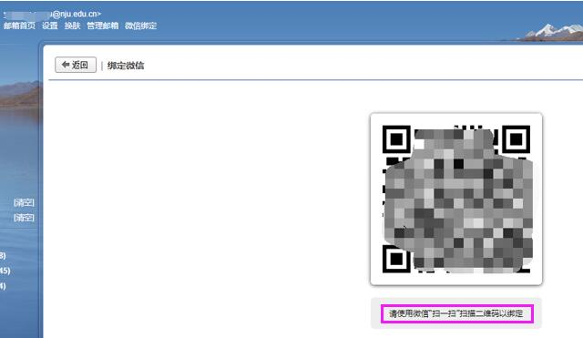
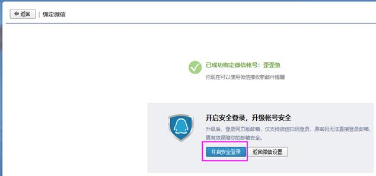
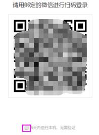
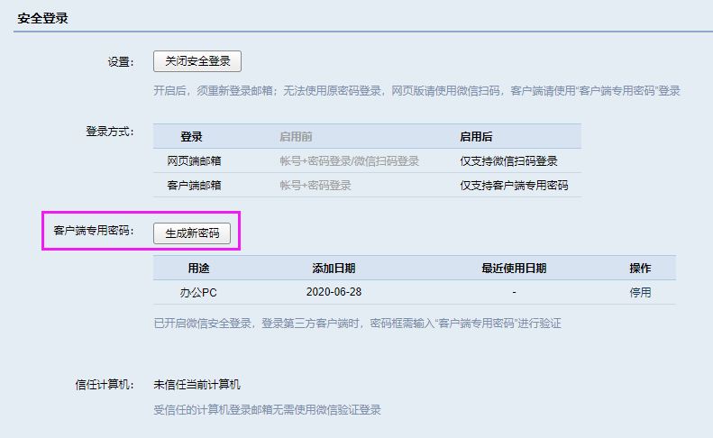

:::info
本系列节选自南京大学信息化建设管理服务中心（ITSC）的信息中心学生指南（点击原文跳转 guide.nju.edu.cn），在此感谢信息化中心老师的付出！

:::

这是本系列文章的第四篇。我们将总结校园邮箱的使用。关于往期内容，可以查看 链接。

## 一 、南大学生邮箱简介
### 1. 什么是南大学生邮箱？如何开通学生邮箱？
:::tips
<u>答：</u>学生邮箱是以smail.nju.edu.cn结尾的教育邮箱。同学们在向老师提问、学术交流以及正版软件或学生认证的使用时，会用到该邮箱。

进校后， 在籍本科生、研究生均已**自动开通**学生免费邮箱账号。打开网页http://mail.smail.nju.edu.cn 即可使用。

邮箱账号名为：学号，初始密码为：身份证号；如非身份证（如护照），则为Nju加全部证件号（18级为Nic加证件号后六位）。首次登录时须修改初始密码。

如你的学号为221234567，那么你的学生邮箱就为221234567@smail.nju.edu.cn

:::

### 2. 学生邮箱可以设置别名吗？如何设置？
:::tips
<u>答：</u>学生邮箱是教育网域名，可以用于学术用途。数字开头的邮箱显得不太正式。我们可以为邮箱取一个别名，换句话说，你可以使用这个别名邮箱向外发送邮件。比如张三的学号为221234567，他通过下面的方式设置了别名zhangsan，那么他以后可以使用zhangsan@smail.nju.edu.cn来向外发送邮件。

目前，南大所使用的校园邮箱依托腾讯企业邮服务，但腾讯邮箱内尚无别名设置功能，故特提供“南大邮箱别名设置平台”。网址为：

 [http://mailm.nju.edu.cn:8080/](http://mailm.nju.edu.cn:8080/)  
注：该“别名设置平台”仅限**校内访问**。

设置办法：    请用自己的学号/工号账户名（南大学生选择@smail.nju.edu.cn后缀）和邮箱密码登录进入“别名设置平台”，点击“账户检查”，可查询或设置邮箱别名。

 **别名一旦设置成功，是不能再修改的**，因此请慎重设置您的别名。

提醒：南大邮箱将来可能用于您发表国际论文或申请出国读博等正式用途，例如作为您发表学术论文的通讯邮箱等。因此建议您选取邮箱别名时，可参考下建议：

[1]《学术邮箱命名指南》 [https://zhuanlan.zhihu.com/p/80767310](https://zhuanlan.zhihu.com/p/80767310)

[2]《How to Create a Professional Email Address》  [https://blog.hubspot.com/marketing/professional-email-address](https://blog.hubspot.com/marketing/professional-email-address)

[3]  [http://www.ecampustours.com/for-students/college-planning/applying-for-college/creating-a-professional-email-address.aspx#.YRoETYgzZPY](http://www.ecampustours.com/for-students/college-planning/applying-for-college/creating-a-professional-email-address.aspx#.YRoETYgzZPY)

:::

### 3. 忘记密码了怎么重置？
:::tips
<u>答：</u>可以关注南京大学信息门户或南京大学APP。

**办法一、通过微信门户：**

**1、打开微信，扫码关注“南京大学信息门户”：**

**2、****进入“南京大学信息门户”后，点击“综合服务”**（首次使用需要通过统一身份认证）；

**选择“网络服务”，点击“邮箱密码修改”，验证过身份后，即可修改。**如下图：

**办法二、通过“南京大学APP”：**

**1、在手机上，下载、安装“南京大学”****APP**

2、打开APP，点击“学工号登录”，使用统一身份认证进入APP，页面下方选**“服务”**，向下滑动，找到**“网络服务”，点击“邮箱密码修改”**。（注：每次修改前均须再次验证身份）

:::

### 4. 邮箱的有效期是多久？
:::tips
<u>答：</u>目前政策是可用至**毕业后一年内**，毕业生邮箱仍然保留。之后长期不用或毕业已久的邮箱有可能被清理。如有清理或政策变化，我们会提前邮件通知，请经常登录邮箱查看。

:::

## 二、防诈安全提醒
虽然说邮箱有层层安全过滤，但不法分子总喜欢利用邮件传播病毒木马等盗号程序。多数钓鱼邮件会借“系统升级”“账号异常”“邮箱扩容”“邮箱冻结解冻”等名义，引诱客户输入邮箱账号密码操作，从而完成盗号。如何防范呢？

1）**<u>不要轻易点击邮件中的超链接！</u>**如果收到一些内容中带有超链接的邮件，且点击跳转后要求您输入邮箱、身份认证、银行卡的帐号和密码时，建议用户提高警惕，不要轻信！收到此类邮件时，尽量避免点击邮件中的网络链接。

2）如收到带附件的邮件，**<u>请查看发件人邮箱地址</u>**，如并非常用通信人的常用邮件地址，请提高警惕：不要下载邮件中的附件！

3）**<u>凡收到需要用户提供帐号、密码、及个人信息的邮件，请勿回复！</u>**

4）认真检查发件人的地址是否可信。例如我校邮件后缀@nju.edu.cn，如果学校发送重要通知，发通知信的邮箱后缀只可能是@nju.edu.cn，除此之外均非官方通知；同时学校通知也会在学校官网公示。您也可电话信息化中心89683791咨询、核实。

5）不在不安全的场所（如网吧以及其它公共电脑）登录邮箱。

6）建议您在电脑上及时更新电脑补丁并安装杀毒软件，定期对电脑进行杀毒

**<u>如邮箱已有异常（例如：收到大量退信；收到腾讯邮箱提醒有异地登录；或自己在网页版邮箱右上角“自助查询”查看“登录查询”、“发信查询”，发现有不是自己的操作，等等）：</u>**

第一时间处理：

1、扫描电脑进行杀毒、查杀木马等操作，加强邮箱账号的安全保护

2、确保设备安全的情况下，立即修改邮箱帐号的密码。然后邮箱绑定微信、**开启微信安全登录**

3、检查邮箱是否有非本人设置的自动转发和收信规则，若有，建议取消或删除相关设置。

也可联系我们（89683791）或 将可疑邮件转发我们：mailreport@nju.edu.cn

### 5. 为什么要推荐开启微信安全登录？如何开启？
:::tips
<u>答：</u>开启微信认证登录后，网页登录时需微信扫码、客户端登录则使用专用密码。因此即使邮箱密码被盗，盗用者也无法进入您的邮箱。安全级别大大提高。

办法是：

1）绑定微信（绑定后即可在微信里收发邮件、并可收到邮件异常登录等安全消息的微信消息推送）：登录邮箱网页版，点左上方“设置”，“微信绑定”，点击“绑定微信”；用微信“扫一扫”扫描出现的二维码，即可自动绑定。

2）点击“开启安全登录”。“开启”即可。

3）常用计算机上，登录邮箱时，在二维码下面，可以勾选“5天内信任本机，无需验证”，然后再扫码进入邮箱。如下图：

注：开启安全登录后，可在 “设置”、“微信绑定”里，生成客户端专用密码。登录客户端时请使用该密码登录邮箱。  

:::

## 三、学生邮箱客户端设置
部分同学可能会使用Foxmail，QQ邮箱等支持POP3/IMAP等软件客户端来收发邮件，这时需要设置收件和发件邮箱服务器。具体可以参考[https://itsc.nju.edu.cn/1a/8f/c21586a334479/page.htm](https://itsc.nju.edu.cn/1a/8f/c21586a334479/page.htm) 和 [https://work.weixin.qq.com/help?person_id=0&doc_id=431&helpType=exmail](https://work.weixin.qq.com/help?person_id=0&doc_id=431&helpType=exmail)

Mac端可以参考[http://service.exmail.qq.com/cgi-bin/help?subtype=1&&id=28&&no=1000863](http://service.exmail.qq.com/cgi-bin/help?subtype=1&&id=28&&no=1000863) 

此外，南大邮箱还支持**<u>自助查询</u>**（收信查询、恢复误删邮件、查看是否被盗用、发信查询），**<u>撤回已发送邮件</u>**（支持撤回 24 小时内发送至南大邮箱、腾讯企业邮箱和QQ邮箱的未读、已读邮件。对方使用客户端收取到本地的邮件无法取回），**<u>举报垃圾邮件</u>**（点击“举报”，选择类型并勾选“将发件人加入黑名单”），**<u>设置黑白名单</u>**，**<u>邮件群发</u>**等功能，具体可以在浏览器中输入[https://itsc.nju.edu.cn/96/2e/c21475a497198/page.htm#4](https://itsc.nju.edu.cn/96/2e/c21475a497198/page.htm#4)查看。

