关于学生邮箱的具体介绍，请在 ITSC 的常用问答中浏览：[https://guide.nju.edu.cn/faq/main.htm](https://guide.nju.edu.cn/faq/main.htm)，这里主要说几个容易出问题的地方

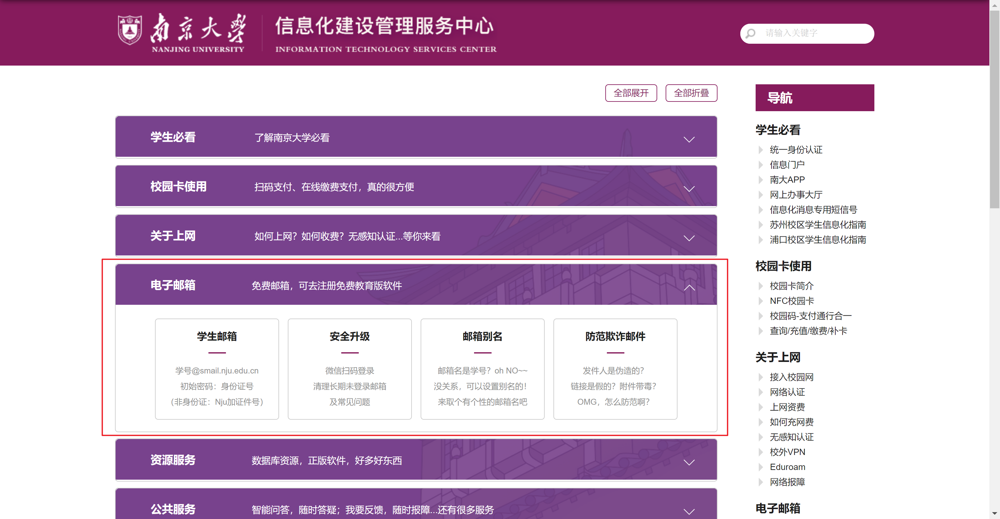

#### 一、如何开通邮箱？
入学后自动开通，一般新生需要等到 **8 月下旬**才能使用邮箱，邮箱账号是 `学号@smail.nju.edu.cn`，注意后缀是 **smail.nju.edu.cn**，初始密码为身份证号

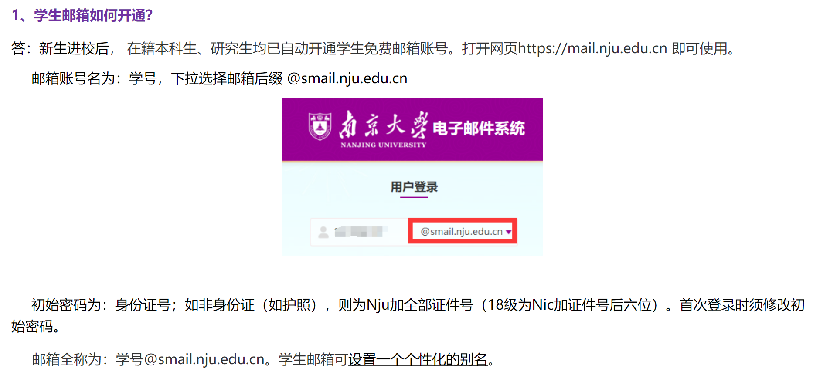

#### 二、为什么要使用学校邮箱？
首先，你当然可以使用个人邮箱，只是在一些正式场合更适宜使用学校邮箱，同时有的教育优惠也需要使用学校邮箱认证。为了让你的邮箱更显正式，你还可以给自己的邮箱设置一个别名：[【南大学生邮箱设置别名办法】](https://itsc.nju.edu.cn/1a/90/c21586a334480/page.htm)设置之前也请记得先浏览一下该网页下方的**邮箱名的选取建议**

> 顺便，以防有些人不知道，发邮件是不需要相同后缀的，即你用任意一个邮箱都可以给所有其他邮箱发邮件，163 邮箱可以给 qq 邮箱发，qq 邮箱也可以给 smail.nju 邮箱发！！都是随意互发的！！
>

#### 三、如何更方便的收发邮件？
有时候，我们并不会经常上线查看新邮件，但又担心会错过新邮件，此时就可以使用客户端软件（如foxmail、outlook等）收发邮件。客户端可以把多个邮箱平台集成在一起，非常方便地实现收发邮件。下面具体介绍如何设置

1. **首先，在网页上登录南大邮箱，按图中顺序点击，确保方框内的选项已被勾选上，下面的收取选项自行决定勾选（笔者是全选）**

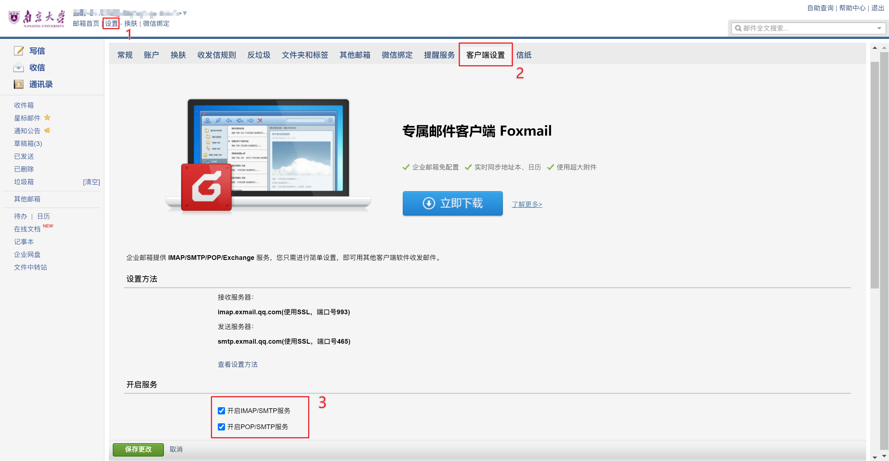

2. **打开你的邮箱客户端（foxmail、outlook、网易大师邮箱等），这里以 Windows 自带的邮件（Outlook）为例，其他客户端步骤也差不多**
    1. 点击设置（齿轮）-添加账户；在跳出来的“建议的账户”自行输入南大邮箱账号——学号@smail.nju.edu.cn；选择电子邮件提供商：IMAP/POP 都可以，点确定以后就先不要动了

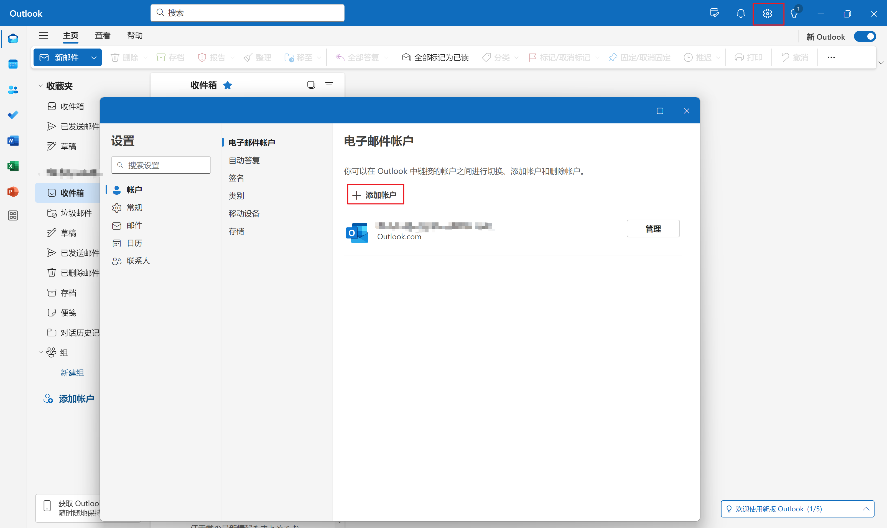

    2. 回到南大邮箱界面，选择微信绑定，点击生成新密码->复制客户端密码，用途自己随意输入

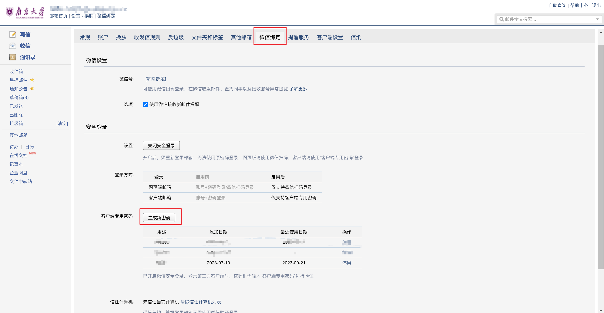

    3. 再回到 Outlook 添加账户的界面，在剪头所指的位置粘贴刚才复制的客户端密码

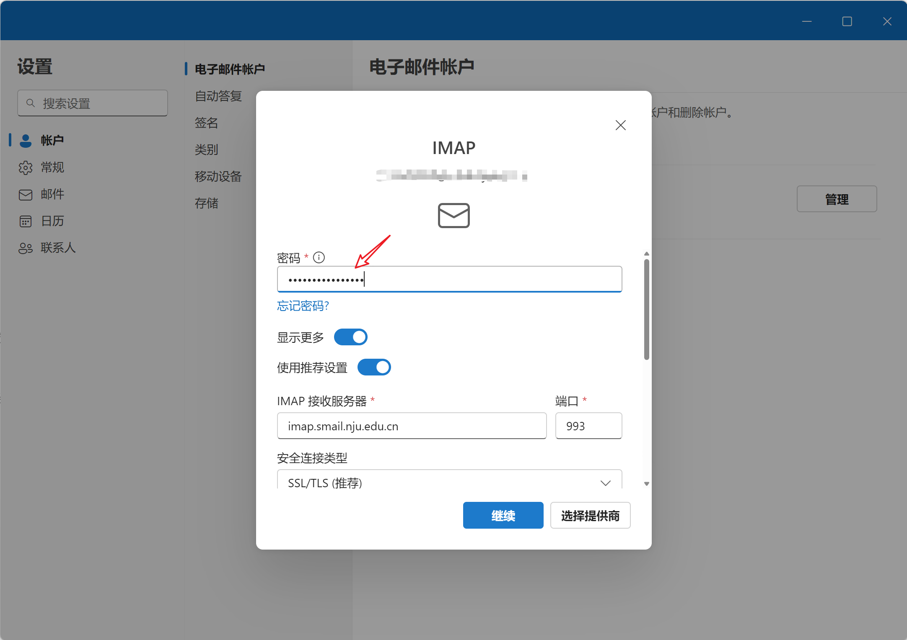

    4. 再回到南大邮箱，参照“客户端设置”-“设置方法”（方框内），将 IMAP 接收服务器、SMTP 发送服务器的相关设置填好（我这里默认是错的），SMTP 密码不用管默认和 IMAP 密码相同，记得端口也要确认一下（我这里 SMTP 的要改），确认无误后点击继续，然后就完成了

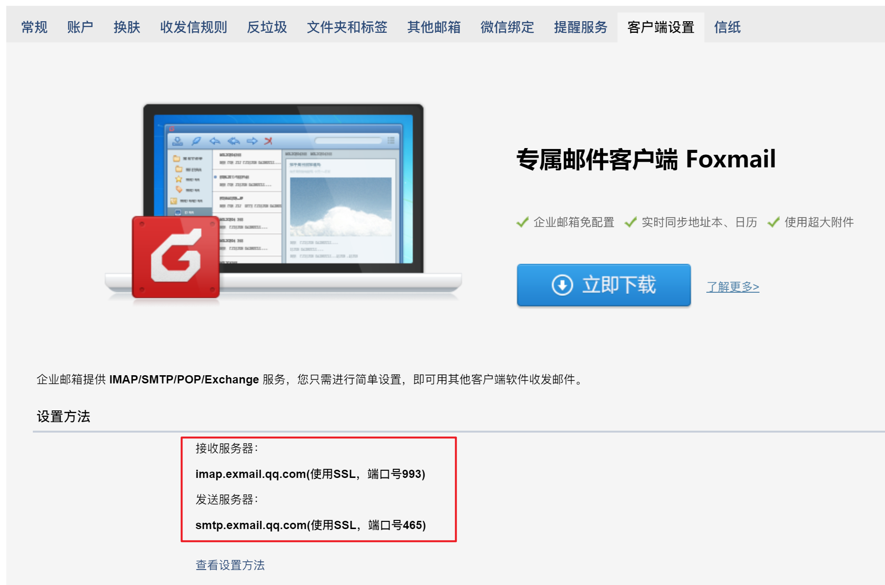

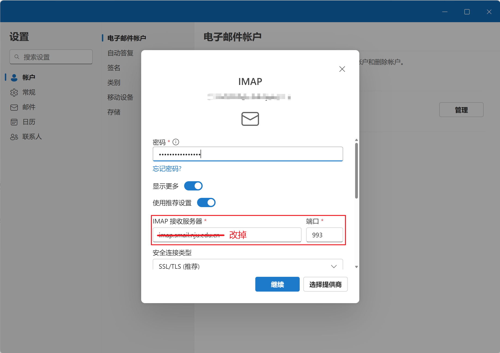

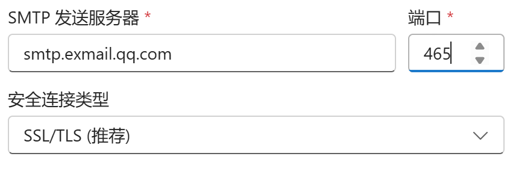

3. **你可以将自己的所有邮箱统一添加到一个客户端，还是非常方便的**

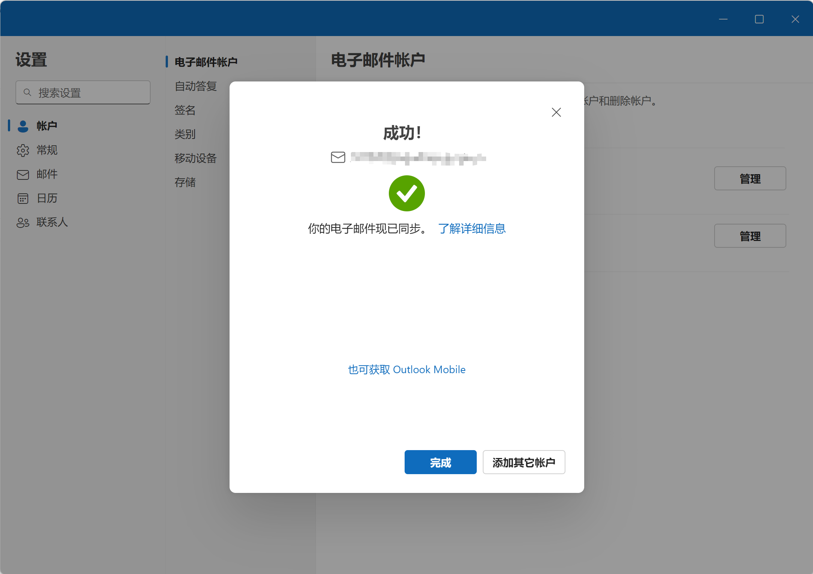

> 注：foxmail添加学校账号时可以先选择账号为腾讯企业邮，微信扫码登录；手机端 qq 邮箱添加时，也可以先选择腾讯企业邮，微信登录——这两步的前提是，你的邮箱已经开通了微信扫码登录，不知道如何开启请访问[https://itsc.nju.edu.cn/96/2e/c21475a497198/page.htm](https://itsc.nju.edu.cn/96/2e/c21475a497198/page.htm)
>
> 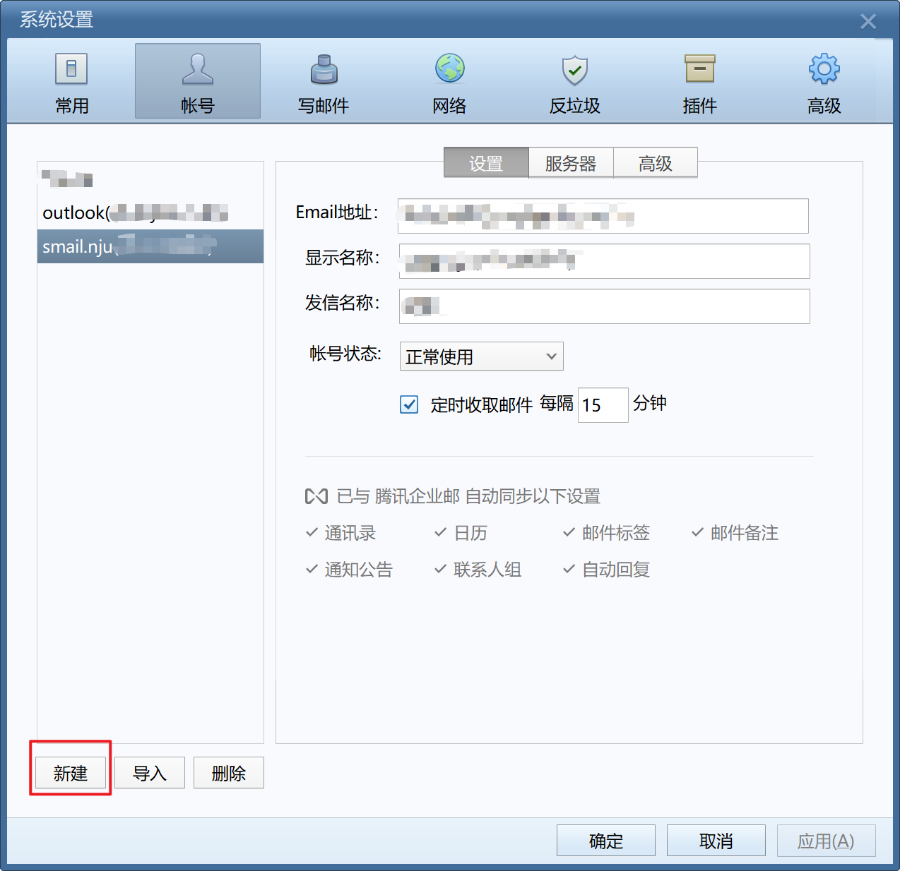
>

