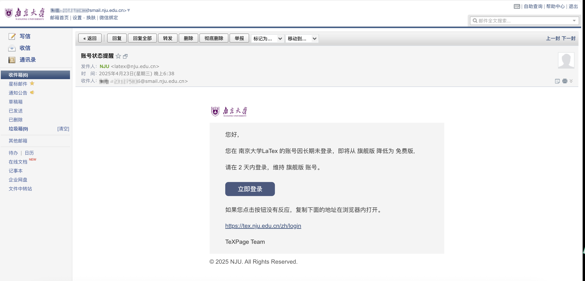
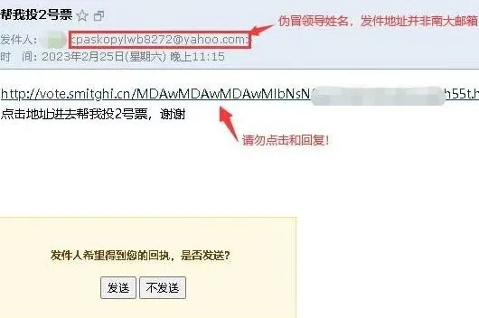
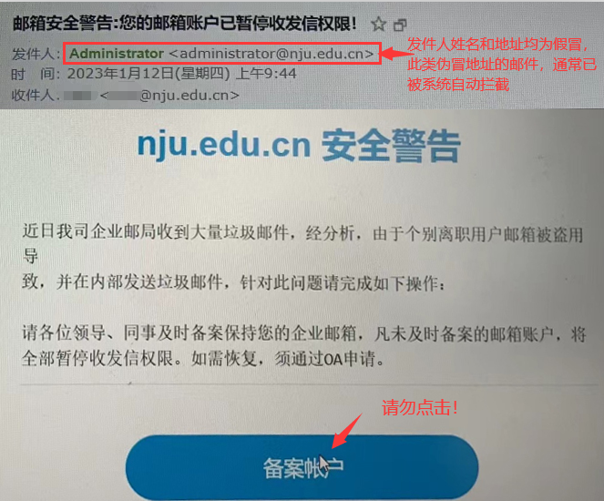
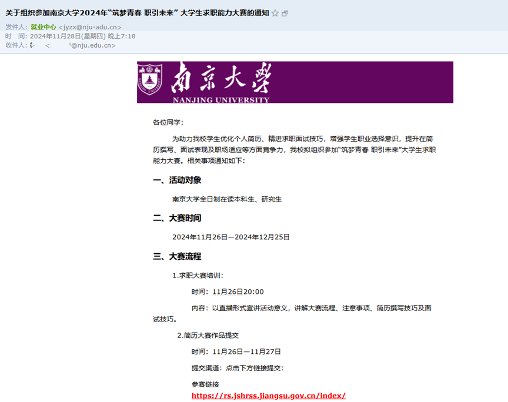
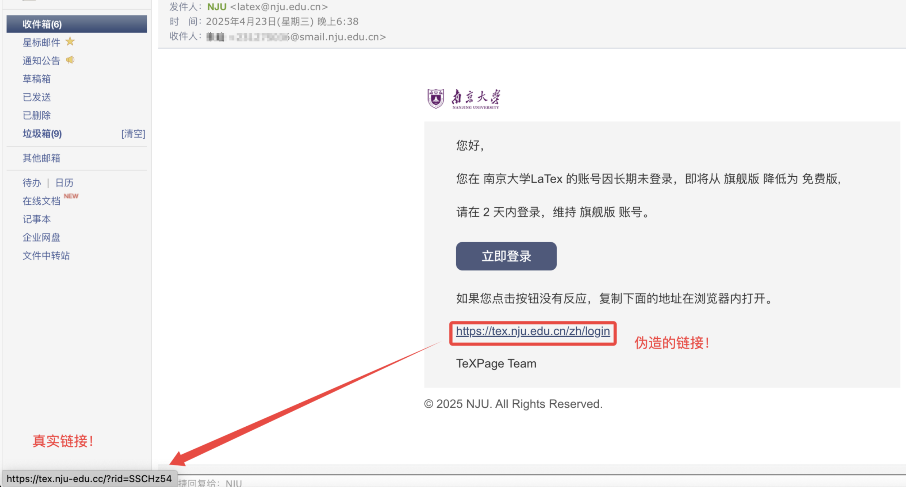

### 前言
作为一名大学生，正确地使用电子邮件是一项基本的技能。本文主要介绍学生邮箱反诈知识。

### 从邮件结构看反诈要点
一封邮件的结构，大体包括：

+ 邮件头
    - **发件人**（包括发件名称，和发件域名）
    - 时间
    - 收件人
+ **正文**
    - **链接**
    - 文本
    - 图片
+ **附件**

一封小小的邮件往往**“危机四伏”**，需要各位小蓝鲸用火眼金睛**谨慎识别**，下面我们从邮件的各个组成部分，科普一封**诈骗邮件**可能露出的蛛丝马迹。

****

#### 发件人
发件人信息包括**发件昵称**和**发件域名**。

+ **不要轻信发件昵称（显示名）！**
    - 由于**发件昵称**可以随意设置，因此**不能作为任何的权威证明！**

:::success
**注意！**近年来，部分教师邮箱被黑客盗取凭证以发送钓鱼邮件。发件人名称可被伪装，许多邮件客户端默认**隐藏完整发件人信息**。打开链接或下载附件前，要展开并核实**发件人完整邮箱地址**。

:::

+ **谨慎甄别邮件域名！**
    - 通常，南京大学的老师会通过`@nju.edu.cn`的邮箱联系你，在各院系的教师主页往往可以查询到老师使用的**邮箱地址。**各部门也都有自己的**域名地址。**可以通过**域名**识别一些低级的**诈骗邮件**

:::color4
**注意****！**由于邮件地址可以被**伪造/盗取**，即使邮件域名正确也不能**掉以轻心！**

:::

    - 
    - 

#### 链接
对于邮件反诈，最重要的一条**基本原则**是**不要点击来历不明的链接。**

+ **不明链接不要点！认准**`**nju.edu.cn**`**！**
    - 如果邮件收到了**学校通知**，强烈建议去学校相关网站**查询通知，对齐信息，**或**咨询辅导员**。
    - 收到社会招聘等信息，也同样强烈建议**去公司官网**查询、比对相关公告。

+ **超链接显示的链接可伪造！认准实际链接！**

:::success
**注意：**即使超链接显示为完整网址，其实际指向的地址也可能不同（例如这里：[南京大学本科生院](https://grawww.nju.edu.cn/)）。

点击链接前，要将鼠标悬停在链接上，查看实际目标地址。

:::

+ **如不慎点入陌生链接，谨慎提供个人信息**
    - 在**南京大学，**最重要的个人身份认证就是**统一身份认证**，一定要保护好自己的**账号、密码**，**谨慎再谨慎！**

:::info
**注意！**判断网站真伪，关键要看网址域名是否为**官方地址**。网站外观易于复制仿造，不能仅凭**外观**就轻易相信。

（nju变njv，nju1，nju1）

nju.edu.cn变nju.com，nju.top

综合类：p.nju.edu.cn变成login.njv.com等

:::

#### 正文诈骗话术
许多**钓鱼邮件**会有一些典型的话术，以**操纵心理**，让**小蓝鲸**陷入慌乱而落入**诈骗**的圈套。在这里总结一些常见的话术。

##### 紧迫
+ _“您的统一身份认证账号即将过期！请点此链接续期！”_
+ _“请于24小时内点击此链接，否则您的邮箱将被注销！”_

##### 贪婪
利用人们的贪婪心理，让你以为天上掉馅饼。

+ _“恭喜您！您在我们公司抽奖活动中赢得了100万美元，请尽快填写您的银行账户以便发放奖金。”_

##### 恐惧
通过威胁、制造风险感，使受害者因害怕损失或惩罚而被操纵。

+ 话术特点：
    - 声称你违法、欠费、账户异常、面临惩罚等。
    - 放大后果：“马上冻结账户”“承担法律责任”。
    - 让人感到必须马上解决才能避免灾难。
+ 常见表达：
    - “您的账户已被锁定，请立即验证。”
    - “您涉嫌洗钱活动，请配合调查。”
    - “如果不按要求操作，您的名誉和财产将受损。”

##### 好奇
激发受害者的好奇心或窥探欲，让人忍不住点击或回复。

+ 话术特点：
    - 提供模糊的、刺激的线索，引诱点击。
    - 内容往往涉及秘密、八卦、敏感信息。
    - 故意留下未解答的问题或惊悚的暗示。
+ 常见表达：
    - “这是关于你的重要消息，请点击查看。”
    - “你绝对想不到的事情发生了！”
    - “这里有一段你的视频，快看看。”

##### 信任
冒充熟人、权威、组织等博取信任，使你主动配合。

+ 话术特点：
    - 使用看似正规或熟悉的身份、标识、邮件格式。
    - 假扮领导、同事、朋友、银行、警察、税务局。
    - 让你觉得对方是可信赖的人或机构。
+ 常见表达：
    - “我是你老板，请帮我处理一笔紧急转账。”
    - “我是某某银行客服，请验证您的信息。”
    - “我是你朋友，用这个新号码联系。”

#### 附件
**邮件附件是“bat”、“msi”、“exe” 、“cmd” 、“msp”格式的，请特别注意**。

以上提到的拓展名格式，都是**可执行文件**或**脚本文件**，在 Windows 系统上可以直接运行，执行任意代码。一旦打开，它们可能：

+ 安装**恶意软件**（如木马、勒索软件、后门）。
+ **窃取你的账号**、密码、文件或监视你的操作。
+ 加入僵尸网络、发起攻击。
+ 加密你的硬盘然后**勒索**赎金。

:::color4
**注意！**有的恶意程序可能伪装为`document.bat`或`setup.exe`等“人畜无害”的名字，诱骗你点击。请谨慎。

:::

可能你的电脑没有显示**拓展名**，可以按[这篇教程](https://zhuanlan.zhihu.com/p/637215545)调出。

