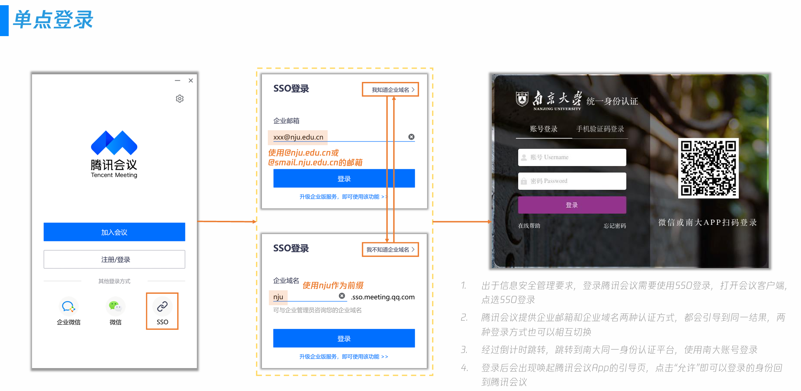
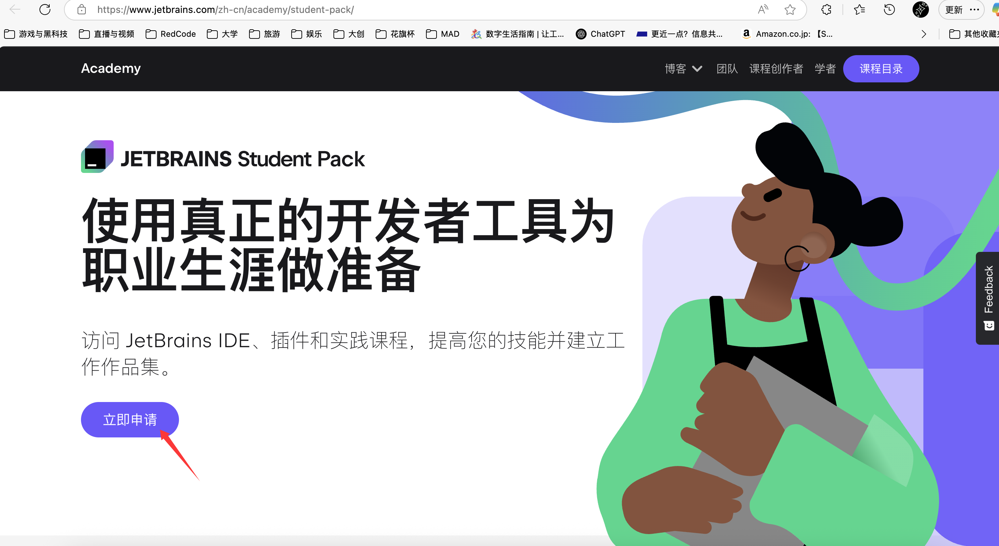
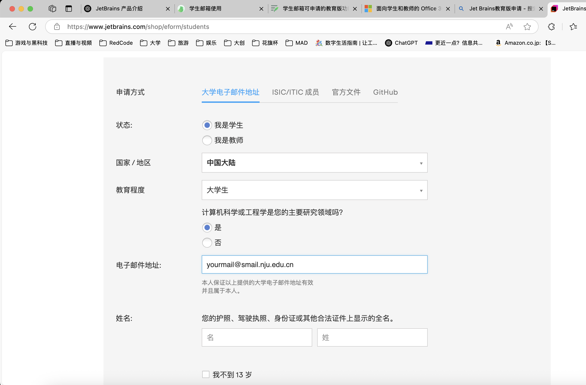
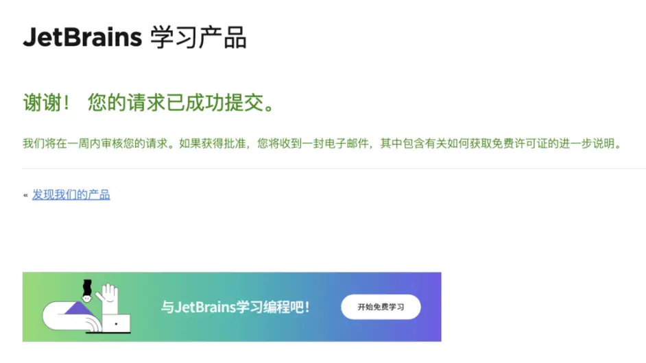
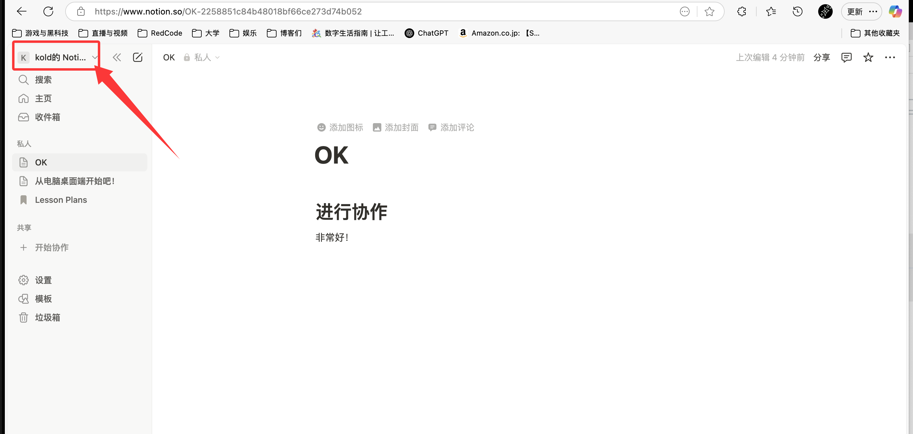
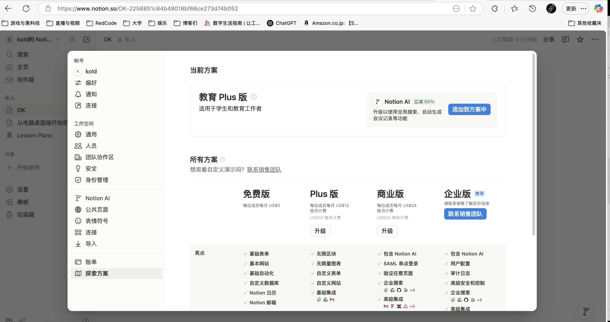
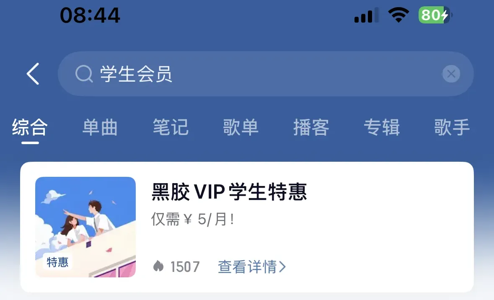

恭喜你成为南京大学小蓝鲸的一员！作为一名大学生，商业世界给了你相当多的优惠和特权——从享受海底捞的大学生89折，到Apple设备的教育优惠，再到专业IDE（集成开发环境）软件的教育版授权等等。通常，这些服务会通过各种各样的方式验证你的学生身份，例如**学信网验证、教育邮箱认证、支付宝学生认证等。**

:::color5
本文主要介绍你的**学生邮箱(**`**@smail.nju.edu.cn**`**)**可以申请的教育版功能。

本文内容仅作建议，具体要求以各平台为准。

:::

### 视频会议服务
#### 腾讯会议
腾讯会议（Tencent Meeting）是腾讯基于21年音视频通讯经验、并依托于腾讯云全球化网络部署出品的简单易用、高清流畅、安全可靠的云会议协作平台。

作为一名小蓝鲸，你可能经常遇到如下场景：

+ 参加[ITSC](https://itsc.nju.edu.cn/main.htm)组织的各类**在线讲座活动**（~~并获得免费上网时长~~）
+ 学生工作中组织、参与线上活动或会议
+ 在线面试、考试
+ 参加**视频会议直播课**

学校购买了腾讯会议的教育版权益，同学们通过SSO登录，可以享受较免费版更加完整全面的权益，有效满足在校各种需求。

关于**SSO登录**，可以阅读这篇官方的介绍：

+ [腾讯会议SSO登录简介 - 腾讯会议帮助中心](https://meeting.tencent.com/support/topic/2183/index.html)

关于**SSO登录**的具体操作，乃至腾讯会议的**详细操作指引**，推荐阅读ITSC的这篇教程，非常详细。

[云视频会议](https://itsc.nju.edu.cn/ysphy/list.htm)

**省流版（摘自**[腾讯会议企业版操作指引 - 南京大学信息化建设管理服务中心](https://oi.nju.edu.cn/_upload/article/files/4b/34/7c33778e4eeb8dcd3f9fea6bc7b0/436fad93-7683-4dfe-b39d-da33461be72b.pdf)**）：**

:::color5
提示：因购买的腾讯会议服务容量有限，在部分高峰时段期间可能会出现“并发会议场次达到上限”的限制，推荐同学们提前预约场次，适当提前开启会议。

:::

### 编程与开发相关服务
#### Github Education系列权益
官网介绍：[Github Education官方申请指南](https://docs.github.com/zh/education/about-github-education/github-education-for-students/apply-to-github-education-as-a-student)

参考阅读：

+ [Github学生认证及学生包保姆级申请指南](https://zhuanlan.zhihu.com/p/578964972)
+ [以学生身份申请 GitHub Education](https://docs.github.com/zh/education/about-github-education/github-education-for-students/apply-to-github-education-as-a-student)

Github学生认证的申请相对复杂，一般需要使用下列材料以确保证明有效：

+ 使用南大邮箱（**@smail.nju.edu.cn**）；
+ 学生证信息（包含入学日期）；
+ 学信网截图；
+ 申请说明（英文简要陈述即可）。

> 据同学反馈，近期Github Education审核愈发严格，通过率不高，欢迎审核通过的同学们投稿相关经验。
>

#### JetBrains
JetBrains 是专注于“智能、高效、全流程”的软件开发工具厂商，从个人开发者到大型企业都广泛采用其产品。

同时，JetBrains也非常豪气地提供了Student Pack：**全免费！**

Student Pack 是 JetBrains 针对在校学生和教师推出的 **免费的全部产品包教育许可证（All Products Pack Educational License）**，可以免费使用 JetBrains 提供的所有桌面 IDE 和工具，**适用于学习和学术研究用途。**

:::success
**提示：**请守护开源精神，不要将教育版软件用于商业用途，也不要借给你的程序员叔叔用来工作

:::

> + **IDE 系列**：IntelliJ IDEA Ultimate、PyCharm Professional、WebStorm、PhpStorm、CLion、GoLand、RubyMine、RustRover、Rider 等；
> + **团队/质量工具**：TeamCity、YouTrack、Space、Qodana 等；
> + **插件与服务**：JetBrains Academy、AI Assistant、Code With Me 等
>

如果你是一个泛计算机类学生，那么你很可能会用到JetBrains的IDE产品如CLion、IDEA和PyCharm。即使不是科班，也很可能遇到需要写个Python脚本来完成某个期末作业等等的场景，也很推荐用。

那么，**怎样获得这样好用的Student Pack呢？你可以查看**[官方指南](https://zhuanlan.zhihu.com/p/560589157)，或按如下步骤操作：

1. 点击[JetBrains Student Pack](https://www.jetbrains.com/zh-cn/academy/student-pack/)，进入**JetBrains Student Pack**的申请主页
2. 点击立刻申请
3. 填写申请信息
    1. **注意：**这里的电子邮件地址需要填写你的`xxx@smail.nju.edu.cn`的邮箱域名。关于****[**南大邮箱**](https://www.yuque.com/keke.sorry/q-a2.0/ofsgzeghamxnvmgu)使用

4. 申请提交成功信息后，系统会跳转到完成页面并提示【请耐心等待人工审批流程的邮件通知】。当填写的信息有缺少或不全的地方，页面会停留在表单，此时请依照表单上的提示信息对应补充后重新提交。

5. 当申请通过后， JetBrains 会**邮件通知**您开通学生授权。如果您此前已经用提交申请所留的邮箱注册过 JetBrains Account 帐号，此时登入[平台](https://account.jetbrains.com/login)就可以查询到学生授权记录。如果还没有注册过，请通过邮件引导完成操作。

:::info
**注意：**每次申请到的免费学生授权有效期是一年！如果到期之后，可以申请续期。

续期申请的入口（[JetBrains Account登录](https://account.jetbrains.com/login)），登入后找到“学生授权记录”，再从“续期链接”进入申请表单。**续期链接要在原先的学生授权到期前几天才会出现，可以续期时系统会发送邮件通知，无需提早申请。**

:::

### 笔记和知识库软件
#### Notion
Notion 是一款集**笔记、知识管理、项目协作**于一体的全能型生产力工具，它支持个人和团队用户，用来写作、管理任务、建立知识库、制作看板、规划日程等，非常灵活、可定制。~~语雀外国版~~

Notion官网：[链接](https://www.notion.so/)

Notion同样也提供了依托**学生邮箱**进行认证的优惠服务！下面介绍步骤

1. 使用你的NJU邮箱进行注册
2. 注册之后，来到你的个人主页，点击左上角的三角，进入我的账户，打开**设置**

3. 点击探索方案，有一个升级到教育Plus版的按钮，点击认证即可。

### 影音设计软件
#### Adobe全家桶
:::info
**注意：南京大学已经购入Adobe全家桶内容，无需以个人身份通过市面上的Adobe学生优惠重复购买。**

:::

**学校**已经为各位小蓝鲸提供了包括WPS 365全家桶、Adobe全家桶，微软Windows操作系统、Office、Visio软件、Matlab软件、ChemOffice、Endnotes等丰富的**正版软件，具体详见下文：**

[南京大学信息化建设管理服务中心 - 正版软件介绍](https://itsc.nju.edu.cn/zbrj/list.htm)

Adobe全家桶安装激活方法[见此](https://itsc.nju.edu.cn/adobe/list.htm)。

:::danger
根据验证系统设定，Adobe安装激活过程中用到的邮箱地址

**是**`**学工号@nju.edu.cn**`**！**

<u>（不是</u>`<u>学工号@smail.nju.edu.cn</u>`<u>的学生邮箱地址！）</u>

验证激活或每年续期失败时，请务必检查该邮箱是否填写正确！

:::

### 娱乐生活软件
#### Apple Music
Apple Music 是苹果公司于 2015 年推出的流媒体音乐服务，曲库丰富，音质出众，UI优雅，对于iOS/MacOS用户吸引力很大。同时，Apple Music也提供了**<u>6元/月</u>****的大学生优惠订阅**_**，**_具体教程：

[获取 Apple Music 学生订阅 - 官方 Apple 支持 (中国)](https://support.apple.com/zh-cn/106008)

Apple Music大学生认证采取UNiDAYS认证，有edu邮箱的话认证十分方便，只需要填写你的**南大邮箱**地址，接收发送的**验证链接**激活即可。

**祝你在南大享受音乐的快乐！**

****

#### 网易云音乐
网易云音乐同样也推出了学生优惠，黑胶会员**<u>5元/月</u>**。

要获得特惠，只需要在网易云音乐APP中搜索**学生会员**，就可以找到办理会员页面。

:::info
**注意：网易云音乐当前仅支持14-22周岁的用户使用学生特惠。研究生、博士生小蓝鲸可能无法使用！**

:::

进入办理会员页面后，进行**学生认证**后，选择心仪的订阅方案即可。

#### 其他音乐软件
其他音乐软件如QQ音乐等，也多有**学生特惠**，可参考本教程操作。

### 学习相关软件
全能扫描王完成学生认证有一年免费会员，到期后可再次进行认证；微信读书完成学生认证有一个月免费会员，邀请同学认证还有10天免费会员；参加本科生院发起的建言献策活动也有机会获得微信读书/WPS的年度会员~~（虽然现在还没到我的账户上）~~

[南哪助手长期接受同学们投稿](https://www.yuque.com/keke.sorry/q-a2.0/gw3phd)

