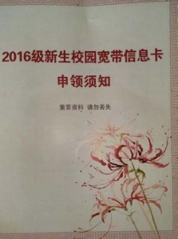
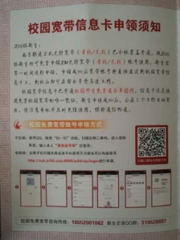
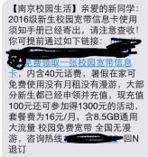
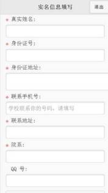
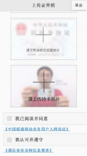
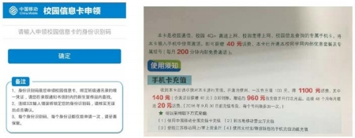
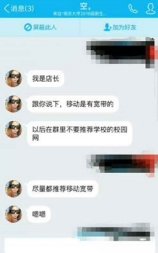
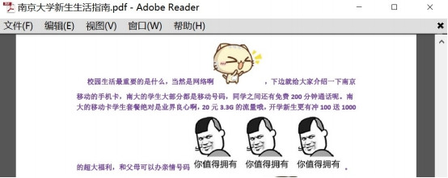
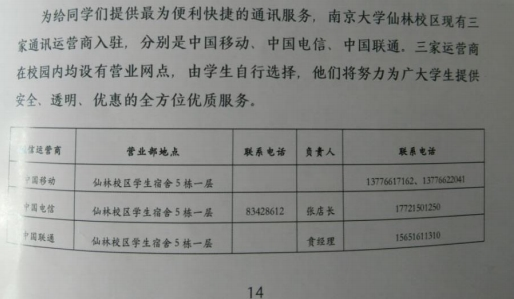

[南哪助手长期接受同学们投稿](https://www.yuque.com/greatnju/q-a/gw3phd#o8osi)

---

首先恭喜各位新同学被南京大学录取！在各位新同学陆续收到南大录取通知书的同时，我们注意到有一些通讯运营商也伺机而动，向新生发放各种广告，其中不少广告**隐****蔽****性**和**诱****导****性**极强。

在此，笔者郑重的提醒大家：除录取通知书信封（有且只有一封）**内****部**的内容外，任何贴附在录取通知书信封上或单独邮寄的材料/物件，均**与****南****京****大****学****官****方****没****有****任****何****关系**。任何“校园信息卡”“宽带信息卡”“校园宽带卡”**短信**、相关纸质/在线宣传**材****料**、接到的来自南京的办卡**电话**的均为**运营商的****广****告****和推销**，与南大无关。

每个新生**默****认****开****通****校园网**，在南大公共区域无线上网以及在宿舍上网**不****须****要****额外办****理****任****何****业****务**。

**校****园****卡**是一张身份证大小的校园一卡通，是南大人在校内通过身份认证（宿舍楼、图书馆门禁等）、进行日常消费（食堂、浴室、超市等）及办理各项业务的基本凭证，开学报到（8月27-28日）时在自己院系报到处**领****取**，**无需****单****独办****理**，**无****需****任****何****费****用**。

那些所谓“信息卡”就是普通**手机****SIM****卡**，**不****是****南****大****上****网****所必****须**，更不会有什么校方通知和实用信息通过那些渠道发布。诸如“80%以上新生选用”、“大部分同学都已领取”等措辞均为宣传文案，有违反广告法第七条第二款的嫌疑，且相互证伪，况别人选择什么运营商和你自己的选择没什么关系。

某运营商宣称“大部分官方通知和辅导员通知会通过飞信发布”，事实上飞信已几乎不再被作为通知发布渠道。开学时辅导员会收集每个人的联系方式，不存在使用某种手机卡便于联系辅导员和同学的说法。

新生收到的各种广告虽然有一些是正规运营商的，但是具有很强的**诱导性**，刻意弱化**运营****商****信****息**和**手****机****卡**的本质，刻意强调“南京大学”“校园”“宽带”“上网”“大多数人选择”“专属”“信息卡”“与老师联系”“免费”，部分新生误以为这就是开学需要领取的“校园卡”或是认为这是南大上网所必须的“校园上网卡”而盲目办理。例如有一位手机为iphone5s移动版（A1518）的新生误办理了中国某通的所谓“宽带信息卡”（**实****质****是手机****卡**），其实根本无法使用。

面对这类广告请大家务必谨慎并提醒自己认识的南大新生注意。目前已知运营商的广告形式有：

#### 1. 中国某通
中国某通营业厅向新生发送短信，短信正文中完全隐藏联通的相关信息，申领网页（其实是手机卡申领实名登记页面）中也一直到了上传身份证照片页面（也就是最后一步）才有很小的联通字样展示，在此之前用户已经被要求输入了身份证号、身份证地址、姓名、院系等个人敏感信息，极易造成个人信息泄露，且该页面编写简陋，安全性差。

联通营业厅还通过EMS向考生寄送的所谓“校园宽带信息卡”申领通知，并建立所谓“2016级新生交流群1”。

#### 2. 中国某动
中国移动营业厅通过兼职人员在各新生群拉人、寄送“校园信息卡”申领通知、发送申领提醒短信等方式发布广告。

移动营业厅组建名为“南京大学2016级新生群”的QQ群在群发给新生的广告短信中以为新生答疑为名吸引新生加入，实则向进群的新生推销移动手机卡和宽带业务。

据部分加入该所谓“新生群”的16级新生反映，该群群主为移动营业厅店长，群内总体答疑水平相对较差，主要业务目标为引导办卡或办理移动宽带业务，存在疑似恶意诱导及客观上严重误导新生的情况。例如，某新生问及报到流程时，竟被回复说要去食堂门口报名。

另外，在部分新生群出现的一个名为“南京大学新生生活指南.pdf”的群文件也是移动的广告：

正如入学须知中所说，南京大学学生可自由选择使用哪家运营商的服务。手机卡的选择主要考虑自己**手机支****持****的网****络****制式**以及自己**实际的****使****用需求**。当然，如果确信自己收到的是正规运营商的广告并认为其资费标准和套餐内容**正****好****符****合****自****己****的****需****求**，也**符****合****自****己****手****机支持****的****网****络****制式**，可以选择办理。在此提醒一点，对于套餐内容需要认真阅读宣传材料，特别注意**边****缘**、**角****落**的信息及各种**小字**，认真理解套餐细节，比如**套餐中的****流****量是****不****是只送若干个****月**，送的话费分多少的月返还，是否有最低消费等等，避免**误解套餐内****容**而误判。

校内有三家运营商的营业网点，笔者更建议大家到校后具体研读多种套餐政策，去营业厅或临时办理网店详细咨询，选择适合自己的需求以及符合手机制式的手机卡自行办理相关业务。

  

  

在南大使用校园网即可满足大家的日常上网需求，校园网的使用与各运营商无关。关于校园网的说明及资费可参考：

[新生校园网使用指南](https://www.yuque.com/greatnju/q-a/vqnpi0)

如果大家经过实际体验，对网络确有更高的需求，可以开学之后经过详细了解各运营商的宽带业务，根据自己的需求选择性办理。

**友****情****提****醒****：****在开****学报****到****办理****相****关手****续时****，****务****必****紧****跟****从****自己****院****系报****到处****开****始带着你走流****程****的****那****位****学****长****/****学****姐****，****不要****认****错****人或****跟****丢****。****去****年****出****现****过运****营****商****工****作****/****兼****职****人****员****冒****充****校****学****生****会工****作****人员****或****院系迎新****志****愿者以带****新****生走报到****流****程为名带****新****生去办理****电****话卡，****办****理完****电****话卡****将****新****生****抛****在****一****边走****掉****的****情****况，****影****响极****差。**

P.S.各位新生的联系方式及个人信息不是由南大招办泄露的，请大家放心。至于具体是谁泄露的呢，相信聪明的你已有自己的答案。

如果对自己收到的广告信息有疑问欢迎来咨询群确认。

---

[南哪助手长期接受同学们投稿](https://www.yuque.com/greatnju/q-a/gw3phd#k6p5Y)

