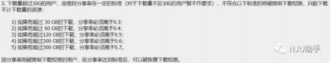

[南哪助手长期接受同学们投稿](https://www.yuque.com/greatnju/q-a/gw3phd#o8osi)

---

写在前面：紫荆已于2020年11月26日24点起关站。

小 百 合 BBS， 许 学 姐 ， 黄 黄

- [ ]  

**提示：全文很长。**

开始是一个简单的紫荆介绍，之后是许学姐写的紫荆教程，**十****分详细，使****用紫****荆****时****，**** ****有问题看了再****问**。最后的故事，是紫荆的由来。

紫荆，是一个用爱堆砌起来的地方，紫荆是胡同写给他的领导“紫荆MM”的一封情书，“你的心里，刻着我的名字”。

 

## 一 、紫荆是什么？
简单来说，紫荆站是南大人专属的网络资源的 PT（Private Tracker ）站点（需要在 连接到校园网的状态下登录），资源丰富（包括但不限于电影电视剧学习教程软件安装 包），**你****想****要****的****紫****荆****都****有**，下载速度稳定时大概在 **11M/S**** **左右，比百度网盘什么的快到不 知道哪里去了。

 

## 二 、紫荆使用教程
### 1. 网址及注册
紫荆的网址为：**zijingbt.njuftp.org**。在连接到校园网的状态下可以登录，目前没 有校外登录的渠道。需要注意的是，并不需要在 p.nju.edu.cn 登录也可以使用紫荆。 注 册时需要用到学校邮箱，每个南大的学生都拥有一个南大的邮箱，登录网址为： mail.smail.nju.edu.cn，初始密码是 18 位身份证号，账号名为学号。请确保学校的邮箱 可以登录使用，密码将以邮件形式发送至校园邮箱内，如邮箱不能正常使用请联系校园网 络中心。如在注册上和以后的使用上有问题出现，可加群 809554906，或站内联系现役管 理组成员。

欢迎关注“**NJU**** ****紫****荆****站**”微信公众号，平时有服务器停机或 free 活动的时候会通 知。

### 2. 界面
网页最上面的状态栏，记录着你的使用数据。“活动 做种 下载”指的是你当前使用 utorrent 软件进行做种（seeding）的数目和下载（downloading）的数目；“分享率”即 为“上传量”与“下载量”的比值，过低会有惩罚措施，这会在后面提及；“积分”可以 用来竞猜，也可以在分享率低于 5.0 的时候兑换上传量，积分的增长主要依赖于当前做种 的数目，你在 utorrent 上 seeding 的种子越多，每小时获得的积分也会越多，但没有详细 的计算公式，注意这个过程不需要有人下载你正在做种的种子。

首页即为“种子页”，第二页应为“添加候选”（上传员及以上成员为“上传”）， 可以添加你想上传的种子由管理员审核；“候选区”可以看到有哪些种子待审核；“排 行”可以看上传量、下载量和积分的前一百名；“博彩”可以用积分进行体育赛事或是热 门事件的竞猜，这也是紫荆积分目前最主要的功能；“规则”可以看到紫荆的使用规则； “常见问题”则是用户遇到问题时应首先查看的页面。

种子页可以看见这样的界面，最左边三列数字分别是该种子的当前做种数、当前下载 数和历史下载数，种子名称为中英文双语，名称为蓝色的种子是 Free 种，即不计下载量 的种子，其中文名后也会出现“不计”的字样，而绿色的“200%”指的是上传量以 200%计 算。

最后三行分别是文件大小、种子添加的时间以及上传者。

### 3. 下载及上传
**不****要****用****迅****雷****！****！****不****要****用迅****雷**** ！！不要 用迅****雷****！****！**

对于 windows 用户，使用紫荆右上角提供的客户端即可。（注意下载第一个种子的时 候修改一下下载路径，因为默认是下载到 H 盘，如果没有 H 盘会下载失败）。

对于 MacOS用户，可以使用 μTorrent Mac 0.9.0 及以上，或者 Transmission 1.50 及以上版本。

下载时，只要在网页上下载完种子，拖入 utorrent 客户端即可下载。下载速度稳定 时大概在 11m/s 左右。若存在下载失败或没速度的问题，先检查自己的客户端版本是否过 高，其次在紫荆上查看一下那个种子的“当前做种数”是否为 0。若依旧解决不了请加群 咨询。

上传是 pt 的灵魂。在我个人看来，玩 pt 其实就是一个分享的过程。只要你下载完 种子，种子的状态会从“下载中”变为“做种中”（seeding），此时 只要你不关闭 utorrent，那么如果别人也正在下载这个种子，便会从你这边下载，你即可获得“上传 量”，在下载量大并且做种的人少的时候获取上传量的速度更为明显。比如说，一个 20g 的种子，只有你在做种，那么别人完整地下完这个种子，你就能得到 20g 的上传量（如有 上传翻倍的情况则为 40g），前提是你自始至终挂着 utorrent。（关闭 utorrent 以后，再 次打开 utorrent 依然可以继续做种，只要你文件位置不变，种子文件未删除）Pt 的本 质，其实就是 p2p，没有中心服务器来存储所有文件，这是和网盘的本质区别。

所以，有人在上传别人才可以下载。为了鼓励上传，各个 pt 站都会有强制的分享率 要求，限制所谓的“白嫖”行为，紫荆也不例外（见下页）。因此为了满足分享率要求， 在电脑空闲的时候，尽量挂着 utorrent。

### 4. 如何经营好自己的账号
首先来看一下紫荆关于分享率的规定：

所以保持较高的分享率是保证自己能一直使用紫荆的关键，不然会受到不小的限制。 你可以在刚使用紫荆的时候，下载一些热门的、当前下载人数多的资源，免费（不计下载 量）的资源更好，然后挂着 utorrent 刷上传量。平时使用的时候多注意自己的上传量是否 不足，不足的时候重复以上步骤。 或是自己添加候选，上传种子，那么可以获得该种子 前期下载时绝大多数的上传量。 若有余力，也可以加入上传员行列，获取上传量更加快 速。

### 5. 关于招新
紫荆目前上传高质量、有用资源的同学还是不够多，所以欢迎有兴趣的同学在熟悉紫 荆的使用之后，贡献自己的一份力量。

紫荆招上传员的标准是：在不犯大错误的情况下累计上传三十个种子。达到要求的同 学随时可以私信管理员“张扬”和“冰墨魂”询问。上传员可以参与管理组的日常讨论， 获取其他 pt 站的邀请，免审核做种等等。

P.s. 紫荆对于上传的种子质量要求较高，一般可以在六维、北邮人等其他 pt 站搬 运。如没有这些网站的账号，而有兴趣加入上传员的同学，可以在熟悉 pt 规则后，在分 享率不低于 2.5，下载量不低于 200g 的情况下，在紫荆右上角“细语”里的“广场”发 “求邀请”的细语，我们会酌情考虑给予邀请。

如有其它问题，欢迎加入紫荆 PT 咨询群二号机（一群已满）：809554906 咨询。

 

## 三 、紫荆的故事
沿着胡同，去寻找那灿烂盛开的紫荆花

**来 源：南京 大学小 百合 ****BBS**** ****Girls**** ****信区**

**发信人 ：ImSorry**

****

### 一、缘起
ZiJing PT，本是那个叫胡同的孩子，一晚一晚，一行一行 code 出来的。现在，胡同 打算把紫荆换成 Nexus 系统了，即将告别现在这个有点简单，甚至有点简陋，却平淡温 馨，拥有无数可能性的系统，总是有无限感伤。

他们总是问：胡同啊，你为什么给 PT 起名字叫紫荆呐？每到这个时候，胡同就总是装 死。胡同装死的时候是很可爱的，于是大家就一直不晓得紫荆 PT 的来龙去脉。直到我来了 很久以后，才像拼图一样，渐渐从胡同那里，了解到紫荆 PT 背后的故事……

如今，马上被 7 月毕业信风带走的我，只想趁着时光还记得，把胡同和紫荆的故事记 录下来。这个安然平静的故事不需要被传唱，我只是不希望他们被遗忘——一个叫做胡同 的孩子，为了一句承诺，搭建了这样一个校内资源共享的平台，并许以爱人之名。

胡同把心上人叫做领导，我们则代称为紫荆 MM，因为她同紫荆 PT 的诞生，有着直接 的关系。

 

### 二、只要你说，我就去做
你信不信青梅竹马的感情，终能冲破现实的种种阻隔，最后有情人终成眷属？开始 我

是不信的，后来，我信了。

因为胡同和紫荆 MM吗？是的，因为胡同和紫荆 MM。

可是在很长一段时间里，胡同小朋友是非常纠结的，因为紫荆 MM身在遥远的浙大，他 们无法像普通的情侣那样，朝夕相对。于是胡同变得格外的体贴，他总是希望，即使隔着 不算遥远却无法轻易相见的距离，他也能够让紫荆 MM觉得，自己始终在她身边，而紫荆 MM的任何愿望，只要胡同做得到，他总是尽力去帮她实现。于是，仿佛盘古睁开了双眼望 着鸿蒙大地，紫荆 PT 一切的开始，皆源于一声温柔的叹息：“下载很不方便呢，胡同，怎么办呀……”

为领导解决困难、帮领导实现愿望是胡同存在的目的，胡同小朋友的心 pia 的跳了一 下子，他挠挠头，一秒钟之后说：“不如这样，我搭设一个站点，你想要什么资源，只要和 我说，我都会传上去。”

“只为我存在的站点吗？”紫荆 MM这样笑盈盈的望着胡同问。

胡同涨红了脸，没回答。

紫荆 MM甜蜜的像化掉了一样，低头默默笑了一会儿，问：“是不是学校里的很多人都没有特别好、特别快、特别稳定的渠道下载资源啊？”

“恩，之前有很多 FTP，但是从 FTPer 毕业走了之后，剩下的已经寥寥无几了。”胡同老 老实实的回答说，“其实现在公网比较流行的 PT 形式，我觉得可以拿来借鉴，搭设校园 PT，内网 V4，外网 V6 访问，人越多，速度和稳定性越可以得到保证 balabalabala……”

看着胡同一提到技术性问题就滔滔不绝的样子，紫荆 MM侧起头，含笑望着胡同讲话的 样子。

 

### 三、上帝说，要有光
那段时间，胡同每天晚上都会熬夜到 2 点以后，coding，testing，coding。高清群里 很多人都见证了胡同的努力。

终于有一天，胡同对大家说，可以了。大家那种雀跃的心情，是很难表述出来的。 这么久以来，我们都是在外网、公网、其他教育网 PT 上刷资源，突然之间，属于我们自己 的 PT 诞生了，那种感触，让每个人的心里都激动不已。

新站点叫什么名字好呢……大家都望着胡同，他赋予了这个站点以生命，我们像舞狮 人，在内心的锣鼓喧天中，等待胡同画龙点睛。 胡同那边沉默了很久很久，忽然才发过来 一个网址：[http://zijingbt.njuftp.org/](http://zijingbt.njuftp.org/)[ ](http://zijingbt.njuftp.org/)大家开心的忙着进去开荒拓土，谁都忘记了问 一句为什么。

胡同，为什么叫做 zijing？

 

### 四、云之彼端，约定的地方
那年，南大开展捐树造林活动，捐助人可以写上祝福和心愿。 胡同看到通知，一路跳着跑到一个安静的角落，拨通了给女朋友的电话。

“我们这里可以捐树啊，捐树的时候，还可以写上纪念语呢！ ”“哈？那不是说很多很多年以后，我们还可以一起回来看我们现在一起种的树？啊啊，胡同，我们捐吧，捐两棵， 你一棵，我一棵，要并排种在一起的。”胡同的女友低低的说，“等咱们老的快走不动的时 候，再牵着手一起来看。”

“什么？最后一句胡同没听清。

“没什么。”胡同的女朋友嘿嘿一笑，撒娇说：“胡同，都有什么树啊？我们种一棵橡树， 种一棵木棉，好不好？ ”胡同呃了一声，说：“你等会。 然后胡同又一路跳着跑回公告栏 前，气喘吁吁的给女朋友念，你听着啊，有银杏、紫叶李、国槐、石榴、水杉、玉兰、紫 荆、红叶石楠球、红枫、紫薇、广玉兰、杜英、高杆、女贞、桂花、香樟、鹅掌楸、雪 松、樱花、棕榈、栾树、银杏、夹竹桃、法桐、金桂、腊梅……恩，就这么多……不过好 像，额，没有橡树和木棉……”

“这么多品种都没有，你们学校真是不解风情。”胡同的女朋友有点不满。

额，胡同赶紧安慰她说，“要不雪松？玉兰也很漂亮啊，红枫，桂花……栾树是那种笔 直而高的树，你肯定喜欢。” MM只是在电话那头嘟着嘴不说话。胡同挠挠头，从头到尾又看了一遍树种列表，安抚她说：“其实种什么不重要，纪念语是我们自己写的哦。”

“胡同，我们种两棵紫荆吧。”MM轻轻的说。

领导具有最高决定权，领导让种什么咱就种什么。胡同也嘿嘿的笑，又陪着小心问： “不过，怎么想起种紫荆啦？”

“紫荆是香港的市花啊。”

“嗯。”

“香港是 1997 年回归的啊……”

“嗯。”

“笨！”

“嗯。”

“那年暑假，你是对谁表白的呀？”

胡同一时间突然心潮汹涌，当初的种种羞涩和紧张清晰恍如刚刚发生一样。他和MM都没有说话，他们就默默的握着手机站在那里，甚至能听到彼此的呼吸声。

后来，胡同对我说，当他们问我新PT站的名字的时候，我突然想起了我们的约定，一 起种下的紫荆。

 

### 五、紫荆 MM
我刚来的时候，就听闻到了紫荆MM的名字。但只是听说，从来没有见过。

不搞编程有闲暇的时候，胡同也会像挤牙膏一样同我们聊天。省略号是他最犀利直接具有致命杀伤性的武器，有时候我们打了好几条好多好多字的消息出来，胡同就只用一个省略号回复。

“胡同，”我们逗他，“你对紫荆 MM也敢用省略号吗？”

胡同小盆友就不说话了。 我们哈哈的笑，打趣他。说胡同怎么敢对领导使用省略号呢，必须要言不厌繁啊。也不对，有人出来反对，“说不定胡同就用省略号忽悠紫荆 MM上钩呢，可怜的紫荆 MM，就这样被胡同骗了。”

胡同也不反驳，继续回复我们一串省略号。

“胡同，紫荆 MM在紫荆 PT 吗？”“领导是无处不在的。”胡同这样回答。 有一段时间，胡同言必称领导，我们旁敲侧击刑讯逼供了很久才揣测出来，领导貌似指的是紫荆MM。可是领导在紫荆PT的ID到底是什么，胡同是打死也不说，打得半死不活也不说。

那天，他发了一首歌：浙大女研究生 429 - 我要的飞翔(试听版)，还默不作声的置了顶，大家几乎笑的透不过气来，七嘴八舌的问是不是紫荆 MM的寝室唱的，胡同再次习惯性装死，一言不发的跑掉。直到现在，这个资源一直处于置顶的位置，我想，除了胡同（在 领导的指示下）可能取消置顶，这首歌将成为紫荆 PT 的传说……

 

### 六、我的心里，刻着你的名字
其实很多事情我们决定了开始，却无法决定过程和结果。 对于胡同来说，zijing 也 是这样。

zijing 原本只是这样一个地方，见证着他和紫荆 MM的感情，表明他的心迹，就是说，只要紫荆 MM想要，无论什么，无论多么辛苦，他都会给。 紫荆的花语是矢志不渝， 胡同在给这个小站起名字的时候，是希望每个人都会在这里找到幸福和快乐。 一直以来， 胡同都像呵护一个婴儿一样呵护紫荆 PT，我们也一样。可是随着紫荆 PT 慢慢长大，我们 终于还是无法仅仅满足于将它定位于一个简单到甚至有点简陋的，却平和温馨，充满无数 可能的小站。 这就像当初，胡同和紫荆 MM本想用两棵并肩而立的紫荆树纪念他们的爱 情，却阴差阳错的，因为学校方面的缘故没有种成紫荆，最终诞生了紫荆 PT。

其实无论以何种方式纪念，重要的都不是纪念的载体，而是我们的心意。 也许有一 天，我们跳过大学的溪流和坑坑洼洼，回头的时候发现紫荆 PT 已经不在了；也许紫荆一直 在，可是我们回首的时候，却同此刻她刚刚建立的时候相差太远，远的我们都有点认不出 了。

可是，我希望，紫荆 MM和胡同的故事会一直在，而不是变成某种游离模糊的传说。 **因为这里，是一个****用****爱****堆****砌起来的地方。**

****

故事看完了，最后，关注“**NJU****紫荆****站**”微信公众号，我们一起，打开新世界的大 门。

 

来 源 |

小 百 合 BBS 许 学 姐

整 理 | 黄 黄

---

[南哪助手长期接受同学们投稿](https://www.yuque.com/greatnju/q-a/gw3phd#k6p5Y)

