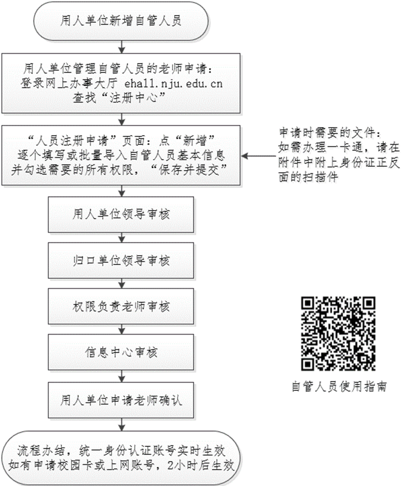

近期，有一些需要暑期提前入组的硕博同学联系小破手，想知道入校、上网、吃食堂等的方法，小破手在此整理了一下，希望可以帮助到大家。

# 第一步：申请成为“自管人员”
  
我校大部分服务系统已对接“统一身份认证”（例如：上网认证系统p.nju.edu.cn、微信公众号“南京大学信息门户”、“南京大学”APP、网上办事服务大厅ehall.nju.edu.cn、OA办公系统等），可以用同一个账号名、密码登录。<u>对于提前入组的同学来说，你的账号名就是“自管号”。</u>

# 申请流程

# 常见问题
1. 如何找到这位负责人？

询问师兄师姐、老板或者行政老师均可

2. 想要实体卡怎么办？

如申请校园卡权限并审核通过，虚拟卡开通。如需实体卡，请至信息化中心或者鼓楼服务大厅办理（请提前于微信信息门户或者南大APP充值20元工本费）。

3. 初始密码是什么？

身份证号全部

4. 绑定手机号

2022年9月起，统一身份认证登录时需要手机短信验证（半年内只需一次手机短信验证）。因此，必须提前在统一身份认证平台绑定手机号。

:::info
办法一：微信关注“南京大学信息门户”->“我”->“个人中心”，设置手机号。  
办法二：安装“南京大学”APP->“学工号”登录->“服务”，搜索“认证账号设置”，设置手机号。  
办法三：已登录过“南京大学信息门户”、南京大学APP者，可电脑端扫码进入统一身份认证平台设置。

:::

# 第二步：申请各类权限
## 校门通行权限
校园卡不代表有“通行权限”。在申请自管账号时，申请人勾选“通行权限”并审核通过，才拥有校门通行权限。

##   
消费权限
在注册中心申请了校园卡后，消费权限已默认开通。

###   
消费方法一：校园码支付
关注并通过统一身份认证登录微信公众号“南京大学信息门户”—“i 校园”—“校园码”（或长按“南京大学”APP，点“校园码”），校内消费时扫描二维码即可。

###   
消费方法二：微信支付码
首次关注微信服务号“南京大学信息门户”，点击“综合服务”，统一身份认证登录后需等待半小时，方可使用“微信付款码”消费。

打开微信—“我”—“支付”—“收付款”，消费时扫描付款码即可。

:::info
暂不支持“支付宝付款码”

:::

##   
上网权限
师生在南京大学校内上网，分两步：

1. 通过有线或无线方式连接上校内网络； 
2. 如果没有自动弹出认证界面，可在浏览器中输入网址`http://p.nju.edu.cn`，认证通过后才可以访问校外网络。

自管人员上网资费为每自然月30元。

