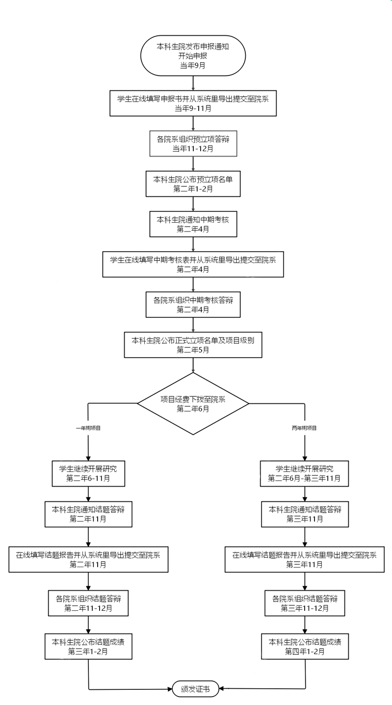

**注释：**

1.本科生院发布申报通知后，可在创新网站及时查看申报教师提供的课题。

2.每学年在**4月份**集中组织一次中期考核，中期考核正式确定立项名单（项目级别、经费额度）;在**4月份和12月份**组织结题考核，请各项目组及时关注。

3.如有项目变更（包括成员、导师和课题内容变化和项目终止等情况），请到创新网站下载变更申请表（需要说明理由和经费使用情况），填写后签字盖章交本科生院备案。

4.江苏省和教育部创新项目申报根据当年的教育部高教司理工处的通知为准。

5.联系电邮：**shuna@nju.edu.cn**，南京大学大学生创新训练计划网站：**http://desktop.nju.edu.cn/**

