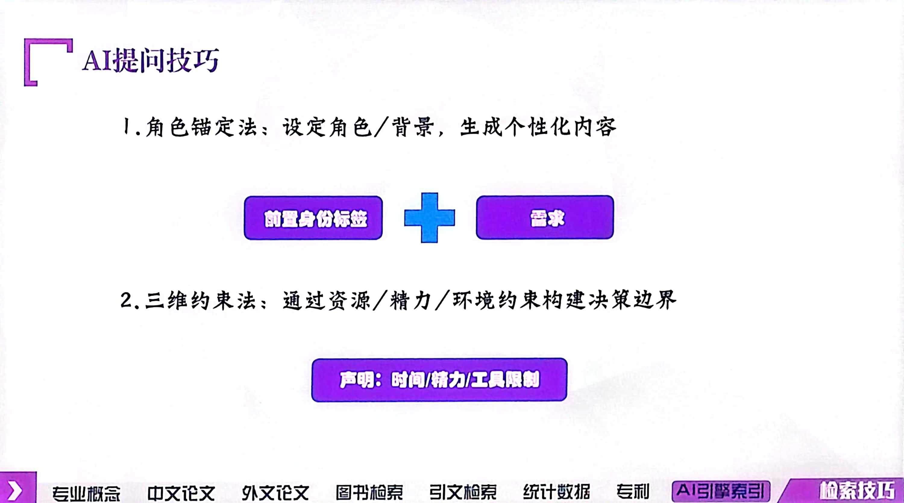
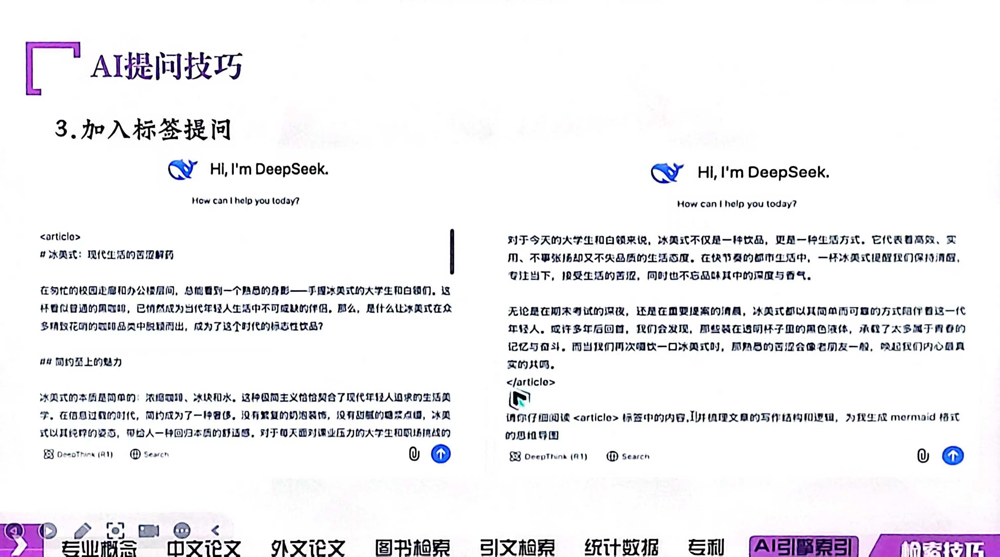
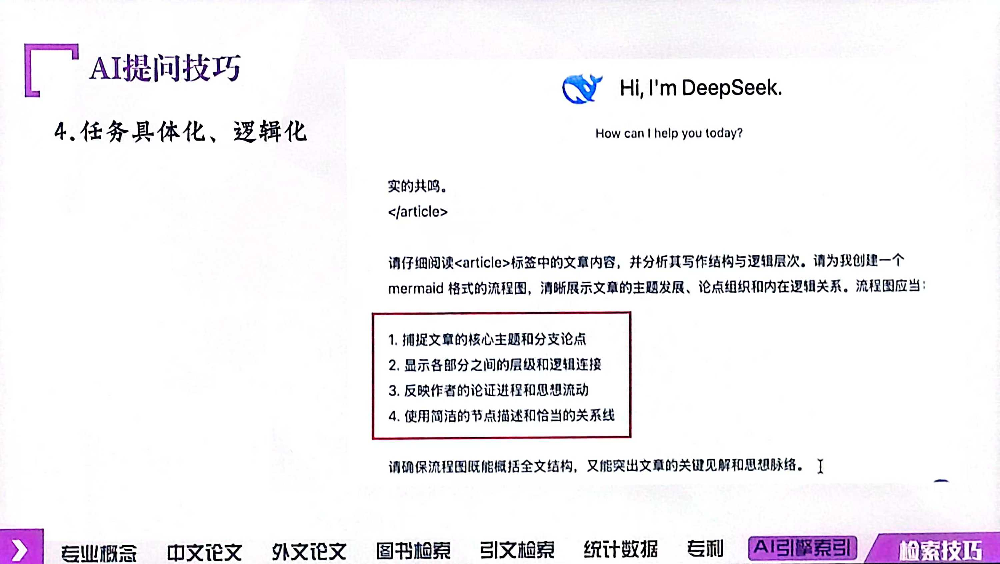
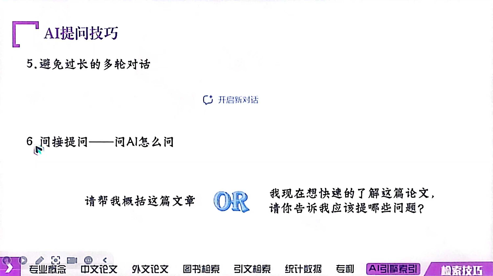
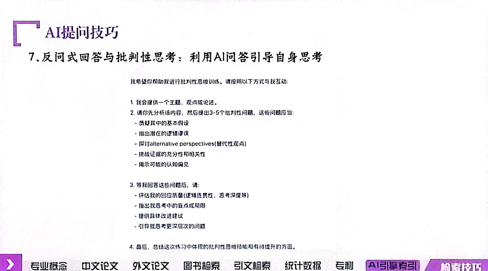

笔者：小拇指（部分内容参考[南京大学破茧信息素养团队](https://mp.weixin.qq.com/s/xIK7YEFBDk1JWBV_vhgbng)的校园宣讲）

2025/4/9

作为大学生，想判断AI答案靠不靠谱？下面几招，助你轻松识破AI答案的“真面目”：

1. 来源追踪术：先看看答案的“户口本”——来源。是出自权威期刊、学术大牛之手，还是某个不知名网站的“野路子”？可以复制粘贴它说的网站来检查。
2. 逻辑推理功：AI有时会“脑洞大开”，答案看似合理，实则漏洞百出。这时候，就得用你的逻辑思维给它“把把脉”，看看它说的有没有道理，前后是否自洽。(AI 的逻辑令人崩溃，建议在答案令你满意前少看它的思路)
3. 交叉验证法：别只听AI一家之言，多找几个“证人”问问。看看其他资料、文献（知网）怎么说，是不是和AI的答案“英雄所见略同”？要是大家都这么说，那答案的可信度就大大增加了。
4. 常识判断力：别忘了，你可是个有常识的大学生！有些答案虽然逻辑上没问题，但明显违背常识，那这时候就得提高警惕了。毕竟，常识可是检验真理的“试金石”。
5. 更新检查术：AI的知识库也是需要更新的哦！有些答案可能之前是对的，但现在因为新发现、新理论而“过时”了。所以，看看答案是不是最新的，也是判断其可靠性的重要一环。（注意检查：开启联网搜索）

那么，怎么用 AI 辅助读文献？

实操技巧之综述指令推荐

**1 核心观点提取:**

作为[你的领域]的专家，帮我深入提炼这篇文献的核心思想。请重点概括文章的主要理论或假设、核心论点和重要发现。进一步解释作者是如何通过逻辑和数据支持来展开论证的，并分析其与现有研究的不同之处。

**2 研究主题和创新点识别:**

请深入剖析这篇文献的研究主题，详细阐述作者提出的创新性贡献。分析文章的新理论、新假设或新方法，并说明这些创新在【领域】内的独特性。请评估这些创新点是否为该领域的已知问题提供了新的解决途径，或在现有研究基础上拓展了知识边界。

**3 研究方法分析: **

作为【领域】的专业分析师，详细解析该文献的研究方法，包括设计、数据收集和数据分析过程。具体描述作者在实验、模型构建或数据分析中采用的独特策略，井分析这些方法如何验证假设或支持结论。请进一步评估数据的可靠性和方法的严谨性，说明它们在实验结果可信度方面的贡献。

** 4 数据支持与结论验证： **

概括文章的主要结论，并详细分析其对【领域】的学术或实际贡献。请指出作者是如何将结论与现有研究连接起来，填补了哪些知识空白或实践差距。 进一步评价该研究在推动学科前沿或应用创新中的潜力。

**5  局限性分析: **

批判性评估该文献的局限性，包括实验方法、数据样本和分析角度的不足。 请详细分析这些局限如何影响研究结论，井提出可行的改进建议。说明在未来研究中如何通过优化方法或扩大样本来提高研究的可信度。 

**6 未来研究方向: **

基于文章的结论与局限，分析未来的研究方向。请详细列出基于此研究结果的潜在研究问题和新课题，并评估这些方向对【领域】发展的可能性和重要性，提出可以进一步探讨的假设或实验设计。

**7 生成“术语表”，掌握专业概念: ****<u>（很好用！！）</u>**

根据这篇文献内容生成一份详细的术语表。请包含每个术语的定义、学术背景、在本研究中的具体应用及其<u>在论文中首次出现的章节位置</u>。请用Markdown格式 （也可以不用） 输出术语表，并确保解释简明扼要，便于快速查阅和复习。

** 8 ****<u>对比阅读</u>****，增强理解深度: **

对比本篇文献与《[另一篇文献标题]》的异同，从以下几个方面逐一分析: 研究目的、理论框架、研究方法与实验设计、数据分析方法、主要结论、 应用意义和研究局限性。请在对比分析中指出两篇文献在学术贡献和应用潜力上的异同，并评价每篇文献在该领域的学术地位。

以下是[南京大学破茧信息素养团队](https://mp.weixin.qq.com/s/xIK7YEFBDk1JWBV_vhgbng)校园宣讲部分 PPT：

PS: 第三点标签提问非常好用，就像是你在学习计算机的表达方式以更好地和它沟通；最后两点比较难以掌握需要多多研究。

总之，判断AI答案靠不靠谱，就像是一场“学术探案”，需要你细心观察、逻辑推理、多方求证。很多时候 AI 会伪造数据甚至论文文献，此外你给它的要求它会置之不理（例如字数要求），需要你多次调教和检查。

