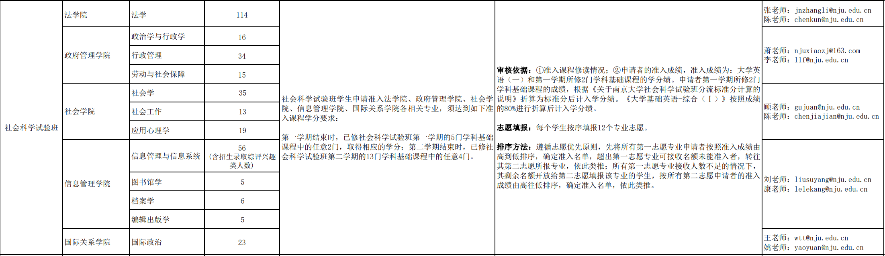
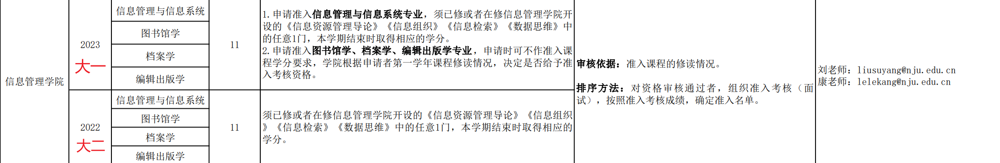
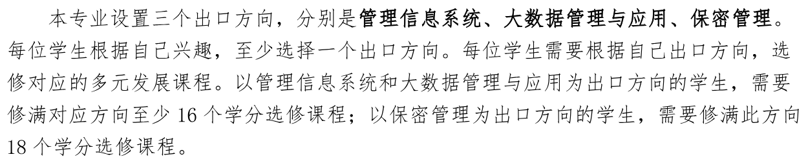
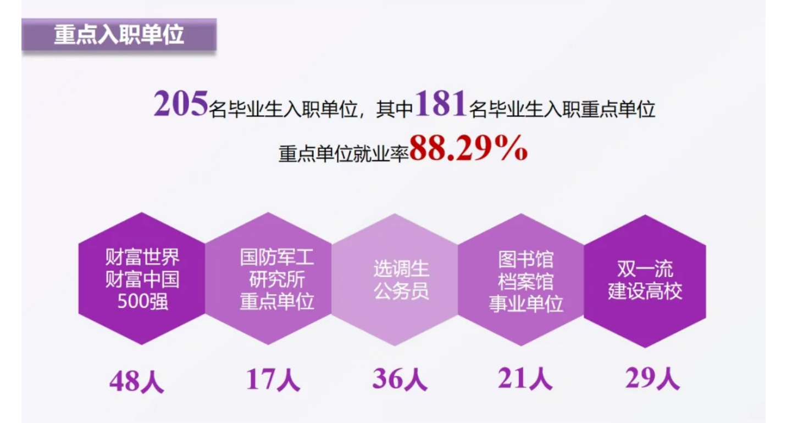
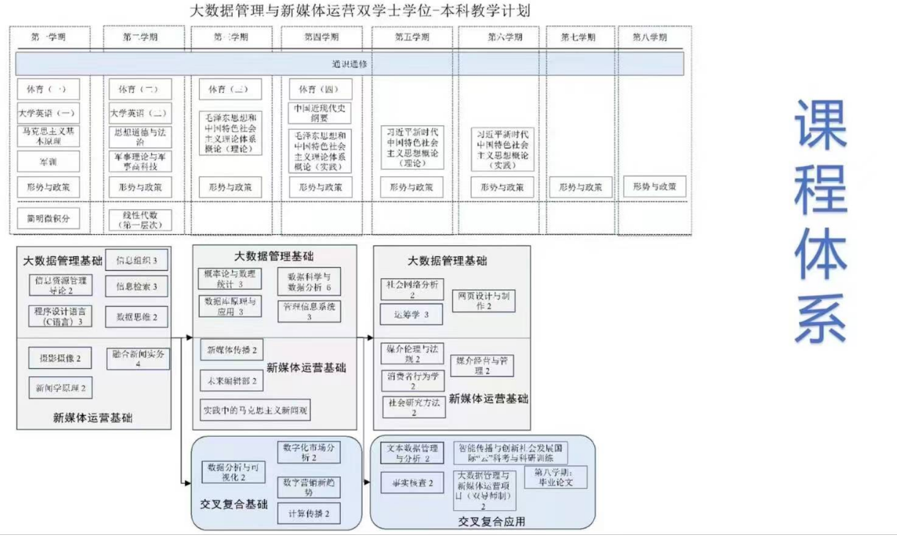
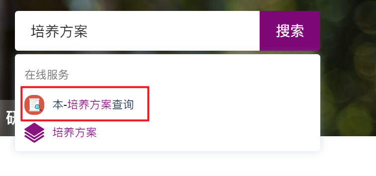
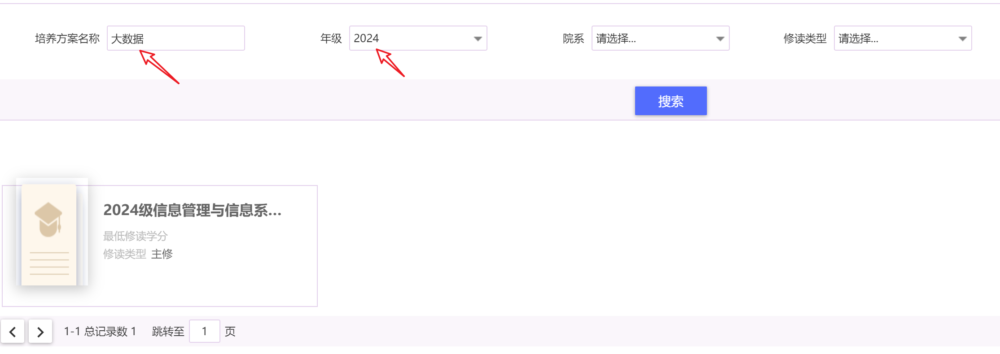
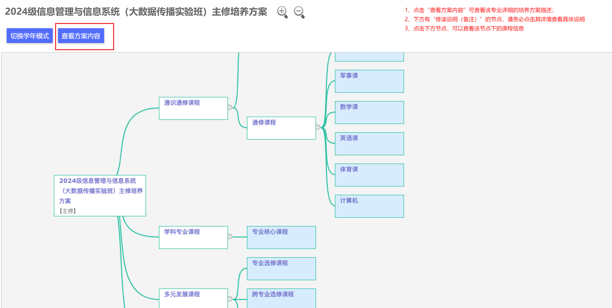

[南哪助手长期接受同学们投稿](https://www.yuque.com/greatnju/q-a/gw3phd#o8osi)

学院官网：[信息管理学院](https://im.nju.edu.cn/main.htm)

## 一、学院简介
信息管理学院“信息资源管理”（也称图书情报与档案管理）学科是南京大学的优势学科之一，在第四轮、第五轮学术评估中均取得“A+”的成绩，在国内学科排名中处于前列位置。学院目前拥有一批国内知名、学术造诣深厚的学科带头人及学术骨干，学科实力雄厚。

> （太长可以不看）具体包括国家人才计划特聘教授3人、国家人才计划青年学者1人，欧洲文理科学院院士1人，“百千万人才工程计划”国家级人才1人，教育部“新世纪优秀人才支持计划” 5人，国务院学位委员会学科评议组成员1人，教育部社会科学委员会委员1人，教育部教学指导委员会委员4人，享受国务院特殊津贴4人，中国科学技术情报学会、中国社会科学情报学会副理事长1人，系统工程学会信息系统工程专业委员会（CNAIS）副主席1人，中国索引学会副理事长1人，全国高校期刊委员会副会长1人，全国图书情报及出版专业学位教育指导委员会副主任委员各1人。
>

专业设置方面，本科开设四个专业：信息管理与信息系统、档案学、编辑出版学、图书馆学，其中信息管理与信息系统隶属于管理科学与工程一级学科，其余三个均隶属于图书情报与档案管理（信息资源管理）一级学科。同时，南京大学信息管理学院也是国内首批开设国家保密学院的院校，学生可通过选修相关课程获得保密证书。

## 二、专业准入
学院四个专业主要通过社会科学试验班分流进入，大一同学可在大一期间选修信管学院开设的平台课及其他社科院系开设的平台课，广泛了解，确定自己的兴趣所在。（注：分流至信管学院各专业没有必须修满大一信管开设的所有平台课的要求，可自行选择大二再补修，但此时需要跨校区，学生需自行斟酌）

分流规则方面，需统一填写志愿，准入成绩会将大一上学期两门英语课（听说&读写）和两门平台课纳入计算，遵循志愿优先原则进行分流工作。具体可看下图（2023 级分流实施方案）

整体来看，信管各专业分流难度较低，无需过于担心。对于转专业的同学，转入信管的难度较低，一般达到课程修读标准，正常参加面试，成功率都比较高。课程修读标准见下图（2024 年跨大类【院系】准入方案）

## 三、课程设置
2021 级信管本科培养方案：[信息管理学院培养方案.pdf](https://www.yuque.com/attachments/yuque/0/2025/pdf/34810676/1746452130491-9e8fcdab-fc90-4cba-a2f9-cd3322c8ccb4.pdf)截止 2023 级尚未发生变动，可供参考阅读

信管大一由于社科大类的平台课限制，开设的都是一些非常基础的专业平台课，主要目的还是让大家对图情、信管有一个基本了解，这些课程难度都不大，也不怎么涉及技术（除了信息组织），算是基本的入门课程。

由于大一的专业核心课过少，导致大部分同学在大二的课业压力非常重。在大二上学期需要同时修读数据库、程设、线性代数、概率论四门比较硬核的专业基础课程，大二下学期则需要学习数据结构、离散数学、数据分析、管理信息系统四门专业核心课程（比较硬核，也很重要，建议大家好好学一下【当然，自学也可以】）

大三两学期都各有三门专业必修课，这时候必修课就不再是学习的重点了，接下来向大家隆重介绍信管学院特色的必修性选修课（编出、图书馆、档案学的同学请忽视，可以自行查看培养方案了解本专业要求），可以简单看下图：

说人话就是，信息管理与信息系统专业的同学需要在上述三个方向中选择一个方向，本专业开设的专业选修课均为这三个方向的课程，毕业时**管理信息系统、大数据管理与应用**方向的同学需要确保本方向选修课已修满 16 学分，**保密管理**方向的同学需修满 18 学分。专业选修课方向归属请查询培养方案。（另外再说一句，出口方向从 2021 级才开始实施，目前还没有毕业，所以这些方向会不会在毕业证标明还未知，笔者猜测应该不会。截止这篇笔记写成，2021 级本科生推免工作还没开始，所以专业选修课成绩会不会纳入推免绩点还未知，但一般而言是不会的）

> 这里是一些建议或者说 tips 吧
>
> 1. 由于大三下需要修读管理学【必修】，而信管的管理学和商学院大一上修读的管理学课程号相同，可以相互替代，所以大一上时间空闲/想给自己找事做的同学可以跨选商院的管理学课程，大三下就不用再修了
> 2. 南京大学课程要求每人必须修满 14 学分通识课程（[https://www.yuque.com/greatnju/q-a/nyrrkz](https://www.yuque.com/greatnju/q-a/nyrrkz)），毕业要求修满 150 学分，而信管的必修+对应方向的选修学分总计是不够的，所以个人需要选修一些通识、公选课。而由于大二课业压力很大，建议是大一有时间可以多选一点通识/公选
> 3. 虽然每学期会有一门指定的思政必修课，但是为了减轻大二压力，你也可以选择在大一补退选期间自行多选一门其他的思政必修课修读，大二时就不用重复修读了
>

## 四、推免/就业/出国
先说就业吧，如果有志于从事互联网行业，是可以考虑信管的，但是同时也需要自己课后多学习。具体就业的话就看这篇推送吧：[【重磅】南京大学信息管理学院2023届毕业生就业质量报告](https://mp.weixin.qq.com/s/4_Au91TfnbWUpEvJ0ZwHXg) 

推免的话，信管的传统是将所有的必修课程全部纳入计算，大致可以等同于学位学分绩。（具体情况有待更新）比例的话，大致是 40%左右，每年都有前面的同学选择出国而放弃推免资格，所以成绩排名可能会到 40+%。然后如果只想推免至本校本院的话，截止 2021 级都是只参加 9 月举办的预推免，不参加 8 月底的夏令营。深入了解还请多多关注南大信管公众号，一般每学期都会举办保研/出国/就业/考研分享会。

出国的话，笔者了解不多，以身边同学经历来看，本专业想去港新之类难度不大，建议是早做准备，多多了解一些信息，还是一样想深入了解的话关注一下分享会的相关信息。

## 五、双学位
另注：2024 年新开设大数据传播实验班（信息管理与信息系统&新闻学双学位），由于是新开设专业一切未知，这里给出培养方案供参考阅读——[强强联合，这个双学位班培养未来传播人才！](https://mp.weixin.qq.com/s/TBgVVFOXoPuqR_VaNxlnGA)

如何查询自己的培养方案？

新生在已经可以登录南京大学 APP 后/八月中下旬，访问<a href="https://ehall.nju.edu.cn/ywtb-portal/official/index.html#/hall" target="_blank">南京大学网上办事服务大厅</a>，点击右上角登录（不知道什么是统一身份认证看<a href="https://www.yuque.com/greatnju/q-a/vrkw5d" data-href="https://www.yuque.com/greatnju/q-a/vrkw5d" class="ne-link">https://www.yuque.com/greatnju/q-a/vrkw5d</a>），搜索框输入培养方案，选择“本-培养方案查询”

像这样输入搜索

之后即可自行查看

## 六、总结
阅读到这里的你，如果你是社科大类的同学，现在还没有明确自己的兴趣，那么我建议你多听多看，可以去旁听自己没有选修的其他平台课，找到适合自己的专业，在这里祝你分流顺利！在社科玩的开心！

如果你是已经确认的信管同学，希望你对未来的课程有充足的了解，课上学不懂的不要焦虑，可以多多利用 B 站大学，调整好心态，祝你在信管有所收获，实现自洽。

总之，祝大家都有美好的未来

> 欢迎信管同学来 star NJUIM 的课程仓库：[https://git.nju.edu.cn/dadaya/NJU_IM](https://git.nju.edu.cn/dadaya/NJU_IM)，访问需先用学校的邮箱注册账号并登录，大一同学可到 9 月入学后再访问
>

[南哪助手长期接受同学们投稿](https://www.yuque.com/greatnju/q-a/gw3phd#k6p5Y)

