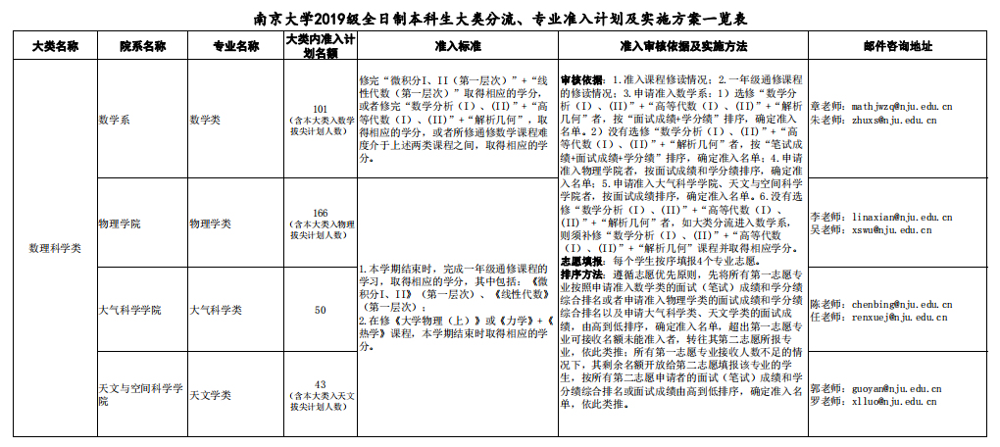
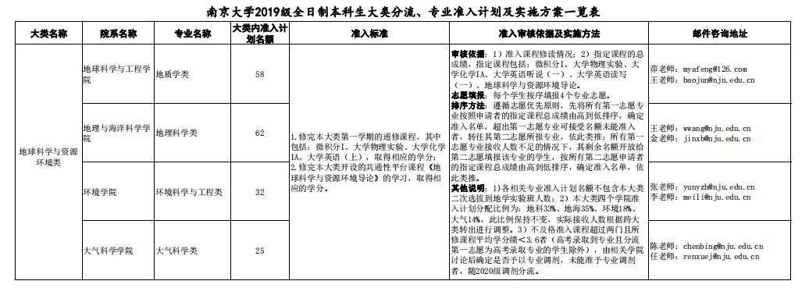
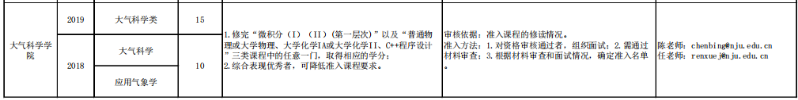

[南哪助手长期接受同学们投稿](https://www.yuque.com/greatnju/q-a/gw3phd#o8osi)

---

按照我的习惯，还是先给出目录：

一、大气学院简介

二、专业准入

三、课程和交流

四、推免、出国和就业

五、日常生活

 

## 一、大气学院简介
       南京大学大气科学学院源于国立中央大学气象系，也是我国第一个气象系。竺可桢、涂长望等著名气象学家曾在此任教，培养出了顾震潮、陶诗言等杰出校友。

       大气学院下设气象系和大气物理学系，本科设立了大气科学和应用气象学两个专业。目前学院已经与中国气象局以及众多国际名校联合建设了多个实验室，其中与芬兰赫尔辛基大学合作的大气与地球系统科学（教育部）国际合作联合实验室，是目前南京大学唯一一个教育部国际合作联合实验室。

       大气学院在历次学科评估和国际排名中均名列前茅，其学科精度以及在国内的地位都是数一数二的，大概只有北京大学能与之比肩。（所以在南大大气学院学习要有自信，我们读的是中国最好的大气学院）

 

## 二、专业准入
       大气专业是一个数理和地学结合的专业，所以准入的途径也会比大多数专业要多。

       目前进入大气学院主要是四种途径，第一种是从数理大类分流进入，第二种是从地学大类分流进入，第三种是从地球系统科学与环境实验班分流进入，第四种是转专业进入。

       前两种都是在大一学年结束时通过学校统一分流，一般通过数理大类进入学院的同学会多一些。以最新的19级为例，根据《南京大学2019级全日制本科生大类分流、专业准入计划及实施方案一览表》，大气学院在数理大类设置了50个名额，在地学大类设置了25个名额。

       两个大类的准入标准附图于下：

       对于大类分流的更多细节会在各大类的介绍中说明，此处只特别说明一下，数理大类同时开设了微积分/线性代数和数学分析/高等代数，对于非数学系同学来说，只需要修读微积分和线性代数即可。微积分和线代可以用数分和高代替代，但是数分和高代难度较大，从整体上看会对绩点有一定影响。请各位同学结合自身实际，妥善选择课程。

       地实班会在大二学年结束后分流进入大气、环院、地科、地海四院，刚刚分流的18级地实班共有79人，其中18人分流进入大气学院。具体的分流政策会在地实班的介绍文件中详细介绍。

       转专业的情况，根据南大的转专业政策，可以在大一学年末或者大二学年末转专业，根据《南京大学2020年全日制本科生跨大类（院系）专业准入计划及实施方案一览表》，目前大气学院准入要求如下：

       大气学院对转专业准入比较宽松，达到准入标准的同学基本都可以成功转入。

PS：以上均为往年政策，仅供参考，具体要求以届时教务处最新文件为准。

 

## 三、课程和交流
       大气科学对数学、物理、化学、计算机均有一定的要求。（学大气的人什么都能做！）

       大气学院在大一、大二两学年主要是进行基础课程的培养，包括微积分、线性代数、概率论与数理统计、普通物理、大学化学、流体力学、Fortran程序设计等，另外也会有大气科学概论、大气探测原理与实验等大气科学专业课程。

       大二学年结束后，大气学院的学生会被分流进入大气科学和应用气象学两个专业。

       大三学年开始，大气学院的学生会大量接触到大气科学的专业课程，包括动力气象、现代气候学基础、数值天气预报等。

       另外，学校规定的思政军事类课程，以及英语、体育课程也都是大气学院的必修课程。

       具体的课程清单请查阅教务网的培养计划，推免课程清单将会在下一节列出。

       除去学校国际交流中心的各种交流项目外，大气学院在每年暑假还会组织部分同学参与赫尔辛基的国际科考（今年因为疫情原因而取消了）。同学们会在学院老师的带领下参观Vaisala气象公司和SMEARⅡ观测基地，并参加相关的学术讲座以及Group Work。另外，同学们也会参观芬兰的一些著名景点，感受北欧国家的生活。

       北欧国家的气象观测一直走在国际前列，赴芬兰参加国际科考，既是一次接触学术前沿的机会，也能够丰富自己的经历、拓宽自己的视野。

 

## 四、推免、出国和就业
       大气学院是南大保研率最高的学院之一，保研率可以达到40%左右。

       以去年毕业的2019届（即15级）为例，共有本科生79人，有31人获得推免资格，保研率39.2%。而总升学人数达到了45人（不含出国），升学率达到了73%。这些同学都去了南京大学、北京大学、清华大学、中国科学院等国内著名高校和研究所继续深造。

       无论是想留在南大继续深造，还是想去清北等其他国内名校深造，大气学院的学生都广受欢迎。据任院长在宣讲会上的说法，南大大气学院的学生一般达到前20名就会受到清北的欢迎，这跟南大大气在国内的地位也是分不开的。大气学院的升学率和升学质量，无论是在南大各院系还是在国内各高校大气学院中，都是数一数二的。

       由于大气学院的学生来源相对复杂，在大一修读的课程也略有不同，大气学院在计算推免学分绩时是取了两个大类的共同课程。根据《2018年度南京大学大气科学学院推免生遴选工作实施细则》（仅供参考，我拿到最新的细则后会进行更新），推免课程包括（括号内为学分）：

思政军事类课程：

马克思主义基本原理概论（2+1），思想道德修养与法律基础（2+1），毛泽东思想和中国特色社会主义理论体系概论（3+3），中国近现代史纲要（2），形势与政策（2）、军事理论与军事高科技（2），军训（1）

通修课程：

微积分I第一层次（5）、微积分II第一层次（5）、线性代数与常微分方程（4）、大学英语（8）、大学体育（4）

学科平台课：

普通物理（8）、普通物理实验（2）、统计物理（4）、数学物理方法（4）、概率论与数理统计（3)、大学化学（2）、大学计算机信息技术（2）、FORTRAN语言程序设计（2）

专业核心课：

大气科学概论（3）、地球大气综合探测（3）、流体力学（4）、动力气象（4）、天气学原理（4）、现代气候学基础（3）、数值天气预报（3）、气象统计预报（3）、大气探测实验（1）、天气学实验（2）、天气分析与预报技术（3）、计算方法（2）

PS：对于大一修读数学分析和高等代数，且后来未修读微积分和线性代数进行替换的同学，用数分A、B替代微积分I、II，将两学期的高等代数取均分按4学分替代线性代数。

 

       出国深造方面，仍以15级为例，15级共有13人出国深造，包括卡耐基梅隆大学、多伦多大学、加州大学戴维斯分校、新加坡国立大学等众多国际名校。

 

       关于就业，不少大气学院的学生会被问“学大气是不是就是去气象局”。实际上，除去部分同学会去江苏省气象局、上海市气象局等重点单位，大气学院还有很多就业方向，常见的包括航空航天部门、空管部门、环境部门，也有不少学生未来会去各大研究院致力于科研工作，另外还会有一些同学著名企业、银行就业。

 

## 五、日常生活
       首先，强调一下，大气学院是男女均衡的理科院系，而且大气学院的女孩子颜值很高，嗯。

       除了数理大类迎新晚会、地学大类迎新晚会这样的活动，大气学院还会有很多围绕气象展开的活动。

       比如围绕国际气象日展开的系列活动，包括气象摄影比赛、三行情诗比赛、知识竞赛等比赛，奖品丰厚到你会怀疑学院是不是嫌钱太多花不掉（有钱真好）。

       大气学院有一个公益性质的团队——涂长望讲师团。以气象大师涂长望先生的名字命名，讲师团致力于进行气象科普相关的志愿活动，包括北极阁科普讲解活动、气象知识进校园活动、南京图书馆的科普活动等，把气象知识传播给更多的人。

       大气学院有丰富的学术讲座资源，截至我写这篇文章，“风云英华”系列学术讲座已经举办到了第三十二期，这些讲座邀请到了国内外的著名气象学者，也为学院的同学们提供了旷阔的学术视野。

       大气学院是一个规模比较小的学院，每一级只有七十多个人。这里的同学们都在一起上课一起学习，关系亲密宛如家人。不同于别的学院的同学会给老师们划分出“守序善良”、“混乱邪恶”这样的九宫格，大气学院的老师们无论是在上课还是给分，都非常友善，也深受同学们的欢迎。

       最后，被不少同学喜爱的大白鲸飞艇，就是大气学院用来观测气象的工具。

       欢迎学弟学妹们来大气学院，和我们一起学（wan）习（shua）！

---

[南哪助手长期接受同学们投稿](https://www.yuque.com/greatnju/q-a/gw3phd#k6p5Y)

