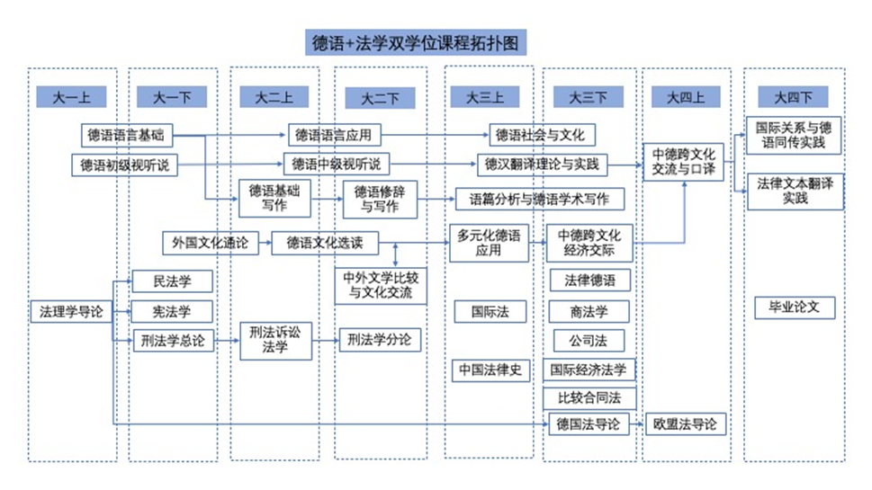

:::danger
【未完结，持续更新】

:::

# 学院简介
:::info
编者注  
**德语法学实验班的挂靠学院为外国语学院**。下文为外院官网选段。

:::

南京大学外国语学院肇始于1917年南京高等师范学校设立的英文专修科......**1993年扩建为南京大学外国语学院。**......2017年外国语言文学入选教育部一流建设学科，<u>2022年再次入选教育部一流建设学科，在全国第五轮学科评估中取得</u>**<u>优异</u>**<u>成绩。 </u>......英语、法语、俄语、德语、日语专业入选国家级一流本科专业建设点，朝鲜语专业入选省级一流本科专业建设点。......追求高质量发展，在当代外国文学与文化、外国文学史、文学翻译理论、文学文化批评理论、中国文学文化在海外的传播与接受、比较文学与跨文化、理论语言学及应用语言学、语用学、术语与翻译跨学科研究等领域取得丰硕成果，形成优势与特色。

# 专业准入准出方案
:::info
《培养方案》

德语（德语法学实验班）基于德语专业与法学专业的交叉融合，培养具有家国情怀和全球视野、政治立场坚定、通晓德语语言文化、熟悉中德法律的复合型人才，服务国家重大战略，推动构建人类命运共同体。实验班发挥南京大学学科齐全、教育资源丰富的优势，打破院系和专业壁垒，探索建立反映新文科融合性、时代性、中国化和国际化发展特点的复合型人才培养模式。  
本专业学制四年，专业应修总学分168，其中通识通修课程（必修）52学分，学科专业课程（必修）79学分，多元发展课程（选修）32学分，毕业论文/设计（必修）5学分。

:::

# 课程方案与双学位（仅大一、大二部分）
:::color3
因德法班的大三阶段学习目前仅有一届同学基本完成，尚处于探索阶段，故本段文字中笔者将着重论述较为成熟的大一、大二阶段学习。

:::

## 总览
## 德语部分
大一至大二两学年内，德法班的同学须**从零基础开始，完整掌握德语听说读写各项基本能力**（参考欧洲语言标准**B2**水平），并于**大二学年末参与专业四级考试（PGG）**。  
本系列课程和德语系（非德法班）同学共同上课。因语言学习的特殊性，兼顾与法学课程的课时安排，基础德语系列课程（<u>德语语言基础</u>、<u>德语语言应用</u>）在前两个学年的课程量占比极高（从大一上的10课时/周到大二下的8课时/周），并且早八占比极大，故有一定强度。但欣慰的是，作为全国高校顶尖水平的德语系，南大德语系的老师们**<u>水平高，实力足，人也特好</u>**，而且得益于外院特色的小班化，每个院系的同学数量并不多，如果在学习的过程中遇到任何问题，**请不要吝啬提问的机会(。ì _ í。)** 同时，因外院特有的来自于全国数所具备保送生资格的外国语学校的，经保送而非高考而来到德语系，进一步选择德法班的同学也会在同一课堂中上课，对于零基础的同学们也不必太担心两类同学间的过大差异，老师在实际教学中会有效把握相关知识的传授进度，确保同学们学习到位。  
对于选修课部分，德语系同步开设了横跨四个学期的<u>视听说系列课程</u>（听说能力，口语交际），大二则进一步开设了<u>德语文化选读</u>（阅读练习+文化了解）、<u>德语基础写作</u>与<u>德语修辞与写作</u>（写作能力培养）。  
对于外院特色课程部分（<u>外国文化通论</u>、<u>中外文学比较和文化交流</u>），其性质更偏向于讲座，为同学们介绍外院各语种老师所了解和研究的作家、作品和故事。_（属于大课，你知道该做什么的.jpg）_  
综合来看，虽然今日互联网上对文史哲外等文科性质的各高校院系多有声讨之风，但是南大外院德语系永远是德语学子最好的避风港。**<u>虽然因专业性质特殊，德法班的学习强度和任务安排并非完全尽如人意，但德法班具备了其它单一专业或一般辅修所不具有的特色风格，笔者依然希望选择这里的同学们珍惜在这里的四年时光。</u>**

## 法学部分
首先要说明的是，德法班在大一、大二阶段所完成的法学学习，扔依托法学院所开设的各类课程（如大一分流前的3~4门计入分流依据的课程、大二的各门大课），即德法班需要和法学院应届同学<u>在同一教室上课，最终参加同一轮考试，但不参加法学院排名</u>。  
大一阶段，因分流安排，德法班的同学主要完成<u>法理学导论</u>、<u>民法学（总论）</u>、<u>刑法学（总论一）</u>、<u>宪法学</u>的学习。笔者在这里需要指出的是，对于德法班的同学们，大一主要完成的任务，总结下来有如下几点：

+ 德语零基础入门
+ 法学课程学习
+ **通识课学习**

依据德法班的培养方案，每位同学要完成168学分的学习，这个标准相较于150学分的标准有较大程度的提升，使得德法班的学业安排处在一种“头重脚轻”的状态（大一基本没有法学课、较为重要的法学课则集中在了大三、特别是大三下），故笔者建议德法班的同学们，在确保通识课能够过关的基础上，倾斜相关的通识课时间，尽快对法学专业的总体课程安排有所了解，并趁大一通识课稍有空闲时间时，在有所了解的基础上，遵循自己在其中圈定的兴趣学科，在民法、刑法、宪法与行政法中选择一个大类，<u>参考市面各类法考课程或教科书，尽早入门，以降低后续学习门槛。</u>  
大一作为初入大学校园的一年，对于初入法学领域的德法班同学，笔者认为以兴趣为导向相较于单纯以完成课业考核为导向，更具备长久的吸引力和妥当性。法学学习将穿插在德法班四年的学业中，并在中后期强烈依赖前期所掌握的基础知识，故笔者在此也鼓励德法班的同学们在前期尽可能了解这样一门社会科学的基本逻辑。  
需要提醒的是，由于政策滞后性的存在，依据目前的司法部关于法考（国家统一法律职业资格考试）的准考政策，**<u>德法班的同学本科毕业后尚不能直接参与法考</u>**，对于**通过高考**进入德法班的同学们，如果有志直接进入法学院，通过法学专业毕业并进行深造、法考等选择，也可以通过转专业的方式直接进入法学院。对于保送生，依据教育部有关规定，不得转为非外语专业，故不存在上述途径。  
大二时，法学院已经完成了分流，课程规模也进一步扩大：大二上完成<u>民法学（物权法）</u>、<u>刑法学（总论二）</u>、<u>刑事诉讼法学</u>的的学习，大二下则继续学习<u>民法学（债权法）</u>、<u>刑法学（分论）</u>、<u>行政法与行政诉讼法学</u>。相较于法学院的各类选修课程，德法班并未在计划中直接照搬列入上述选修课，而对相关德法班特有的法学必修课的所在学期进行了调整，这样调整的缺点显而易见：德法班的同学并未能完全和法学院一样选择各类选修课（如确有需求，可以自行通过跨专业选课选择），但省去各类选修课有效减少了德法班同学的压力，一定程度上缓解了大二德语法学“两手抓，两手都要硬”的局面，鼓励德法班的同学们集中于核心课程。同时，对于选修课的安排，笔者建议结合实际需求，通过跨专业选课参与。

:::color1
如和德法班高度契合的德国法导论课程：

**先说结论，德国法导论泛用性高，对策性高，总的来说属于****<u>超大杯</u>**——虽然是大三安排的选修课程，但这门课程所带来的实际价值远大于课程本身，能够有效提升德法班同学对德国法和比较法的认知了解，并了解到德国本科法学教育的一线方案，推荐所有德法班同学大二下抽空提前上这门课。~~_笔者大三才上，亏麻了_~~

:::

# 实践机会和问题
TODO

# 总结
TODO

# 附录：推荐学习资料等
TODOTODOTODO

[南哪助手长期接受同学们投稿](https://www.yuque.com/greatnju/q-a/gw3phd)

