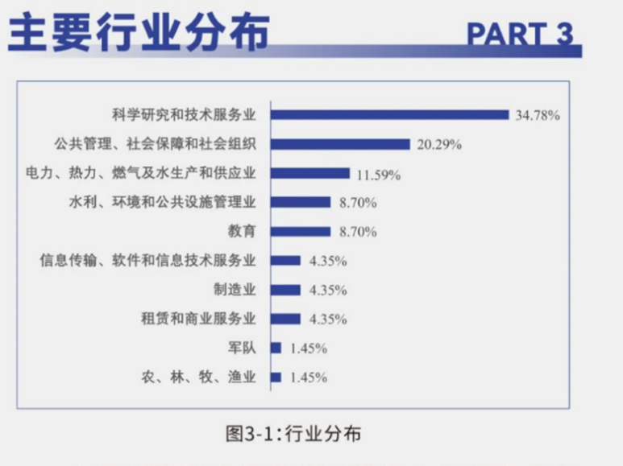
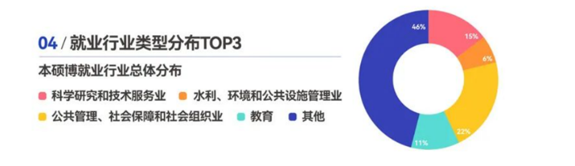
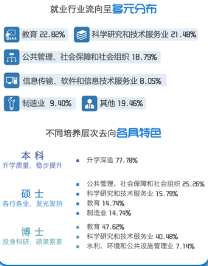
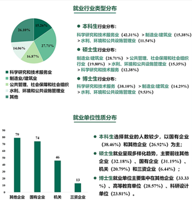

:::info
**本文转载自【2025南大转专业&&辅修交流群：1047975773】**

**作者：**

**24 地学转智软 史益瑄**

**23 地学转南软 花天岑**

**23 地学转自动化（工管）李诗琪**

:::

> **感谢22级技科集电Lasitskene学长，23级社会学院风笙学长，23级现工院月晕知风学长，24级地海izhu学长，24级地科关怡珂学长提供了部分了课程介绍。**
>

:::info
**转载请咨询原作者。**

:::

# 前言
几位笔者大一在南京大学地学大类生存一整年，现已转入其他专业。鉴于近日新生入群甚多，其中不乏因分数不够理想专业而无奈进入地学大类，或对本大类缺乏充分了解的同学，笔者试在此陈述我自己对地学大类专业特征、分流制度、学习策略、转专业以及就业前景的理解。笔者此时尚是准大二/三学生，部分观点可能有失偏颇，还请多多包涵。

# 一、绪论
理科实验班（地球科学与资源环境类）简称为地学大类，是南京大学所有大类中学科实力最强的大类。地学大类共有4个分流院系——地球科学与工程学院，地理科学与海洋学院，环境学院与大气科学学院。这四个院系全都有A＋学科，地科院的地质学，地海院的地理科学，环境学院的环境科学，大气科学学院的大气科学。这样的学科实力在整个南大都是数一数二的。

南京大学的学科实力其实主要就体现在地学和天文两个专业上面。尤其是地质学和地理科学，是全国第一的学科，如果想要做这方面的学术工作，南京大学绝对是一个绝佳的选择，但如果想要一份高薪的工作，尽量不要留在这四个学院。 

# 二、专业大体介绍
地学大类的专业大都是比较学术化的专业，如果不转行的话，基本上就是一直读研读博，然后做科研，但是科研是非常非常需要热爱的，不要为了做科研而做科研，做不下去的，不要为了学术而学术，但能不能做学术工作基本上在读了研究生之后才知道。

# 三、课程的介绍
这段课程介绍，只介绍必修课（包含通修课）。

首先介绍一下大一上的两门指选课——大学化学A和地球科学与资源环境导论（简称地导）。大学化学A总体难度较大，想得高分需要好好学，但想及格还是可以考前速通的。地学导论是一门导论性质的课，是一门水课，上课不需要听（当然如果感兴趣可以听一听），考前背一背重点可以轻松90＋。这门课感觉啥也学不到，不知道有什么存在的意义。

再介绍一下计算机通修课：C程序设计（层次I）（Python同理），和软件学院等专门学计算机的院系中的C语言程序设计难度不可比，地学大类学的比他们简单太多了。但是对于毫无编程经验的同学来说，还是需要花一点时间的，尽量不要轻易用AI解决平时的编程作业，虽然快，但是遇到考试就会比较难绷。

大一上还有一门专业课是化学实验基础。首先要在线上完成实验室安全考试，难度一般，达到九十及以上分数的同学合格，获得进入实验室的资格。一般来说第一节课不会去实验室，会在线上上绪论课，老师会介绍上课形式和注意事项。课程难度系数不高，以前没有接触过化学实验的小伙伴们不用担心，只要是高中选择学习化学的，理解实验原理可轻松拿下。化学实验课一节课时间比较长，大约六七个小时，如果提前完成实验可以提前离开。从23级开始，化学实验课实行单双周制，每上两节课轮换一次老师，保证给分的相对公平。每次实验课之前要写好纸质实验报告，实验完成后上交，下节课返还。并且记住，返还给你的实验报告一定不要丢掉，系统地收拾好，学期结束时要使用！！！考试的形式是做一次实验，不可以用手机，但是可以参考课本和使用计算器，难度一般，给分普遍在八十五左右，好好做实验就差距不大。（其他一些小细节见化学实验课的绪论课）。

关于数学通修课的介绍参考南京大学本科生课程体系导论（见转专业群群文件）。

大一下学期的专业课较多，下面一个个介绍：

+ 三学分普物上：比较简单，不做太多介绍。多关注PPT内容
+ 四学分普物上：难度是有的，但好好学是可以得高分的，没有大学物理上难。

（南大物理学院基本上学的是力学，热学或者大学物理上，普物是给其他院系上的，难度排序为：力学三学分＋热学三学分>大学物理上＞四学分普物上＞三学分普物上（上面的课程都是可以高位替代的），电子学院开设的大学物理I和II本人不了解难度）；

+ 大学化学B：主要学元素，微观结构等，比较难，如果转专业建议不要选
+ 三学分普通地质学：大一暑假有野外实习，但也是背书课，是地学大一比较重要的专业课
+ 二学分普通地质学：大一暑假有野外实习，但也是背书课，是地学大一比较重要的专业课
+ 地理科学基础：水课，但要考勤，期末背背书95＋，和地科导论类似
+ 遥感科学导论：水课，上机考试稍微准备即无压力，笔试需要认真背书，最后给分尚可
+ 大气科学导论：水课，期末随便水水
+ 污染控制概论：两个老师，总评水污染和大气污染各占50%，两个都要考试，都有课后作业，20分钟左右能写完，大气污染还有随堂检测，考试需要背熟ppt，没花太长时间分数也不错
+ 环境学：考核期中小论文+期末闭卷考试（大概占70%）我个人感觉课程还不错，老师讲的很有趣，不过上课课件基本都是10年前的，期末考试主要背课件就行。

# 四、专业分流/转专业
## 分流规则
地学大类的分流是只看上学期的成绩的，一共是四门课成绩，英语，数学通修课，大学化学A和地学导论。此外，在分流之前这四门课的绩点是不公布的。地学大类绩点排名靠前的基本上都是转p，想去大气没有想象中那么难。

## 四个院系的分流难度
****总说的话，如果不转专业，正常分流都是想去哪去哪，因为厉害的人大多在转专业大军里面。

**<u>大气</u>**，A+学科。这个专业在数理大类是点击即送，但是在地学大类是名额最少，比较难分流的专业。值得注意的是，大气有一个大气拔尖（大一刚入学便开始选拔，也就是招生组说的“第一次转专业机会”），也是点击即送，建议打定主意去大气的不要错过。

**<u>地科</u>**，其中的地质学是A+学科。分流难度次于大气。同样的，地质学有一个拔尖班，也是大一选拔，点击即送，明确想去地质学的不要错过。

**<u>环境</u>**，A+。环境是个很特殊的专业。他有一个环境健康班，那个班大部分是综评进来的整个班都特别卷，竞争特别强烈。而且他们保研不在环境整个院系里面计算，而是就在这个班里面计算。但是大类分流进环境不会那么卷。

**<u>地海</u>**，拥有A+学科地理学。同样的，拥有一个地理科学拔尖，值得一提的是，地海拔尖会改变数学层次。大类分流只需要二层次数学，而拔尖班需要学一层次数学（微积分一（一层次）、微积分二（一层次）、线性代数）。所以地海拔尖还需要斟酌一下，自己能否接受数学层次提高，结合自身情况进行选择。

地学大类每年分流的四个院系中，大气是相对来说比较难进的。哪个院系是最好进的则每年不一样。其实地学大类的四个院系就业方面都差不多，其中大气的就业水平高于其他三个院系，故而大气在地学大类一直是第二热门的院系（第一热门是转院），其他三个院系基本上都处于点击就送的分流难度（只要不是太摆烂基本就是想去哪里去哪里）。

附：

2023级分流情况：大气17人，环境29人，地科13人，地海24人，转出39人。

2024级分流情况：大气18人，环境31人，地科13人，地海21人，转出38人。

其中转出情况如下：

| 23级转出情况 |  | 24级转出情况 |  |
| :---: | :---: | :---: | :---: |
| 电子信息类 | 9 | 电子信息类 | 9 |
| 软件工程 | 5 | 软件工程（智能化软件） | 5 |
| 物理学类 | 6 | 光电信息科学与工程 | 4 |
| 集成电路设计与集成系统 | 3 | 计算机科学与技术 | 3 |
| 生物科学 | 2 | 数学类 | 3 |
| 光电信息科学与工程 | 2 | 自动化 | 3 |
| 新能源科学与工程 | 1 | 集成电路设计与集成系统 | 2 |
| 自动化 | 4 | 软件工程 | 2 |
| 软件工程（智能化软件） | 1 | 生物科学类 | 2 |
| 数学类 | 3 | 法学 | 1 |
| 计算机科学与技术 | 1 | 化学 | 1 |
| 人工智能 | 2 | 人工智能 | 1 |
|  |  | 天文学类 | 1 |
|  |  | 物理学类 | 1 |

## 转专业的具体操作
**（****1****）选课：**地学大类和工科试验班都是南大的“转院”（笔者说它为我们呢喃自己的元培！全校分流，自由开放），顾名思义转专业的人特别多。地学大类上学期的指选课为大学化学A和地学导论。大化如果时间冲突可以选择缓修或者免修不免考。地学导论可以缓修，但能不能免修不免考请咨询任课老师和教务员（笔者得到的消息不一）（24级的情况是完全谢绝免修不免考，强行免修不免考的话满分只有70分，平时分全扣）地学大类有的院系修读一层次数学，有的修读二层次数学。如果要转专业请修读对应专业所要求的数学层次！另外，地学大类中的地科院与大气科学学院的线代是安排在大二上修读的。如果对应专业的线代安排在大一修读，本人建议在上学期修读线代课，这样可以在大一下多一点时间准备转专业。但是下学期线代一般难度小于上学期，各位同学自行选择。地学大类下学期是没有指选课的，地学的专业课可以一门不选，专心转专业。但是如果转专业失败，可能面临补课的问题。如果被调剂到地海院，那么大一下有六门专业课要回鼓楼补课。请慎重选择。

**（****2****）加****2025****转专业****&****辅修群，群号：****1047975773****。**转群是一个很“有用”的群，这里面会有很多很厉害的学长学姐。可以通过群名称来找到他们私戳咨询，也可以直接在大群里咨询。

具体的课程协调安排得看你的目标院系，这些细节可以向对应已经转过去的学长学姐咨询私聊。我这里不多赘述。但是无论你想转哪个专业，都有一些通用的原则。

请坚定自己的目标。转or不转，你一定要自己想清楚了。选择转专业，意味着选择一条相对艰难的路。中途可能会因为各种各样的原因，你可能会自我怀疑，可能会后悔。但是请尽量不要让这种负面情绪去占领自己。自己选择的路，就要潇洒地走下去。

（每年的暑假全年级都是好几百人要转专业，第一学期选课的时候也有好几百人，一学期之后就只剩下一半左右了，再到来年五月份真正提交转专业报名的时候，只剩下四分之一左右的同学了。所以坚持下来你已经离成功不远了，请坚定自己的目标）

请不要试图投机取巧。很多咨询转专业的人都喜欢先问哪个专业好转。但其实这个问题压根就是无解的。23级转软的同学就给大家敲响了警钟。在23级之前，转软只需要微积分等课程达到80分就基本可以转进去，竞争压力不大。但是在23级，由于大家都觉得软是热门专业里相对好转的专业，出现了大一转软人数达到42的恐怖情况，最终录取结果为25/42，转软难度远大于往年。所以请不要投机取巧，这个世界就是一个巨大的博弈，如果你没有足够的本领去看穿博弈的结果，那请不要去过多的揣测哪个专业好转。你应该思考的是我对哪个专业感兴趣或者哪个专业适合我。

附：

1. 如果你要转专业笔者的一点小小的建议，可以考虑缓修大化（因为这个课比较难），保留地导课（一方面，这个课不接受免修不免考，一旦要补修会非常麻烦；另一方面，大一修读上课也完全不用听，去教室自习/看手机即可，压力较小，期末突击一下物化生选手也能比较容易的上80分）剩下的地学专业课一门都不上，全心全意准备转专业。

2. 如果从24级转专业的情况来看，满足以下两个条件：第一，你确实有比较认真的学习；第二，你的目标专业不是AI，CS这样的难度天花板。你的转专业极大概率是成功的。如果不满足条件一，很有可能你的转专业是失败的；如果不满足条件二，请你打起十二分的努力奋力一搏，绝非轻轻松松即可成功。

## 二次选拔
拔尖班不是高中的实验班，是一种学术班，专门培养学术人才的，在保研率上可能有优势的，但这可能也意味着更加残酷的竞争。此外拔尖班的培养方案与其他班级同学可能有所不同。

地学大类一共有四个拔尖班，地质拔尖，地理拔尖，行星拔尖，大气拔尖（大气拔尖不属于安邦书院，归有训书院管了）。第一个和第三个拔尖班属于地科院，第二个属于地海院，第四个属于大气科学学院。四个拔尖将会给学生最好的资源以做学术研究，对就业带来的好处微乎其微，要慎重选择。

****

# 五、就业质量报告
就业质量报告在学院的微信公众号或者官网上应该可以找到，找不到就找学长学姐要。

以下为2023级的就业质量报告，24级的请移步** 南大就业 **公众号。

# 六、笔者的话
分流不需要太卷，正常学就好，但转专业比较苦，但成功是真的开心。

**希望所有看到这份文件的同学分流成功，转专业成功。**

