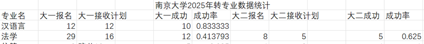
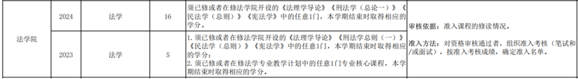
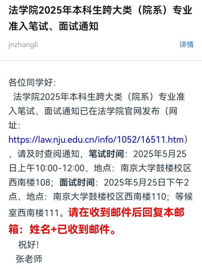

:::info
**本文转载自【2025南大转专业&&辅修交流群：1047975773】**

**作者：****苍井空 周末 不知名的学长学姐们**

**转载请咨询原作者。**

:::

****

# 一、准入难度及门槛（往年录取情况）

 

竞争烈度如上，但鉴于2025年社科分流法学第一志愿没录满，26年到底什么情况很难说。至于门槛，笔者之一高中选科物化生——可以说，只要想转，没有门槛。

****

# 二、前期流程
1. 首先需要关注本科生院发布的跨大类准入方案，了解准入标准及要求

 大部分转专业对于原专业课程修读情况和绩点是没有要求的，法学亦是如此。转法学有两个条件：

（1）修读《法理学导论》（大一上开设）《民法学（总则）》《刑法学（总论一）》《宪法学》（大一下开设）四门中的任意一门并取得学分（即不挂科）

（2）参加转专业考试（笔试+面试），根据综合成绩和计划人数择优录取

2. 选课系统中，在“跨专业选修”一栏设置转专业意向—法学，提高选课优先级；根据准入方案以及课程开设时间，两个学期选择一门或多门准入课程。

3. 每年4月末，在教务系统中提交跨大类准入申请；

4. 第二学期期末周前两周左右（5月底），将会收到考核通知；

   

5. 按时参加考试；

6. 录取结果将于六月末至七月初，由本科生院汇总统一公布。

# 三、课程选择
原则上只需要修一门法学院准入课程就可以转专业。但笔者建议将四门准入课全部修读完，一来有助于构建完整的思想体系，二则转专业考试的面试老师就是授课老师，笔试部分大概率也是他们出题，而面试专业知识部分的问题都是课堂的重点或是前一两节课的教学内容。

亦可只选择下学期的民总刑总重点学习（原因可见第五节考试相关）。

## 《法理学导论》
大一上学期开设的法理学导论，目前授课老师是蔡琳老师。老师认真负责，有问必答，课堂幽默，但由于法理学关注法学基础理论和底层逻辑，所以相对抽象，初学者难以很好地掌握和理解。此外，蔡老师的思维发散性强，喜欢在课件中引用外国法学大家的理论，也会不时跳到某个具体案件的分析，所以把握老师的授课思路并不容易，给分也一般。很多有志于转入法学的同学可能会被这门课程劝退，但其实其他部门法的入门较之相对容易，如果对于转入法学尚未下定决心者，可以不必修读（如果大二进入法学院，可以线上补修），利用上学期的时间多上几个专业的课，多搜集一些信息，同时多阅读学术著作开阔眼界，看看自己想转的专业是否是自己想象的样子。只有真正了解过，用心做出了决断，才不会为自己的选择后悔。

## 《民法学（总则）》
目前是冯洁语老师和朱庆育教授分别开设一个班。但据冯老师课上所说，他不再带25级本科生，有可能是尚连杰老师接任。朱庆育教授是目前我国民法领域中青年学者之中的翘楚，“老师很好，收获很多，但作业任务繁重，学生内卷严重”，今年课程的平时作业是至少阅读其推荐的四本民法学著作中的一本并交两篇字数至少一万字的读书报告，也可以选择提交四本书的读书报告（合计总字数至少八万字），期末总评成绩结合期末考试可以从90分起评。可想而知为了分数，内卷化有多么严重。笔者的建议是，根据自己的学习能力与时间管理做决定，保守一点不太建议选朱总的课，但如果一心向法，不想错过法学大拿的课堂，有信心能通过转专业考试，可以选这位老师，老师的授课质量真的很高。

## 《刑法学（总论一）》
目前是张淼老师和马春晓老师分别开设一个班。这里需要注意的是，刑法学理论分歧较大，不同学者立场不同授课的部分内容也不同。尤其是犯罪构成理论，是刑法学理论的框架，简单可分为三阶层和四要件两种。三阶层理论为近年来国内刑法学界逐渐占据主流的理论，引自德日法学，相比四要件解决实际问题颇有优势，但在实务中仍存在分析繁琐、难以快速解决问题的不足，为国内中青年学者所主张。四要件理论脱胎于前苏联法学，自新中国成立以来一直为学界主流观点，也为老一辈刑法学家所推崇。近年来由于德日新理论的冲击以及理论本身存在一定的缺陷，有势弱之相，但目前我国绝大多数司法机关工作人员裁决案件时仍使用四要件理论，一为其学生时代所学皆为四要件，二为四要件在解决实际问题时快捷方便。此外值得一提的是，法学硕士的考试依据四要件理论，而法考依据的却是三阶层（未来几年可能发生变化）。

张淼老师上课主要依据国家编写的马工程教材，以四要件为主，穿插教学一些学界新理论。老师不赞成上课使用电子产品，思维较为发散，基本没有成体系的教学PPT，基础知识需要自学。老师上课幽默风趣，注重对思想的启发。

马老师深受同学爱戴。今年开始平时作业多了一篇五千字的读书报告，课程的PPT非常详细，但需要手拍（可以跟学长姐要），不会提供给学生。授课内容主要参考周光权教授的《刑法总论》，以三阶层理论为主，体系性强。

## 《宪法学》
目前是姜秉曦、金健老师合开一个班，张慰老师开一个班。姜秉曦、金健老师今年第一年带本科生，平时作业是3000~5000字的读书札记，上课风趣幽默，只是PPT上的考点很多，需要平时记忆，期末突击难以全面掌握。对张慰老师笔者了解不多，期末考试有往年题可循。由于宪法学转专业考试不会涉及，对于应试不用过于在意。

大一上学期还有法学院开设的另一门非准入课，为领导人法治思想概论，简称习法概。该课程为多位老师轮流授课，无签到无论文（23年有论文），课堂上多为老师分享自己研究领域的内容，而考试几乎全是书本上的知识（课程同名教材）。文科生有高中政治的基础，考前认真背诵就能得到不错的分数（建议找法考理论法部分的资料来背，例如胡震理论法背诵“七页纸”），课程负担较小。

# 四、教材书籍推荐
《博登海默法理学》

周安平《常识法理学》

梁慧星《民法学总论》

李建伟《民法专题讲座》

车润海《刑法学法律硕士考试一本通》

柏浪涛《刑法专题讲座》

周光权《刑法总论》

:::info
以上皆为学科入门或单纯用于应试，**对于想要学好这门学科远远不够！！！**法学学习一定要多读书！不要过于功利！否则只会因小失大！

:::

# 五、考试相关（文末附有往年题）
## 1. 笔试
注重基础知识的记忆、清晰的阐述思路以及法言法语的使用，对理解和论证的深度要求较低。民法学总则（50分）、刑法学（50分）、法理学（50分）三选二作答，因为法理学摇摆空间过大，所以几乎所有人都会选择民刑两个板块，所以转专业最重要的阶段是大一下学期，民总和刑总一定要全面备考，课堂认真听讲，做好笔记，考前一个月或两个月，结合教材和笔记，把基础概念和老师课堂着重讲解的知识点应背尽背，根据往年题的形式、内容预设可能的考题和答案，充分准备。

值得注意的是，刑法学虽说学说分歧较大，但转专业考试只会考基础理论，学三阶层或四要件区别不大。如果周教授的教材学术性过强，可以使用车润海编写的学硕教材，便于备考。

此外，因为大一大二合卷，刑法可能会出现超纲，但多可在往年题中发现踪迹。

## 2. 面试（自我介绍—专业知识—英语口语）
可以在自我介绍环节适当引导老师提问英语部分。专业知识部分可以自己选择一门课程（民法学总则、刑法学、法理学三选一），根据你的选择，课程相对应的老师进行提问，遇上超纲的问题可以跟考官说，老师会换题；问题相对比较基础，随机性较大，真诚表达自己观点即可。英文环节不必紧张，老师英文提问，注意听清问题，问题可能根据自我介绍内容提出，有日常内容也有可能涉及专业知识，随机性较大。备考阶段最好针对自我介绍的内容预设问题，准备5～6个可能的Q&A，但也不能忽视一些比较大众的问题。记得无论如何得说下去。

:::info
最终以笔试成绩为主要参考。

:::

# 六、其他
## 1. 原专业课程怎么处理？
免修不免考或者缓修。如果转成功，缓修课程就不用修读。

如果课程无冲突，上学期原专业课、平台课同时兼顾亦没有问题。下学期选课需要自己慎重考虑：如果原专业课一门没学，风险极大，大一转失败大二不准备继续转的话，补课压力会很大，但想要转专业成功又需要在法学课程、备考上投入时间和精力，而且课程可能会有冲突。

## 2. 转专业失败了怎么办？
大二再战，或者既来之则安之。得知失败结果的时候，要考虑两条路。大二的名额本身就少，这必然是一场战略豪赌。转完专业后法学院落下的课程怎么补？（大二缓修和跨专业选修的课程数量有限制，一些课程会在大三补修并且不能免修不免考。考研和法考都会受到影响）转专业二战失败后，在原专业怎么好好盘算自己的未来？请务必慎重考虑。

# 往年题
## 笔试部分
### 法理学
#### 2020级
1. 老子说“法令滋彰，盗贼多有。”赞同吗？如何理解？

2. 法学家茨威格说过，“只有傻瓜才会因为奎宁不长在自己的菜园子里而不服用他。”如何理解？

3. 正当程序的起源和发展

4. 法律解释的方法。

#### 2021级
1. 法学和社会学、经济学的区别

2. 假如一个法律概念存在争议，有很多种方法(比如文义解释和立法目的解释），你会采取哪种方法？为什么？

3. 有人说通过法律把美德规定起来，能够打造一个更美好的社会，你赞同吗？为什么？

4. 社会组织、社交网络平台的行为规则，是不是法律？

5. 如果你是一个案子的当事人，你希望这个案子由人类法官还是机器人法官审理？为什么？

### 民法学（总则）
#### 2020级
法条分析：《中华人民共和国民法典》第一百五十三条 违反法律、行政法规的强制性规定的民事法律行为无效。但是，该强制性规定不导致该民事法律行为无效的除外。

#### 2021级
法条分析：《中华人民共和国民法典》第一百五十一条 一方利用对方处于危困状态、缺乏判断能力等情形，致使民事法律行为成立时显失公平的，受损害方有权请求人民法院或者仲裁机构予以撤销。

名词解释：中性行为

论述：物权行为无因性

案例分析：秘书塞信（商人甲请秘书乙帮忙查看私人信件，乙想与商人丙交好，在甲的私人信件中混入与商人丙订立价值20万合同的要约。甲未经检查，看完第一封信后在所有信件上签字，乙将要约发送给丙。一个星期后不知情的丙上门送货，甲不愿支付价款；主要考点是甲欠缺表示意识）

#### 2022级
简述限制行为能力人可以独立实施的法律行为

简述通谋虚伪与恶意串通、避法行为的关系

法条分析：第一百四十七条【重大误解】基于重大误解实施的民事法律行为，行为人有权请求人民法院或者仲裁机构予以撤销。

简述意思表示的构成

#### 2023级
1. 解释意思表示的到达，

2. 欺诈行为构成要件，

3. 负担行为处分行为的区分，

4. 阐述违反公序良俗的法律行为

#### 2024级
1. 论述中性行为及其效力（20）

2. 通谋虚伪的构成要件及效力，并举例（30）

### 刑法学
#### 2020级
简答：犯罪构成；客观解释（10分两题）

论述：刑事责任年龄；我国刑法的域外效力（40分2题）

#### 2021级
名词解释：从旧兼从轻原则；文理解释（10分两题）

论述：试论述我国刑法的空间效力；试论述犯罪主体相关知识（40分2题）

#### 2022级
阐述罪刑法定原则

简述正当防卫的构成要件

简述死刑的限制适用

简述抢劫罪的加重犯情节

#### 2023级
1. 解释受贿罪

2. 阐述罪刑法定原则

3. 阐述我国死刑制度

#### 2024级
1. 解释抢劫罪（10）

2. 论述我国刑法的空间效力（20）

3. 论述我国刑事责任年龄制度（20）

## 面试部分
### 专业知识
#### 2020级
Type1：刑法：我国刑法的域外效力；法理学：社科法学和法教义学的关系

Type2：刑法：直接故意和间接故意；法理学：介绍一本有关的书

Type3：刑法：什么是犯罪中止，犯罪预备

Type4：刑法：罪刑法定原则；法理：罪责自负原则

Type5：法理：法律的规范作用

Type6：刑法：犯罪构成；民法：诚实信用原则

Type7：民法：诉讼时效

Type8：法理：道德和法律的关系

Type9：民法：效力性规范和强制性规范的区别

#### 2021级
Type1：刑法；解释“罪刑法定原则”，老师追问“你认为罪刑法定和‘法无明文规定不为罪，法无明文规定不处罚”完全相等吗

Type2：刑法；什么是文理解释

Type3：刑法；阐述正当防卫

Type4：刑法；阐述正当防卫

Type5：刑法；阐述犯罪主观方面

Type6：刑法；三阶层的理论基础，三阶层和四要件相关问题

Type7：民法；用民法中某一具体理论说明民法规则的发展性

Type8：刑法；刑法犯罪四要件

Type9：刑法；刑事责任年龄

Type10: 刑法；阐述罪责刑相适应原则

#### 2022级
Type1：民法；论述物权理论在我国的意义

Type2：民法；意思表示效力瑕疵的构成要件

Type3：刑法；单位犯罪和自然人共同犯罪的区别

Type4：刑法；简述刑法中的因果关系

Type5：刑法；三阶层和四要件的区别以及三阶层有什么优势

Type6：刑法；解释一下被害人承诺的行为

Type7：宪法；围绕法和宪法谈谈你的看法

#### 2023级
1. 阐述正当防卫构成要件

2. 阐述习惯在刑法中的作用

3. 遗失物相关问题

4. 简述我国死刑制度

5. 解释期待可能性（这一问题由于受试者未学到而换题）

6. 简述刑法的空间效力

7. 故意犯罪和过失犯罪区别，以推倒老师为例区分间接故意和过于自信的过失

#### 2024级
1. 意思表示的构成要件追问：缺乏表示意识的意思表示的效力如何

2. 解释犯罪构成

3. 错误制度的二元论和一元论

4. 我国刑法的域外效力

5. 解释悖俗行为

6. 危害行为的特点

7. 解释违法（违反强制性规定）无效

### 英语环节
#### 2021级
Type1：用英语介绍民法；

Type2：为什么喜欢法学；Do you know what is legal interpretation

Type3：如何看待robot judge；（该同学原专业为计科）

Type4：公平的作用；讲一个legal story；解释 legal interpretation；（该同学在自我介绍过程中提及了罗翔老师的刑法小故事引起了自己对法学的兴趣）

Type5：用英语介绍你的家乡；（该同学在自我介绍时提到了家乡情况）

Type6：经济学和法学的区别；（该同学原专业为经管大类）

Type7：介绍你的家乡；

Type8：为什么要转专业；介绍自己最喜欢的一本书

Type9：你心中的公平正义；（该同学原专业为新闻传播类）

Type10：用英语介绍宪法；

#### 2022级
Type1：介绍一个你喜欢的老师

Type2：介绍你的家乡（好几位同学都是）

Type3：解释一下当时为什么选择建筑学（原专业建规）

Type4：用英语介绍一下你的原专业

Type5：用英文介绍德语法学实验班和普通法学培养方案的不同以及你觉得德语学习是有必要的吗

（原专业德语法学实验班）

Type6：介绍一下你最喜欢的书

Type7：介绍一下金斯伯格大法官（该同学在自我介绍时提及）

#### 2024级
1. 介绍一本法学相关的书籍（与笔者的自我介绍毫无关系）

2. 介绍未来的职业规划（自我介绍时提到了法学的职业路径）

3. 介绍你的家乡（提到了家乡）

4. 介绍你的童年生活

5. 介绍一位哲学家

