笔者：小拇指

2024/4/10

PS: 本文内容结合参考推文《[学在鼓楼](https://mp.weixin.qq.com/s/tbUcyqMr2EXsSEcOE7K9yQ)》《[考试周指南 | 期末在即，这份锦囊请收好！](https://mp.weixin.qq.com/s/wi0dwsHAJOzlF2TOh9Q_rg)》《[南青帮推｜南京大学仙林校区面试地点合集](https://mp.weixin.qq.com/s/-yW3_cBSYMqPFFuanUpcbA)》《[CNKI、SpringerLink、 SpringerNature、 RSC、ScienceDirect校外访问无须VPN指南](https://mp.weixin.qq.com/s/-yW3_cBSYMqPFFuanUpcbA)》《[晨读地图等您解锁：鼓楼篇](https://mp.weixin.qq.com/s/dyjc4unlMy1K33Xt4jkGrQ)》，结合本人亲身经验，希望可以帮到大家（点击跳转~）

（很作人都不知道）费楼还分 AB 座？

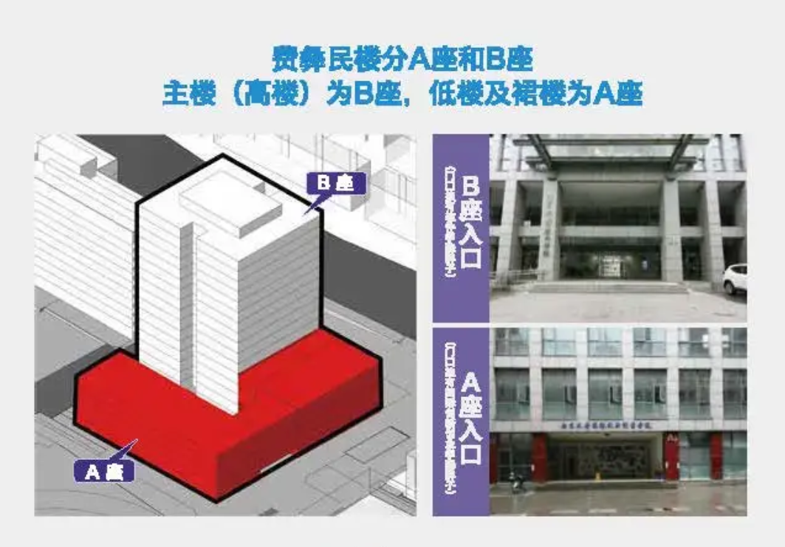

我要一个安静的环境写作业，有没有自习地点推荐？

**空闲教室**：仙林校区的仙一、仙二、逸夫楼A、B、C三个区域，鼓楼校区的郑钢教学楼、逸夫馆、新教、南教教室座位数量充足，有**联排和活动的两种座椅**可供选择。每间教室前后都配备有4-5个插座可供携带电子设备学习的同学使用。大家可以自行在南京大学APP上查询空闲教室，未用作考试的教室即可自习。教学楼一般在每天22：30左右清楼熄灯。

**出声场所**：仙林校区的仙一、仙二教学楼交界处的**思善堂，朗读亭和室外平台**为复习中需要背诵和讨论的同学提供了充足的空间，**逸夫楼一楼的候车室**也是大家出声背诵的好去处；鼓楼校区的**各教学楼大厅的座椅**和新教楼旁的**室外长椅**，也可供大家背诵讨论使用；苏州校区的**南雍楼大厅及周边庭院**也可以作为同学们背诵朗读与讨论学习的合适选择。

**通宵教室**：经学校相关部门研究决定，2024年11月27日至2025年1月12日本学期期末考试周结束，将开放仙林校区**择善楼一楼仙Ⅰ-106、Ⅰ-107**作为通宵自习教室，以满足同学期末复习、考研复习等自习需求。（每年政策都会有所变化！）

**杜厦图书馆**：二楼大厅放置有自助打印设备，三楼和四楼部分地方也可提供自助文印，二楼的花房、朗读亭、杜厦先生小展馆方便同学们出声讨论和背诵记忆；在鼓楼图书馆的新书角、展示大厅可以出声背诵。

**校内餐饮店**：温暖舒适、环境优雅，也是同学们自习、小组讨论的一大选择，仙林校区有计算机系（常州楼）的第三领域、新闻传播学院的News Café、敬文学生活动中心附近的星巴克、圣达楼院内的seso咖啡馆、学生宿舍一组团的邮局咖啡、小金金手作等等，鼓楼校区南园亦有issue咖啡馆（可借桌子~）。此外，仙一、仙二每层楼设有自助贩卖机，仙一、仙二二楼和郑钢教学楼一楼还设有咖啡机，逸夫楼B102教师休息室也提供餐食。

（高中延续了一些习惯……）鼓楼校区晨读可以去哪里？

**室外**

在刚进入汉口路校门右转的**罗根泽旧居**附近。

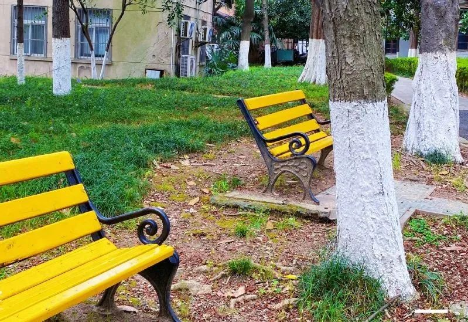

罗根泽旧居旁  

在**面对教学楼左前方的小径两侧**有许多位于草坪中的长椅。  

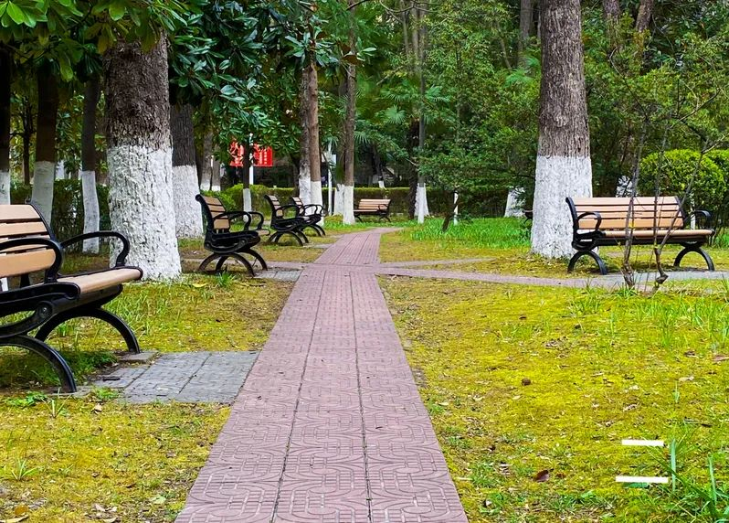

教学楼前

**榴园**有漂亮的亭子和回廊。

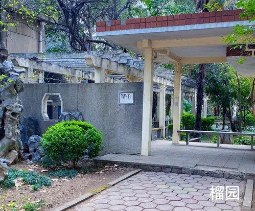

榴园

在**中大路中段右转，图书馆右侧处**，有漂亮的石凳、石桌。

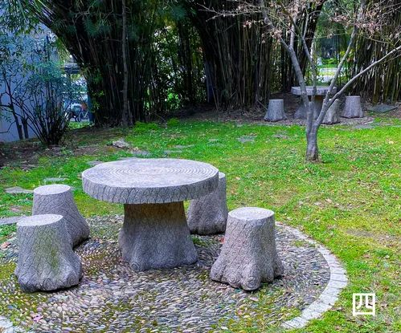

图书馆右侧

在**李四光雕像和金大苑中间**有一个造型奇特的长椅，大的半圆弧状的长椅中间还有一圈石凳围着一个石桌。

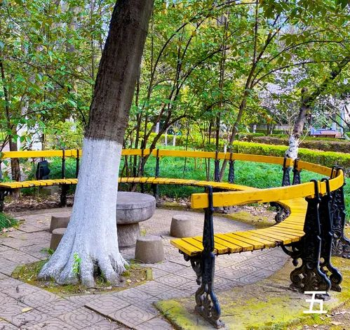

李四光雕像与金大苑中间

在**新教学楼和东南楼**中间有小圆凳和一个半圆弧型的桌子。

在**东大楼**附近，有一条林荫小道，小道一侧有一排长椅。

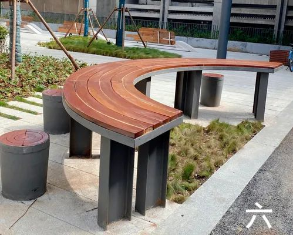

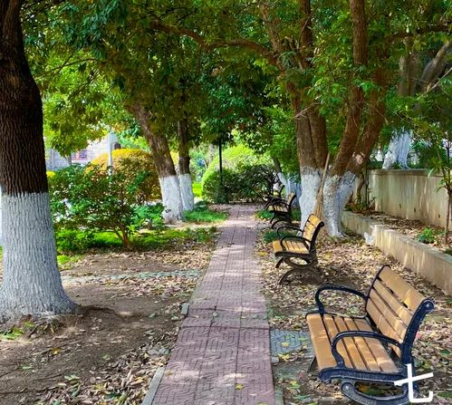

在**五二零纪念亭**附近，有一条小道两侧零星分布着几个长椅。

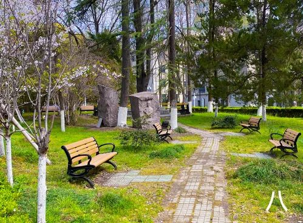

五二零纪念亭旁

在**新教学楼和东大楼之间**有两排造型精致的长椅。

在**东大楼和东北楼之间**。

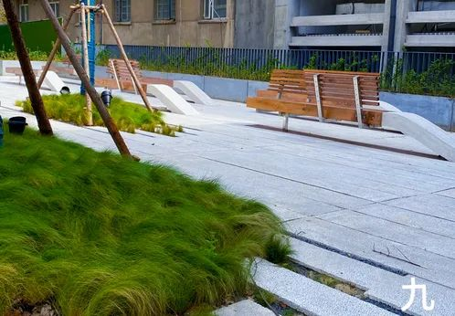

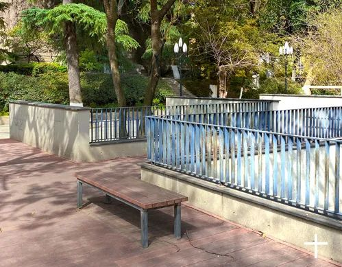

**室内**

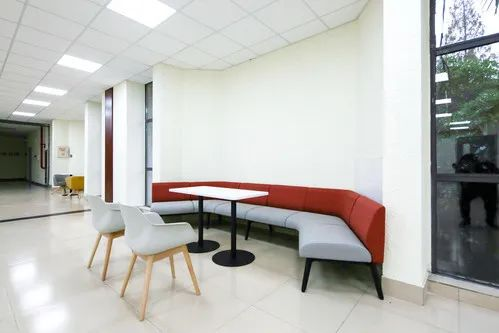

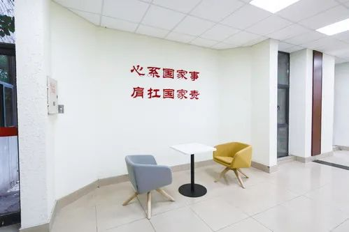

逸夫馆（馆1） 一楼 朗读区

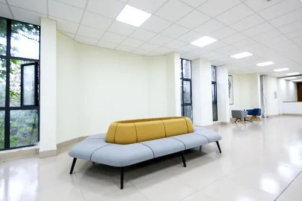

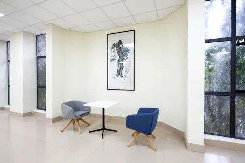

逸夫馆（馆1） 二楼 朗读区

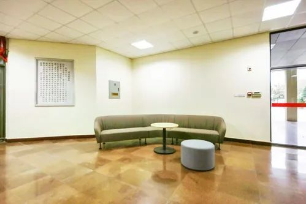

逸夫馆（馆3） 一楼 朗读区

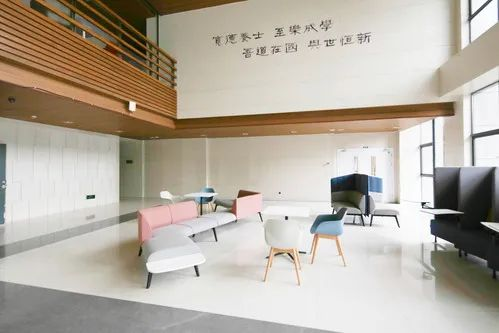

费彝民楼B座 一楼 朗读区

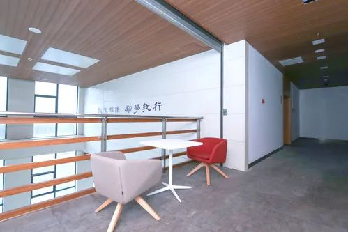

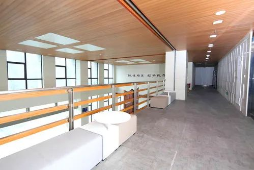

费彝民楼B座 二楼 朗读区

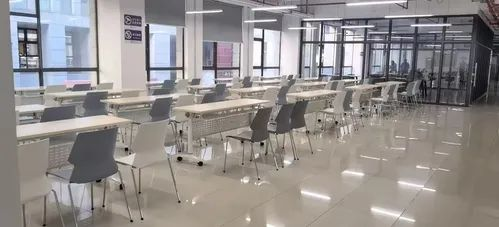

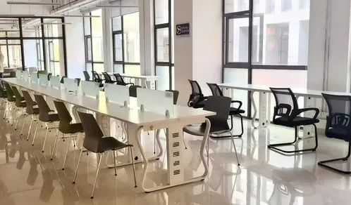

费彝民楼A座 二楼 朗读区

**总结：****费 Af2；费 Bf1f2；馆 3f1;馆 1f1f2（像不像神秘咒语~）**

****

仙林校区哪里可以面试啊？

新闻传播学院楼

二楼拐角处：较为隐蔽，适合小组面试

三楼多闻雅集：环境幽静，适合专注思考

四榉紫云间间：专业氛围，帮助保持自信

注意：如果需要更独立的空间，可以提前向辅导员老师申请，另因公共空间资源有限，请在遵守学院管理规定的前提下开展个人活动~

教学楼内标准教室：通常配备必要的教学设备，如投影仪、音响等，可以满足不同类型的面试需求。同学们可通过“南京大学APP”预先申请教室借用。

就业指导中心

328礼仪室：适会进行礼仪方面的面试或培训

332单面室：专门用于一对一的面试场会

333群面室：适合进行小组面试或团队讨论

335试课室：可用于需要特殊布置的面试场合

注意：**预约拨打电话：**025-89683307

**预约电话在线时间：**工作日上午8:30-12:00下午13:30-17:00

图书馆研讨室：环境安静，同学们可以在“南京大学APP”上提前预约

敬文学生活动中心九楼圆桌：环境典雅、舒适放松(注意：**预约拨打电话同上**)

（校外赶 ddl）我可以在校外使用统一身份认证登录直接访问电子学术资源吗？

●** 知网CNKI **  

   1.  使用非校园 IP 地址打开浏览器，输入 [https://fsso.cnki.net/](https://fsso.cnki.net/) 选择南京大学         

   2.输入南京大学统一身份认证（不受IP限制）  登陆成功后，即可访问资源     

**  ● SpringerLink   **

     1.使用非校园 IP 地址打开浏览器，输入[https://link.springer.com/](https://link.springer.com/)     点击“Login”     

    2.选择“Log in via Shibboleth or Athens”，在  Log in via Shibboleth 上面的“Select   yourinstitution”输入“Nanjing University”       

   3.输入南京大学统一身份认证（不受IP限制）      登陆成功后，即可访问资源     

**   ● SpringerNature   **

    1.  使用非校园 IP 地址打开浏览器，输入[http://www.nature.com/](http://www.nature.com/) 点击“Login”        2.选择 “Access through your institution”     输入学校英文名称“Nanjing University”       

    3.输入南京大学统一身份认证（不受IP限制）      登陆成功后，即可访问资源     

**    ● Royal Society of Chemistry   **

    1、使用非校园IP地址打开浏览器，输入  [http://pubs.rsc.org/](http://pubs.rsc.org/) 点击“Login”     

   2.选“Find My Institution” “Select Your   Institution’s Group” “China         CERNETFederation”

     3.选择自己的学校，输入“Nanjing University”      

     4.输入南京大学统一身份认证（不受IP限制）      登陆成功后，即可访问资源     

**   ● ScienceDirect   **

     1.使用非校园IP地址打开浏览器，输入[https://www.sciencedirect.com/](https://www.sciencedirect.com/)  点击“Sign in”

     2.在“Search for your institution and click the name to login”输入Nanjing University，或者在“Select your region or group”选择 China CERNET Federation(CARSI)       

    3.输入南京大学统一身份认证（不受IP限制）      登陆成功后，即可访问资源

