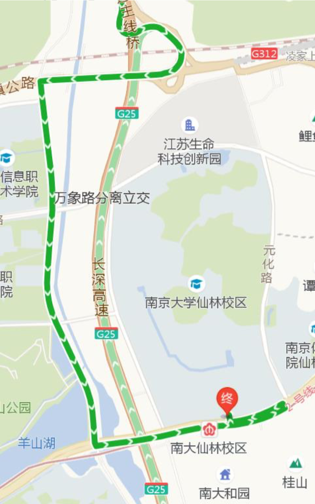
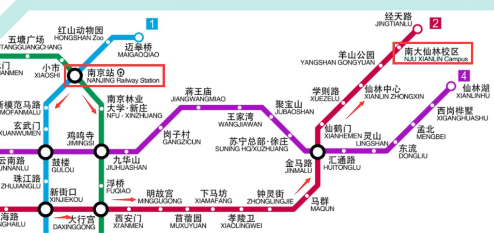
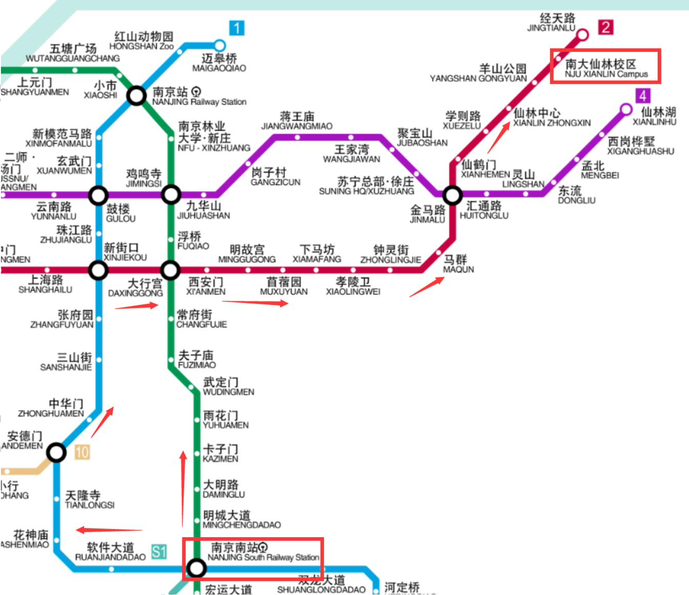
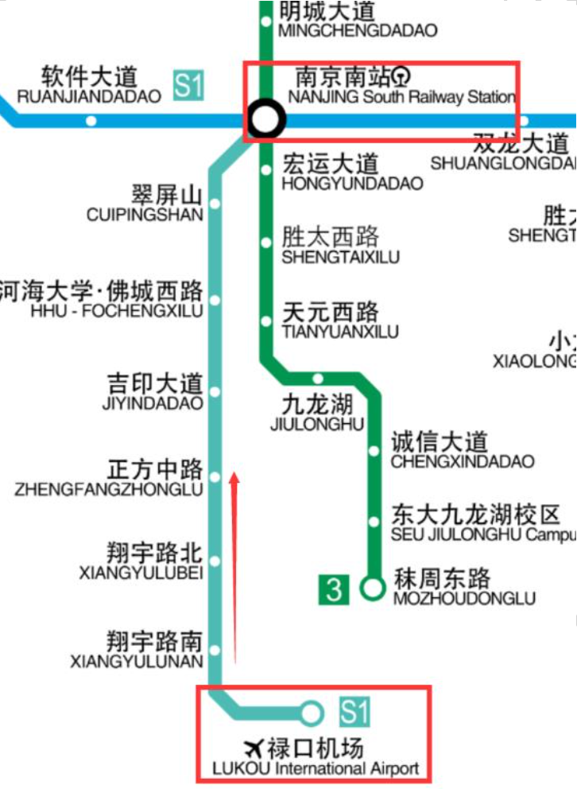

[南哪助手长期接受同学们投稿](https://www.yuque.com/greatnju/q-a/gw3phd#o8osi)

---

~~通过层层筛选和考核，各位小伙伴终于获得了南京大学的录取资格，即将在2020年9月来到南大仙林校区，开始为期4年（或更长）的本科生活。~~

**自2022年起，新生需首先进入鼓楼校区完成第一年的学习，请参阅**[鼓楼校区到校交通指南](https://www.yuque.com/greatnju/q-a/vbq9zd)

如果有来参观的需求，可以参考本教程。

自2012年起，仙林校区已经成为了南京大学的行政主校区。

本文将对南京市区内的主要客运枢纽到达仙林校区的方法进行简要介绍，以期帮助各位新生根据自己的需求选择交通方式，更便捷地到达仙林校区。

**注意，疫情管控期间只能在南门进校**

## 一、自驾
南京大学仙林校区位于南京主城以东，G25长深高速、G2501南京绕城高速高速并行段东侧，地址是**南京市****栖****霞****区****仙****林****大****道****163****号**。

自驾前往学校的同学，可在**G25****长深****高****速**的**栖****霞**枢纽下高速，往**市区****/****仙****林****（****九****乡河****西路****）**方向行驶，左转进入九乡河西路，再左转进入仙林大道，按照导向标识指引即可到达仙林校区正门（即南门）。

## 二、铁路
目前南京全大市内办理客运业务的铁路车站有：南京站、南京南站、仙林站、江宁站、江宁西站和溧水站。其中，**南****京****站**和**南****京****南****站**是主要客运车站，建议选择铁路来校的同学买票到上述两个车站；**<u>不</u>****<u>建议</u>**新生到仙林站下车来校；**<u>请勿</u>**到其他车站下车来校。

### 1．南京站
如果车票票面上写着终点站是“南京”，则是到南京站。

#### a) 如选择地铁来校，可以：

      ①乘坐驶往秣周东路（或胜太西路）方向的地铁3号线到大行宫站下车，同站换乘驶往经天路方向的地铁2号线到倒数第二站“南大仙林校区”站下车，出站后从地下通道过马路就可以看到南大仙林校区的大门啦！（17站）

      南京站的3号线首班时间6:23，如果坐首班车到大行宫的话，那时候2号线就已经开始运营了。大行宫站,2号线末班时间23:25，所以虽然南京站的3号线末班车是23:23，还是需要大家尽量在23:00之前从南京站乘坐3号线。

      ②乘坐驶往中国药科大学（或河定桥）方向的地铁1号线到新街口站下车，同站换乘驶往经天路方向的地铁2号线。（19站）  
      南京站的1号线首班时间5:46，到达新街口的时间是5:57，可是新街口的2号线首班是6:22，所以如果坐1号线首班车到新街口的话需要等一段时间才能坐上前往仙林校区的列车。新街口站的2号线末班时间23:23，所以虽然南京站的1号线末班车是23:23，还是需要大家尽量在23:00之前从南京站乘坐1号线。

      乘坐地铁全程约50分钟，票价6元。

#### b) 如选择公交来校，可以：
      ①由南京站南广场出站，向右（西）侧步行约300米，至**龙蟠****路****·****南****京****站****西**公交车站，乘坐**元化****路****方****向**的**D1****（****大****站****快****车****）**路公交车，至倒数第二站**南****大****仙****林校****区站**下车，过地下通道即到。

      车程约45分钟，车费3元。始发站中保村站发车时间6:30~22:15。

      

      ②由南京站南广场出站，向左（东）侧步行50米至**南****京****站****南****广****场东**公交车站，乘坐**灵****山****北****路****总****站****方****向**的**97****路**公交车至**中****医药****大学**公交站，过红绿灯路口至斜对面到**羊****山****公****园****地****铁****站**公交站，乘坐**322/325/178/743****路**公交车**向****东**至**南****大****仙****林****校****区****站**下车即可。

      总车程约45分钟，合计车费4元。97路发车时间为6:30~23:00。

      ③如在夜间到达南京站，可由上一条所示到达**南****京****站****南****广****场****东**公交车站，乘坐**经****天****路****方****向**的**Y34****路**公交车，至**南****大****仙****林****校****区****站**下车即可。

      车程约45分钟，车费2元。本站发车时间为23:40~6:00，约50分钟一班。

#### c) 乘坐出租车约60元，约35分钟可到达学校。
### 2．南京南站
如果车票票面上写着终点站是“南京南”，则是到南京南站。

#### a) 如选择地铁来校，可以：

      ①乘坐驶往林场方向的地铁3号线到大行宫站下车，同站换乘驶往经天路方向的地铁二号线。（21站）全程约60分钟，票价5元。

      南京南站的3号线首班时间6:19，如果坐首班车到大行宫的话那时候2号线就已经开始运营了。大行宫站的2号线末班时间23:25，所以虽然南京南站的3号线末班车是23:19，还是需要大家尽量在23:00之前从南京南站乘坐3号线。

      ②乘坐驶往迈皋桥方向的地铁1号线到新街口站下车，同站换乘驶往经天路方向的地铁2号线。（22站）全程约70分钟，票价7元。

      南京南站的1号线首班时间6:13，如果坐首班车到新街口的话那时候2号线就已经开始运营了。新街口站的2号线末班时间23:23，所以虽然南京南站的1号线末班车是23:54，还是需要大家尽量在22:50之前从南京南站乘坐1号线。

#### b) 如选择公交来校
（**<u>本线路高能，切勿携带大量行李尝试！</u>****！**）：

      ①可在**南京****南****站**公交站乘坐**84****路**至终点站**理****工****大**，向前（东）步行500米（也可以乘坐任意公交车一站路）至**孝****陵****卫**公交站，乘坐**310****路**公交车至**仙****隐****北****路**公交站（18站），同站换乘**D1****（****大站****快****车****）**路公交车至**南****大****仙****林****校****区**站（6站）即可。

      本线路总票价7元，不保证150分钟可以到校。

      ②可在**南京****南****站**公交站乘坐**791****路**公交车（农副产品物流中心方向）至**上****高****路****市****井**公交车站（23站），同站换乘**743****路**公交车（经天路地铁站西方向）至**南大仙林校区**站下车（37站）即可。

      本线路总票价4元，但是由于743路车60至90分钟一趟，因此无法保证三小时内可以到校。

#### c) 乘坐出租车约需90元，约40-50分钟可到达学校。
### 3．仙林站（不建议！！）
出站后向右（西）侧小路步行至金创路隧道涵洞前，在**金****港****科****创园南**公交车站乘坐**323****路**（太阳城方向）公交车至**学****则****路****地****铁****站**站（7站），步行30米到达**学****则****路****地****铁****站**，乘坐地铁2号线（经天路方向）到**南大仙****林****校****区****站**下车即可。全程约需40分钟，车费4元。

### 提示
      火车站换乘地铁是不需要跑到火车站外面的，刚出站应该就能看见地铁的指示标志，注意标牌，跟着走就行了，不清楚的话也可以向火车站工作人员询问。南京地铁的标志是这样的（下图）。

      不同线路地铁的换乘也是不需要出站的，同样注意各种标识，需要时咨询工作人员。乘坐地铁时，先到自动售票机上购买地铁票，触屏使用机器，点击你的到站，即地铁二号线的倒数第二站----南大仙林校区，选择购买的张数，机器会显示票价，投入1元硬币或者面额为10元或5元的平整纸币，成功即可取出找零和地铁票（蓝色圆片）。进站刷票闸机开，出站将票投入回收口。如果自动售票机处排队等候人过多，也可以在人工售票处购票。

南京地铁可以使用支付宝扫码进站，在支付宝搜索南京地铁即可，无需排队买票。

:::danger
**<u>注意</u>****：**地铁上禁止饮食，会被罚款的哦==

:::

## 三、公路客运
南京主城主要的公路客运站点有：南京汽车客运站（小红山汽车站）、南京长途汽车东站（长途东站）、南京长途汽车客运北站（桥北客运站）、南京汽车客运南站。

### 1．南京汽车客运站（小红山汽车站）
小红山汽车站位于南京火车站北广场东侧，可以参照火车到达南京站的情况。

### 2．南京长途汽车东站（长途东站）
出门右转50米到达玄武大道后，再右转步行约50米到达**玄武大****道****·****长****途****东****站 **公交车站，乘坐 **D1****（大****站****快****车）**路公交车至**南大****仙****林****校区**站（9 站）即可。车费3元，车程约35分钟。** **

### 3．南京长途汽车客运北站（桥北客运站）
出门过马路至对向的桥北客运站公交车站，乘坐503路区间（柳洲东路总站西方向）至**柳洲****东****路****总****站****西**（5站），步行50米至**柳****洲东****路**地铁站，乘坐驶往秣周东路（或胜太西路）方向的地铁3号线到**大****行宫****站**下车，同站换乘驶往经天路方向的地铁2号线到**南****大****仙林****校****区****站**下车即可。全程约需90分钟。

### 4．南京汽车客运南站
汽车南站位于高铁南京南站内西北侧，可以参照铁路到达南京南站的情况。

## 四、飞机
民航客机降落在南京禄口国际机场。

### a) 乘坐地铁来校
乘坐南京**地****铁****S1****号****线****（****机****场****线****）**到终点站**南京****南****站**，然后参考乘坐火车到达南京南站的情况。

全程约28站，约110分钟，票价9元。机场线S1首班6:40，末班22:00，全程约40分钟。

### b) 乘坐机场巴士
在南京禄口国际机场T2航站楼到达厅外乘坐南京**机****场****巴****士****1****号****线**（南京火车站方向），在**西安****门**站（倒数第二站）下车，向前步行200米至西安门地铁站，乘坐**地****铁****2****号****线**（经天路方向）到**南大****仙****林****校区****站**下车即可。

其中机场巴士车费20元，地铁4元。约90分钟可到校。

### c) 乘坐出租车来校
途径G25长深高速、G2501南京绕城高速并行段，费用在200元左右（不含高速通行费），约1小时可到达学校。

---

[南哪助手长期接受同学们投稿](https://www.yuque.com/greatnju/q-a/gw3phd#k6p5Y)

