[南哪助手长期接受同学们投稿](https://www.yuque.com/greatnju/q-a/gw3phd#o8osi)

---

很多同学对南大的宿舍非常好奇——未来的四年自己究竟会在怎样一个生活环境中？宿舍号到底是什么，南大的宿舍怎么样？对于大家的疑问，我们整理出了一份宿舍的介绍，以问答的形式呈现给大家。

#### Q：我是21级的新生，请问怎么查宿舍啊？
A：在南京大学APP中搜索或智能问答输入“宿舍申办”按提示签名（可能需要重新进入才能）查看宿舍分配情况。寻找室友可将宿舍号挂在群名片上，在书院群寻找效率更高。

#### Q：我的宿舍区是第一组团，宿舍楼是仙林宿舍 2 号楼，这是什么意思啊？有的同学查到住在二组团，有什么区别吗？
A：组团是南大对校园内某些区域的划分，具体请看这张图：（群相册里有大图）

左边椭圆形即为一组团，右边的圆形是二组团。

一组团每个楼层的宿舍分布是这样的：

一组团每间宿舍是长这样的：

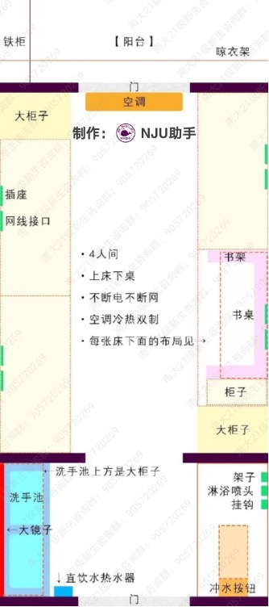

二组团宿舍有所不同，是三个小间+1客厅的套间。每个小间住四个人。以六栋为例，楼栋被分为四个小区，各区仅能从一楼互通，二楼及以上不能互通。（即如果想从一区四楼到二区四楼，必须先下楼到一楼再从二区的楼梯上去）楼栋布局：（图源21级某热心学姐）

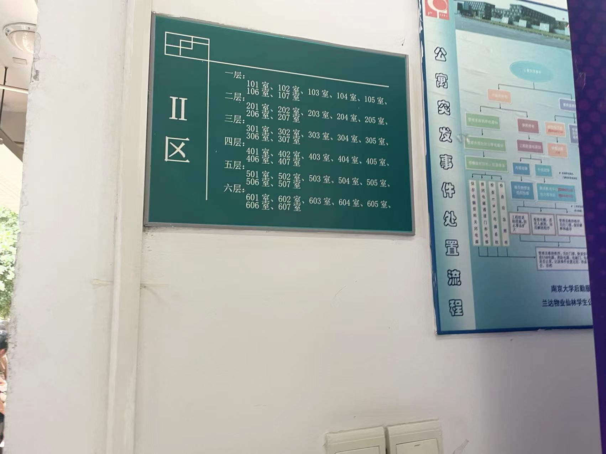

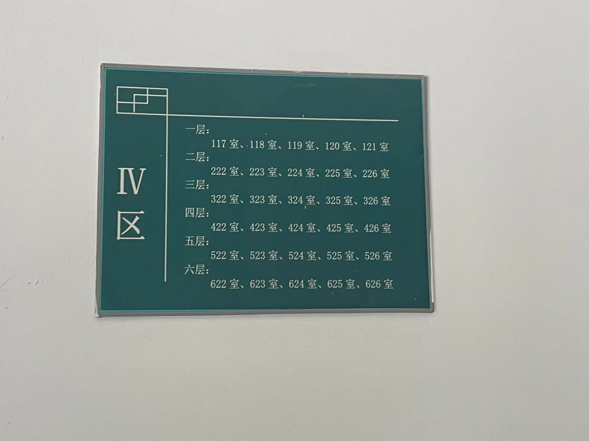

布局如下：

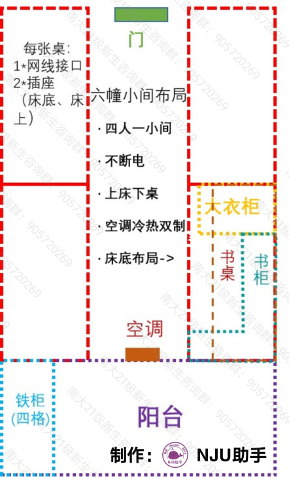

每个小间和一组团一样，也是四人间，不过因为每个套间里有公共卫生间，所以相比一组团宿舍，每个小间里面少了洗手池和卫生间部分。

#### Q：我有个同学住二组团，二组团的一个套间就对应一个宿舍号对吧，那她该怎么知道自己到底住哪个小间呢？
A：她领宿舍钥匙的时候宿管阿姨会告诉她的，而且根据往年情况，小间的门上也会贴着哪一间住哪四个人。

#### Q：哦哦哦，那我的宿舍号是 B501，这又是什么意思啊 QAQ
A：其实上面那个一组团同楼层宿舍分布图已经很清楚啦，A/B 是分区，两个分区对称，没有什么区别， 501 的第一位代表楼层，你就是五楼。具体在宿舍楼中的位置那个图也很清楚了。

#### Q：宿舍里有独卫么？有热水么？怎么洗澡？
A： 极少部分本科生宿舍是有独卫且卫生间有热水的，大部分本科生宿舍有独立卫生间，但只能洗冷水澡。要在宿舍里洗热水澡可以在宿舍楼一楼的开水房打热水上来洗，开水三秒钟一分钱。还可以使用洗澡精灵之类的虹吸式热水器利用宿舍卫生间的喷头进行热水淋浴。多数人会选择去每栋宿舍楼一楼的公共浴室洗。公共浴室安装有单人隔间，开放时间为13：00 – 17：00和18：00 - 23：00，因为17:00-18:00是浴室消毒打扫时间，所以不开放哦。不用害怕，洗上几次就习惯了。可以选下午人少的时候去洗。浴室洗澡是按时间计费，大概三秒钟一分钱。

每间宿舍有直饮水热水器（请理解为能烧热水的饮水机），需要支付宝或者APP扫码使用，饮用的凉水和热水都不用愁，每栋宿舍楼一楼也有开水房可以打到开水。

#### Q：哦，那宿舍里能买洗衣机么？
A： 原则上不能。但是，我很丑，而我没有让你看见我，你也没听别人说我丑，那么对你来说，我就不丑。 不过其实买洗衣机的必要性不是那么强，每栋宿舍楼一楼都有洗衣房，有若干台洗衣机，使用U净app扫码洗衣。

如果你有足够合理而充分的理由给自己宿舍放洗衣机的话，可以写申请交给辅导员签字然后给宿管部，批下来你们就可以合法放置洗衣机。

#### Q：宿舍里怎么上网啊？网速如何？收费呢？
A： 具体看南大校园网使用指南

[新生校园网使用指南](https://www.yuque.com/greatnju/q-a/vqnpi0)

#### Q：宿舍楼一楼都有啥啊？除了洗衣房。宿舍楼拐角那个地方是干啥的。
A： 洗衣房，微波炉，冰箱，公共浴室，24 小时自动贩卖机，通宵自习室，宿管室，开水房。

#### Q：晚上熄灯吗？断网吗？
A： 仙林本科生宿舍楼每个工作日的前一天十一点半关大灯，不过插座不断电，所以影响不大。24 小时不断网，只是晚上 11 点到第二天早上 6 点限制部分网游，可以用加速器或其他什么代理突破.

#### Q：对了忘了问了床位怎么选？宿舍是怎么排的？
A： 宿舍是学校统一安排，每个院系的集中在一起，具体安排请大家等待学校的通知。床位由你们宿舍四个人自己决定，一般是先到先选。都是上床下桌，四个床位区别并不大，自选所好即可。

#### Q：宿舍电费怎么算
A：住宿费1200元中包括了每生每年80度电，超出部分自行购买，一度 0.5483 元。电脑的功率不小，基本上是平时耗电的大头。冬夏开空调用电比较厉害，尤其是冬天，开辅热的情况下，空调功率是夏天的二倍还多，每周耗费50块钱起步，建议每次多充点电费。

充值方法：信息门户或者南大app，22：40到0：00不能充值。楼下多媒体机：随时充值。

:::info
**更新：现在大多数宿舍都改为了1500元标准的带热水器宿舍，一般赠送电量是每生每年320度电。**

:::

#### Q：为什么我充完电费，宿舍还是没电啊？
A：新生账户里是默认有电费的，宿舍没电一般是因为电闸没合上。电闸在宿舍门外的墙上。如果充值的电费等了很久还没有到账，那么打电话给itsc询问。

#### Q：床的大小是多少？需要买蚊帐嘛？床上有没有挂蚊帐的杆？如果买床帘买多高的？
A： 2M*0.9M（理论大小，实际上床板大小可能接近194*87，不同床会有误差，但是适当买大一点可以盖住床和墙面之见的缝隙，所以还是推荐2*0.9的床上用品），如果你比较招蚊子夏天还是挂上吧，床上是有挂蚊帐的金属杆的。

       如果买床帘，买1.2m高的足够了。如果想自己买被套套在学校460套餐的被芯上，那么尺寸是2*1.5

床帘不用支架也可以用，如果要买支架，实际上只需要一根2m左右的长杆就够！

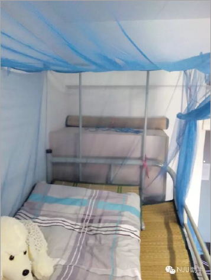

床的护栏高度约为20厘米：

#### Q：能用电热毯吗？都有啥违规电器？宿舍里最大能用多大功率的电器？吹风机能用吗？会查房么？ 
A：电热毯、“热得快”等易发热容易有安全隐患的电器都属于违规电器，另外大型电器如洗衣机、冰箱也属于违规电器。

       宿舍里负载最大功率可能在 1000W 左右，分段限电，如果要用吹风机得从最低档慢慢推上去，直接上高档容易跳闸。

       随着安全意识的提升，宿管查房频率在逐渐升高，部分宿舍楼查房前会提前通知。主要检查违规电器。宿舍卫生主要靠自觉维持。

#### Q：宿舍一进去会有生活用品，清洁用具什么的么？还是光秃秃？
A： 宿舍里一定会有的是四个凳子。清扫用品某些宿舍楼某些年宿管会发扫帚簸箕拖把三件套，有的宿舍则进去以后可以看到上一届学长学姐留下的"遗产"。如果什么都没有就自己买呗~

 

#### Q：空调怎么用啊？随便开吗？费用怎么算？
A： 进宿舍的时候从宿管阿姨那里领空调遥控器，开不开，什么时候开，你们宿舍四人协商决定，尽量照顾到每个人的感受。费用就是计入电费，电费计费方法上面说过啦。

#### Q：有没有宿舍实景照片啊？光说感觉没有感性认识 QAQ
A： 好吧好吧，来咯~~

上床下桌~

桌面的尺寸

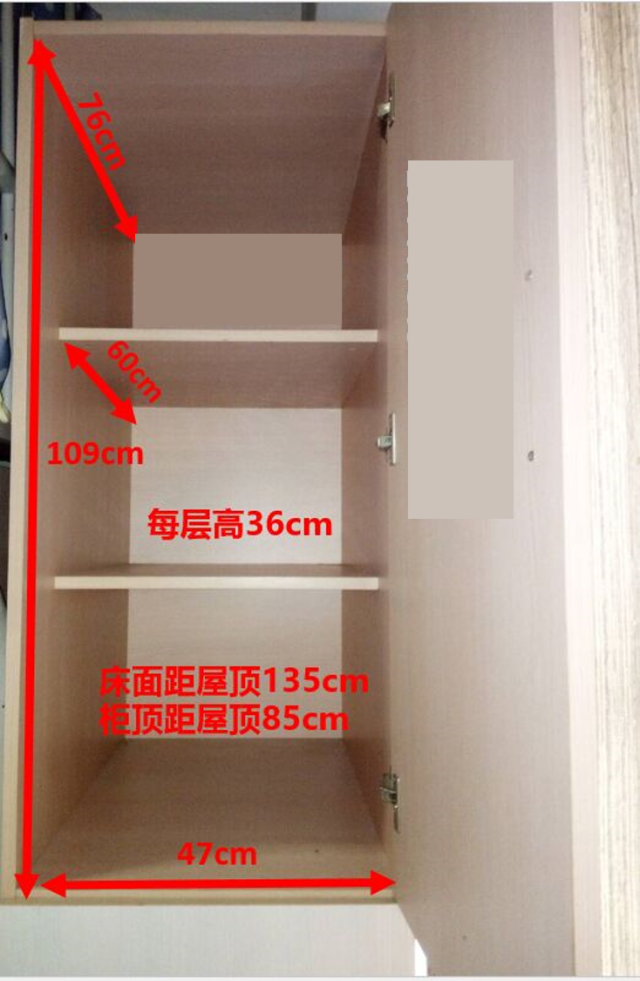

柜子之一的尺寸

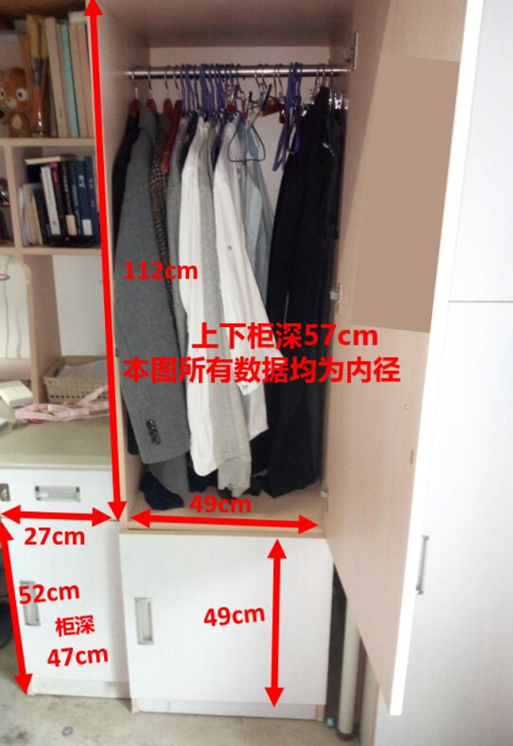

衣柜的尺寸

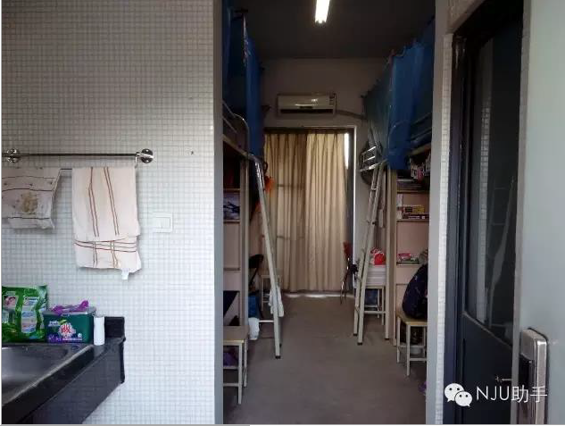

进门后是洗手池和卫生间

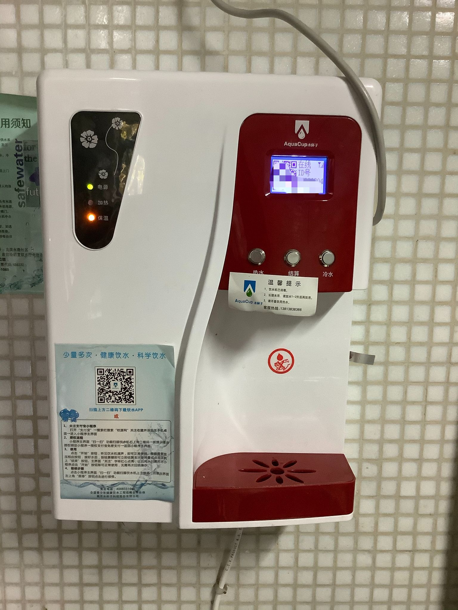

直饮水热水器

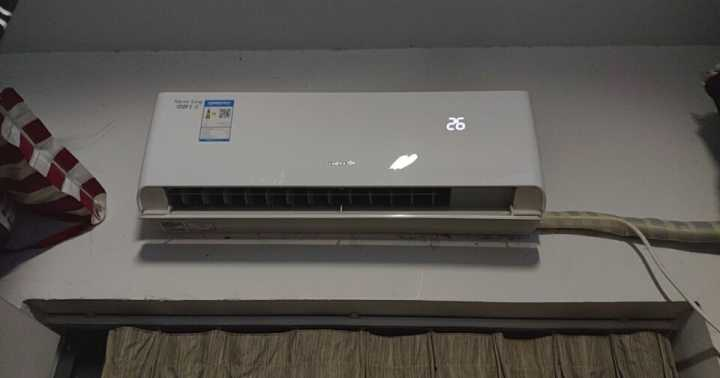

2019年暑假换新过的空调！

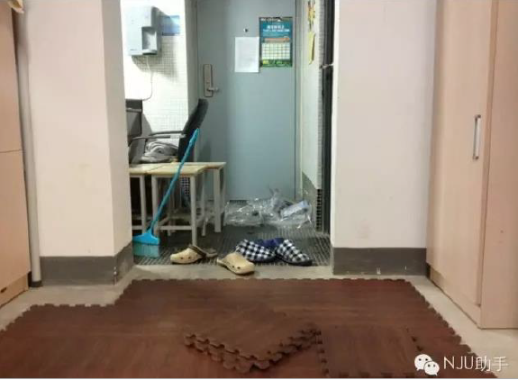

宿舍是水泥地，可以自己铺地垫~

**二组团六栋部分换新家具内景：**

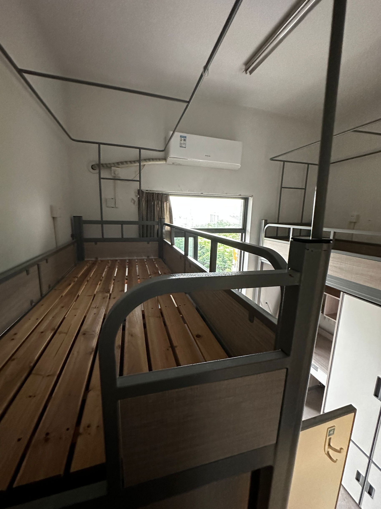

>        宿舍内部照片来源于网络，有几张是软院 12 级 WJN 学长的，有几张出处考了半天没考出来，如果照片所有者看到了需要版权声明或者希望删除引用请联系我们。在此向图片所有者表示感谢！
>
>        南大仙林校区地图的作者是南京大学房产处，新版地图还没有发布。一组团宿舍示意图是浮芸画的，一组团宿舍同楼层宿舍分布是浮芸拍的，二组团宿舍布局是葭葭画的。
>

#### Q：我能去朋友的宿舍逛逛吗？
A：理论上，你只能进入自己所在的楼栋，但实际上，可以扣押校园卡或者身份证进入同性朋友的楼栋。

 

#### Q：宿舍会查寝吗？
A：辅导员和宿管会在“宿舍评比”等时间节点进行查寝，查寝前会通知。查寝频次很低，两三个月一次吧。

#### 附图
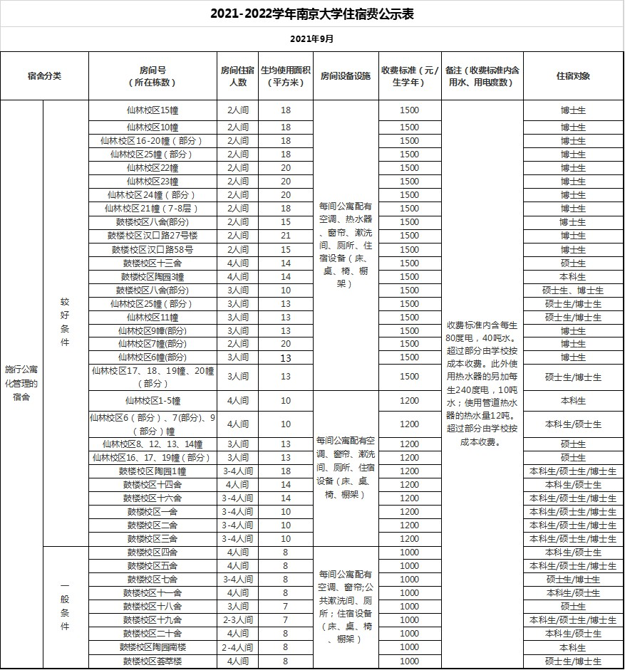

 

如需引用或转载请保留版权信息。

---

[南哪助手长期接受同学们投稿](https://www.yuque.com/greatnju/q-a/gw3phd#k6p5Y)

