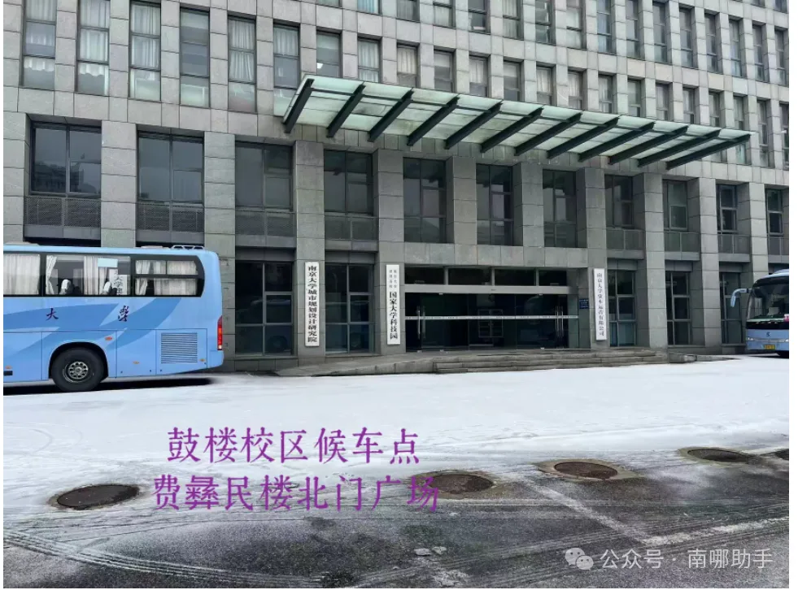
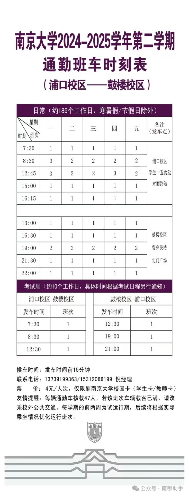
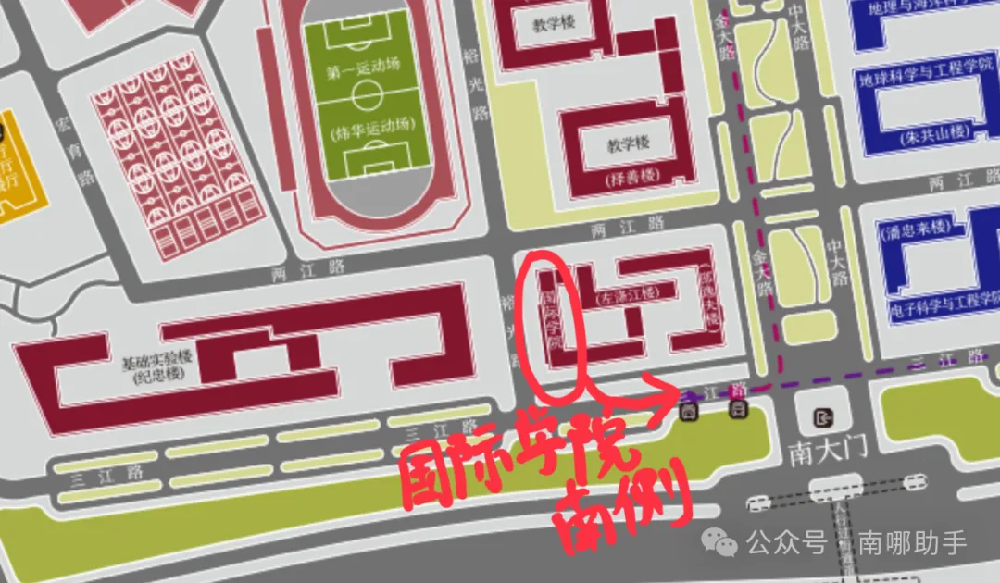

欢迎各位同学投稿，本指南将不断更新

投稿地址：nannahelper@163.com

[南哪助手长期接受同学们投稿](https://www.yuque.com/greatnju/q-a/gw3phd)

# 开学报到：
根据23级经验，浦口校区报到在**浦口校区食堂门前空地**，24级具体地点等待通知。

可以乘坐**地铁3号线**至东大成贤学院站，3号口出，然后由东大成贤学院站换乘**公交**到南大浦口校区南站，或者由东大成贤学院站打车到南京大学浦口校区南2门。南京站和南京南站都在3号线上。

或者从火车站/机场直接打车到南京大学浦口校区南2门。

# 跨校区通勤：
## 1.鼓浦：
### 方式一：通勤校车
浦口校区候车点为**学生第十五食堂**(原浦口校区学生第一餐厅，现更名为学生第十五食堂）对面；鼓楼校区候车点为为**费彝民楼北门广场**。

~~**具体班次**~~~~如下：~~

最新班次如下图：  

**乘车注意事项：**

[1] 票价**4元**/人，**仅限刷南京大学校园卡**；

[2] 请提前**15分钟**到达候车点，排队候车，切勿拥挤；

[3] 通勤车辆每辆核载**47 人**，若载客人员已满，请自行改换其他交通方式；

[4] 前两周为试运行，后续**将根据实际情况进行优化调整**，请大家及时关注最新通知。

### 方式二：地铁
如果你要去的地方离北园东北门近：3号线在鸡鸣寺转4号线在鼓楼站下车从5号口出站

如果你要去的地方离北园北门进：3号线在鸡鸣寺转4号线在云南路站下车从3号口出站

如果你要去南园：3号线在南京站转1号线在珠江路站下车从1号口出站

### 方式三：打车
根据经验，正常情况下在35r上下

## 2.浦仙
### 方式一：地铁1（根据经验，这样比3号线在大行宫转2号线耗时短）
3号线在鸡鸣寺转4号线在金马路转2号线在南大仙林校区站下车，需要时间大约在1h45min以上

### 方式二：地铁2
3号线到南林，出来换乘D1路公交（可以通过手机提前查询实时公交，如果不能衔接上就不要坐），一个多小时出头就能到。

### 方式三：打车
根据经验，走二桥的话早上需要花费50-60min左右的时间到仙林校区，花费在100r-130r之间（包含过路费10r）

如果是周一或者假期结束后的第一个工作日，非常容易遇到堵车等情况，请预留充足时间（我最久的一次是花了90min才到仙林，在路上要被堵成傻狗了……）

如果想省钱走免费的大桥或者隧道的话，高峰期必然堵车，比走二桥至少慢15min以上，请预留充足时间

### 喜报！仙浦班车开通了！！！！！！
和鼓浦校车一样，仙浦校车将在工作日（周一到周五）运营，具体发车时间为：

浦口校区：每天两班，分别在7:30、12:45发车；

仙林校区：每天两班，分别在13:00、19:00发车。

仙林乘车地点：

## 3.浦苏（待补充）
应该不会有人这么倒霉要浦苏通勤吧……蹲一个倒霉蛋投稿，投稿地址：nannahelper@163.com

  
如果你认为你的文章对南大er有帮助，欢迎联系南哪助手QQ**492711989**投稿。

#### 
:::color5
**南哪助手是南大若干学生自发组成的非营利性民间兴趣小组。转载请注明来源。**

:::

#### 

