[南哪助手长期接受同学们投稿](https://www.yuque.com/greatnju/q-a2.0/gw3phd)

# 食
## 食堂就餐
目前浦口校区食堂有两个依然处在营业中，分别是~~一食堂~~（现在改名叫学生第十五食堂了）和民族食堂。

具体位置如图：

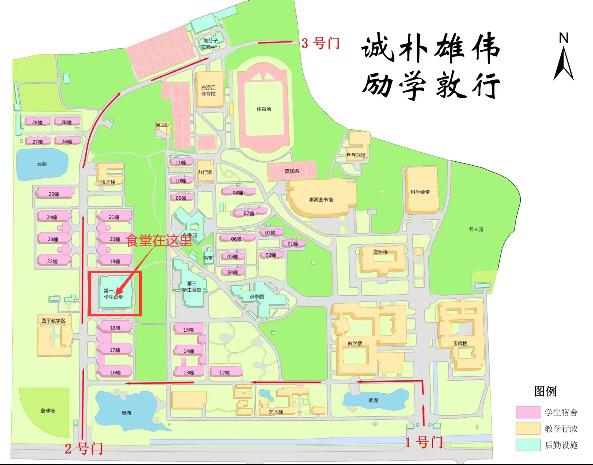

一食堂和民族食堂在同一栋楼，**民族食堂**在一食堂楼上，大家进了一食堂之后可以看到引导牌。

食堂外有洗手间。

相比于鼓楼和仙林，我认为浦口食堂的优点在于价格，总体上来说，它的价格和它的质量是较为匹配的。浦口食堂的突出弱点在于，品类和口味极为匮乏和单调，虽然食堂门口摆了很多展板介绍各个窗口的的菜品，但是建议大家**降低期待**，因为很多菜品食堂其实已经不再售卖了，同时，**没有希望就没有失望。**

浦口食堂的营业时间较短，建议选择食堂用餐的同学合理安排自己的用餐时间。

## 外卖
与其他几个校区一样，浦口校区外卖没有办法送到宿舍楼下。

不过南2门有外卖柜，丢失或者拿错外卖的可能性不大。

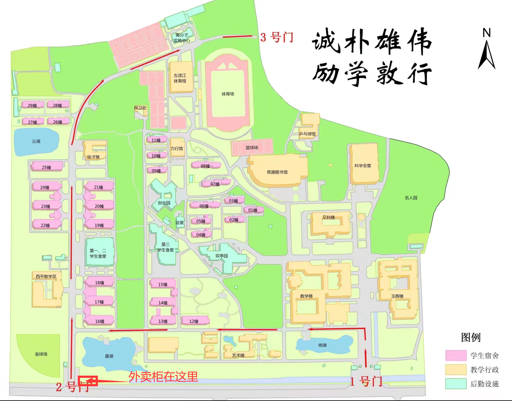

## 外食
校园外较近的几个小型“商圈”分别是香溢紫郡广场、力朋广场和弘扬时光里，具体位置如下图：

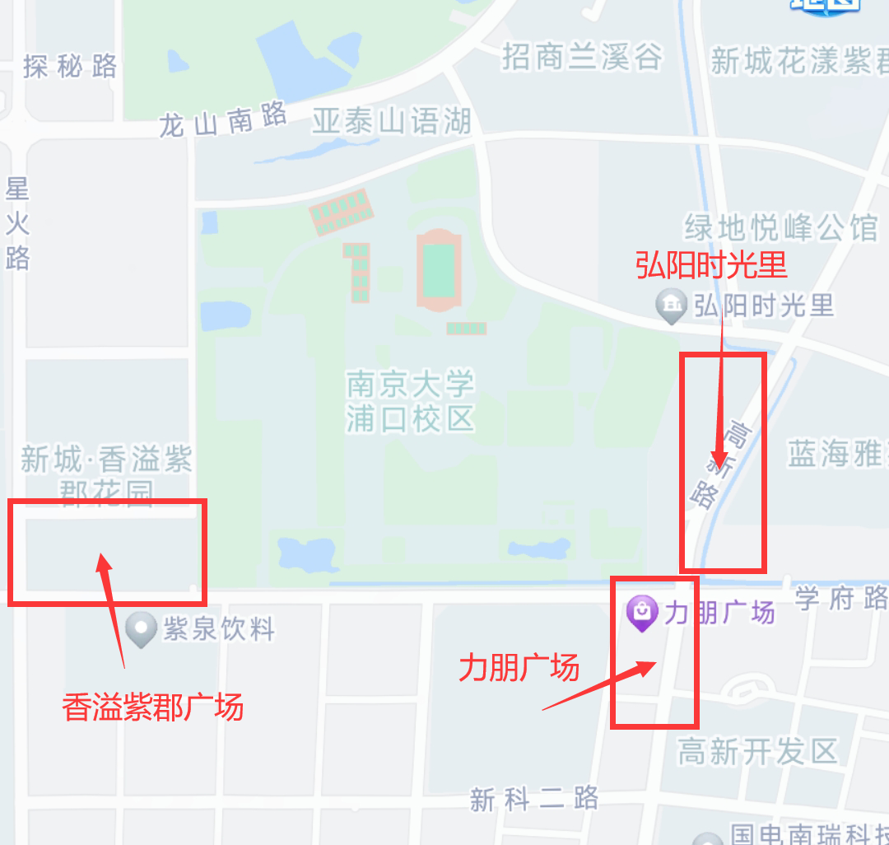

南2门（也就是离宿舍区更近的那个门）离香溢紫郡广场比较近。

南1门（也就是离教学区更近的那个门）离弘阳时光里、力朋广场比较近。

**2024.11.12更新：**

商圈上新！

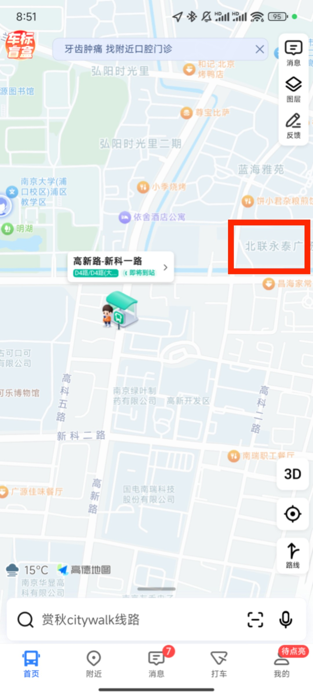

北联永泰广场，出了南1门之后步行大约7分钟，这里目前有马伍旺、瑞幸、肯德基、霸王茶姬、泸溪河、米村拌饭、湘菜等等美食！

香溢紫郡广场和力朋广场都有药店；香溢紫郡广场有小型生活超市和水果店；香溢紫郡广场奶茶店比较多，茶百道、蜜雪冰城、沪上阿姨、coco都有；弘阳时光里的烧烤店、火锅店比较多。

除此之外，其实大家的饭店都差不多，主要还是面馆、米线、黄焖鸡、酸菜鱼、冒菜、家常炒菜等，价格也非常平价。

（图为香溢紫郡广场）

如果大家想搞点中型/大型聚餐或者想吃点好的，龙湖天街也是不错的选择。当然，价格相对来说也会贵一点。

南1门与南2门均有公交可以直达，距离比较近。不过大家一定要**注意公交末班车的时间，做好合理规划。**（有的公交晚上十点多就停运了……）

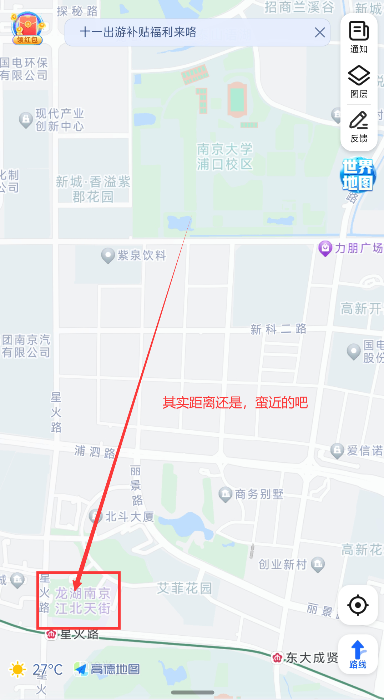

## 一些大家可能比较关心的问题
### Q：浦口有瑞吗？有麦吗？
A：很遗憾，没有麦。至于瑞幸，只在食堂里看到了遗址。~~至于未来会不会有，至少目前没有听说任何小道消息，一切都是未知数……~~

更新：香溢紫郡广场有瑞了！

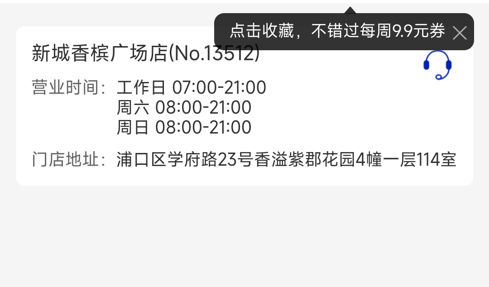

### Q：难道浦口校园里没有吃的吗？就像仙林汉风堂之类的小店也没有吗QAQ
A：没有……在双亭园看到了曾经一些校内小店的遗迹，但是很可惜，每家店都落灰挂锁了。

### Q：有便利店吗？
A：~~有罗森。如果同学们想在早上吃点比较热乎的包子、粽子、烧麦之类的东西当早餐，建议早点去，去晚了可能就没啥剩下的了。（罗森营业时间调整了，现在是上午十点开始营业，下午起点关门，早餐木有了……）罗森具体位置如下图：~~

~~罗森换地方了，目前在食堂二楼，和打印店在一起。~~

似乎啥也没有了……

# 住
## 浦口住宿条件概览
浦口的宿舍条件相对来说还是很不错的，目前都是双人间，独立卫浴，然后两个寝室合用一个大阳台，具体请看示意图（仅供参考，具体请以实际情况为准）：

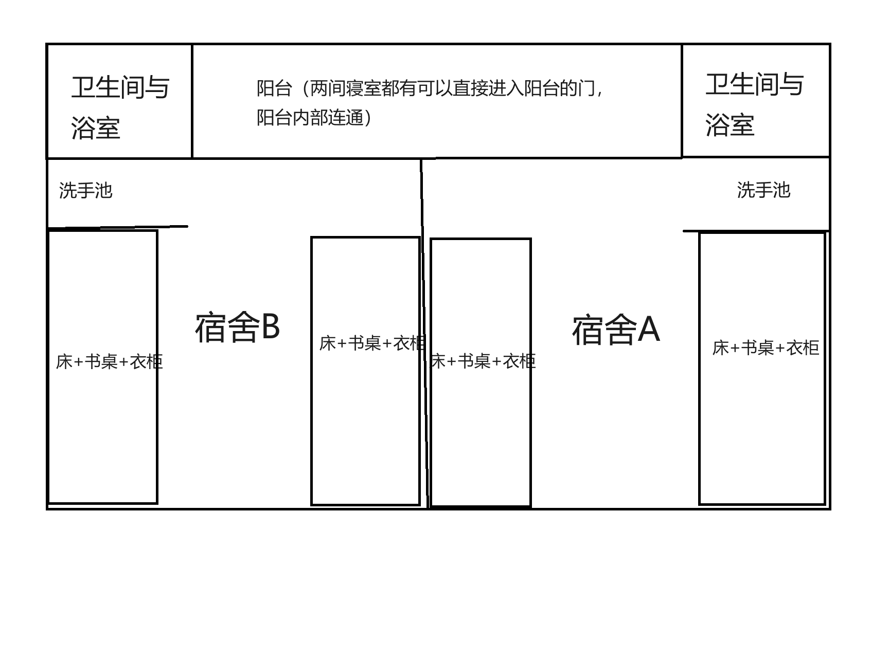

（画得比较粗糙，但是意思大概就是这么个意思）

每层楼都有公用的洗衣机，下载u净app扫码即可使用；

每层楼也都有公共饮水机，刷校园卡就可以接水，冷水热水都有；

宿舍楼内有庭院，庭院里有晾衣杆，天晴的时候晒被子也很方便（有一些宿舍楼没有庭院，但是在楼下也有晾衣杆可以用来晾晒）。

宿舍楼有门禁，需要刷校园卡通过；

晚上锁门时间大概是晚上12点；

早上宿舍楼最早大概在6点半开门，如果有特殊需求建议提前联系宿管阿姨。

## 牛油果绿家具
根据大家的经验分享，目前有两种家具款式，一种是牛油果绿色款式，目前使用这种款式家具的宿舍主要是**12-15栋，**如下图：

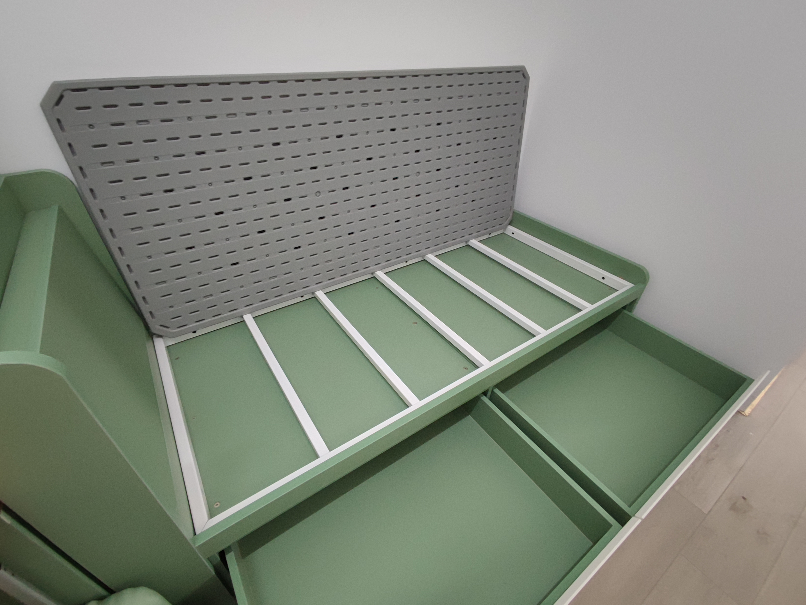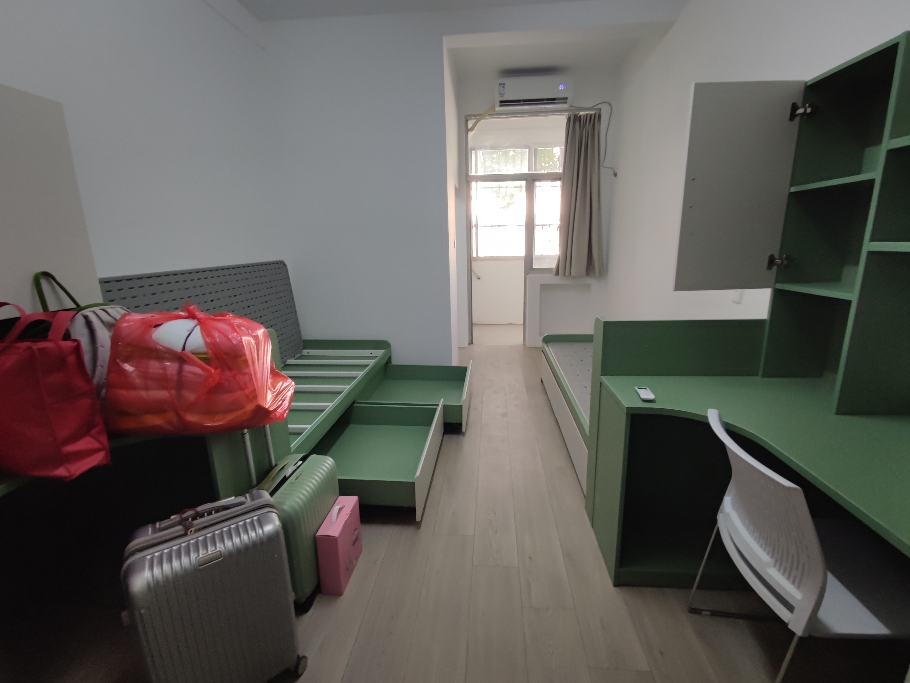

（照片来源：热心同学）

具体尺寸可以参考招标文件：

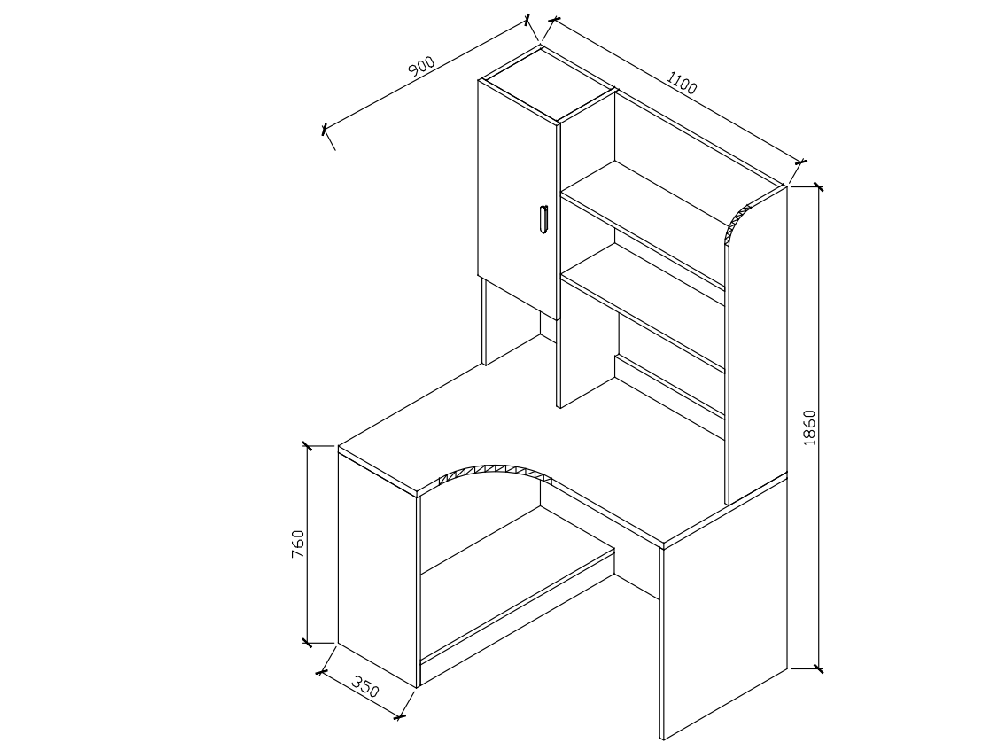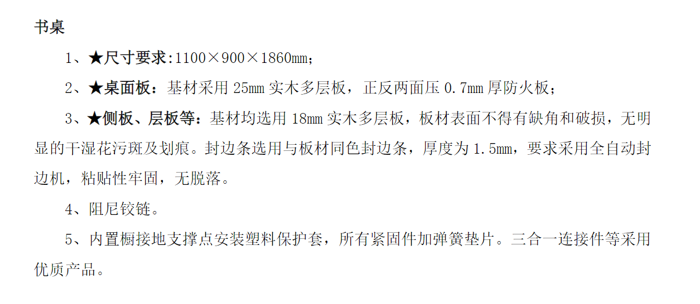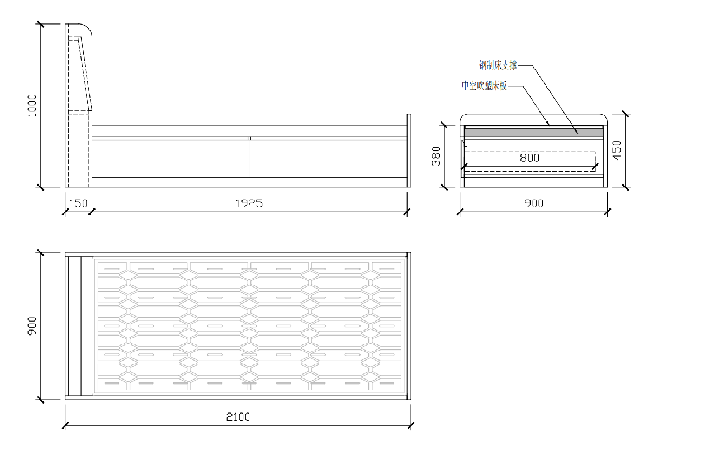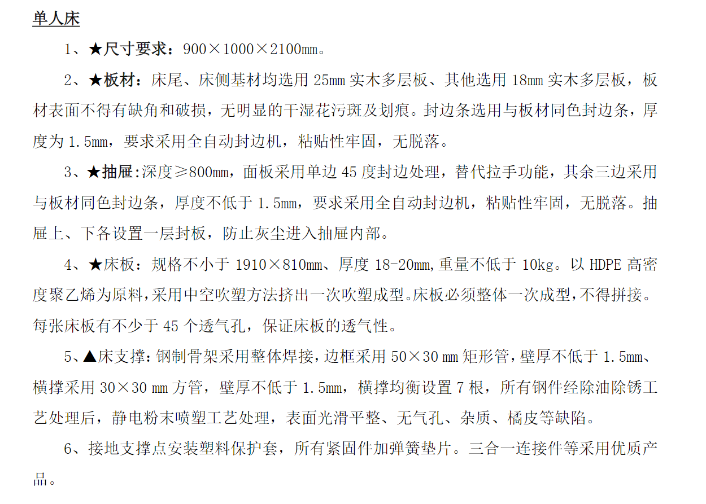

[南京大学浦口校区12-15幢学生宿舍家具采购项目招标文件.pdf](https://www.yuque.com/attachments/yuque/0/2025/pdf/34810676/1746452120342-7522207b-a67c-4a1a-8be5-0a8a8822dc58.pdf)

## 上过热搜的新款家具
另一种就是前不久刚刚上过微博热搜的宿舍。这些宿舍在今年假期刚刚翻新过，更换了新的家具，新家具的款式是将床抬高，衣柜在床下，相比于前文提到的牛油果绿，新款家具的收纳空间更大，书桌也更加宽敞。在小红书和微博上有非常多的同学晒图，感兴趣的同学可以去看看。目前使用这种款式家具的宿舍楼主要是16栋及16栋以后的宿舍。

欢迎使用这种家具的同学投稿床铺的尺寸~

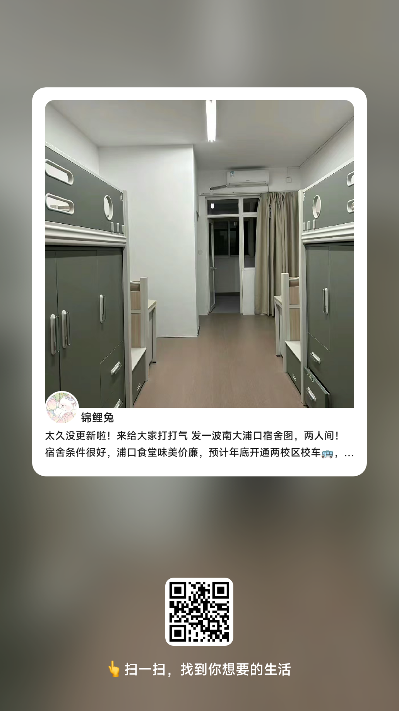

## 24年暑假的新家具
20栋和21栋也换了新家具，根据招标文件来看，是上床下柜款式，具体尺寸如图：

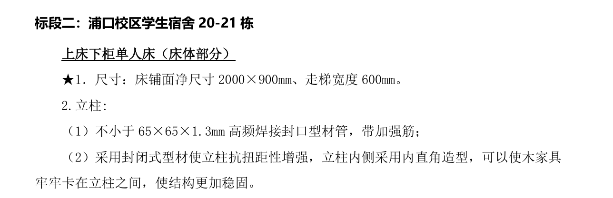

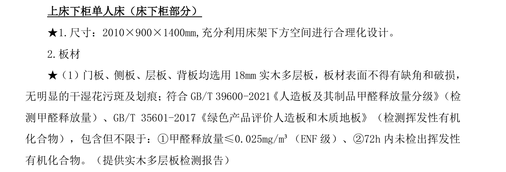

[南大仙林校区8幢和浦口校区20-21栋学生宿舍家具采购项目招标文件.pdf](https://www.yuque.com/attachments/yuque/0/2025/pdf/34810676/1746452120436-5d61f749-5d50-435e-8356-8dab940a8173.pdf)

## 一些大家可能会关心的问题
### Q：浦口宿舍限电吗？
A：从目前我的居住体验来看，对电器功率的限制似乎没有鼓楼、仙林那么大，1800W的吹风机直接推到最高档也没有跳闸。**但是！依然要注意用电安全！**

****

### Q：浦口宿舍有电梯吗？
A：没有……

### Q：宿舍楼里有自动贩卖机吗？
~~A：很遗憾，也没有……~~

~~更新：现在有了！但是目前（2024.1.9）还没有上货。~~

更新：上货了！但是懒得拍照了……

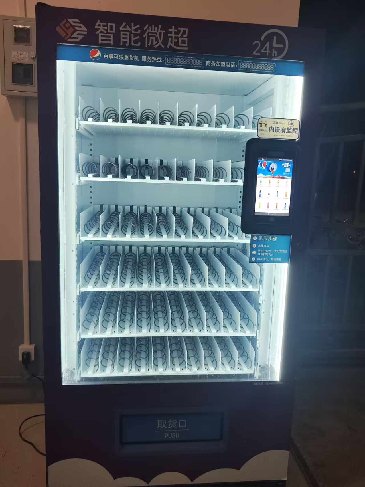

### Q：在宿舍怎么上网？需要找运营商办理额外的宽带吗？
A：wifi全覆盖，除非有特殊需求，不然我觉得也没什么必要办理运营商的宽带。关于上网问题，具体可以阅读小破手的推送：[《25新生指南08丨南大校园网使用攻略》](https://mp.weixin.qq.com/s/R2bE2SAOu5TX9roVdUNLgA)

### Q：宿舍可以买小冰箱/小洗衣机/空气炸锅/电锅……等吗？
A：问就是“原则上不允许”。但是，我很丑，而我没有让你看见我，你也没听别人说我丑，那么对你来说，我就不丑。

### Q：晚上会强制断电断网吗？
A：不会。不断电不断网。

# 行
## 校内出行
浦口校区其实并不算是很大，大家平时主要活动区域也就是宿舍区-教学区两点一线，根据我的个人体验，步行足矣。另外，校园内的共享电动车、共享单车等资源都很充足，所以我觉得并不需要买电动车或者自行车。

## 校外出行
南1门和南2门门口都有公交车，能很方便地前往周边商区或者地铁站。

单纯从距离上来说，校园离S8的“高新开发区”站更近，骑车大概不到10分钟的样子。

但是3号线进城换乘更方便，所以公交或者骑车到3号线“东大成贤学院”站也是不错的选择。

但是！晚上回学校的时候，一定要注意末班车的停运时间！

其余请参考[《浦口校区交通指南》](https://www.yuque.com/greatnju/q-a/lbim7zsai7t0c8ln?singleDoc# 《浦口校区交通指南》)

# 学
## 教学楼概况
上课地点主要在**教学楼**和**玉辉楼**，具体位置如图：

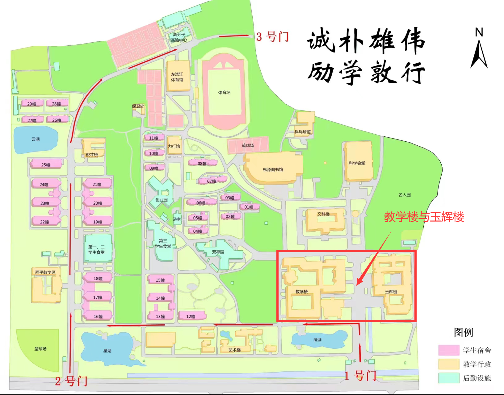

课表上的“浦1”“浦2”就是教学楼的意思，1和2指的是分区。

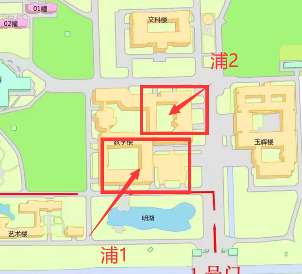

虽然根据地图显示浦1、浦2、浦3相互连通，理论上从任意一个门进教学楼，绕啊绕啊绕总能绕到自己要去的教室，但是因为浦3目前不开放，很多门都是锁着的，为了避免绕到“此路不通”，还是建议就近找门进教学楼比较方便。教室在浦1就从浦1进，教室在浦2就从浦2进。

教学楼内有自助打印机，可以方便大家打印各类证明文件、成绩单等等，具体位置大概在大平台，靠近教室浦1-230；

教学楼内有饮水机，免费使用，无需刷卡，冷热水均有；

教学楼内有自动贩卖机，主要售卖的内容是各类饮料，但是分部较为稀疏。

根据教学楼内的标识，教学楼开放时间大概在7:00-22：30；

浦口教学楼内有电梯。

## 图书馆
关于图书馆的借阅规则，大家可以阅读小破手往期推送：[25新生指南05丨南京大学图书馆使用宝典（新）（本研通用）](https://mp.weixin.qq.com/s/RhjuaNNdzsn1eJgOsstTow)

另外：

浦口校区图书馆座位充足，无需预约（也压根没有开通预约服务）；

跨校区借阅目前已经和其余三校区连通，在委托请求中把取书地设置为浦口校区即可；但是耗费的时间比较长，如果条件允许，我觉得还是人肉前往鼓楼、仙林直接借书比较快……

# 购
## 附近大型商圈
附近较为大型的商圈有龙湖天街、弘阳广场等。

## 网购
网购的话，快递地址是：**江苏省南京市浦口区学府路8号南京大学浦口校区。**

快递会送到第一菜鸟驿站/第二菜鸟驿站。两个菜鸟驿站其实位置都在一起，在食堂的地下车库里；

如果你收到的取件码是**1-n-xxxx**，那就是第一菜鸟驿站的意思；

如果你收到的取件码是**n（n≠1且n≠7且n≠8）-a-xxxx**，那就是第二菜鸟驿站的意思；

如果你收到的取件码是**n-a-xxxx（n=7或者n=8）**，意味着你的快递是邮政快递，需要前往浦口教学楼1楼领取，具体位置大约如图：

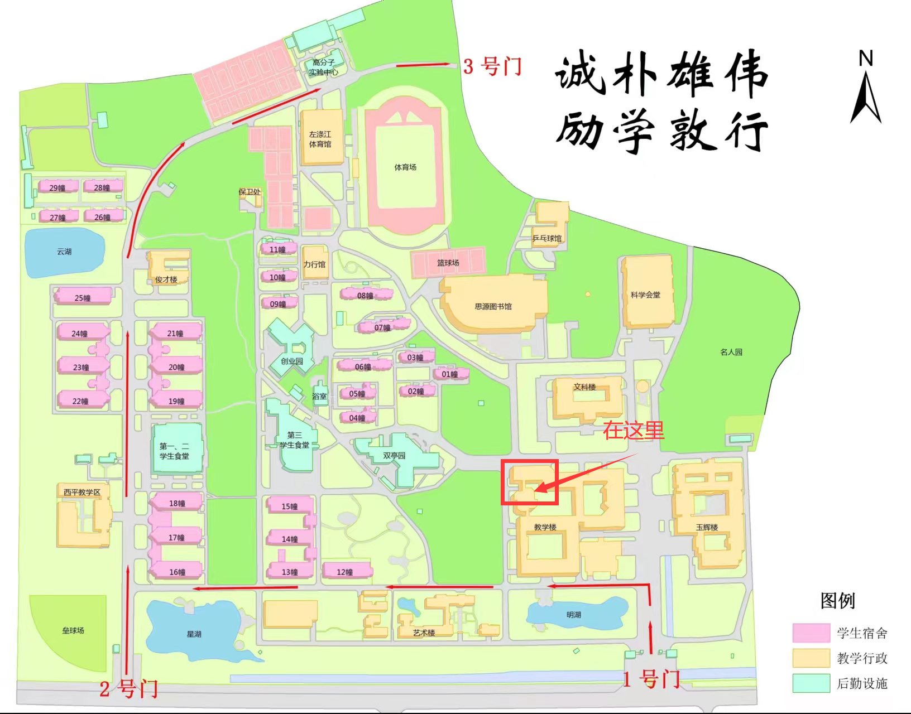

**顺丰**有自己的驿收发，具体位置在第二菜鸟驿站旁边；

**京东与天猫超市**的快递一般会送到第一菜鸟驿站；

网购退货也是去菜鸟驿站退，当然也可以选上门取件，一般会到宿舍门口来拿；

但是如果是**拼多多**退货，需要去教学楼一楼退货（也就是拿邮政快递的地方）；

取件的时候要扫描身份码，所以建议**提前下载并注册好菜鸟app。**

**德邦**不会送到校园里！所以选择德邦需谨慎！

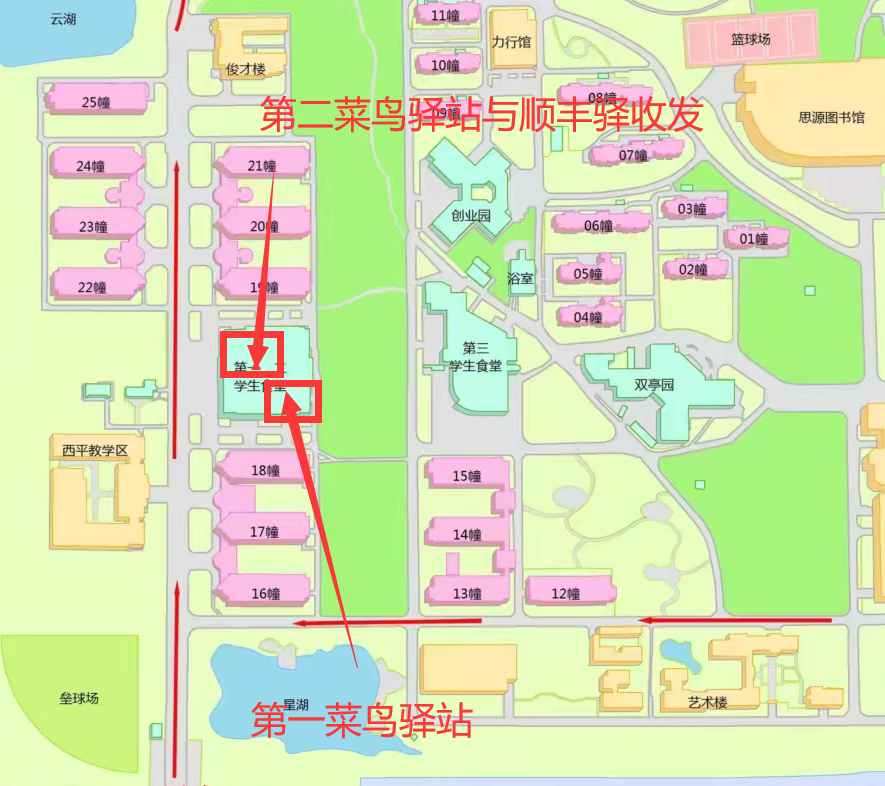

## 校内购物
浦口的教育超市（简称教超）在食堂旁边，很小，因此商品种类也不是很齐全，另外关门时间很早，~~晚上八点半就关门了；~~

喜大普奔，浦口教育超市营业时间延长到晚上十点半了！！！

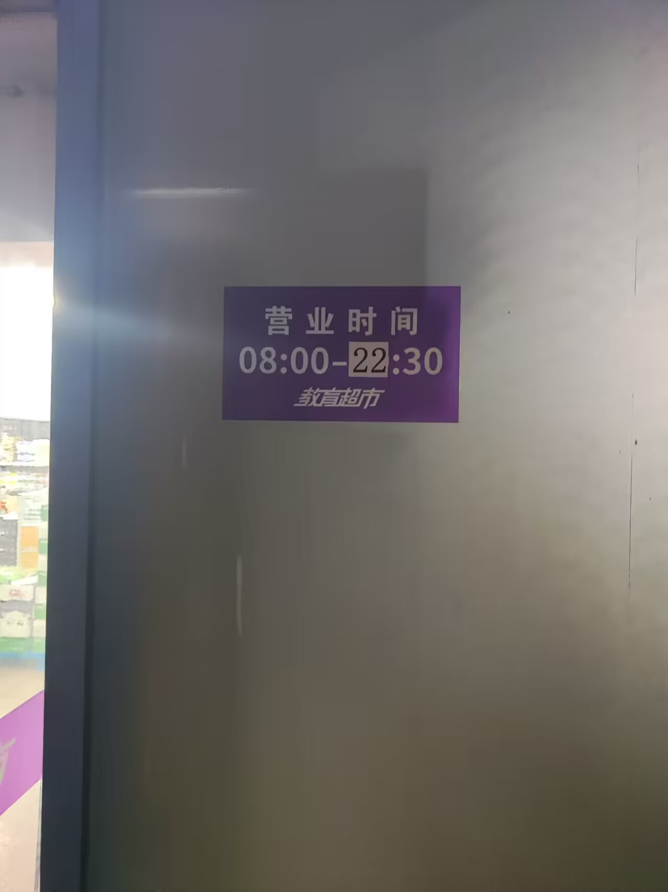

打印的话，可以去双亭园，有打印店（也是双亭园为数不多几家还在营业的店铺了）

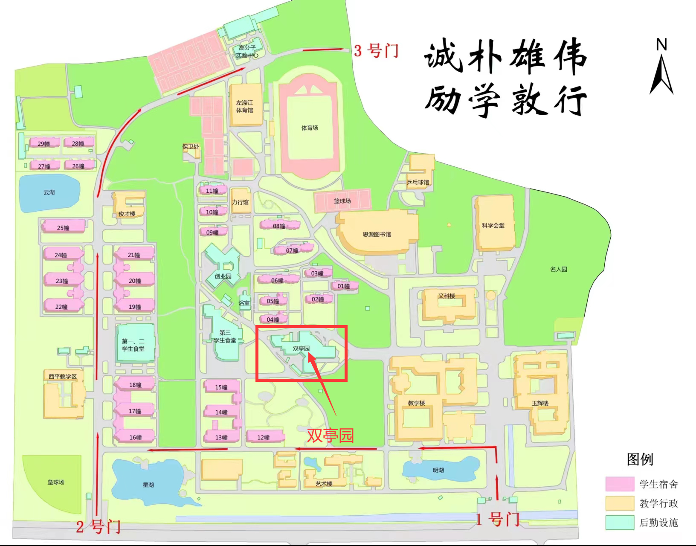

# 一些你可能关心的其他问题
## Q：校内有修理铺吗？有缝补处吗？
A：有的有的，在双亭园，联系方式和业务范围如图所示：

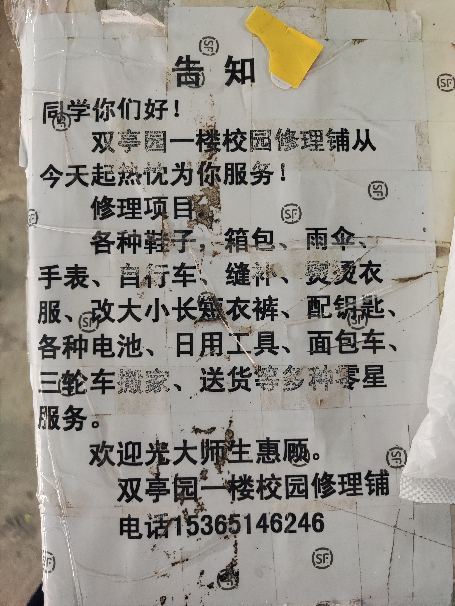

## Q：浦口校医院能xxx吗？
A：如果你在xxx处填写的内容是“看简单小感冒”的话，可以，其他基本都不行哦，例如看牙、b超等，建议亲一律去校外医院呢。如果你对使用医保就医有困惑，可以阅读小破手的就医指南《[迎新特辑12丨南哪学生就医指南](https://mp.weixin.qq.com/s/GwXgm7bLXN2aHD0srgfINg)》。另外也建议亲关注公众号“南京大学医院”，方便获取关于医保、就医等事项的最新通知~

> 
>

